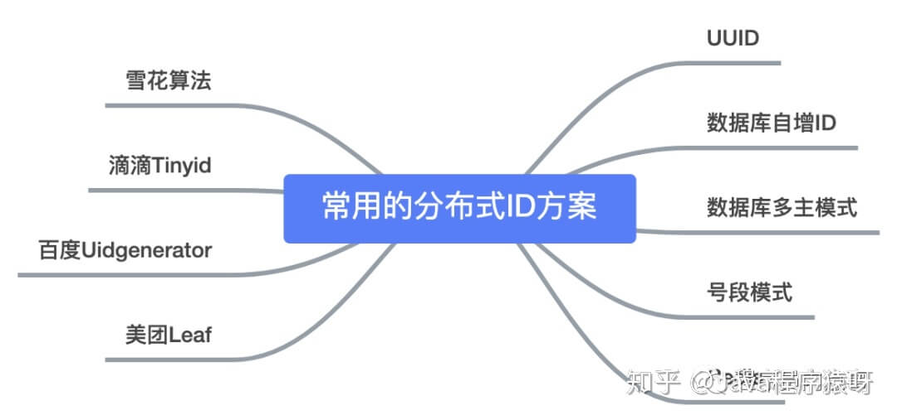

# 分布式

## 集群分布式

## grpc

## 分布式系统优缺点，一致性是如何保证的

## etcd原理

## raft算法是那种一致性算法

## 分布式id

### 那么分布式ID需要满足那些条件？

- 全局唯一：必须保证ID是全局性唯一的，基本要求
- 高性能：高可用低延时，ID生成响应要块，否则反倒会成为业务瓶颈
- 高可用：100%的可用性是骗人的，但是也要无限接近于100%的可用性
- 好接入：要秉着拿来即用的设计原则，在系统设计和实现上要尽可能的简单
- 趋势递增：最好趋势递增，这个要求就得看具体业务场景了，一般不严格要求

### 分布式ID都有哪些生成方式？

- UUID
- 数据库自增ID
- 数据库多主模式
- 号段模式
- Redis
- 雪花算法（SnowFlake）
- 滴滴出品（TinyID）
- 百度 （Uidgenerator）
- 美团（Leaf）



### 基于UUID

```UUID
在Java的世界里，想要得到一个具有唯一性的ID，首先被想到可能就是UUID，毕竟它有着全球唯一的
特性。那么UUID可以做分布式ID吗？答案是可以的，但是并不推荐

public static void main(String[] args) {
       String uuid = UUID.randomUUID().toString().replaceAll("-","");
       System.out.println(uuid);
 }

UUID的生成简单到只有一行代码，输出结果 c2b8c2b9e46c47e3b30dca3b0d447718，但UUID却并
不适用于实际的业务需求。像用作订单号UUID这样的字符串没有丝毫的意义，看不出和订单相关的有
用信息；而对于数据库来说用作业务主键ID，它不仅是太长还是字符串，存储性能差查询也很耗时，
所以不推荐用作分布式ID。
```

**UUID优点：**

- 生成足够简单，本地生成无网络消耗，具有唯一性

**UUID缺点：**

- 无序的字符串，不具备趋势自增特性
- 没有具体的业务含义
- 长度过长16 字节128位，36位长度的字符串，存储以及查询对MySQL的性能消耗较大，MySQL官方明确建议主键要尽量越短越好，作为数据库主键 UUID 的无序性会导致数据位置频繁变动，严重影响性能。

### 基于数据库自增ID

```mysql
基于数据库的auto_increment自增ID完全可以充当分布式ID，具体实现：需要一个单独的MySQL实例用来生成ID，建表结构如下：


```
