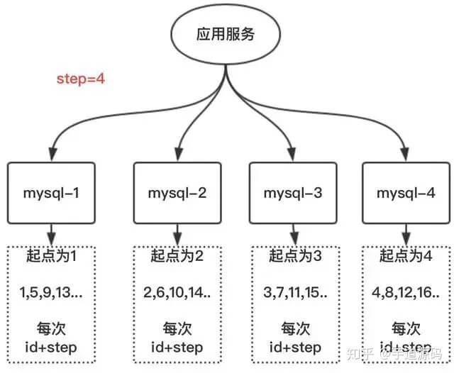
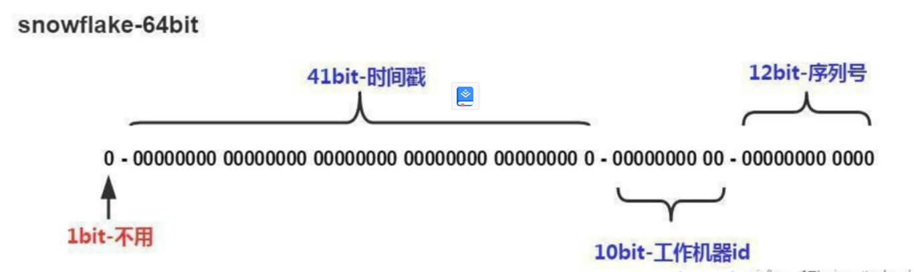

# 分布式

## 集群分布式

## grpc

## 分布式系统优缺点，一致性是如何保证的

## etcd原理

## raft算法是那种一致性算法

## 分布式id

- [一线大厂的分布式唯一 ID 生成方案是什么样的](https://zhuanlan.zhihu.com/p/140078865)
- [9种分布式ID生成方式](https://zhuanlan.zhihu.com/p/152179727)

### 分布式ID需要满足那些条件？

- 全局唯一：必须保证ID是全局性唯一的，基本要求
- 高性能：高可用低延时，ID生成响应要块，否则反倒会成为业务瓶颈
- 高可用：100%的可用性是骗人的，但是也要无限接近于100%的可用性
- 好接入：要秉着拿来即用的设计原则，在系统设计和实现上要尽可能的简单
- 趋势递增：最好趋势递增，这个要求就得看具体业务场景了，一般不严格要求

### 分布式ID都有哪些生成方式？

- UUID
- 数据库自增ID
- 数据库多主模式
- 号段模式
- Redis
- 雪花算法（SnowFlake）

### 基于UUID

```UUID
在Java/Golang等服务端语言的世界里，想要得到一个具有唯一性的ID，首先被想到可能就是语言自身的一些UUID库，
毕竟它有着全球唯一的特性。
那么UUID可以做分布式ID吗？答案是可以的，但是并不推荐；

// Java
public static void main(String[] args) {
    String uuid = UUID.randomUUID().toString().replaceAll("-","");
    System.out.println(uuid);
}

// Golang
import (
  uuid "github.com/satori/go.uuid"
)

func buildUUID(String[] args) {
    uuid.NewV4()
}

UUID的生成简单到只有一行代码，输出结果 c2b8c2b9e46c47e3b30dca3b0d447718，但UUID却并
不适用于实际的业务需求。像用作订单号UUID这样的字符串没有丝毫的意义，看不出和订单相关的有
用信息；而对于数据库来说用作业务主键ID，它不仅是太长还是字符串，存储性能差查询也很耗时，
所以不推荐用作分布式ID。
```

**UUID优点：**

- 生成足够简单，本地生成无网络消耗，具有唯一性

**UUID缺点：**

- 无序的字符串，不具备趋势自增特性
- 没有具体的业务含义
- UUID的字符串存储，查询效率慢
- 存储空间大

**UUID应用场景：**

- 类似生成token令牌的场景
- 不适用一些要求有趋势递增的ID场景

### 基于数据库自增ID

```mysql
基于数据库的auto_increment自增ID完全可以充当分布式ID;
具体实现：需要一个单独的MySQL实例用来生成ID，建表结构如下：

CREATE TABLE `increasing_id` (
 `id` INT(10) UNSIGNED NOT NULL AUTO_INCREMENT,
 `value` CHAR(10) NOT NULL DEFAULT '',
 PRIMARY KEY (`id`) USING BTREE
)ENGINE=INNODB;

INSERT INTO `increasing_id`(VALUE) VALUES('');

当我们需要一个ID的时候，向表中插入一条记录返回主键ID，但这种方式有一个比较致命的缺点，访
问量激增时MySQL本身就是系统的瓶颈，用它来实现分布式服务风险比较大，不推荐！

```

**基于数据库自增ID优点：**

- 实现简单，ID单调自增，数值类型查询速度快
- 查询效率高
- 具有一定的业务可读

**基于数据库自增ID缺点：**

- DB单点存在宕机风险，无法扛住高并发场景

### 基于数据库集群模式

```mysql
这个方案就是解决mysql的单点问题，在auto_increment基本上面，设置step步长。
每台的初始值分别为1,2,3...N，步长为N（这个案例步长为4）
```



|||
|-|-|
|优点：|解决了单点问题|
|缺点：|一旦把步长定好后，就无法扩容；而且单个数据库的压力大，数据库自身性能无法满足高并发|
|应用场景：| 数据不需要扩容的场景|

### 雪花snowflake算法

```mysql
雪花算法（Snowflake）是twitter公司内部分布式项目采用的ID生成算法，开源后广受国内大厂的
好评，在该算法影响下各大公司相继开发出各具特色的分布式生成器。

1位标识符：始终是0

41位时间戳：41位时间截不是存储当前时间的时间截，而是存储时间截的差值（当前时间截 - 开始
时间截 )得到的值，这里的的开始时间截，一般是我们的id生成器开始使用的时间，由我们程序来指定的

10位机器标识码：可以部署在1024个节点，如果机器分机房（IDC）部署，这10位可以由 5位机房ID + 5位机器ID 组成

12位序列：毫秒内的计数，12位的计数顺序号支持每个节点每毫秒(同一机器，同一时间截)产生4096个ID序号
```


