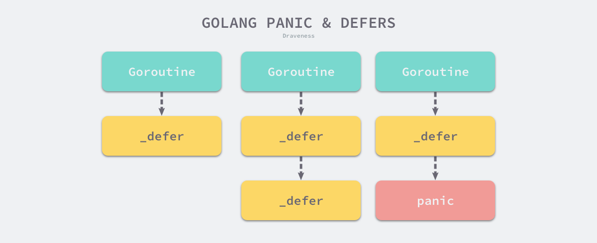
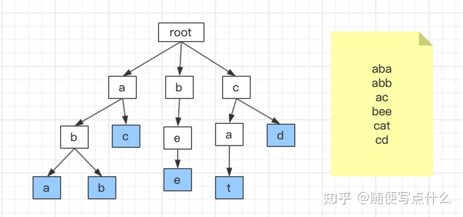
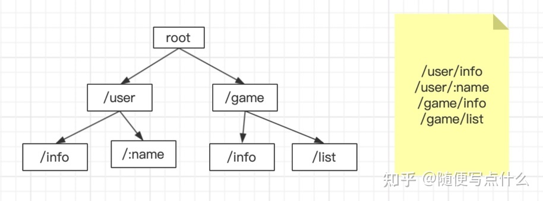

# Golang常见问题

## 编译原理

[Golang编译原理](./compile.md)

### go的init函数是什么时候执行的？

在Go中，init函数是一种特殊的函数，它在程序运行之前自动执行。具体来说，每个包中的init函数都会在程序启动时按照它们在程序中导入的顺序被调用。如果一个包被导入多次，init函数也只会被调用一次。

init函数的主要作用是在程序运行之前执行一些必要的初始化工作，例如初始化全局变量或者注册一些信息等。由于init函数是在程序启动之前自动执行的，所以它通常被用于执行一些比较底层的初始化工作，而不是处理高层逻辑。

### 多个init函数执行顺序能保证吗？

在同一个包中，多个init函数的执行顺序是按照它们在源代码中出现的顺序执行的，也就是说先出现的init函数会先被执行，后出现的init函数会后被执行。这个执行顺序是可以保证的。

对于不同包中的init函数，它们的执行顺序是按照它们在程序中被导入的顺序执行的。也就是说，如果包A导入了包B和包C，那么包B中的init函数会在包C中的init函数之前被执行，而包A中的init函数会在包B和包C中的init函数之后被执行。这个执行顺序也是可以保证的。

需要注意的是，init函数不能被显式地调用，它们是在程序启动时自动执行的。因此，如果在init函数中有依赖关系，需要保证它们的执行顺序正确，否则会导致程序出现不可预料的错误。

## 数据结构

[Golang数据结构](./struct.md)

### 切片的底层实现说一下？

```golang
type SliceHeader struct {
 Data uintptr
 Len  int
 Cap  int
}
```

- Data 是指向数组的指针;  
- Len 是当前切片的长度；  
- Cap 是当前切片的容量，即 Data 数组的大小。

### Go中对nil的Slice和空的Slice的处理是一致的吗？

nil slice和empty slice是不一致的

一个nil的slice表示一个没有底层数组的slice，它的长度和容量都为0。如果对一个nil的slice执行任何操作，如append、len、cap等，都会导致运行时错误。因此，对一个nil的slice进行操作时，需要先使用make函数分配底层数组。

一个空的slice表示一个长度和容量都为0的slice，但它是一个有效的slice。对一个空的slice执行append操作时，会创建一个新的slice，并将元素添加到其中。对一个空的slice执行len和cap操作时，都会返回0。

通常错误的用法，会报数组越界的错误，因为只是声明了slice，却没有给实例化的对象。

```golang
var slice []int
slice[1] = 0
```

此时slice的值是nil，这种情况可以用于需要返回slice的函数，当函数出现异常的时候，保证函数依然会有nil的返回值。

empty slice 是指slice不为nil，但是slice没有值，slice的底层的空间是空的，此时的定义如下：

```golang
slice := make([]int,0）
slice := []int{}
```

当我们查询或者处理一个空的列表的时候，这非常有用，它会告诉我们返回的是一个列表，但是列表内没有任何值。

### slice，len，cap，共享，扩容

- 如果期望容量大于当前容量的两倍就会使用期望容量；
- 如果当前切片的长度小于 1024 就会将容量翻倍；
- 如果当前切片的长度大于 1024 就会每次增加 25% 的容量，直到新容量大于期望容量；

### slice和array区别

在Go中，array和slice都是用来存储一组相同类型的元素的数据结构，但它们有以下几个区别：

1、定义方式

array和slice的定义方式不同。定义一个array需要指定数组的长度，例如：

```golang
var a [3]int // 定义一个包含3个元素的int类型数组
```

而slice是一个对array的封装，它不需要指定长度，可以从已有的array或slice中创建，例如：
```golang
var s1 []int      // 声明一个nil的slice
s2 := []int{1, 2} // 声明一个包含2个元素的slice
s3 := a[:]        // 从数组a创建一个包含所有元素的slice
```
1、长度和容量  
array的长度是固定的，无法改变。而slice的长度可以动态改变，它的容量也可以随着元素的增加而增加。slice的长度和容量可以使用len和cap函数获取。

2、传递方式  
array和slice在传递方式上也有区别。当一个array作为参数传递给函数时，它的值会被复制一份。而slice作为参数传递时，实际上传递的是一个指向底层数组的指针，因此对slice的修改会影响到原始的slice和底层数组。

3、底层数组的内存分配  
array的底层是一个静态分配的数组，它的内存是在编译时分配的。而slice的底层是一个动态分配的数组，它的内存是在运行时分配的。当slice的容量不够时，会重新分配一块更大的内存，并将原来的元素复制到新的内存中。

总之，array和slice都有各自的特点和应用场景。如果需要存储一组固定长度的元素，并且在编译时就知道数组的长度，那么应该使用array。如果需要存储一个长度不确定的序列，并且需要动态改变它的长度，那么应该使用slice。

### 如何把数组转化成一个切片

```golang
arrData := [10]int{}
sliceData := arrData[0:3]
```

### make一个slice参数怎么写？

```golang
// 当前切片长度=len=5  
// 当前切片容量=cap=10  
data := make([]int, 5, 10）
```

### map会遇到一些并发安全的问题，为什么就并发不安全了？

go 语言的设计者认为，在大部分场景中，对 map 的操作都非线程安全的；**我们不可能为了那小部分的需求，而牺牲大部分人的性能。**  

```golang
func main() {
    s := make(map[int]int)
    // 启 100 个异步线程去写 map
    for i := 0; i < 100; i++ {
        go func(i int) {
            s[i] = i
        }(i)
    }
    // 启 100 个一步线程去读 map
    for i := 0; i < 100; i++ {
        go func(i int) {
            fmt.Printf("map 第 %d 个元素值是 %d", i, s[i])
        }(i)
    }
    // 睡眠 3 秒钟，方便前面的协程打印
    time.Sleep(3 * time.Second)
}
```

因为是异步协程，所以 map 同一时刻就可能被多个写的协程操作。  
那么运行后就会报错：fatal error: concurrent map writes

在 Go 中，map本身是非线程安全的数据结构，因为它在并发读写时存在以下几个问题：

1、多个 goroutine 并发读写同一个 map，可能导致数据竞争，从而出现未定义的行为。

2、在一个 goroutine 执行写操作的同时，另外一个 goroutine 执行读操作可能会看到不一致的数据。这是因为写操作可能会改变底层数据结构，从而导致读操作的行为出现不可预期的变化。

3、在一个 goroutine 执行写操作的同时，另外一个 goroutine 执行写操作可能会导致数据丢失或覆盖。这是因为在并发写操作时，两个 goroutine 可能会同时读取到相同的值并对其进行修改，从而导致最终的结果出现不一致。

为了解决这些问题，Go 提供了一些并发安全的 map 实现，例如sync.Map和concurrent-map等。这些实现内部使用了锁和其他同步机制来保证并发访问的安全性。在使用这些实现时，需要注意它们与标准的map在用法上的一些区别。

另外，如果并发访问的场景比较简单，也可以通过使用同步机制如mutex或channel来实现并发安全的map。例如，可以使用一个mutex来保护对map的读写操作，或者使用一个带缓冲的channel来实现有限的并发访问。但需要注意的是，手动实现并发安全的map可能需要考虑到更多的细节和边界情况，因此需要谨慎设计和测试。

### map和sync.Map是有什么区别？看过源码吗，可以介绍一下吗？

[一文解决Map并发问题](https://cloud.tencent.com/developer/article/1539049)

sync.Map是Go语言提供的一种并发安全的键值对容器，它可以被多个goroutine并发读写而不需要加锁。相比较于标准库中的map，sync.Map的实现要更加复杂一些。

sync.Map的实现原理是：内部维护了一个read和一个dirty两个map，read用来进行并发读取，而dirty用来进行写操作。当写操作时，dirty会记录发生了哪些变更，而read则不会发生变化。当读取操作时，如果dirty非空，则先将dirty中的数据合并到read中，这样读操作就可以读到最新的数据了。而如果dirty为空，则直接从read中读取数据。

sync.Map提供了以下三个方法来操作数据：

- Load(key interface{}) (value interface{}, ok bool)：获取指定键对应的值，如果键不存在则返回false。

- Store(key, value interface{})：设置指定键对应的值。

- Delete(key interface{})：删除指定键对应的值。

#### sync.Map的特点

```golang
type Map struct {
   mu Mutex
   read atomic.Value // readOnly
   dirty map[interface{}]*entry
   misses int
}
```

可以无锁访问read map，而且会优先操作read map，倘若只操作read map就可以满足要求，那就不用去操作write map(dirty)。

**sync.Map 特点：**

- 空间换时间，通过冗余的两个数据结构(read、dirty)，实现加锁对性能的影响。  
- 使用只读数据(read)，避免读写冲突。  
- 动态调整，miss次数多了之后，将dirty数据提升为read。  
- double-checking。  
- 延迟删除，删除一个键值只是打标记，只有在提升dirty的时候才清理删除的数据。  
- 优先从read读取、更新、删除，因为对read的读取不需要锁。  

**sync缺点：**
如果是写多的场景，会导致 read map 缓存失效，需要加锁，冲突变多，性能急剧下降。

### map里面解决hash冲突怎么做的，冲突了元素放在头还是尾

Go 语言中使用拉链法来解决哈希碰撞的问题实现了哈希表

根据key定位到指定桶中，循环桶中的元素

- 1、先定位如果tophash与桶中的top是否不相等 如果不相等则返回地址  
- 2、如果与桶中tophash相等，则判断key是否相等，如果相等则返回地址  
- 3、如果1/2 寻找后还没有合适地址，则去查找溢出桶，循环1/2  
- 4、如果溢出桶也未寻找到，则需要扩容  

Go语言中的map使用了哈希表来实现，当哈希表中出现哈希冲突时，会采用链表法来解决。

具体来说，每个桶对应一个链表，每个链表中的元素都具有相同的哈希值。当插入一个新元素时，首先会计算其哈希值，然后找到对应的桶。如果桶中已经有元素，则需要遍历链表，查找是否存在相同的键，如果找到则替换原来的值，否则将新元素插入链表头部。如果桶中没有元素，则直接将新元素插入链表头部。

因为哈希表的大小是固定的，所以在插入新元素时，可能会出现桶已满的情况。这时，Go语言会将该桶中的所有元素都迁移到一个新的桶中，然后再将新元素插入到新桶中。这个过程称为“扩容”。

需要注意的是，在链表中新元素被插入链表头部的原因是：对于哈希表中的元素，通常是按照插入的顺序进行遍历，而链表中新插入的元素最容易被访问到。如果采用将新元素放在链表尾部的策略，那么在遍历时就需要遍历整个链表才能访问到最新的元素，这会影响遍历的效率。而将新元素放在链表头部，则可以快速地访问到最新的元素，提高遍历的效率。

### map取一个key，然后修改这个值，原map数据的值会不会变化

如果从map中取出一个值，对这个值进行修改，那么原map中对应的值是不会发生变化的。

这是因为在Go语言中，map中的值是通过引用传递的。当从map中取出一个值时，实际上是将该值的指针复制了一份。修改复制后的值只会影响到该值本身，不会影响原map中对应的值。

举个例子，假设有一个map如下所示：
```golang
m := map[string]int{"a": 1, "b": 2, "c": 3}
```
现在从map中取出键为"a"的值，并将其加1：

```golang
v := m["a"]
v = v + 1
```
此时，v的值为2，而原map中对应键"a"的值仍为1，没有发生变化。

如果要修改原map中对应键的值，应该直接对map进行赋值，而不是修改取出的值。例如：
```golang
m["a"] = m["a"] + 1
```
这样就可以将原map中对应键的值加1了。

### map如何顺序读取

Go中的Map是一种无序的集合类型，其元素的顺序是不确定的，因此不支持直接按顺序访问Map中的元素。

如果需要按顺序访问Map中的元素，可以通过先将键排序，然后再按照排序后的键顺序来遍历Map，这可以使用内置的sort包和slice实现。具体的操作步骤如下：

1、将Map中的键转化为一个slice  
2、使用sort包中的函数对slice进行排序  
3、遍历排序后的slice，通过Map的键来获取相应的值  

以下是一个简单的示例代码，展示了如何使用slice来实现按顺序遍历Map：
```golang
import (
    "fmt"
    "sort"
)

func main() {
    m := map[string]int{
        "one":   1,
        "three": 3,
        "two":   2,
    }

    // 将Map中的键转化为一个slice
    keys := make([]string, 0, len(m))
    for k := range m {
        keys = append(keys, k)
    }

    // 使用sort包中的函数对slice进行排序
    sort.Strings(keys)

    // 遍历排序后的slice，通过Map的键来获取相应的值
    for _, k := range keys {
        fmt.Printf("%v:%v\n", k, m[k])
    }
}
```
在上面的示例代码中，我们首先将Map中的键转化为一个slice，然后使用sort.Strings函数对slice进行排序，最后按照排序后的键顺序遍历Map，并输出对应的键值对。

### 并发读写map会发生什么？怎么避免?

fatal error: concurrent map read and map write  
会发生并发读写问题

1、在1.9之前可以定义一个结构体加上一把读写锁来解决并发安全问题；
2、1.9之后官方在sync包定义了Map结构体，如果遇到并发问题，可以使用sync.Map解决。  

### struct能不能比较

[Go 结构体（struct）是否可以比较？](https://segmentfault.com/a/1190000040099215)  


Go中的struct类型是一种用户自定义的复合数据类型，可以包含任意类型的字段。在Go中，我们可以使用==运算符来比较两个struct类型的值是否相等(strruct 是否能比较需要看结构体的元素类型)。

如果两个struct类型的值拥有相同的字段和相同的值，则它们是相等的。需要注意的是，只有当struct类型的所有字段都是可比较的类型时，该struct类型才是可比较的。

以下是一个简单的示例代码，展示了如何比较两个struct类型的值：
```golang
package main

import "fmt"

type Person struct {
    Name string
    Age  int
}

func main() {
    p1 := Person{"Alice", 30}
    p2 := Person{"Bob", 25}

    // 比较两个struct类型的值是否相等
    if p1 == p2 {
        fmt.Println("p1 and p2 are equal")
    } else {
        fmt.Println("p1 and p2 are not equal")
    }

    // 比较两个struct类型的值是否相等
    p3 := Person{"Alice", 30}
    if p1 == p3 {
        fmt.Println("p1 and p3 are equal")
    } else {
        fmt.Println("p1 and p3 are not equal")
    }
}

```
### go结构体和结构体指针的区别

```golang
type MyStruct struct {
    Name string
}

func (s MyStruct) SetName1(name string) {
    s.Name = name
}

func (s *MyStruct) SetName2(name string) {
    s.Name = name
}

 func SetName1(s MyStruct, name string){
    u.Name = name
 }

 func SetName2(s *MyStruct,name string){
    u.Name = name
 }
```

- 在使用上的考虑：方法是否需要修改接收器？如果需要，接收器必须是一个指针。
- 在效率上的考虑：如果接收器很大，比如：一个大的结构体，使用指针接收器会好很多。
- 在一致性上的考虑：如果类型的某些方法必须有指针接收器，那么其余的方法也应该有指针接收器，所以无论类型如何使用，方法集都是一致的。

回到上面的例子中，从功能使用角度来看：  
如果 SetName2 方法修改了 s 的字段，调用者是可以看到这些字段值变更的，因为其是指针引用，本质上是同一份。  
相对 SetName1 方法来讲，该方法是用调用者参数的副本来调用的，本质上是值传递，它所做的任何字段变更对调用者来说是看不见的。
另外对于基本类型、切片和小结构等类型，值接收器是非常廉价的。  

### go里面interface是什么概念

在Go中，interface是一种抽象类型，它定义了一组方法的集合。这些方法可以被任何类型（包括内置类型、用户自定义类型、指针类型等）实现，从而使得这些类型都满足该接口的约束。

一个接口类型可以被认为是一种契约或协议，它规定了实现该接口的类型必须实现哪些方法。接口类型本身是一种类型，因此可以作为函数参数、返回值、变量等类型使用。

一个类型只有实现了接口定义的所有方法，才能被称为实现了该接口。如果一个类型实现了一个接口的所有方法，那么它就可以被赋值给该接口类型的变量，从而实现了接口的多态特性。

以下是一个简单的示例代码，展示了如何定义和实现接口：
```golang
package main

import "fmt"

// 定义一个接口类型
type Shape interface {
    area() float64
}

// 定义一个结构体类型
type Rectangle struct {
    width  float64
    height float64
}

// 实现Shape接口的方法
func (r Rectangle) area() float64 {
    return r.width * r.height
}

func main() {
    // 创建一个Rectangle类型的值
    r := Rectangle{5, 10}

    // 将r赋值给Shape类型的变量
    var s Shape
    s = r

    // 调用Shape接口的方法
    fmt.Println(s.area())
}

```

### go什么场景使用接口
在Go中，接口是一个非常强大的工具，可以在不知道具体类型的情况下，定义和操作一组相关的对象。使用接口可以提高代码的灵活性和可复用性，使得代码更容易扩展和维护。以下是一些使用接口的场景：

1、封装实现细节  
使用接口可以封装实现细节，使得代码的调用者不需要知道具体的实现细节，只需要知道如何使用接口即可。这样可以减少代码的耦合度，提高代码的可维护性。

2、定义插件  
使用接口可以定义插件，通过插件机制可以方便地扩展和定制程序功能。例如，我们可以定义一个数据库接口，通过实现该接口可以方便地切换不同的数据库实现。

3、实现多态特性  
使用接口可以实现多态特性，通过将实现了同一个接口的类型赋值给接口类型的变量，可以实现不同类型的对象在调用相同方法时产生不同的行为。

4、隐藏具体类型  
使用接口可以隐藏具体类型，将对象的具体类型与接口类型分离，从而实现代码的解耦。这样可以使得代码更加灵活，方便地切换对象的具体类型。

5、实现接口断言  
使用接口断言可以判断一个对象是否实现了某个接口。这种技术可以用于实现类型断言、类型判断等功能，从而实现更加灵活和安全的代码。

总之，在Go中，接口是一个非常有用的工具，可以用于实现各种不同的功能和场景。使用接口可以提高代码的灵活性和可复用性，是Go编程中不可或缺的一部分。

### 函数传递有什么区别

在Go中，函数参数可以按值传递和按引用传递两种方式传递。下面是它们之间的区别：

1、按值传递  
按值传递是指将函数参数的值复制一份，传递给函数。在函数内部对参数的修改不会影响函数外部的变量值。这种方式适用于参数值较小的情况，可以避免误修改函数外部的变量值。

示例代码如下：
```golang
package main

import "fmt"

func main() {
    x := 10
    y := 20
    swap(x, y)
    fmt.Println("x:", x, "y:", y)
}

func swap(a, b int) {
    a, b = b, a
    fmt.Println("a:", a, "b:", b)
}

// output
a: 20 b: 10
x: 10 y: 20
```
可以看到，在swap函数内部，a和b的值已经交换了，但是在main函数中，x和y的值没有发生变化，因为函数参数按值传递时，只会修改函数参数的副本。

2、按引用传递  
按引用传递是指将函数参数的地址传递给函数，函数可以通过该地址修改函数外部的变量值。这种方式适用于参数值较大的情况，可以避免复制大量的数据。

示例代码如下：
```golang
package main

import "fmt"

func main() {
    x := 10
    y := 20
    swap(&x, &y)
    fmt.Println("x:", x, "y:", y)
}

func swap(a, b *int) {
    *a, *b = *b, *a
    fmt.Println("a:", *a, "b:", *b)
}
// output
a: 20 b: 10
x: 20 y: 10
```

可以看到，在swap函数内部，a和b的值已经交换了，并且通过指针修改了x和y的值，因为函数参数按引用传递时，可以直接操作函数外部的变量。

总之，按值传递和按引用传递是函数参数传递中的两种常用方式，可以根据实际情况选择合适的方式。需要注意的是，在Go中，指针类型可以用来实现按引用传递的效果。

### 为什么给变量一个基础类型没有并发安全问题？

在Go中，给变量一个基础类型不会有并发安全问题，主要有以下几个原因：

1、基础类型的变量是存储在栈上的，每个goroutine都有自己的栈，不同goroutine之间不会相互影响，因此也不会出现并发安全问题。

2、基础类型的变量是不可变的，它们的值在初始化后不会被修改，因此也不会出现并发安全问题。比如，一个int类型的变量x在初始化后赋值为10，之后就不会再被修改，即使多个goroutine同时读取它，也不会出现问题。

3、如果在多个goroutine之间共享一个基础类型的变量，需要使用同步机制来保证并发安全。比如，可以使用互斥锁或原子操作等方式来保证在某一时刻只有一个goroutine可以访问该变量。

总之，给变量一个基础类型不会有并发安全问题，但是如果在多个goroutine之间共享该变量，则需要使用同步机制来保证并发安全。

### string和byte数组有什么区别？

在Go语言中，string和byte数组都可以表示字符串类型，但它们之间有很大的区别。

1、string类型是不可变的，一旦创建就无法更改。而byte数组是可变的，可以通过修改数组中的元素来改变其内容。

2、string类型是只读的，不能通过索引方式直接修改其内容。而byte数组是可读可写的，可以通过索引方式读取和修改其内容。

3、string类型是Unicode字符序列的集合，它的底层实现是一个byte数组，但是在表示字符串时需要考虑编码方式，如UTF-8、UTF-16等。而byte数组则是一个字节序列，可以表示任意二进制数据，包括字符串等。

4、string类型有一些特殊的操作，如字符串拼接、截取、查找等。而byte数组需要通过一些方法来实现这些操作，如使用bytes包或strings包中的函数。

因此，如果需要处理字符串类型的数据，建议使用string类型。如果需要处理二进制数据或需要对字符串进行修改，则可以使用byte数组。需要注意的是，如果需要在string类型和byte数组之间进行转换，可以使用Go语言中的内置函数进行转换，如[]byte(string)和string([]byte)。

### go深拷贝，什么时候需要深拷贝

在Go语言中，对于基本类型的变量（如int、float、bool等），赋值操作是深拷贝。但对于复合类型的数据（如数组、切片、Map、结构体等），赋值操作只是浅拷贝，即只是复制了数据的引用地址，而不是真正的复制数据。

当我们需要对复合类型的数据进行修改，但同时又需要保留原始数据时，就需要进行深拷贝。深拷贝是指将一个数据的副本完全复制一份，并将其与原始数据分开存放，两者之间没有任何关系。这样，当我们对拷贝后的数据进行修改时，不会影响原始数据。

以下是需要进行深拷贝的一些场景：

1、当需要对一个切片或Map进行排序时，为了保留原始数据，通常需要对切片或Map进行深拷贝，然后对拷贝后的数据进行排序。

2、当需要对一个结构体中的某个字段进行修改，但又不想影响原始数据时，可以对整个结构体进行深拷贝，然后对拷贝后的结构体进行修改。

3、当需要在一个goroutine中修改数据，但同时又需要保留原始数据时，可以将原始数据进行深拷贝，然后在拷贝后的数据上进行修改。

总之，深拷贝是一种保留原始数据、防止数据修改的有效方式，在一些特定的场景下，需要使用深拷贝来确保数据的正确性。

## 常用关键字

### defer是啥？怎么用的？底层原理是啥？

在Go语言中，defer语句用于注册延迟调用，在函数退出时执行。它通常用于确保一些资源在函数返回之前被释放、关闭或清理。

defer语句可以被放置在函数的任何位置，而且可以有多个defer语句。当函数返回时，所有已注册的defer语句都会被执行，且执行顺序与注册顺序相反。也就是说，最后一个defer语句会最先执行，第一个defer语句会最后执行。

下面是一个使用defer语句的例子：
```golang
func readFile(filename string) (string, error) {
    f, err := os.Open(filename)
    if err != nil {
        return "", err
    }
    defer f.Close()
    content, err := ioutil.ReadAll(f)
    if err != nil {
        return "", err
    }
    return string(content), nil
}
```

在这个例子中，我们打开一个文件，读取其中的内容，然后在函数返回之前关闭文件。为了确保文件会被关闭，我们使用了defer语句来注册一个f.Close()的延迟调用，这样无论函数何时退出，都会执行这个调用。

底层原理方面，Go语言在函数调用的过程中，会将每个defer语句压入一个栈中。当函数返回时，Go语言会依次执行栈中的defer语句，保证这些语句的执行顺序与注册顺序相反。因为defer语句的执行是在函数返回之前，所以它也可以用于捕获和处理函数中的错误，避免函数返回之前忘记处理错误。

需要注意的是，defer语句虽然简单易用，但不应滥用。在函数中注册过多的defer语句可能会导致性能问题，因此建议仅在必要时使用defer语句。

#### return 不是原子操作：

执行过程是: 保存返回值(若有)–>执行 defer（若有）–>执行 ret 跳转，申请资源后立即使用 defer 关闭资源是好习惯。

#### defer用的多吗？有哪些应用

- 资源释放（数据库资源、锁资源）  
- 连接关闭（TCP、文件句柄）  
- 捕获panic， 进行 recover 防止程序崩溃

### panic 和 recover

- panic 能够改变程序的控制流，调用 panic 后会立刻停止执行当前函数的剩余代码，并在当前 Goroutine 中递归执行调用方的 defer；  
- recover 可以中止 panic 造成的程序崩溃。它是一个只能在 defer 中发挥作用的函数，在其他作用域中调用不会发挥作用；  

#### panic 和 recover使用的现象

- panic 只会触发当前 Goroutine 的 defer；  
- recover 只有在 defer 中调用才会生效；  
- panic 允许在 defer 中嵌套多次调用；  



### go如何避免panic

通过defer 函数中调用recover() 恢复崩溃情况

### 异常捕获是如何做的？

- 逐级返回error等待顶成捕获
- 通过recover在defer捕获

### select可以用于什么

[select](https://draveness.me/golang/docs/part2-foundation/ch05-keyword/golang-select/)

在Go语言中，select语句可以用于处理并发场景。它可以用来等待多个通道中的操作完成，从而实现并发控制、数据传输等功能。

select语句包含若干个case语句和一个默认语句（可选），每个case语句中包含一个通道操作或一个发送/接收操作。当select语句执行时，它会从所有可用的case语句中随机选择一个，并执行这个case中的操作。如果没有可用的case语句，且存在默认语句，那么就执行默认语句。

下面是一个使用select语句的例子：
```golang
func main() {
    ch1 := make(chan int)
    ch2 := make(chan int)
    go func() {
        time.Sleep(1 * time.Second)
        ch1 <- 1
    }()
    go func() {
        time.Sleep(2 * time.Second)
        ch2 <- 2
    }()
    select {
    case <-ch1:
        fmt.Println("Received from ch1")
    case <-ch2:
        fmt.Println("Received from ch2")
    }
}
```

在这个例子中，我们创建了两个通道ch1和ch2，并启动了两个goroutine，分别向这两个通道发送数据。在主函数中，我们使用select语句从这两个通道中等待数据的到来，一旦其中一个通道中有数据，就会执行对应的case语句。

select语句的应用场景很广泛，可以用于实现超时控制、取消操作、多个goroutine的同步等。比如，在网络编程中，我们可以使用select语句同时监听多个网络通道，从而实现并发处理多个网络请求。

### make和new

在Go语言中，make和new都是用于创建新对象的内置函数，但它们的功能和用法是不同的。

1、make函数  
make函数用于创建切片、映射和通道等引用类型的数据结构。它的基本语法如下：
```golang
make(T, args...)
```

其中，T表示所要创建的数据类型，args表示可选的参数列表。对于不同的数据类型，args的含义也不同。

例如，创建一个长度为10的整型切片可以使用以下代码：
```golang
s := make([]int, 10)
```
创建一个长度为5，容量为10的整型切片可以使用以下代码：
```golang
s := make([]int, 5, 10)
```

make函数会返回一个已经初始化并可以使用的对象。

2、new函数  
new函数用于创建值类型的数据结构，如结构体、数组等。它的基本语法如下：
```golang
new(T)
```
其中，T表示所要创建的数据类型。new函数会分配内存空间，并返回该类型的指针，指向新分配的内存空间。

例如，创建一个整型变量可以使用以下代码：
```golang
var x *int = new(int)
```
new函数返回一个指向新分配的整型变量的指针。

需要注意的是，new函数返回的是指针类型，需要使用*操作符获取指针指向的变量值。而make函数返回的是值类型，可以直接使用。

总的来说，make和new都是用于创建新对象的内置函数，但它们的用途是不同的。make函数用于创建引用类型的数据结构，new函数用于创建值类型的数据结构。

### append时的过程
在Go语言中，切片是一种动态数组，其长度和容量可以在运行时动态增长。当我们向一个切片中追加新元素时，Go语言会自动扩容底层数组，将元素追加到扩容后的新数组中，并将切片的长度和容量更新为新数组的长度。

下面是向切片中追加元素的过程：

1、判断底层数组是否有足够的空间存储新元素。如果有，直接将新元素追加到底层数组的末尾，更新切片的长度，并返回更新后的切片。

2、如果底层数组的空间不足，则需要进行扩容。扩容会分配一个新的更大的底层数组，将原来的元素复制到新的底层数组中，并将新元素追加到末尾。

3、复制完成后，将原来的底层数组释放，并将切片的指针指向新的底层数组，同时更新切片的长度和容量，并返回更新后的切片。

需要注意的是，当底层数组的容量不足时，Go语言会进行自动扩容。扩容后的容量通常为原容量的2倍，但如果切片的容量大于1024，则扩容时每次增加25%的容量。

另外，当我们使用append函数向切片中追加元素时，如果追加的是另一个切片，则可以使用省略号(...)将该切片展开，例如：
```golang
slice1 := []int{1, 2, 3}
slice2 := []int{4, 5, 6}
slice1 = append(slice1, slice2...)
```

## 并发编程

[Golang并发模型](./concurrent.md)

### context

Go语言中的Context是一种跨API和goroutine的请求作用域上下文，它提供了在goroutine之间传递请求范围数据、取消信号以及超时信号的机制。

在使用Context时，我们可以通过context包提供的WithCancel、WithDeadline、WithTimeout、WithValue等函数创建一个Context对象，并将该对象传递给需要访问上下文数据的goroutine或函数中。Context对象可以包含一些请求级别的数据，例如HTTP请求的元数据、认证信息、跟踪信息等，同时Context还提供了一种取消机制，可以用来取消已经启动的goroutine或正在执行的操作。

使用Context时，我们可以通过WithCancel、WithDeadline、WithTimeout等函数创建一个带有取消信号的Context对象，并通过Context的Done方法获取到一个取消通知的channel，一旦Context被取消，这个channel就会关闭，我们可以通过这个channel来通知正在执行的goroutine或函数停止执行。

另外，我们也可以使用WithValue函数将一个键值对存储在Context对象中，这个键值对可以在Context树中的所有goroutine和函数中访问，但需要注意的是，Context中存储的值应该是请求级别的数据，不应该被用来传递常量或变量。此外，Context对象的值应该是只读的，而不是可变的，因为Context对象可能会被多个goroutine和函数同时访问。

总之，Context提供了一种方便的机制来传递请求范围数据、取消信号以及超时信号，帮助我们构建高效、可靠的并发应用。

```golang
type Context interface {
 Deadline() (deadline time.Time, ok bool)
 Done() <-chan struct{}
 Err() error
 Value(key interface{}) interface{}
}
```

主要作用是在多个Goroutine组成的树中同步取消信号以减少对资源的消耗和占用；还有传值的功能，但是这个功能我们还是很少用到。

### Go语言的互斥锁是怎么实现的？读写锁呢？

Go语言中的互斥锁和读写锁都是通过在操作系统层面调用系统的原子操作指令来实现的，保证了锁的高效和正确性。

互斥锁(Mutex)是一种互斥的锁，同一时间只能有一个goroutine持有该锁，其他goroutine需要等待该锁被释放后才能继续执行。在Go语言中，可以通过sync.Mutex类型来实现互斥锁，例如：
```golang
var mutex sync.Mutex

func foo() {
    mutex.Lock()
    // do something
    mutex.Unlock()
}
```
读写锁(RWMutex)则是一种读写分离的锁，读操作可以并发执行，但写操作需要独占锁资源。在Go语言中，可以通过sync.RWMutex类型来实现读写锁，例如：
```golang
var rwMutex sync.RWMutex

func read() {
    rwMutex.RLock()
    // do something
    rwMutex.RUnlock()
}

func write() {
    rwMutex.Lock()
    // do something
    rwMutex.Unlock()
}

```

在实现上，互斥锁和读写锁都是通过在底层操作系统中使用原子操作指令来实现的，Go语言中使用了操作系统提供的信号量机制来实现锁。在具体实现中，互斥锁和读写锁的区别在于，读写锁的状态包括了读状态和写状态两种，读状态允许多个goroutine同时获取锁，而写状态只允许一个goroutine获取锁。在读写锁的实现中，使用了类似计数器的方式来控制读和写的状态转换。

总的来说，Go语言中的互斥锁和读写锁都是使用了操作系统提供的原子操作指令来实现的，并且在锁的设计上采用了读写分离的思想，从而保证了锁的高效性和正确性。

### go的锁是可重入的吗？

不支持

#### Go 锁设计原则

在工程中使用互斥的根本原因是：为了保护不变量，也可以用于保护内、外部的不变量。  
基于此，Go 在互斥锁设计上会遵守这几个原则。如下：

- 在调用 mutex.Lock 方法时，要保证这些变量的不变性保持，不会在后续的过程中被破坏。
- 在调用 mu.Unlock 方法时，要保证：（1）程序不再需要依赖那些不变量。（2）如果程序在互斥锁加锁期间破坏了它们，则需要确保已经恢复了它们。

#### 可重入锁

简单来讲，可重入互斥锁是互斥锁的一种，同一线程对其多次加锁不会产生死锁，又或是导致阻塞。

锁的场景如下：

- 在加锁上：如果是可重入互斥锁，当前尝试加锁的线程如果就是持有该锁的线程时，加锁操作就会成功。
- 在解锁上：可重入互斥锁一般都会记录被加锁的次数，只有执行相同次数的解锁操作才会真正解锁。

### 获取不到锁会一直等待吗？

不会，如果当前 Goroutine 等待锁的时间超过了 1ms，互斥锁就会切换到饥饿模式；

### 那如何实现一个timeout的锁？

[Go超时锁的设计和实现](https://www.jianshu.com/p/4d85661fba0a)

Go中的sync.Mutex和sync.RWMutex并没有提供内置的timeout功能，但是可以使用time.After()函数和select语句来实现一个timeout的锁。

下面是一个基于sync.Mutex实现的timeout锁的示例代码：
```golang
import (
    "sync"
    "time"
)

type TimeoutMutex struct {
    mutex sync.Mutex
}

func (m *TimeoutMutex) LockTimeout(timeout time.Duration) bool {
    ch := make(chan bool, 1)
    go func() {
        m.mutex.Lock()
        ch <- true
    }()
    select {
    case <-ch:
        return true
    case <-time.After(timeout):
        return false
    }
}
``` 
在这个示例代码中，我们定义了一个TimeoutMutex结构体，它包含一个普通的sync.Mutex。

LockTimeout()方法接受一个timeout参数，表示在多长时间内等待锁的获取。首先创建一个带缓冲通道，然后启动一个新的goroutine获取锁，并将一个true值发送到通道中。

然后，使用select语句等待在通道或超时事件上。如果在timeout时间内成功获取了锁，就会收到通道中的true值，并返回true，否则会在超时事件触发时返回false。

使用该timeout锁时，只需使用LockTimeout()方法来代替普通的Lock()方法即可。例如：
```golang
var timeoutMutex TimeoutMutex

if timeoutMutex.LockTimeout(1 * time.Second) {
    defer timeoutMutex.mutex.Unlock()
    // 获取到了锁，执行需要加锁的操作
} else {
    // 没有获取到锁，执行超时处理
}

```
需要注意的是，在使用timeout锁时，需要确保超时时间足够长以确保程序的正确性，同时也要避免超时时间过长导致程序响应缓慢。

### golang支持哪些并发机制

Go 语言提供了一系列丰富的并发机制，包括：

1、Goroutines：Goroutine 是 Go 语言的轻量级线程，可以轻松创建大量的 Goroutine，从而实现高并发的处理能力。

2、Channels：Channel 是 Go 语言中的一种特殊类型，用于在 Goroutine 之间进行通信和同步。通过使用 Channel，可以实现 Goroutine 之间的数据传输和同步。

3、Mutex：Mutex 是 Go 语言中的一种锁机制，用于保护共享资源的访问。通过使用 Mutex，可以实现对共享资源的互斥访问，从而避免竞态条件的发生。

4、WaitGroup：WaitGroup 是 Go 语言中的一种同步机制，用于等待一组 Goroutine 的执行完成。通过使用 WaitGroup，可以实现等待多个 Goroutine 的执行完成后再进行后续操作的需求。

5、Atomic：Atomic 是 Go 语言中的一种原子操作机制，用于保证某些操作的原子性。通过使用 Atomic，可以避免竞态条件的发生，从而实现对共享资源的安全访问。

6、RWMutex：RWMutex 是 Go 语言中的一种读写锁机制，用于保护共享资源的读写操作。通过使用 RWMutex，可以实现对共享资源的并发读取和独占写入，从而提高程序的并发性能。

7、Context：Context 是 Go 语言中的一种上下文机制，用于在 Goroutine 之间传递上下文信息。通过使用 Context，可以实现对 Goroutine 的取消、超时等操作。

总的来说，Go 语言提供了非常丰富和灵活的并发机制，开发者可以根据实际需求选择合适的并发机制来实现高并发的程序设计。

### sync pool的实现原理

sync.Pool 是 Go 语言标准库中提供的一种对象池，用于复用对象，减少内存分配和垃圾回收的压力，提高程序的性能。它的实现原理如下：

sync.Pool 中有一个私有的对象池，用于存储已经分配的对象。

当需要获取一个对象时，先从对象池中获取一个可用的对象，如果没有可用的对象，则会调用 New 方法创建一个新的对象。

当使用完一个对象后，不要将对象直接丢弃，而是通过调用 Put 方法将对象归还到对象池中。

对象池中的对象是可以被 GC 回收的，因此当内存占用过高时，Go 语言的 GC 机制会自动回收对象池中的一部分对象。

需要注意的是，由于 sync.Pool 的实现是基于复用对象来提高程序性能的，因此需要确保复用的对象是线程安全的，或者在归还对象时进行必要的状态重置操作，以避免对象状态的混乱。

下面是一个简单的示例代码，用于演示 sync.Pool 的使用：
```golang
var pool = sync.Pool{
    New: func() interface{} {
        return &Object{}
    },
}

func main() {
    obj1 := pool.Get().(*Object)
    obj1.DoSomething()

    obj2 := pool.Get().(*Object)
    obj2.DoSomething()

    pool.Put(obj1)
    pool.Put(obj2)

    obj3 := pool.Get().(*Object)
    obj3.DoSomething()

    //...
}

type Object struct {
    //...
}

func (o *Object) DoSomething() {
    //...
}

```

在这个示例代码中，我们定义了一个 sync.Pool 对象 pool，并指定了 New 方法用于创建新的对象。在 main 函数中，我们通过 Get 方法从对象池中获取一个对象 obj1，并调用 DoSomething 方法对对象进行操作。

接着，我们从对象池中再次获取一个对象 obj2，并进行操作。注意，此时获取到的对象可能是一个之前归还到对象池中的对象，因此需要确保对象状态的正确性。

最后，我们通过 Put 方法将对象 obj1 和 obj2 归还到对象池中，以供后续使用。在需要使用对象时，可以通过 Get 方法从对象池中获取对象，并在使用完毕后归还到对象池中。

### golang sync.WaitGroup用过吗？有哪些坑？

使用 sync.WaitGroup 可以实现在多个 Goroutine 之间同步的效果，但是在使用 sync.WaitGroup 时需要注意一些坑：

1、必须在 Add 方法调用之前确定 WaitGroup 的计数器值。在 Add 方法调用之后，不能更改计数器值，否则可能导致 Goroutine 死锁或者计数器值不正确。

2、必须在 Wait 方法调用之前，所有 Add 方法调用必须已经执行完毕，否则可能导致 Goroutine 死锁或者计数器值不正确。

3、在 Add 方法调用之后，每个 Wait 方法调用都必须配对使用一个 Done 方法调用，否则可能导致 Goroutine 死锁或者计数器值不正确。

4、必须确保所有 Done 方法调用的数量不多于 Add 方法调用的数量，否则可能导致 Goroutine 死锁或者计数器值不正确。

5、如果在 Wait 方法调用之后调用了 Add 方法增加计数器值，需要等待所有新增的 Goroutine 执行完毕并调用 Done 方法，否则可能导致 Goroutine 死锁或者计数器值不正确。

6、如果 WaitGroup 对象需要被复用，必须在所有 Done 方法调用之后，调用 Wait 方法等待所有 Goroutine 执行完毕，并确保计数器值归零，否则可能导致 Goroutine 死锁或者计数器值不正确。

下面是一个示例代码，用于演示在使用 sync.WaitGroup 时需要注意的坑：

```golang
func main() {
    var wg sync.WaitGroup
    for i := 0; i < 3; i++ {
        wg.Add(1)
        go func(id int) {
            fmt.Printf("Goroutine %d started\n", id)
            time.Sleep(time.Second)
            fmt.Printf("Goroutine %d finished\n", id)
            wg.Done()
        }(i)
    }
    // wg.Add(1)  // 该行代码会导致计数器值不正确
    wg.Wait()
}

```
在这个示例代码中，我们创建了一个 sync.WaitGroup 对象 wg，并在循环中启动了三个 Goroutine。在每个 Goroutine 中，我们通过 Done 方法通知 wg 对象计数器减一，以表示当前 Goroutine 已经执行完毕。

在最后，我们通过 Wait 方法等待所有 Goroutine 执行完毕。注意，在 Wait 方法调用之前，所有 Add 方法调用必须已经执行完毕，否则可能导致 Goroutine 死锁或者计数器值不正确。如果在 Wait 方法调用之后调用了 Add 方法增加计数器值，需要等待所有新增的 Goroutine 执行完毕并调用 Done 方法，否则可能导致 Goroutine 死锁

### go用共享内存的方式实现并发如何保证安全？

在 Go 中使用共享内存实现并发，需要考虑如何保证程序的安全性，以避免出现数据竞争等问题。

下面是一些保证共享内存并发安全的方法：

1、使用互斥锁（Mutex）：可以使用 Go 的内置 sync.Mutex 类型来保证多个 Goroutine 访问共享变量时的互斥性，从而避免数据竞争问题。

2、使用读写锁（RWMutex）：当多个 Goroutine 只读共享变量时，可以使用 Go 的内置 sync.RWMutex 类型来保证并发访问的安全性，避免写时复制带来的额外开销。

3、使用原子操作：当多个 Goroutine 对同一个变量进行读写操作时，可以使用 Go 的内置原子操作（如 atomic.AddInt32）来保证操作的原子性，从而避免数据竞争问题。

4、使用管道（channel）：可以使用 Go 的内置管道机制来实现 Goroutine 之间的通信，从而避免共享变量的问题。通过管道传递数据可以避免多个 Goroutine 同时对共享变量进行读写的问题，从而提高程序的并发性。

5、避免共享变量：尽量避免使用共享变量来实现并发，而是通过将任务分配给多个 Goroutine 来实现并发。这样可以避免共享变量带来的竞争问题，并且可以提高程序的可维护性和可扩展性。

需要注意的是，虽然上述方法可以保证程序的安全性，但并不是万无一失的。在实际使用中，还需要结合具体的业务需求和场景来选择合适的并发控制方式，并且需要对程序进行充分的测试和验证，以确保程序的正确性和稳定性。

### 怎么理解“不要用共享内存来通信，而是用通信来共享内存”

“不要用共享内存来通信，而是用通信来共享内存”是一种经典的并发编程思想，常常被引用于解决并发编程中的同步问题。

这句话的意思是，在并发编程中，我们应该避免使用共享内存来进行不同 Goroutine 之间的通信和同步，而是通过通信的方式来共享内存。

具体来说，我们可以使用 Go 中的通道（channel）来实现 Goroutine 之间的通信，从而共享内存中的数据。通过将数据放入通道中，可以确保数据的安全性，避免多个 Goroutine 同时访问同一个变量导致的竞争问题。此外，使用通道还可以实现 Goroutine 的同步，通过阻塞机制来等待某个 Goroutine 完成某个任务。

相比于共享内存，使用通信的方式可以减少竞争和死锁等问题，并且可以提高程序的可维护性和可扩展性。在实践中，通常建议使用通道来进行 Goroutine 之间的通信和同步，而尽量避免使用共享内存的方式。这也是 Go 语言的并发编程模型中的一个重要特点。

## 调度器

- [Golang调度器](./scheduler.md)
- [[Golang三关-典藏版] Golang 调度器 GMP 原理与调度全分析](https://learnku.com/articles/41728)
- [6.5 调度器](https://draveness.me/golang/docs/part3-runtime/ch06-concurrency/golang-goroutine/)

### Go语言调度器的发展史说一下？

**单线程调度器 · 0.x：**  
只包含 40 多行代码；  
程序中只能存在一个活跃线程，由 G-M 模型组成；

**多线程调度器 · 1.0：**  
允许运行多线程的程序；  
全局锁导致竞争严重；

**任务窃取调度器 · 1.1：**  
引入了处理器 P，构成了目前的 G-M-P 模型；  
在处理器 P 的基础上实现了基于工作窃取的调度器；  
在某些情况下，Goroutine 不会让出线程，进而造成饥饿问题；  
时间过长的垃圾回收（Stop-the-world，STW）会导致程序长时间无法工作；

**抢占式调度器 · 1.2 ~ 至今：**  
基于协作的抢占式调度器 - 1.2 ~ 1.13  
通过编译器在函数调用时插入抢占检查指令，在函数调用时检查当前 Goroutine 是否发起了抢占请求，实现基于协作的抢占式调度；  
Goroutine 可能会因为垃圾回收和循环长时间占用资源导致程序暂停；  
基于信号的抢占式调度器 - 1.14 ~ 至今  
实现基于信号的真抢占式调度；  
垃圾回收在扫描栈时会触发抢占调度；  
抢占的时间点不够多，还不能覆盖全部的边缘情况；  

**非均匀存储访问调度器 · 提案**  
对运行时的各种资源进行分区；  
实现非常复杂，到今天还没有提上日程；  

### GMP模型是什么？为什么要有P？

Go1.0 的 GM 模型的 Goroutine 调度器限制了用 Go 编写的并发程序的可扩展性，尤其是高吞吐量服务器和并行计算程序。

#### GM实现有如下的问题

**存在单一的全局 mutex（Sched.Lock）和集中状态管理：**  
mutex 需要保护所有与 goroutine 相关的操作（创建、完成、重排等），导致锁竞争严重。

**Goroutine 传递的问题：**  
goroutine（G）交接（G.nextg）：工作者线程（M's）之间会经常交接可运行的 goroutine。  
上述可能会导致延迟增加和额外的开销。每个 M 必须能够执行任何可运行的 G，特别是刚刚创建 G 的 M。

**每个 M 都需要做内存缓存（M.mcache）：**  
会导致资源消耗过大（每个 mcache 可以吸纳到 2M 的内存缓存和其他缓存），数据局部性差。  

**频繁的线程阻塞/解阻塞：**  
在存在 syscalls 的情况下，线程经常被阻塞和解阻塞。这增加了很多额外的性能开销。

#### 加入P带来什么改变

- 每个 P 有自己的本地队列，大幅度的减轻了对全局队列的直接依赖，所带来的效果就是锁竞争的减少。而 GM 模型的性能开销大头就是锁竞争。  
- 每个 P 相对的平衡上，在 GMP 模型中也实现了 Work Stealing 算法，如果 P 的本地队列为空，则会从全局队列或其他 P 的本地队列中窃取可运行的 G 来运行，减少空转，提高了资源利用率。

#### 为什么要有 P

- 一般来讲，M 的数量都会多于 P。像在 Go 中，M 的数量默认是 10000，P 的默认数量的 CPU 核数。另外由于 M 的属性，也就是如果存在系统阻塞调用，阻塞了 M，又不够用的情况下，M 会不断增加。
- M 不断增加的话，如果本地队列挂载在 M 上，那就意味着本地队列也会随之增加。这显然是不合理的，因为本地队列的管理会变得复杂，且 Work Stealing 性能会大幅度下降。  
- M 被系统调用阻塞后，我们是期望把他既有未执行的任务分配给其他继续运行的，而不是一阻塞就导致全部停止。

### 主协程如何等其余协程完再操作

主协程自我阻塞，直到需要的协程完成  
阻塞方法  

**使用sync.WaitGroup()管理其余协程：**  
优点：操作简单  
缺点：不能管控协程的执行完成的顺序  

**利用缓存管道进行协程之间的通信：**  
优点：能够管控一组协程结束  
缺点：不能管控协程的执行完成顺序  

**利用无缓存管道进行协程之间的通信：**  
优点：能够管控协程执行完成的顺序  

### Goroutine是什么？能介绍一下它吗？

Goroutine是Go语言中的一种轻量级线程，它由Go语言的运行时系统调度，可以在单个线程中同时运行多个Goroutine。与传统的线程相比，Goroutine的创建和销毁的开销非常小，可以轻松地创建成千上万个Goroutine，而不会造成系统负担。

Goroutine的特点包括：

1、轻量级：Goroutine的创建和销毁开销非常小，可以轻松地创建大量的Goroutine。  
2、简单：使用Go语言内置的关键字go就可以创建一个Goroutine，非常方便。  
3、快速：Goroutine的切换非常快速，可以在微秒级别进行切换。  
4、安全：Goroutine使用独立的栈空间，避免了传统线程之间的竞争和同步问题，因此更加安全。  

Goroutine可以在Go语言中使用，通过go关键字来创建一个Goroutine，如下所示：
```golang
go func() {
    // Goroutine中要执行的代码
}()
```
在上面的代码中，通过go关键字创建了一个匿名函数的Goroutine。Goroutine会在单独的线程中运行，不会阻塞主线程的执行。当Goroutine的代码执行完成后，它会自动退出，释放相关的资源。

总之，Goroutine是Go语言中的一种轻量级线程，具有轻量级、简单、快速、安全等特点，可以方便地进行并发编程，是Go语言中非常重要的特性之一。


### goroutine创建数量有限制吗？

在Go语言中，Goroutine的创建数量并没有硬性的限制，但是实际上Goroutine的数量受到多种因素的影响，包括系统资源、调度器、内存等。因此，在实际使用中，应该根据具体情况来合理使用Goroutine，以避免资源浪费和系统负载过高的情况。

下面列举一些影响Goroutine数量的因素：

1、系统资源：Goroutine需要占用一定的系统资源，包括线程、栈空间、内存等。如果系统资源不足，则会影响Goroutine的创建数量。  
2、调度器：Go语言的调度器使用了一些优化算法，如抢占式调度、Goroutine阻塞时调度等。这些算法可以在保证程序正确性的前提下，提高Goroutine的并发执行效率，但也会影响Goroutine的创建数量。  
3、内存：每个Goroutine需要一定的栈空间，如果Goroutine数量过多，则会占用大量的栈空间，从而导致内存消耗过大。  

综上所述，Goroutine的创建数量并没有硬性限制，但是受到多种因素的影响。在实际使用中，应该根据具体情况来合理使用Goroutine，以充分发挥其并发性能优势。

#### 通过channel限制goroutine

```golang
type Limit struct {
 n   int
 c   chan struct{}
 ctx context.Context
}

func NewLimit(ctx context.Context, n int) *Limit {
 return &Limit{
  n:   n,
  c:   make(chan struct{}, n),
  ctx: ctx,
 }
}

// Run f in a new goroutine but with limit.
func (g *Limit) Run(f func(ctx context.Context)) {
 g.c <- struct{}{}
 go func() {
  f(g.ctx)
  <-g.c
 }()
}

```

### 为什么不要频繁创建和停止goroutine

在Go语言中，创建和停止Goroutine的开销比较小，但是频繁创建和停止Goroutine仍然会带来一定的开销和问题。下面列举了一些原因：

1、开销：每个Goroutine需要一定的栈空间和系统资源，频繁创建和停止Goroutine会占用大量的资源，从而导致系统负载过高。  

2、调度器：Go语言的调度器需要在多个Goroutine之间进行调度，如果Goroutine数量过多，则会导致调度器的负担过重，从而影响程序的并发性能。  

3、稳定性：频繁创建和停止Goroutine容易导致竞争和同步问题，从而影响程序的稳定性和正确性。  

4、内存：每个Goroutine需要一定的栈空间，如果Goroutine数量过多，则会占用大量的内存空间，从而影响系统的内存使用情况。  

因此，在使用Goroutine时，应该尽量避免频繁创建和停止Goroutine。一种有效的方法是使用Goroutine池，即预先创建一些Goroutine，并重复利用它们，避免频繁创建和停止Goroutine带来的问题。另外，在实际使用中，应该根据具体情况来合理使用Goroutine，避免Goroutine数量过多，从而保证程序的稳定性和性能。

### go里面为什么需要多协程？

Go语言中使用多协程是为了实现并发编程。与传统的基于线程的并发编程不同，Go语言的协程是一种轻量级的用户态线程，可以在一个或多个系统线程上运行。

使用多协程可以带来以下好处：

1、高并发：协程可以在一个或多个系统线程上运行，可以更有效地利用多核CPU，从而实现高并发。  

2、高效性：相比于基于线程的并发编程，协程的切换成本更低，协程的创建和销毁也比线程更快，从而提高了程序的运行效率。  

3、简单性：协程模型比基于线程的模型更简单，可以更方便地实现并发编程，同时也避免了传统并发编程中出现的线程安全问题。  

4、可扩展性：使用协程可以方便地扩展程序的并发能力，可以根据需要创建更多的协程，从而实现更高的并发度。  

综上所述，使用多协程是Go语言实现高效、高并发的重要手段。通过协程的并发编程模型，可以实现更高的运行效率、更好的可维护性和更高的扩展性。

### goroutine为什么会存在，为什么不使用线程？

在Go语言中，使用Goroutine而不是线程，主要是因为Goroutine相对于线程具有以下优势：

1、轻量级：每个Goroutine的栈空间只有几KB，远远小于线程的栈空间，因此可以创建更多的Goroutine，而不会导致系统负担过重。  

2、系统资源开销小：线程创建和销毁的开销比较大，而Goroutine的创建和销毁开销非常小，可以快速地创建和销毁Goroutine，而不会对系统资源造成过大的影响。

3、更高的并发能力：Goroutine的调度器采用的是M:N调度模型，即M个Goroutine调度到N个系统线程上执行，可以更高效地利用系统资源，提高程序的并发能力。

4、更好的内存管理：Goroutine采用的是栈分配的方式，可以避免线程的内存管理问题，提高程序的稳定性。

5、更好的错误处理：Goroutine的错误处理机制比线程更加简单和可靠，可以更好地处理异常情况，提高程序的健壮性。

综上所述，使用Goroutine而不是线程，可以更好地利用系统资源，提高程序的并发能力，同时也避免了线程的一些问题，例如内存管理和错误处理。因此，在Go语言中，Goroutine被广泛应用于并发编程。

### 同时启了一万个g，如何调度的？

在Go语言中，Goroutine的调度采用了M:N调度模型，即M个Goroutine调度到N个系统线程上执行。每个系统线程（M）维护一个Goroutine队列，当有空闲的系统线程时，调度器会从队列中取出一个Goroutine，并将其分配给该系统线程执行。

具体来说，Go语言的调度器会将Goroutine分为两种类型：系统线程（G0）和普通Goroutine（G1）。G0是操作系统创建的线程，用于执行Go程序的初始化和调度，而G1则是用户创建的Goroutine。调度器会将G1分配到M上执行，当某个M执行G1时，如果G1被阻塞，M会将其放回队列，开始执行其他G1，如果队列中没有G1了，则M会从全局队列中取出新的G1执行。

在同时启动一万个Goroutine的情况下，Go调度器会根据系统资源的情况，将这些Goroutine分配到M上执行。如果系统资源足够，调度器会为这些Goroutine创建足够多的系统线程，并将这些Goroutine分配到这些系统线程上执行。如果系统资源不足，调度器会根据优先级和等待时间等因素来进行调度，保证高优先级的Goroutine优先执行，等待时间较长的Goroutine会得到更多的执行机会。

总的来说，Go调度器采用了一系列复杂的调度算法和机制，可以动态地调整Goroutine的数量和分配情况，以实现高效的并发执行。因此，同时启动一万个Goroutine在Go语言中并不会导致系统负载过重或者影响程序的执行效率。

### 一个进程能创建多少线程受哪些因素的限制

一个进程能够创建的线程数量受到以下几个方面的限制：

1、系统资源：每个线程都需要占用一定的系统资源，包括内存、CPU时间片、上下文切换等。因此，一个进程能够创建的线程数量受到系统资源的限制。当系统资源不足时，创建线程的操作就会失败或者导致系统负载过重。

2、系统限制：不同操作系统对于进程创建线程的数量都有一定的限制。例如，在Windows系统中，每个进程最多只能创建2048个线程；在Linux系统中，线程数量的限制取决于系统的配置和可用内存大小。

3、硬件限制：硬件限制是指CPU的物理核心数和内存大小等硬件资源的限制。一个进程能够创建的线程数量也受到硬件资源的限制。例如，一个拥有4个物理核心的CPU，在同一时刻最多只能同时执行4个线程，因此一个进程创建的线程数量也应该受到这个限制。

综上所述，一个进程能够创建的线程数量受到系统资源、系统限制和硬件限制等多方面的影响。在实际应用中，需要根据系统配置、硬件资源和应用需求等因素综合考虑，确定一个合适的线程数量。同时，需要避免过多地创建线程，否则会导致系统资源的浪费和程序执行效率的降低。

### goroutine在项目里面主要承担了什么责任

Goroutine 在项目中主要承担以下几个方面的责任：

1、并发执行任务：Goroutine 可以在程序中同时执行多个任务，实现并发执行。在项目中，可以利用 Goroutine 来加快任务的执行速度，提高系统的并发处理能力。

2、非阻塞 I/O 操作：Goroutine 可以实现非阻塞的 I/O 操作，即在进行 I/O 操作时，不会阻塞其他 Goroutine 的执行。这在处理网络通信、文件读写等 I/O 密集型操作时非常有用。

3、队列处理：在项目中，Goroutine 可以用于实现队列处理，即将任务按照一定的顺序排队，并由 Goroutine 逐个处理队列中的任务。这种方式可以实现任务的顺序处理，提高任务的执行可控性。

4、定时器处理：Goroutine 可以用于实现定时器处理，即定时执行某个任务。在项目中，定时器常常用于执行定时任务、定时检查系统状态等。

5、并发控制：Goroutine 可以通过同步原语（如 channel、mutex 等）实现并发控制，保证多个 Goroutine 同时执行时不会出现竞争状态，从而保证程序的正确性。

综上所述，Goroutine 在项目中承担了多种任务，包括并发执行任务、非阻塞 I/O 操作、队列处理、定时器处理和并发控制等，可以帮助程序实现高效、可靠的并发处理能力。

### 用go协程的时候也是要走IO的，go是如何处理的？

在 Go 中，可以使用 Goroutine 和 channel 来实现非阻塞的 I/O 操作。Goroutine 可以在程序中同时执行多个任务，而 channel 可以用于 Goroutine 之间的通信和同步。利用这两个特性，可以实现高效的非阻塞 I/O 操作。

具体地，当执行一个 I/O 操作时，可以将该操作封装为一个 Goroutine，在执行 I/O 操作的同时，让其他 Goroutine 继续执行，从而实现非阻塞的 I/O 操作。当 I/O 操作完成时，Goroutine 可以通过 channel 将结果返回给主线程，从而完成整个操作。如果多个 Goroutine 同时执行 I/O 操作，可以使用多个 channel 分别返回结果。

除了使用 Goroutine 和 channel，Go 还提供了一些内置函数和库，如 net/http、net、syscall 等，可以直接调用系统的 I/O 操作，并在底层使用非阻塞的方式处理 I/O 事件。这些库封装了底层 I/O 操作，使得开发人员可以更加方便地使用非阻塞 I/O。

总之，Go 通过 Goroutine 和 channel、内置函数和库等方式实现了高效的非阻塞 I/O 操作，使得程序能够充分利用系统资源，提高并发处理能力。

### 为什么不要大量使用goroutine

在Go语言中，goroutine的创建成本很低，调度效率高，Go语言在设计时就是按以数万个goroutine为规范进行设计的，数十万个并不意外，但是goroutine在内存占用方面确实具有有限的成本，你不能创造无限数量的它们

### 并行goroutine如何实现

并行 Goroutine 的实现可以通过以下几种方式：

使用多核 CPU：当计算机拥有多个 CPU 核心时，可以让多个 Goroutine 在不同的核心上并行执行，从而实现并行计算。Go 语言的运行时系统会自动利用多核 CPU，将 Goroutine 平均分配到不同的 CPU 核心上运行。

手动控制 Goroutine 数量：在某些场景下，可以手动控制 Goroutine 的数量，从而实现并行计算。例如，在处理大量数据时，可以将数据切分成多个块，每个 Goroutine 处理一个块，并将结果汇总。通过控制 Goroutine 的数量，可以提高程序的并行处理能力。

利用 WaitGroup：WaitGroup 是 Go 语言提供的一个同步原语，可以用于等待一组 Goroutine 完成执行。通过创建多个 Goroutine，并将它们加入到 WaitGroup 中，可以实现并行计算。当所有 Goroutine 都执行完成时，可以通过 WaitGroup 等待函数进行同步。

利用 channel：在某些场景下，可以利用 channel 进行并行计算。例如，可以创建多个 Goroutine，每个 Goroutine 从一个 channel 中读取数据，并将处理结果发送到另一个 channel 中。通过合理地设置 channel 的缓冲区大小，可以实现高效的并行计算。

综上所述，实现并行 Goroutine 的方式有多种，包括使用多核 CPU、手动控制 Goroutine 数量、利用 WaitGroup 和利用 channel 等。根据具体场景的不同，选择不同的实现方式可以提高程序的并行处理能力。

### go协程、线程、进程区别

协程：协程是一种轻量级线程，也称为用户态线程。它是一种用户态的可执行代码块，可以在一个线程内执行，不需要创建新的系统线程，因此协程的创建和销毁的成本很低。协程的调度是由程序员控制的，程序员可以随时切换协程的执行，从而实现并发处理。

线程：线程是操作系统调度的最小执行单元。一个进程可以包含多个线程，多个线程共享进程的资源，例如内存、文件句柄等。线程的创建和销毁的成本比较高，因为它需要操作系统的支持。线程的调度由操作系统控制，程序员无法控制。

进程：进程是操作系统分配资源的基本单位。每个进程都有独立的内存空间、文件系统等资源，进程之间相互隔离。进程的创建和销毁成本比较高，因为它需要操作系统的支持。进程的调度由操作系统控制，程序员无法控制。


### 知道processor大小是多少吗？

因为会消耗大量的内存 (进程虚拟内存会占用 4GB [32 位操作系统], 而线程也要大约 4MB)。

大量的进程 / 线程出现了新的问题，高内存占用、调度的高消耗 CPU

### 服务能开多少个m由什么决定

- go 语言本身的限制：go 程序启动时，会设置 M 的最大数量，默认 10000. 但是内核很难支持这么多的线程数，所以这个限制可以忽略。
- runtime/debug 中的 SetMaxThreads 函数，设置 M 的最大数量
- 一个 M 阻塞了，会创建新的 M。

### 开多少个p由什么决定

由启动时环境变量 $GOMAXPROCS 或者是由 runtime 的方法 GOMAXPROCS() 决定。这意味着在程序执行的任意时刻都只有 $GOMAXPROCS 个 goroutine 在同时运行。

### m和p是什么样的关系

M 与 P 的数量没有绝对关系，一个 M 阻塞，P 就会去创建或者切换另一个 M，所以，即使 P 的默认数量是 1，也有可能会创建很多个 M 出来。

### P 和 M 何时会被创建

- P 何时创建：在确定了 P 的最大数量 n 后，运行时系统会根据这个数量创建 n 个 P。

- M 何时创建：没有足够的 M 来关联 P 并运行其中的可运行的 G。比如所有的 M 此时都阻塞住了，而 P 中还有很多就绪任务，就会去寻找空闲的 M，而没有空闲的，就会去创建新的 M。

## 内存管理

[Golang内存管理](./memory.md)  
[Go内存分配那些事，就这么简单！](https://mp.weixin.qq.com/s/3gGbJaeuvx4klqcv34hmmw)  

### 知道golang的内存逃逸吗？什么情况下会发生内存逃逸？

**Go 语言的逃逸分析遵循以下两个不变性：**

- 指向栈对象的指针不能存在于堆中；
- 指向栈对象的指针不能在栈对象回收后存活；

程序变量会携带有一组校验数据，用来证明它的整个生命周期是否在运行时完全可知。
如果变量通过了这些校验，它就可以在栈上分配。否则就说它逃逸了，必须在堆上分配。

能引起变量逃逸到堆上的典型情况：

- 在方法内把局部变量指针返回局部变量原本应该在栈中分配，在栈中回收。但是由于返回时被外部引用，因此其生命周期大于栈，则溢出。
- 发送指针或带有指针的值到 channel 中。 在编译时，是没有办法知道哪个 goroutine 会在 channel 上接收数据。所以编译器没法知道变量什么时候才会被释放。
- 在一个切片上存储指针或带指针的值；一个典型的例子就是 []*string ，这会导致切片的内容逃逸。尽管其后面的数组可能是在栈上分配的，但其引用的值一定是在堆上。
- slice 的背后数组被重新分配了，因为 append 时可能会超出其容量( cap )。 slice 初始化的地方在编译时是可以知道的，它最开始会在栈上分配。- 如果切片背后的存储要基于运行时的数据进行扩充，就会在堆上分配。
- 在 interface 类型上调用方法。 在 interface 类型上调用方法都是动态调度的 —— 方法的真正实现只能在运行时知道。想像一个 io.Reader 类型的变量 r , 调用 r.Read(b) 会使得 r 的值和切片b 的背后存储都逃逸掉，所以会在堆上分配。


在 Go 中，内存逃逸指的是在函数或方法中创建的变量逃离了它们被创建的作用域。当一个变量在函数内部创建，但它的指针被返回或者被保存在全局变量中，这个变量就会发生内存逃逸。

具体来说，以下情况可能导致内存逃逸：

1、返回指向局部变量的指针。当函数返回一个指向局部变量的指针时，由于该指针将在函数返回后仍然存在，因此必须分配在堆上。

2、在切片、字典或通道上分配内存。由于这些类型的底层结构在堆上分配，因此任何使用这些类型的变量的情况都将导致内存逃逸。

3、将变量传递给一个接受接口类型的函数。当一个变量被传递给一个接受接口类型的函数时，该变量将被分配在堆上，因为 Go 编译器无法确定哪个具体类型将实现该接口。

4、在并发程序中使用闭包。当在一个闭包中引用一个函数外的变量时，这个变量将分配在堆上，因为闭包可以被传递到其他 goroutine 中并在不同的上下文中执行。

内存逃逸的发生会导致程序的性能下降，因为在堆上分配和回收内存需要额外的开销。为了避免内存逃逸，可以通过使用静态分析工具或调整代码结构等方法来优化代码。例如，可以尽可能地使用栈分配内存，或者通过将变量声明为指针来减少内存分配的次数。

**案例：**
通过一个例子加深理解，接下来尝试下怎么通过 go build -gcflags=-m 查看逃逸的情况。

```golang

type A struct {
 s string
}

// 这是上面提到的 "在方法内把局部变量指针返回" 的情况
func foo(s string) *A {
 a := new(A)
 a.s = s
 return a //返回局部变量a,在C语言中妥妥野指针，但在go则ok，但a会逃逸到堆
}

func main() {
 a := foo("hello")
 b := a.s + " world"
 c := b + "!"
 fmt.Println(c)
}

PS D:\project\algorithm> go build -gcflags=-m main.go
# command-line-arguments
.\main.go:12:6: can inline foo
.\main.go:19:10: inlining call to foo
.\main.go:22:13: inlining call to fmt.Println
.\main.go:12:10: leaking param: s
.\main.go:13:10: new(A) escapes to heap
.\main.go:19:10: new(A) does not escape
.\main.go:20:11: a.s + " world" does not escape
.\main.go:21:9: b + "!" escapes to heap
.\main.go:22:13: ... argument does not escape
.\main.go:22:13: c escapes to heap
```

- ./main.go:13:10: new(A) escapes to heap 说明 new(A) 逃逸了,符合上述提到的常见情况中的第一种。
- ./main.go:20:11: main a.s + " world" does not escape 说明 b 变量没有逃逸，因为它只在方法内存在，会在方法结束时被回收。
- ./main.go:21:9: b + "!" escapes to heap 说明 c 变量逃逸，通过fmt.Println(a ...interface{})打印的变量，都会发生逃逸

### go内存操作也要处理IO，是如何处理的?

在 Go 中，内存操作（例如从网络中读取数据、向文件中写入数据等）通常会涉及到输入输出（IO）操作。Go 为处理这些操作提供了标准库中的 io 包。在这个包中，提供了一些接口和函数，用于读取和写入各种类型的数据，包括字节流、文本文件和网络连接等。下面是一些 Go 处理 IO 操作的方式：

1、读取和写入字节流：通过使用 io.Reader 和 io.Writer 接口，可以读取和写入字节流。例如，使用 bufio 包中的 bufio.NewReader 和 bufio.NewWriter 函数可以将 io.Reader 和 io.Writer 对象包装成带有缓冲的版本，从而提高读写的效率。

2、读取和写入文本文件：使用 os 包中的 os.Open 和 os.Create 函数打开文件，然后使用 bufio 包中的 bufio.NewScanner 和 bufio.NewWriter 函数读取和写入文本数据。

3、读取和写入二进制文件：使用 encoding/binary 包可以读取和写入各种类型的二进制数据，例如整数、浮点数和字符串等。

4、处理网络连接：使用 net 包可以连接和监听网络连接，然后使用类似 io.Reader 和 io.Writer 接口的 net.Conn 接口来读取和写入网络数据。

在处理 IO 操作时，Go 通常使用异步 IO 模型（非阻塞 IO），这允许一个 goroutine 在读取或写入 IO 时继续执行其他任务。这种方式可以提高程序的并发性能。Go 还提供了一些其他的异步 IO 方式，例如使用通道和 goroutine 读写数据

### 项目中如果出现内存泄漏你是怎么排查的？

内存泄漏是指在程序中分配的内存没有被正确释放，导致程序占用的内存不断增加，最终可能导致程序崩溃。在 Go 中，内存泄漏通常是由于变量没有被及时释放或者被错误地使用导致的。

以下是一些排查 Go 内存泄漏的方法：

1、使用内存分析工具：Go 提供了一些内存分析工具，例如 pprof 和 Go Heap，可以分析程序中内存的使用情况，找出内存泄漏的原因。可以使用这些工具来查看程序中哪些变量占用了过多的内存，并且跟踪内存使用的变化。

2、检查变量的生命周期：检查程序中的变量是否被正确地释放。如果变量没有被及时释放，可能会导致内存泄漏。可以使用 Go 的垃圾回收机制来自动管理内存，但是在某些情况下，程序员需要手动释放不再使用的变量。

3、检查循环引用：如果程序中存在循环引用的结构体或变量，可能会导致内存泄漏。在这种情况下，可以考虑使用 weak reference 来解决问题。

4、检查 goroutine：如果程序中有太多的 goroutine，可能会导致内存泄漏。可以使用 Go 的调度器来限制 goroutine 的数量，避免出现内存泄漏的问题。

检查代码中的错误：内存泄漏也可能是由于程序中存在错误导致的。可以仔细检查代码中是否存在逻辑错误或语法错误等问题。

总之，在排查 Go 内存泄漏时，需要结合代码和工具进行分析和检查，找出内存泄漏的原因，并及时修复问题，避免程序因内存泄漏而崩溃或性能下降。

### 内存申请上有什么区别

在 Go 中，内存申请可以通过内置函数 new 和 make 实现，这两个函数都可以用来动态分配内存。

但是，它们的使用场景和用途是不同的。具体区别如下：

1、new 函数：用于申请任意类型的内存空间，返回指向该类型零值的指针。它只是一个简单的分配内存的工具，不会初始化内存，也不会返回指向零值的指针。例如，new(int) 会返回一个 *int 类型的指针，并将其初始化为 0。

2、make 函数：用于创建内置类型（例如 slice、map 和 channel）的对象。它会分配内存并初始化内存，并返回指向该类型的新对象的指针。例如，make([]int, 10) 会创建一个包含 10 个整数的切片，并将其初始化为零值。

因此，在选择使用 new 还是 make 时，需要根据实际情况选择。如果要创建一个内置类型的对象（如 slice、map 和 channel），则应使用 make 函数；如果要分配任意类型的内存空间，则应使用 new 函数。此外，需要注意，使用 new 函数分配的内存空间没有初始化，如果需要使用，需要手动初始化。

## 垃圾回收

[深入浅出垃圾回收（三）增量式 GC](https://liujiacai.net/blog/2018/08/04/incremental-gc/)  
[Go 垃圾回收（一）——为什么要学习 GC ?](https://zhuanlan.zhihu.com/p/101132283)  
[Go内存分配那些事，就这么简单！](https://mp.weixin.qq.com/s/3gGbJaeuvx4klqcv34hmmw)  
[Go垃圾回收 1：历史和原理](https://lessisbetter.site/2019/10/20/go-gc-1-history-and-priciple/)

### GC 不回收什么？

为了解释垃圾回收是什么，我们先来说说 GC 不回收什么。在我们程序中会使用到两种内存，分别为堆（Heap）和栈（Stack），而 GC 不负责回收栈中的内存。  
那么这是为什么呢？  
主要原因是栈是一块专用内存，专门为了函数执行而准备的，存储着函数中的局部变量以及调用栈；除此以外，栈中的数据都有一个特点——简单。比如局部变量就不能被函数外访问，所以这块内存用完就可以直接释放。正是因为这个特点，栈中的数据可以通过简单的编译器指令自动清理，也就不需要通过GC来回收了。

### 为什么需要垃圾回收？

现在我们知道了垃圾回收只负责回收堆中的数据，那么为什么堆中的数据需要自动垃圾回收呢？

其实早期的语言是没有自动垃圾回收的。比如在 C 语言中就需要使用 malloc/free 来人为地申请或者释放堆内存。这种做法除了增加工作量以外，还容易出现其他问题。

一种可能是并发问题，并发执行的程序容易错误地释放掉还在使用的内存。  
一种可能是重复释放内存，还有可能是直接忘记释放内存，从而导致内存泄露等问题。

而这类问题不管是发现还是排查往往会花费很多时间和精力。
所以现代的语言都有了这样的需求——一个自动内存管理工具。

### 什么是垃圾回收？

当我们说垃圾回收（GC garbage collection）的时候，我们其实说的是自动垃圾回收（Automatic Garbage Collection），一个自动回收堆内存的工具。所以垃圾回收一点也不神奇，它只是一种工具，可以更便捷更高效地帮助程序员管理内存。

### 追踪式垃圾回收（Tracing garbage collection）

追踪式算法的核心思想是判断一个对象是否可达，因为一旦这个对象不可达就可以立刻被 GC 回收了。  
那么我们怎么判断一个对象是否可达呢？  
第一步找出所有的全局变量和当前函数栈里的变量，标记为可达。  
第二步从已经标记的数据开始，进一步标记它们可访问的变量，以此类推，专业术语叫传递闭包。

### GC你了解吗？展开说一下GC的过程

Go 语言使用自动垃圾回收（Garbage Collection，GC）机制来管理内存，这意味着 Go 语言程序员不需要显式地释放内存。Go 语言的垃圾回收器使用了标记-清除（mark-and-sweep）算法，并采用了分代（generational）策略来优化垃圾回收效率。

具体来说，当一个 Go 语言程序启动时，会默认开启一个垃圾回收器（Garbage Collector，简称 GC）。垃圾回收器会周期性地扫描程序中不再使用的对象，并将它们从内存中删除，以便释放内存空间。在 Go 语言中，垃圾回收器会通过三色标记法（tricolor marking）来确定哪些对象可以被回收。

在垃圾回收器的运行过程中，会出现“Stop The World”（STW）的情况，即程序会停止执行，直到垃圾回收器扫描完所有的对象。因此，为了减少 STW 的影响，Go 语言的垃圾回收器采用了并发标记（concurrent marking）和并发清除（concurrent sweeping）的策略，以最小化垃圾回收对程序性能的影响。

垃圾回收器通过三个阶段来完成垃圾回收：标记、清除和扫描。标记阶段会遍历所有的指针，将所有可以到达的对象标记为“活跃”。清除阶段会将所有未被标记的对象清除。扫描阶段会对堆进行整理，使堆的空间尽量连续。

此外，Go 语言还提供了一些垃圾回收相关的环境变量和命令行参数，例如 GOGC 环境变量和 -gcflags 命令行参数，用于调整垃圾回收器的行为和性能。在实际应用中，可以根据具体情况对这些参数进行调整，以达到最佳的性能和效果；开发者可以通过它们来调整垃圾回收的性能和行为。例如，可以使用runtime.GC()函数来手动触发垃圾回收，可以使用环境变量GOGC来调整垃圾回收的触发时间和行为，还可以使用GC（）和debug.GCStats()函数来获取垃圾回收的统计信息。


#### 阶段一：Mark Setup 标记准备（STW：Stop the world）

**Write Barrier（写屏障）：**
我们知道三色标记法是一种可以并发执行的算法。所以在运行过程中程序的函数栈内可能会有新分配的对象，那么这些对象该怎么通知到GC，怎么给他们着色呢？这个时候就需要我们的 Write Barrier 出马了。Write Barrier 主要做这样一件事情，修改原先的写逻辑，然后在对象新增的同时给它着色，并且着色为”灰色“。因此打开了 Write Barrier 可以保证了三色标记法在并发下安全正确地运行。

**Stop The World：**
不过在打开 Write Barrier 前有一个依赖，我们需要先停止所有的 goroutine，也就是所说的 STW（Stop The World）操作。那么接下来问题来了，GC 该怎么通知所有的 goroutine 停止呢 ？

我们知道，在停止 goroutine 的方案中，Go 语言采取的是协助式抢占模式（当前 1.13 及之前版本，1.14开始基于行好事抢占模式）。  
协助模式的做法是在程序编译阶段注入额外的代码，更精确的说法是在每个函数的序言中增加一个协助式抢占点。  
因为一个 goroutine 中通常有无数调用函数的操作，选择在函数序言中增加抢占点可以较好地平衡性能和实时性之间的利弊。  
在通常情况下，一次 Mark Setup 操作会在 10-30 微秒之间。

#### 阶段二：Marking 标记（Concurrent）

在第一阶段打开 Write Barrier 后，就进入第二阶段的标记了。Marking 使用的算法就是我们之前提到的三色标记法。不过我们可以简单了解一下标记阶段的资源分配情况。

在标记开始的时候，收集器会默认抢占 25% 的 CPU 性能，剩下的75%会分配给程序执行。但是一旦收集器认为来不及进行标记任务了，就会改变这个 25% 的性能分配。这个时候收集器会抢占程序额外的 CPU，这部分被抢占 goroutine 有个名字叫 Mark Assist。而且因为抢占 CPU的目的主要是 GC 来不及标记新增的内存，那么抢占正在分配内存的 goroutine 效果会更加好，所以分配内存速度越快的 goroutine 就会被抢占越多的资源。

除此以外 GC 还有一个额外的优化，一旦某次 GC 中用到了 Mark Assist，下次 GC 就会提前开始，目的是尽量减少 Mark Assist 的使用，从而避免影响正常的程序执行。

#### 阶段三：Mark Termination 标记结束（STW）

最重要的 Marking 阶段结束后就会进入 Mark Termination 阶段。这个阶段会关闭掉已经打开了的 Write Barrier，和 Mark Setup 阶段一样这个阶段也需要 STW。

标记结束阶段还需要做的事情是计算下一次清理的目标和计划，比如第二阶段使用了 Mark Assist 就会促使下次 GC 提早进行。如果想人为地减少或者增加 GC 的频率，那么我们可以用 GOGC 这个环境变量设置。Go 的 GC 有且只会有一个参数进行调优，也就是我们所说的 GOGC，目的是为了防止大家在一大堆调优参数中摸不着头脑。

通常情况下，标记结束阶段会耗时 60-90 微秒。

#### 阶段四：Sweeping 清理（Concurrent）

最后一个阶段就是垃圾清理阶段，这个过程是并发进行的。清扫的开销会增加到分配堆内存的过程中，所以这个时间也是无感知不会与垃圾回收的延迟相关联。

### 触发GC时机

- 在分配内存时，会判断当前的Heap内存分配量是否达到了触发一轮GC的阈值（每轮GC完成后，该阈值会被动态设置），如果超过阈值，则启动一轮GC。

- 调用runtime.GC()强制启动一轮GC。

- sysmon是运行时的守护进程，当超过 forcegcperiod (2分钟)没有运行GC会启动一轮GC。

### GC调节参数

Go垃圾回收不像Java垃圾回收那样，有很多参数可供调节，Go为了保证使用GC的简洁性，只提供了一个参数GOGC。

GOGC代表了占用中的内存增长比率，达到该比率时应当触发1次GC，该参数可以通过环境变量设置。

它的单位是百分比，取值范围并不是 [0, 100]，可以是1000，甚至2000，2000时代表2000%，即20倍。

```golang
假如当前heap占用内存为4MB，GOGC = 75，

4 * (1+75%) = 7MB
等heap占用内存大小达到7MB时会触发1轮GC。
```

**GOGC还有2个特殊值：**  

- "off" : 代表关闭GC
- 0 : 代表持续进行垃圾回收，只用于调试

## channel

[一文读懂channel设计](https://mp.weixin.qq.com/s/buwtTCm_szzeusgxHWmKjQ)

**目前的 Channel 收发操作均遵循了先进先出的设计，具体规则如下：**

- 先从 Channel 读取数据的 Goroutine 会先接收到数据；
- 先向 Channel 发送数据的 Goroutine 会得到先发送数据的权利；

### channel底层是用什么实现的？

```golang
type hchan struct {
 qcount   uint // Channel 中的元素个数
 dataqsiz uint // Channel 中的循环队列的长度
 buf      unsafe.Pointer // Channel 的缓冲区数据指针
 closed   uint32
 elemsize uint16 // Channel 能够收发的元素大小
 elemtype *_type // Channel 能够收发的元素类型
 sendx    uint // Channel 的发送操作处理到的位置
 recvx    uint // Channel 的接收操作处理到的位置
 recvq    waitq // Channel 由于缓冲区空间不足而阻塞的 Goroutine 列表
 sendq    waitq // Channel 由于缓冲区空间不足而阻塞的 Goroutine 列表

 lock mutex
}
```

[image](./image/202212082203001.png)

### channel和锁对比一下

"Channel" 和 "锁" 都是用于并发编程的概念，但它们有不同的作用和实现方式。

1、Channel（通道）  
通道是并发编程中一种用于协调多个线程之间通信和同步的机制。通道允许一个线程将数据发送到通道中，而另一个线程则可以从通道中接收数据。通道可以是同步的或异步的，这取决于它们的实现方式。

在同步通道中，发送线程会等待接收线程接收数据，直到数据被接收为止。在异步通道中，发送线程不会等待接收线程接收数据，而是立即返回。

通道的一个主要优点是它们可以确保同一时刻只有一个线程可以访问共享数据。这可以避免数据竞争和其他并发问题。

2、锁  
锁是另一种用于并发编程的机制，它用于协调多个线程之间对共享资源的访问。锁允许一个线程锁定共享资源，从而确保其他线程无法同时访问该资源。当线程完成对共享资源的访问后，它将释放锁定，允许其他线程访问该资源。

锁的一个主要优点是它们可以确保同一时刻只有一个线程可以访问共享资源。这可以避免数据竞争和其他并发问题。

3、对比  
通道和锁都可以用于协调多个线程之间的访问和同步，但它们的实现方式和作用略有不同。通道通常用于线程之间传递数据，而锁通常用于控制对共享资源的访问。另外，通道可以避免线程之间的竞争条件，而锁可以避免资源竞争条件。因此，选择使用通道还是锁取决于要解决的问题和所需的功能。

### channel的应用场景

通道（Channel）是一种在并发编程中常用的机制，用于在不同线程之间传递数据和同步操作。

以下是一些通道的常见应用场景：

1、任务分发：将一个任务分解为多个子任务，每个子任务分配给不同的工作线程处理，线程可以使用通道在任务之间传递数据。

2、事件驱动：使用通道在多个并发处理单元之间传递事件消息。例如，一个GUI应用程序可以使用通道来传递事件消息，使得事件处理程序能够响应用户交互。

3、串行化：使用通道来将多个并发操作串行化，保证操作的正确顺序。例如，一个并发任务需要先进行初始化，然后进行计算，最后输出结果。使用通道可以保证操作按照正确的顺序执行。

4、数据共享：使用通道在多个线程之间共享数据。线程可以使用通道读取和写入共享的数据。

5、限流：使用通道来限制处理速率，防止资源过度占用。例如，当处理器的负载过高时，可以通过限制任务的产生速率来平衡系统的负载。

总之，通道是一种非常强大的并发编程机制，可以在多个并发操作之间实现数据传输和同步操作。可以通过合理的使用通道来简化并发编程的复杂度，避免竞态条件和死锁等问题。

### 向为nil的channel发送数据会怎么样

向一个为 nil 的通道（channel）发送数据将会导致程序 panic（即运行时错误），因为 nil 通道在内存中并不存在，因此无法发送数据。这种错误通常称为 "send on nil channel"（在 nil 通道上发送数据）。

例如，以下代码片段中，ch 是一个未初始化的通道，如果尝试向其发送数据，则会导致 panic：

```golang
var ch chan int // 声明一个未初始化的通道

ch <- 1 // 尝试向 ch 发送数据，将导致 panic

```
为避免这种错误，应在使用通道之前先对其进行初始化。可以使用内置的 make 函数对通道进行初始化，例如：

```golang
ch := make(chan int) // 初始化一个整数类型的通道
```
在初始化后，通道才会在内存中分配空间，才能安全地用于发送和接收数据。


### 同一个协程里面，对无缓冲channel同时发送和接收数据有什么问题

在同一个协程（goroutine）中同时对无缓冲通道（unbuffered channel）进行发送和接收操作会导致该协程死锁（deadlock）。

这是因为无缓冲通道在发送和接收数据时都需要阻塞等待对端的操作。如果在同一个协程中同时进行发送和接收操作，那么该协程就会阻塞在这里，无法继续执行后面的代码，从而导致死锁。

以下是一个会导致死锁的示例代码：
```golang
package main

func main() {
    ch := make(chan int)
    ch <- 1 // 向 ch 发送数据，但没有接收者，协程阻塞
    <- ch  // 从 ch 接收数据，但没有发送者，协程阻塞
    // 上述两行代码都会导致协程阻塞，从而造成死锁
}

```
为避免这种死锁问题，应该在不同的协程中分别进行发送和接收操作或者使用有缓冲通道（buffered channel）来避免发送和接收操作的阻塞问题。

### go利用channel通信的方式

Go语言中，使用channel通信是实现并发编程的重要方式之一。下面是使用channel通信的一些示例：

1、创建一个channel，将一个整数值发送到该channel，并从该channel接收该整数值：

```golang
package main

import "fmt"

func main() {
    ch := make(chan int)
    go func() {
        ch <- 42
    }()
    fmt.Println(<-ch)
}
```
在该示例中，我们创建了一个名为ch的channel，并使用make()函数初始化它。然后我们使用go关键字启动一个匿名函数，并将整数值42发送到ch channel。最后，我们使用<-运算符从ch channel接收整数值，并将其打印出来。

2、创建两个channel，并使用一个goroutine从一个channel读取一个整数值，并将其加1后发送到另一个channel：
```golang
package main

import "fmt"

func main() {
    ch1 := make(chan int)
    ch2 := make(chan int)

    go func() {
        i := <-ch1
        ch2 <- i + 1
    }()

    ch1 <- 42
    fmt.Println(<-ch2)
}
```

在该示例中，我们创建了两个channel：ch1和ch2。然后，我们使用go关键字启动一个匿名函数，该函数从ch1 channel读取一个整数值，将其加1后发送到ch2 channel。接下来，我们将整数值42发送到ch1 channel，并使用<-运算符从ch2 channel接收整数值，并将其打印出来。

这些示例演示了如何使用channel在goroutine之间进行通信，从而实现并发编程。在实际应用中，我们可以根据需要创建不同类型的channel，并使用它们来传递不同类型的数据。

### channel有缓冲和无缓冲在使用上有什么区别？

无缓冲channel：

- 无缓冲channel是指在发送数据时，必须有一个接收者在等待接收数据，否则发送操作会被阻塞，直到有接收者准备好接收数据。同样，在接收数据时，必须有一个发送者在发送数据，否则接收操作会被阻塞，直到有发送者准备好发送数据。这种方式也被称为同步式通信。

- 无缓冲channel用于在goroutine之间进行数据同步，保证goroutine之间的同步，防止出现数据竞争的情况。使用无缓冲channel可以确保发送和接收操作的同步性，并防止发送方和接收方之间的数据竞争。由于无缓冲channel是同步的，因此在使用它们时，需要确保发送方和接收方都准备好执行相应的操作，否则会发生阻塞。

- 无缓冲channel的定义方式为：make(chan T)，其中T表示channel中元素的类型。

有缓冲channel：

- 有缓冲channel是指在发送数据时，可以先将数据放入缓冲区中，而不是等待接收者接收数据。如果缓冲区已满，则发送操作会被阻塞。同样，在接收数据时，可以先从缓冲区中读取数据，而不是等待发送者发送数据。如果缓冲区为空，则接收操作会被阻塞。

- 有缓冲channel用于在goroutine之间进行数据传输，可以提高goroutine之间的并发性能。在有缓冲channel中，发送者和接收者之间可以存在一定的时间差，因此可以减少等待时间，提高并发性能。但是，如果缓冲区已满或已空，则发送者和接收者仍然会被阻塞。

- 有缓冲channel的定义方式为：make(chan T, N)，其中N表示channel的缓冲区大小。

总的来说，无缓冲channel适用于保证goroutine之间同步的场景，而有缓冲channel适用于提高并发性能的场景。在使用channel时，需要根据具体的应用场景来选择合适的channel类型。

### 关闭channel有什么作用？

1、通知接收者channel已关闭  
在使用channel进行通信时，当发送者向已关闭的channel发送数据时，会导致panic，而当接收者从已关闭的channel接收数据时，会立即返回已关闭的标志值，即使缓冲区中还有数据未被接收。因此，关闭channel可以用来通知接收者该channel已关闭。

2、避免死锁  
当有多个goroutine在使用channel进行通信时，如果其中一个goroutine不关闭channel，那么其他goroutine就会一直等待接收数据，从而导致死锁。因此，关闭channel可以避免死锁的发生，保证程序的正常执行。

3、释放资源  
在一些场景下，channel可能会占用一定的内存资源，当不再需要使用channel时，可以通过关闭channel来释放占用的资源，提高程序的性能。

在Go语言中，可以使用内置的close()函数来关闭channel，例如：close(ch)，其中ch表示要关闭的channel。需要注意的是，关闭一个已经关闭的channel或者向一个已经关闭的channel发送数据会导致panic。因此，在使用close()函数时，需要确保只有在不需要使用channel时才关闭它，并且在发送数据前检查channel是否已经关闭。

### Channel可能会引发goroutine泄漏

是的，channel可能会引发goroutine泄漏，这是因为channel在使用时需要注意以下两个问题：

1、在goroutine中使用channel时，需要确保该goroutine在所有数据发送和接收操作完成后退出，否则就会引发goroutine泄漏。如果某个goroutine在发送或接收数据时被阻塞，并且该goroutine不会在程序的其他地方被唤醒，那么该goroutine就会一直存在于内存中，从而导致goroutine泄漏。

2、在使用channel时，需要确保在所有发送者和接收者都完成操作后关闭channel，否则就会引发goroutine泄漏。如果某个goroutine在等待从channel接收数据时，而该channel没有被关闭，那么该goroutine就会一直等待，直到程序退出或者出现panic，从而导致goroutine泄漏。

为了避免goroutine泄漏，可以采取以下措施：

1、在goroutine中使用select语句并且在default分支中添加退出goroutine的代码，以确保在所有数据发送和接收操作完成后退出goroutine。

2、使用sync.WaitGroup来等待所有goroutine完成操作后再关闭channel。

3、使用context包来控制goroutine的生命周期，在goroutine超时或者其他条件满足时强制退出goroutine。

### go channel实现排序

使用channel进行通信通知，用channel去传递信息，从而控制并发执行顺序。

```golang


var wg sync.WaitGroup

func main() {
 event1 := make(chan struct{}, 1)
 event2 := make(chan struct{}, 1)
 event3 := make(chan struct{}, 1)

 event1 <- struct{}{}
 wg.Add(3)
 start := time.Now().Unix()
 go Handle("event1", event1, event2)
 go Handle("event2", event2, event3)
 go Handle("event3", event3, event1)
 wg.Wait()

 end := time.Now().Unix()
 fmt.Println(end - start)
}

func Handle(event string, inputchan chan struct{}, outputchan chan struct{}) {
 for i := 0; i < 3; i++ {
  time.Sleep(1 * time.Second)
  select {
  case <-inputchan:
   fmt.Println(event)
   outputchan <- struct{}{}
  }
 }
 wg.Done()
}


event1
event2
event3
event1
event2
event3
event1
event2
event3
3
```

### 集群用channel如何实现分布式锁

## 常用框架

### golang用到哪些框架

|框架|优点|缺点|参考|
|-|-|-|-|
|iris|功能相对完善|依赖库较多【127】|[中文参考](https://www.bookstack.cn/read/studyiris-doc/bb3ca1bc8612e3b2.md) [iris框架解析](https://juejin.cn/post/6844903877507055630)|
|gin|代码较简洁，社区活跃||<https://github.com/gin-gonic/gin>|
|beego||性能差，代码冗余|<https://github.com/astaxie/beego> <https://beego.me>|
|echo|||<https://github.com/labstack/echo> <https://echo.labstack.com>|
|revel|||<https://github.com/revel/revel><https://revel.github.io>|

### gin框架的路由是怎么处理的？

gin框架的路由处理是通过gin的Engine来实现的。当Engine收到一个HTTP请求时，它会根据请求的方法和路径查找匹配的路由处理函数并执行。

在gin中，路由分为两种类型：基于HTTP方法的路由和基于路径的路由。HTTP方法路由是指根据HTTP方法匹配处理函数的路由，如GET、POST、PUT、DELETE等；而基于路径的路由是指根据URL路径匹配处理函数的路由。

Gin的路由处理流程如下：

1、创建Gin Engine实例
```golang
r := gin.Default()
```

2、添加路由处理函数，可以使用HTTP方法和URL路径来定义路由规则，并指定对应的处理函数
```golang
r.GET("/user/:id", func(c *gin.Context) {
    // 处理函数代码
})
```

3、启动服务器并监听HTTP请求
```golang
r.Run(":8080")
```

当收到一个HTTP请求时，Gin会按照添加路由的顺序依次匹配路由规则，直到找到一个匹配的路由。如果没有找到匹配的路由，则会返回404错误。

当找到匹配的路由时，Gin会执行对应的处理函数，并将HTTP请求的上下文对象（包含请求参数、请求头等信息）传递给处理函数。处理函数可以通过上下文对象来访问请求参数、设置响应头、写入响应数据等。

[Golang-gin框架路由原理](https://zhuanlan.zhihu.com/p/491337692)  
[gin框架路由理论](https://www.cnblogs.com/randysun/p/15841366.html#gallery-1)

#### 前缀树算法

前缀树的本质就是一棵查找树，有别于普通查找树，它适用于一些特殊场合，比如用于字符串的查找。比如一个在路由的场景中，有1W个路由字符串，每个字符串长度不等，我们可以使用数组来储存，查找的时间复杂度是O(n)，可以用map来储存，查找的复杂度是O(1)，但是都没法解决动态匹配的问题，如果用前缀树时间复杂度是O(logn)，也可以解决动态匹配参数的问题。

下图展示了前缀树的原理，有以下6个字符串，如果要查找cat字符串，步骤如下：

先拿字符c和root的第一个节点a比较，如果不等，再继续和父节点root的第二个节点比较，直到找到c。  
再拿字符a和父节点c的第一个节点a比较，结果相等，则继续往下。  
再拿字符t和父节点a的第一个节点t比较，结果相等，则完成。  


同理，在路由中，前缀树可以规划成如下：



#### gin框架的路由算法

Gin框架的路由算法主要基于Trie树和动态规划。具体来说，Gin框架会将添加的路由规则转化为一棵Trie树，并使用动态规划算法来查找匹配的路由。

Trie树是一种树形结构，用于存储一组字符串，具有快速的查找和插入操作。在Gin中，每个节点表示一个URL路径的一部分，根节点表示空路径，叶子节点表示完整的URL路径。Trie树的每个节点都包含一个HTTP方法（GET、POST、PUT、DELETE等）和一个处理函数。

当收到一个HTTP请求时，Gin会从根节点开始遍历Trie树，根据HTTP方法和URL路径依次匹配节点，直到找到一个匹配的叶子节点。匹配过程中，如果某个节点没有对应的HTTP方法或处理函数，则会继续向下匹配。

在匹配过程中，Gin使用动态规划算法来计算最长公共前缀，即当前URL路径与Trie树中节点路径的最长公共前缀。如果当前节点的路径与URL路径存在不匹配的部分，则匹配失败，继续向下匹配。

在匹配成功后，Gin会执行对应的处理函数，并将HTTP请求的上下文对象传递给处理函数。处理函数可以通过上下文对象来访问请求参数、设置响应头、写入响应数据等。

通过使用Trie树和动态规划算法，Gin可以快速地查找匹配的路由，并支持URL参数和通配符等高级路由功能。

## 性能

[Golang 大杀器之跟踪剖析 trace](https://juejin.cn/post/6844903887757901831)  
[腾讯 Go 性能优化实战](https://mp.weixin.qq.com/s/Z9DoVGwdAtpbjealQLEMkw)  
[深度解密Go语言之pprof](https://juejin.cn/post/6844903992720359432)  
[graphviz 图形页面分析工具](https://graphviz.gitlab.io/download/)  
[golang pprof 实战](https://blog.wolfogre.com/posts/go-ppof-practice/)  
[实战Go内存泄露](https://segmentfault.com/a/1190000019222661)

### go性能分析工具

### go的profile工具？

Go 语言内置了一个 pprof 工具，可以方便地进行程序性能分析和优化。以下是使用 pprof 工具进行性能分析的一些基本步骤：

1、在程序中加入 import _ "net/http/pprof"，并在 main 函数中调用 http.ListenAndServe("localhost:6060", nil)，以启动 pprof 服务。

2、在程序运行时，使用浏览器访问 http://localhost:6060/debug/pprof/，即可查看 pprof 的 Web 界面。在 Web 界面中，可以查看程序的 CPU、内存、协程等性能数据，并进行分析和优化。

3、使用 go tool pprof 命令进行性能分析。该命令可以通过以下两种方式使用：

4、直接使用 go tool pprof http://localhost:6060/debug/pprof/profile 命令，从 pprof 服务中获取性能数据，并在命令行界面中进行分析和优化。

5、使用 go tool pprof [binary] [profile] 命令，将程序的二进制文件和性能数据文件作为参数，进行分析和优化。例如，可以使用 go tool pprof ./myapp cpu.prof 命令，从文件 cpu.prof 中获取性能数据，并在命令行界面中进行分析和优化。

6、使用 pprof 工具进行性能分析。pprof 工具是 pprof 的一个扩展工具，可以提供更丰富和直观的性能分析结果。例如，可以使用 go tool pprof -svg [binary] [profile] > output.svg 命令，将分析结果保存为 SVG 图像文件，并使用浏览器打开该文件，以查看更加直观和详细的性能分析结果。
需要注意的是，使用 pprof 工具进行性能分析需要一定的经验和技巧，需要根据具体情况进行分析和优化。同时，也需要注意程序的安全性和可靠性，避免在性能分析过程中对程序造成不良影响。

pprof库就可以分析程序的运行情况，并且可以提供可视化的功能

**收集数据方式：**  
1、runtime/pprof： 对于只跑一次的程序，调用pprof包提供的函数，手动开启性能数据采集  
2、net/http/pprof： 对于HTTP服务，访问pprof提供的HTTP接口，获取性能数据  
3、go test：使用go test -run=NONE -bench . -memprofile=mem.out  

// 收集cpu数据 默认30s  
go tool pprof <http://hostname/debug/pprof/profile?seconds=120>  
// 收集heap数据  
go tool pprof <http://hostname/debug/pprof/heap>  
// 收集goroutine数据  
go tool pprof <http://hostname/debug/pprof/goroutine>  
// 收集block数据  
go tool pprof <http://hostname/debug/pprof/block>  
// 收集mutex数据  
go tool pprof <http://hostname/debug/pprof/mutex>  
// 收集trace数据  
curl <http://hostname/debug/pprof/trace?seconds=10> >   trace.out

**数据分析使用：**  
生成报告，Web可视化界面、交互式终端三种方式来使用pprof  
go tool pprof options binary  
--text    ：纯文本方式  
--web     ：生成svg并用浏览器打开  
--svg     ：只生成svg  
--list funcname : 筛选出正则匹配的funcname的函数信息  

// 对比两个文件  
go tool pprof -base profile1 profile2  

**数据收集原理：**  
当CPU性能分析启用后，Go runtime会每10ms暂停一下，记录当前运行的goroutine的调用堆栈及相关数据，当性能分析数据保存到硬盘后，我们就可以分析代码运行状态。

内存性能分析则是在堆（Heap）分配的时候，记录一下调用堆栈，默认情况下是每1000次分配取样一次，这个数值可以改变；栈(Stack)分配由于会随时释放，因此不会被内存分析所记录；由于内存分析是取样方式，并且也因为其记录的是“分配内存”，而不是“使用内存”，因此使用内存能分析工具来准确判断程序具体的内存使用是比较困难的。

阻塞分析是一个很独特的分析，它有点儿类似于CPU性能分析，但是它所记录的是goroutine等待资源所花的时间，阻塞分析对分析程序并发瓶颈非常有帮助，阻塞性能分析可以显示出什么时候出现了大批的goroutine被阻塞了；阻塞性能分析是特殊的分析工具，在排除CPU和内存瓶颈前，不应该用它来分析。

**内存分析案例：**

```golang
$ go tool pprof mem.out
Type: alloc_space
Time: May 1, 2020 at 12:16am (CST)
Entering interactive mode (type "help" for  commands, "o" for options)
(pprof) top 5
Showing nodes accounting for 1084.51MB, 100% of  1084.51MB total
Showing top 5 nodes out of 14
      flat  flat%   sum%        cum   cum%
  490.03MB 45.18% 45.18%   490.03MB 45.18%   strings.(*Builder).WriteString
  306.18MB 28.23% 73.42%   306.18MB 28.23%   bytes.makeSlice
  198.50MB 18.30% 91.72%   198.50MB 18.30%   strconv.formatBits
   89.79MB  8.28%   100%    89.79MB  8.28%   bytes.(*Buffer).String
         0     0%   100%   306.18MB 28.23%   bytes.(*Buffer).WriteString


pprof数值说明
flat ：采样时，该函数所占内存或时间(不包含函数等待子函数返回)
flat%  ： flat/总采样值
sum% ：前面所有flat%的累加值
cum  ：采样时，该函数所占内存或时间(包含函数等待子函数返回)
cum% ：cum/总采样值
```

|类型|描述|备注|
|-|-|-|
|allocs|内存分配情况的采集信息||
|blocks|阻塞操作情况的采集信息||
|cmdline|显示程序启动命令及参数||
|goroutine|当前所有协程的堆栈信息||
|heap|堆上内存使用情况的采集信息|与allocs采样信息一致，allocs是所有对象的内存分配，heap则是活跃对象的内存分配|
|mutex|锁争用情况的采样信息||
|profile|CPU占用情况的采样信息||
|threadcreat|系统线程创建情况的采样信息||
|trace|程序运行跟踪信息||

### 用火焰图的优势？

火焰图（Flame Graph）是一种可视化工具，用于分析程序的性能瓶颈和瓶颈所在的代码路径。它的优势主要包括：

1、易于理解：火焰图采用层次化结构，将代码路径显示为树状结构，易于理解。每一层代表一个函数或代码模块，每一层的宽度表示该函数或模块占用的 CPU 时间比例。因此，可以一目了然地看到程序的热点和瓶颈所在的代码路径。

2、直观：火焰图通过颜色、高度和宽度等维度来展示数据，让人一眼就能看出程序中哪些函数消耗了大量的 CPU 时间，并且在什么地方发生了问题。

3、可交互：火焰图支持交互式操作，可以缩放、过滤和搜索代码路径，方便用户定位和分析性能瓶颈。

4、跨平台：火焰图工具支持多种编程语言和操作系统，包括 C、C++、Java、Python 等，可以在 Windows、Linux、MacOS 等不同的平台上运行。

总之，火焰图是一种非常实用的性能分析工具，可以帮助开发者快速定位和解决程序中的性能问题，提高程序的性能和可靠性。

### 火焰图怎么来寻找瓶颈的？

使用火焰图寻找性能瓶颈的步骤如下：

1、收集性能数据：使用性能分析工具（如Linux Perf、Java Flight Recorder、Python cProfile等）收集程序的性能数据，并将其保存为火焰图所支持的数据格式（如svg、html、json等）。

2、打开火焰图：使用火焰图工具（如Brendan Gregg编写的Flame Graphs）打开性能数据文件。

3、观察火焰图：查看火焰图并寻找高耗时的函数或代码模块，这些区域通常是宽度较宽的区域。

4、确认性能瓶颈：在高耗时的区域中，进一步查看函数或代码模块的调用路径，确认哪些函数或模块是造成性能瓶颈的关键因素。

5、优化代码：根据确认的性能瓶颈，对相关的函数或模块进行优化，减少其消耗的 CPU 时间，提高程序的性能和可靠性。

需要注意的是，火焰图并不是万能的，它只能帮助我们发现程序中的一些性能瓶颈，但并不能完全替代手动分析和优化代码的过程。在使用火焰图的同时，我们还需要结合其他工具和方法，如代码审查、性能测试等，来全面地分析和优化程序的性能。


## 常见功能

### runtime包里面的方法

runtime包是Go语言标准库中的一个包，它提供了与Go程序运行时相关的一些函数和工具。这些函数和工具通常用于调试、性能优化、垃圾回收等方面。下面是一些常用的方法：

- GOMAXPROCS: 用于设置并发执行的最大CPU数量。  
- Goexit: 用于立即退出当前goroutine。  
- Gosched: 用于让出当前goroutine的执行权，以便其他goroutine有机会执行。  
- NumCPU: 用于获取可用的CPU数量。
- NumGoroutine: 用于获取当前程序中正在执行的goroutine的数量。
- Stack: 用于获取当前goroutine的调用栈。
- MemStats: 用于获取程序的内存使用情况统计信息。
- GC: 用于手动触发垃圾回收。

除了这些方法之外，runtime包还提供了一些其他的函数和常量，如FuncForPC、Caller、CallerDepth、Version等等。这些方法通常用于开发高性能、可靠的Go应用程序，对于深入了解和调试Go程序也非常有用。

### go实现不重启热部署

go官方没有热部署工具和命令，可以借助第三方工具进行热部署。

- github.com/cosmtrek/air
- github.com/pilu/fresh
- github.com/cespare/reflex

Fresh 是一个 Go 语言的热部署工具，可以在代码修改后自动重新编译和运行程序，从而实现热部署。下面是使用 Fresh 工具实现热部署的步骤：

1、安装 Fresh 工具：  
可以使用以下命令使用 Go 命令行工具安装 Fresh：
```golang
go get github.com/pilu/fresh
```
2、配置 Fresh：  
在项目根目录下创建一个名为 runner.conf 的文件，并写入以下内容：
```golang
root: .
tmp_path: ./tmp
build_name: runner-build
build_log: runner-build-errors.log
logfile: runner.log
log_color: true
debug: true
watch:
- ./
ignore:
- .git
- tmp
- vendor
```
其中，root 配置了项目的根目录，tmp_path 配置了临时文件夹的路径，build_name 配置了构建程序的名称，build_log 配置了构建程序时的错误日志文件，logfile 配置了 Fresh 的日志文件，log_color 配置了是否启用彩色日志，debug 配置了是否启用调试模式，watch 配置了需要监视的文件夹，ignore 配置了需要忽略的文件夹。

3、启动 Fresh：  
在项目根目录下执行以下命令启动 Fresh：
```golang
fresh
```
Fresh 会自动监视项目根目录下的文件变化，并在发生变化时重新编译和运行程序。此时，您可以在浏览器中访问 http://localhost:8080 来查看程序的运行情况。

需要注意的是，热部署虽然方便，但也存在一些安全风险，例如代码变更后未经充分测试就直接部署到生产环境等问题，因此需要谨慎使用。

### protobuf为什么快

Protobuf之所以快，主要有以下几个方面的原因：

1、二进制编码：相比于其他文本格式的序列化，Protobuf使用的是二进制编码，不需要像JSON或XML一样进行字符串转换，可以节省大量的时间和空间。因为字符串需要进行编码和解码操作，而二进制编码可以直接进行位操作。

2、压缩性能：Protobuf具有出色的压缩性能。因为Protobuf在序列化过程中，只包含必要的数据字段，而且它可以压缩在不影响可读性的前提下压缩数据，可以在网络传输和存储数据时减少带宽和磁盘空间的占用。

3、数据格式定义：Protobuf使用IDL（Interface Definition Language）来定义数据格式。这使得序列化和反序列化的代码可以在编译时生成，而不是在运行时解释。这可以避免一些在运行时进行类型检查和解析的开销，从而提高了性能。

4、紧凑性：与XML和JSON相比，Protobuf序列化后的数据更加紧凑，所以占用的空间更少。在网络传输中，这可以节省大量的带宽。

综上所述，Protobuf的高性能主要源于其使用的二进制编码、出色的压缩性能、数据格式定义和紧凑性等多个方面的优势。这些优势使得Protobuf在大数据量和高并发的场景下表现出色，被广泛应用于各种系统中。

### client如何实现长连接

在Go中实现长连接HTTP客户端可以使用HTTP的Keep-Alive机制。HTTP Keep-Alive是一个HTTP头部字段，用于指示客户端和服务器之间的连接是否保持打开状态以进行多个请求和响应。在使用HTTP Keep-Alive时，客户端和服务器可以在同一连接上传输多个请求和响应，而无需每次都创建新的连接。

以下是一个示例程序，演示如何使用Go实现长连接HTTP客户端：

```golang
package main

import (
	"fmt"
	"net/http"
	"time"
)

func main() {
	// 创建http客户端
	client := &http.Client{
		Transport: &http.Transport{
			MaxIdleConns:        100,              // 最大空闲连接数
			IdleConnTimeout:     30 * time.Second, // 空闲连接超时时间
			DisableCompression:  true,             // 禁用压缩
		},
	}

	// 发送多个请求
	for i := 0; i < 10; i++ {
		resp, err := client.Get("http://example.com")
		if err != nil {
			fmt.Println("Error:", err)
			return
		}
		defer resp.Body.Close()
		// 处理响应
		// ...
	}
}
```
在上面的示例中，我们创建了一个http客户端，并使用http.Transport指定了一些参数来控制连接的行为。MaxIdleConns指定了最大空闲连接数，IdleConnTimeout指定了空闲连接的超时时间。DisableCompression禁用了HTTP压缩。

接下来，我们循环发送10个请求，每个请求都是使用http.Client的Get方法发送的。由于我们使用了HTTP Keep-Alive机制，所以在第一个请求发送后，连接将保持打开状态，可以用于发送其他请求。

需要注意的是，HTTP Keep-Alive机制可能会导致某些网络设备或服务器配置的问题，因此需要测试和调整。


### go怎么实现封装继承多态

Go 语言虽然没有传统面向对象语言中的“封装继承多态”的概念，但是可以通过结构体的字段和方法实现封装，通过结构体的组合实现继承，通过接口实现多态。

1、封装

在 Go 语言中，结构体的字段和方法可以用于实现封装。通过将字段定义为私有的（即使用小写字母开头），可以防止外部访问和修改结构体的数据。而结构体的方法可以通过限制方法的访问权限（即使用小写字母开头），来控制外部的访问和修改行为。

例如，以下代码展示了如何实现封装：
```golang
type Person struct {
    name string
    age  int
}

func (p *Person) setName(name string) {
    p.name = name
}

func (p *Person) setAge(age int) {
    p.age = age
}

func (p *Person) getName() string {
    return p.name
}

func (p *Person) getAge() int {
    return p.age
}
```

2、继承

在 Go 语言中，通过结构体的组合实现继承。可以将一个结构体作为另一个结构体的字段，从而实现对另一个结构体的继承。

例如，以下代码展示了如何实现继承：
```golang
type Animal struct {
    name string
    age  int
}

func (a *Animal) setName(name string) {
    a.name = name
}

func (a *Animal) setAge(age int) {
    a.age = age
}

type Dog struct {
    Animal
    breed string
}

func (d *Dog) setBreed(breed string) {
    d.breed = breed
}
```
在上面的示例中，Dog 结构体通过组合 Animal 结构体来实现继承。通过使用 Animal 结构体的字段和方法，可以在 Dog 结构体中实现更复杂的行为。

3、多态

在 Go 语言中，通过接口实现多态。接口是一个方法集合，可以将多个结构体实现同一个接口，并在调用时使用接口类型来实现多态。

例如，以下代码展示了如何实现多态：
```golang
type Animal interface {
    getName() string
}

type Dog struct {
    name string
}

func (d *Dog) getName() string {
    return d.name
}

type Cat struct {
    name string
}

func (c *Cat) getName() string {
    return c.name
}

func printName(a Animal) {
    fmt.Println(a.getName())
}
```
在上面的示例中，Animal 接口包含一个 getName() 方法，Dog 和 Cat 结构体都实现了这个接口。

### 如何拿到多个goroutine的返回值，如何区别他们

在Go中，可以使用channel来区分多个goroutine的返回值。一个channel是Go中的一种基本数据结构，用于在goroutine之间传输数据。在使用goroutine时，我们可以创建多个channel，并将每个goroutine的返回值发送到不同的channel中。这样，我们就可以轻松地区分多个goroutine的返回值。

以下是一个示例程序，演示如何使用channel来区分多个goroutine的返回值：
```golang
package main

import "fmt"

func worker(id int, jobs <-chan int, results chan<- int) {
    for j := range jobs {
        fmt.Printf("Worker %d started job %d\n", id, j)
        // 模拟任务处理
        for i := 0; i < 100000000; i++ {}
        results <- j * 2 // 将处理结果发送到results通道中
    }
}

func main() {
    const numJobs = 5

    // 创建jobs和results通道
    jobs := make(chan int, numJobs)
    results := make(chan int, numJobs)

    // 启动3个worker goroutine
    for w := 1; w <= 3; w++ {
        go worker(w, jobs, results)
    }

    // 发送5个任务
    for j := 1; j <= numJobs; j++ {
        jobs <- j
    }
    close(jobs) // 关闭jobs通道，表示所有任务都已发送完毕

    // 获取处理结果
    for a := 1; a <= numJobs; a++ {
        r := <-results // 从results通道中接收处理结果
        fmt.Printf("Result %d: %d\n", a, r)
    }
}
```

在上面的示例中，我们创建了两个通道：jobs和results。jobs通道用于传输任务，results通道用于传输处理结果。然后，我们启动了3个worker goroutine，并循环发送5个任务到jobs通道中。最后，我们使用循环从results通道中接收处理结果，并输出结果。

使用channel可以很容易地区分多个goroutine的返回值，因为每个goroutine的返回值都被发送到不同的channel中。在接收返回值时，只需要从相应的channel中接收即可。需要注意的是，在使用channel时需要注意通道的关闭和阻塞问题，以避免出现死锁或其他问题。

### go里面比较成熟的日志框架了解过没有

1、logrus：这是一个非常流行的日志框架，它提供了很多功能，例如多种输出格式、级别、Hooks 等。

2、zap：这是一个由 Uber 开源的日志框架，它的主要特点是高性能和低内存占用。它也提供了许多功能，例如结构化日志记录、日志轮换、上下文日志记录等。

3、zerolog：这也是一个性能高的日志框架，它使用结构化日志记录和 JSON 输出格式。它还支持类似于 logrus 的 Hooks。

4、go-logging：这是另一个流行的日志框架，它提供了多种输出格式和级别，还支持日志轮换和上下文日志记录。

以上是一些比较常用的 Go 日志框架，它们都有各自的优点和适用场景。你可以根据你的需要选择其中之一来使用。

### go实现一个并发限制爬虫

```golang
package main

import (
	"fmt"
	"net/http"
	"sync"
)

type crawler struct {
	urls   []string
	concur int
	wg     sync.WaitGroup
	mu     sync.Mutex
}

func (c *crawler) Run() {
	sem := make(chan struct{}, c.concur) // 使用信号量限制并发数量

	for _, url := range c.urls {
		sem <- struct{}{} // 占用一个信号量
		c.wg.Add(1)       // 添加一个任务到等待组

		go func(url string) {
			defer func() {
				<-sem        // 释放一个信号量
				c.wg.Done()  // 标记任务已完成
			}()

			resp, err := http.Get(url)
			if err != nil {
				fmt.Printf("error fetching %s: %v\n", url, err)
				return
			}

			fmt.Printf("%s -> %d bytes\n", url, resp.ContentLength)
		}(url)
	}

	c.wg.Wait() // 等待所有任务完成
}

func main() {
	c := &crawler{
		urls: []string{
			"https://www.google.com",
			"https://www.facebook.com",
			"https://www.amazon.com",
			"https://www.apple.com",
			"https://www.microsoft.com",
			"https://www.wikipedia.org",
			"https://www.twitter.com",
			"https://www.reddit.com",
			"https://www.youtube.com",
			"https://www.instagram.com",
		},
		concur: 3, // 并发限制
	}

	c.Run()
}

```

在上述程序中，我们定义了一个 crawler 结构体，其中包含了要爬取的 URL 列表、并发限制数、等待组等信息。在 Run 方法中，我们使用 make(chan struct{}, c.concur) 创建了一个带有缓冲的信号量通道，其缓冲大小为并发限制数。在遍历 URL 列表时，我们会占用一个信号量（sem <- struct{}{}）并添加一个任务到等待组（c.wg.Add(1)）。然后我们使用 Go 协程异步执行实际的爬取任务，在任务完成后释放信号量（<-sem）并标记任务已完成（c.wg.Done()）。最后，我们使用 c.wg.Wait() 等待所有任务完成。通过这种方式，我们就可以在爬取网络资源时限制并发数量，以避免对服务器造成过大负荷。

### 参数检查中间件核心功能有哪些？

1、参数解析：中间件可以从请求中提取参数，并对其进行解析。例如，从 HTTP 请求中解析 URL 参数、表单数据、JSON 数据等。

2、参数校验：中间件可以对请求参数进行校验，以确保它们符合预期的格式、类型、取值范围等条件。例如，校验字符串是否符合指定的正则表达式，校验数字是否在指定的范围内等。

3、错误处理：中间件可以检测到参数解析和校验中的错误，并对这些错误进行处理。例如，返回错误码、错误信息等，以便客户端能够正确地处理这些错误。

4、参数转换：中间件可以将请求参数转换为目标数据类型。例如，将字符串转换为整数、将 JSON 对象转换为 Go 结构体等。

5、参数过滤：中间件可以根据需要过滤掉某些请求参数，以保护服务器不受恶意攻击。例如，过滤掉包含 HTML 标签的字符串，防止 XSS 攻击。

6、请求日志：中间件可以记录请求参数和响应结果，以便进行调试和故障排查。例如，记录请求 URL、参数、请求时间、响应状态码、响应时间等信息。

参数缓存：中间件可以缓存请求参数和响应结果，以提高性能和降低服务器负载。例如，将查询结果缓存到 Redis 中，避免重复查询数据库。

通过使用 Go 参数检查中间件，我们可以更加方便、高效、可靠地处理请求参数，从而提高代码的可维护性和可扩展性。

### 对go的中间件和工作机制有了解吗？

在 Go 中，中间件是一种常用的实现模式，用于将处理请求的功能模块化、可重用化。中间件的本质是一个函数，它接收一个处理 HTTP 请求的函数作为参数，然后对其进行一些包装、修改、增强等操作，最终返回一个新的处理 HTTP 请求的函数。这种模式的好处是可以将不同的处理逻辑解耦，从而使得代码更加清晰、可维护、可扩展。

Go 中间件的工作机制通常如下：

1、定义中间件函数，它接收一个处理 HTTP 请求的函数作为参数，并返回一个新的处理 HTTP 请求的函数。

2、在服务器端的路由器中注册中间件函数，以便它可以在请求处理函数之前或之后被调用。

3、在中间件函数中，对传入的请求进行一些操作，例如解析请求参数、校验请求参数、记录请求日志等。

4、如果需要终止请求处理流程，可以在中间件函数中直接返回响应结果。如果需要将请求传递给下一个中间件或处理函数，则需要调用传入的处理 HTTP 请求的函数。

5、在最后一个中间件或处理函数中，返回最终的响应结果。

举例来说，假设我们需要一个中间件来检查请求头中是否包含某个特定的字段，并返回相应的错误码和错误信息。我们可以编写如下的中间件函数：

```golang
func CheckHeader(headerName string, headerValue string) func(next http.Handler) http.Handler {
    return func(next http.Handler) http.Handler {
        return http.HandlerFunc(func(w http.ResponseWriter, r *http.Request) {
            if r.Header.Get(headerName) != headerValue {
                http.Error(w, "Unauthorized", http.StatusUnauthorized)
                return
            }
            next.ServeHTTP(w, r)
        })
    }
}
```
这个中间件函数接收两个参数，分别是要检查的请求头字段名和期望的字段值。它返回一个新的处理 HTTP 请求的函数，其中对请求头进行了检查，如果不符合要求，则返回 401 错误码。在路由器中注册该中间件函数之后，每个经过该路由器的请求都会被该中间件处理。


### cgo了解过引入的风险点吗？

CGO 允许使用 C 语言代码和 Go 代码混合编译，它为 Go 语言提供了访问底层操作系统和硬件的能力。CGO 的引入确实带来了一些风险，这里列举一些常见的风险点：

1、代码安全性风险：CGO 代码中可能存在内存安全问题，如空指针解引用、越界访问等。如果没有正确处理这些问题，可能会导致程序崩溃或者被黑客利用进行攻击。

2、代码可移植性风险：CGO 代码可能会依赖特定的操作系统、硬件或者第三方库，这使得代码难以移植到其他平台上。如果没有考虑到这些问题，可能会导致程序在不同的环境下无法正常运行。

3、性能风险：CGO 代码可能会因为调用了 C 语言库而比纯 Go 代码慢，这可能会对程序的性能造成影响。此外，CGO 代码中还可能存在多次 C 语言和 Go 语言之间的上下文切换，这也会降低程序的性能。

4、编译和部署风险：CGO 代码需要调用 C 语言编译器进行编译，并且需要链接 C 语言库。这使得编译和部署过程变得复杂，容易出现错误。此外，由于 CGO 代码需要使用 cgo 命令进行编译，因此也需要在编译环境中安装相应的工具链和库，这也可能会增加编译和部署的难度。

综上所述，CGO 的引入确实带来了一些风险，需要开发人员在使用 CGO 时注意避免这些问题。一些常见的做法包括使用安全的 C 语言库、进行严格的代码审核和测试、确保代码可移植性和性能等。

### 用go实现一个协程池，大概用什么实现

实现一个协程池，可以使用 Go 语言提供的 goroutine 和 channel 实现。下面是一个简单的协程池实现，可以根据需要进行扩展：

```golang
type Worker func()

type Pool struct {
    workers chan Worker
    stop    chan bool
}

func NewPool(size int) *Pool {
    workers := make(chan Worker, size)
    stop := make(chan bool)
    pool := &Pool{workers, stop}
    for i := 0; i < size; i++ {
        go func() {
            for {
                select {
                case worker := <-workers:
                    worker()
                case <-stop:
                    return
                }
            }
        }()
    }
    return pool
}

func (p *Pool) Submit(worker Worker) {
    p.workers <- worker
}

func (p *Pool) Close() {
    close(p.stop)
    close(p.workers)
}

func main() {
    pool := NewPool(5)
    defer pool.Close()

    for i := 0; i < 10; i++ {
        task := func() {
            fmt.Println("Task", i)
            time.Sleep(time.Second)
        }
        pool.Submit(task)
    }

    time.Sleep(time.Second * 10)
}

```


## 你觉得java和golang有什么优势劣势？


Java 和 Go 是两种不同的编程语言，它们各有优劣势。下面是它们的优势和劣势的比较：

Java 的优势：

- Java 是一种成熟的编程语言，已经有很长的发展历史，并且拥有大量的开发者社区和成熟的生态系统。
- Java 有很强的跨平台性，可以在不同的操作系统和硬件平台上运行。
- Java 支持面向对象编程，有良好的封装性和抽象性。
- Java 有很强的类型安全性和内存管理，可以减少程序崩溃的可能性。

Java 的劣势：

- Java 语言本身比较冗长，需要写很多代码才能完成简单的任务。
- Java 应用程序的启动速度较慢，占用较多的系统资源。
- Java 的并发编程模型比较复杂，需要开发人员有一定的经验和技能。

Go 的优势：

- Go 是一种相对较新的编程语言，非常适合编写并发程序和高性能网络应用程序。
- Go 语言的语法简洁，可以减少代码量。
- Go 内置的并发模型和协程支持非常方便，能够很容易地实现高并发的网络应用程序。
- Go 的编译速度非常快，可以快速迭代和测试代码。

Go 的劣势：

- Go 是一种相对较新的编程语言，生态系统相对较小，缺少一些成熟的第三方库和工具。
- Go 的类型系统相对简单，不能很好地支持面向对象编程。
- Go 语言的内存管理不如 Java 语言那么安全，需要开发人员自己负责内存管理。

总体而言，Java 和 Go 都是非常优秀的编程语言，具有不同的优劣势，开发人员需要根据具体的应用场景和需求来选择合适的语言。