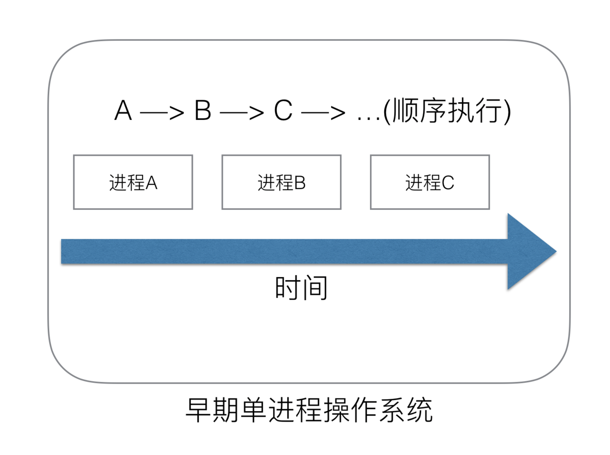
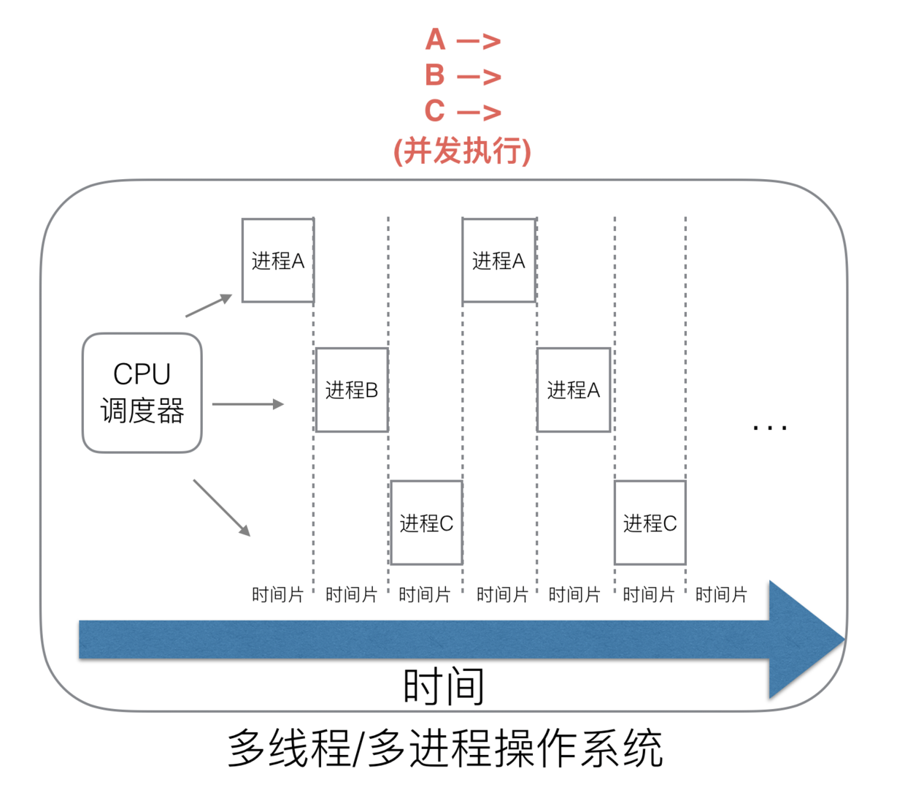
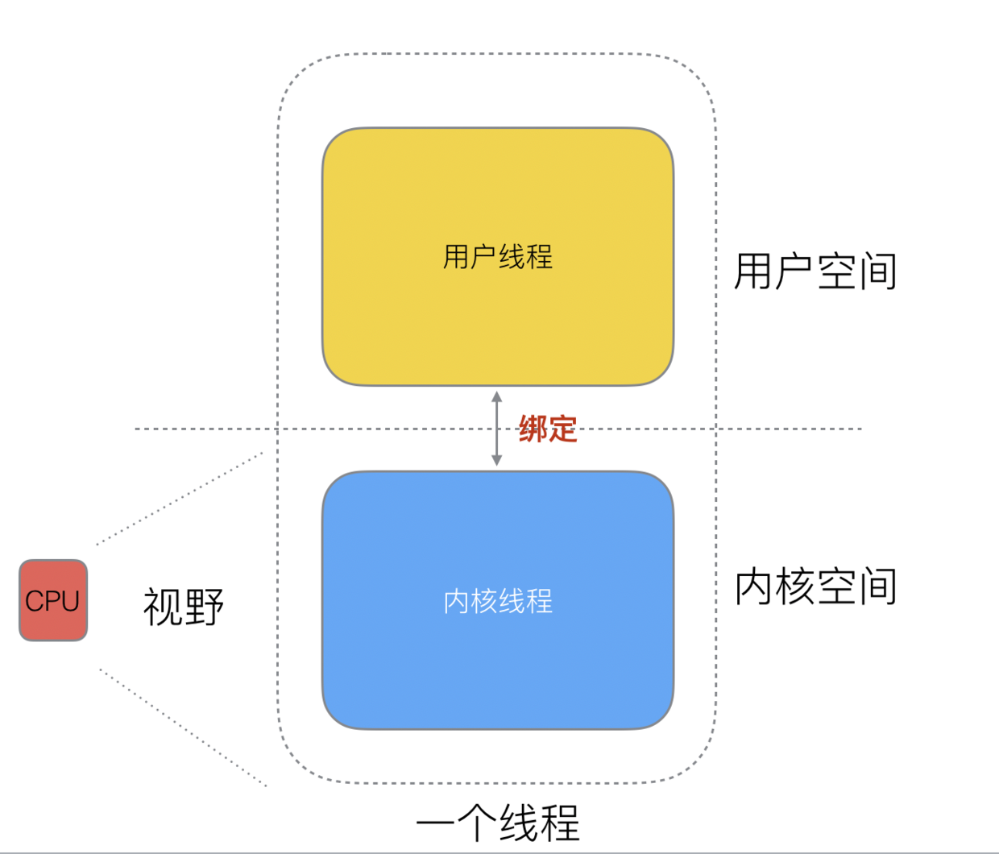
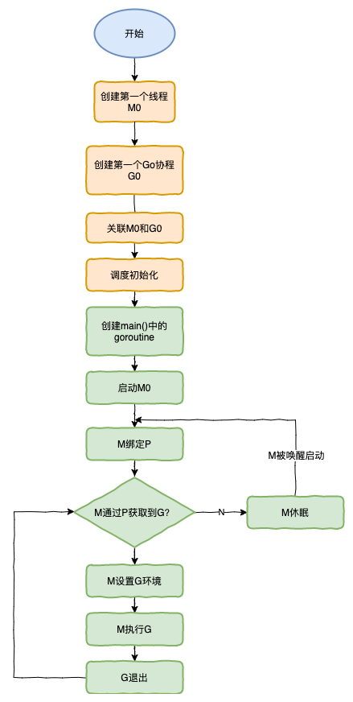

# 调度器

## 调度器的由来

### 单进程时代



**单进程操作系统面临的问题**  
1、单一的执行流程，计算机只能一任务一个任务处理  
2、进程阻塞带来CPU资源的浪费

### 多进程

使用多进程的操作系统中，解决了阻塞问题；在一个进程阻塞CPU可以立刻切换到其他进程中去执行，这样就可以提高CPU资源的利用。



**多进程系统面临的问题**  
同样使用多进程仍有新的问题，进程占用太多的资源，进程的创建、切换、销毁会占用很长时间，CPU虽然利用起来了，但如果进程过多，CPU有很大的一部分都被用来进行进程调度了。

高内存占用  
频繁调度消耗CPU资源

### 多线程

多个线程可以属于同一个进程并共享内存空间，因为多线程不需要创建新的虚拟内存空间，所以它们也不需要内存管理单元处理上下文的切换，线程之间的通信也正是基于共享的内存进行的，与重量级的进程相比，线程显得比较轻量。


虽然线程比较轻量，但是在调度时也有比较大的额外开销;每个线程会都占用1M以上的内存空间，在切换线程时不止会消耗较多的内存，恢复寄存器中的内容还需要向操作系统申请或者销毁资源，每一次线程上下文的切换都需要消耗~1us左右的时间，但是Go调度器对Goroutine的上下文切换约为~0.2us，减少了80%的额外开销2。

### 协程

多进程、多线程已经提高了系统的并发能力，但是在当今互联网高并发场景下，为每个任务都创建一个线程是不现实的，因为会消耗大量的资源；在我们系统级别调度下线程分为“内核态”和“用户态”线程；一个“用户态”线程必须要绑定一个“内核态”线程；这样我们就称“用户态”线程成为“协程”。


#### 线程与协程关系

N:1  N个系统线程对应一个用户协程  
1:1  一个系统线程对应一个用户协程  
N:M  N个系统线程对应M个用户协程  

## GMP调度模型及设计思想

### Go语言调度器历史

```golang
单线程调度器 · 0.x
    只包含40多行代码；
    程序中只能存在一个活跃线程，由G-M模型组成；

多线程调度器 · 1.0
    允许运行多线程的程序；
    全局锁导致竞争严重；

任务窃取调度器 · 1.1
    引入了处理器P，构成了目前的G-M-P模型；
    在处理器P的基础上实现了基于工作窃取的调度器；
    在某些情况下，Goroutine不会让出线程，进而造成饥饿问题；
    时间过长的垃圾回收（Stop-the-world，STW）会导致程序长时间无法工作；

抢占式调度器 · 1.2 ~ 至今
    基于协作的抢占式调度器 - 1.2 ~ 1.13
        通过编译器在函数调用时插入抢占检查指令，在函数调用时检查当前Goroutine是否发起了抢占请求，实现基于协作的抢占式调度；
        Goroutine可能会因为垃圾回收和循环长时间占用资源导致程序暂停；
    基于信号的抢占式调度器 - 1.14 ~ 至今
        实现基于信号的真抢占式调度；
        垃圾回收在扫描栈时会触发抢占调度；
        抢占的时间点不够多，还不能覆盖全部的边缘情况；

非均匀存储访问调度器 · 提案
    对运行时的各种资源进行分区；
    实现非常复杂，到今天还没有提上日程；
```

### Goroutine

Goroutine是golang实际并发执行的实体，底层是使用协程（coroutine）实现并发，coroutine是一种运行在用户态的用户线程；
它具有如下特点：  
>1、使用用户空间，可以避免了内核态和用户态的切换的成本  
>2、可以由语言和框架层进行调度  
>3、占用更小的栈空间，允许创建大量的实体  

### GMP模型的组成

Golang内部有三个对象：P对象（processor）代表上下文或者认为是处理器，M对象（workthread）代表工作线程，G对象（goroutine）。


#### G

1、调度器中待执行的任务，它在调度器中的地位与线程在操作系统的地位类似，只是占用资源更少；  
2、只存在于go语言的运行时，它是go语言在用户态提供的线程，作为更轻量的执行单元，如果使用得当，会提供高并发的能力；  
3、Goroutine在Go语言运行时使用私有结构体runtime.g表示；  

```golang
type g struct {
    // 描述了当前 Goroutine 的栈内存范围 [stack.lo, stack.hi)
    stack       stack
    // 用于调度器抢占式调度
    stackguard0 uintptr
    // 抢占信号
    preempt       bool
    // 抢占时将状态修改成 `_Gpreempted` 
    preemptStop   bool 
    // 在同步安全点收缩栈
    preemptShrink bool 
    // 最内侧的 panic 结构体
    _panic       *_panic
    // 最内侧的延迟函数结构体 
    _defer       *_defer 
    // 当前Goroutine占用的线程，可能为空
    m              *m
    // 存储Goroutine的调度相关的数据
    sched          gobuf
    // Goroutine 的状态
    atomicstatus   uint32
    // 协程ID
    goid           int64
}
```

M(Machine)：对OS内核级线程的封装  
P(Processor)：逻辑处理器，即为G和M的调度对象，用来调度G和M之间的关联关系，其数量为默认核心数

### 调度模型


1、全局队列(Global Queue):存放等待运行的G  
2、P的本地队列：同全局队列类似，存放的也是等待运行的G，存的数量有限，不超过256个。新建G时，G优先加入到P的本地队列，如果队列满了，则会把本地队列中一半的G移动到全局队列。  
3、P列表：所有的P都在程序启动时创建，并保存在数组中，最多有GOMAXPROCS(可配置) 个。
4、M:线程想运行任务就得获取P，从P的本地队列获取G，P队列为空时，M也会尝试从全局队列拿一批G放到P的本地队列，或从其他P的本地队列偷一半放到自己P的本地队列；M运行G，G执行之后，M会从P获取下一个G，不断重复下去。

GMP调度器和OS调度器是通过M结合起来的，每个M都代表了1个内核线程，OS调度器负责把内核线程分配到CPU的核上执行。

#### P和M的个数问题

P的数量：  
由启动时环境变量GOMAXPROCS或者是由runtime.GOMAXPROCS()的方法决定；这意味着在程序执行的任意时刻最多有GOMAXPROCS个goroutine在同时运行；数量一般为CPU核心数。  

M的数量：
>go语言本身的限制：go程序启动时，会设置M的最大数量，默认10000;  
>runtime/debug包中的SetMaxThreads()函数，设置M的最大数量;  
>go程序只有在一个go程准备要执行，但现有的线程都阻塞在系统调用、cgo调用或被runtime.LockOSThread函数阻塞在其他go程时，才会创建一个新的线程  

M与P的数量没有绝对关系，一个M阻塞，P就会去创建或者切换另一个M，所以，即使P的默认数量是1，也有可能会创建很多个M出来。

#### P和M何时被创建

1、P何时创建：在确定了P的最大数量n后，运行时系统会根据这个数量创建n个P。  
2、M何时创建：没有足够的M来关联P并运行其中的可运行的G；比如所有的M此时都阻塞住了，而P中还有很多就绪任务，就会去寻找空闲的M，而没有空闲的，就会去创建新的M。

### 调度器的设计策略

#### 复用线程

避免频繁的创建、销毁线程、而是对线程的复用  

work stealing(工作窃取机制)：  
当本线程无可运行的G时，尝试从其他线程绑定的P偷取G，而不是销毁线程。

hand off(放手机制)：  
当本线程因为G进行系统调用阻塞时，线程释放绑定的P，把P转移给其他空闲的线程执行。

#### 利用并行

GOMAXPROCS设置P的数量，最多有GOMAXPROCS个线程分布在多个CPU上同时运行;GOMAXPROCS也限制了并发的程度，比如GOMAXPROCS = 核数/2，则最多利用了一半的CPU核进行并行。

#### 抢占(<go1.4)

在coroutine中要等待一个协程主动让出CPU才执行下一个协程；  
在Go中，一个goroutine最多占用CPU 10ms，防止其他goroutine被饿死，这就是goroutine不同于coroutine的一个地方。

#### 全局G队列

在新的调度器中依然有全局G队列，但功能已经被弱化了，当M执行work stealing从其他P偷不到G时，它可以从全局G队列获取G。

### 调度流程


​ 1、我们通过go func ()来创建一个goroutine；

​ 2、有两个存储G的队列，一个是局部调度器P的本地队列、一个是全局G队列，新创建的G会先保存在P的本地队列中，如果P的本地队列已经满了就会保存在全局的队列中；

​ 3、G只能运行在M中，一个M必须持有一个P，运行中的M与P是1：1的关系。M会从P的本地队列弹出一个可执行状态的G来执行，如果P的本地队列为空，就会向其他的MP组合偷取一个可执行的G来执行；

​ 4、一个M调度G执行的过程是一个循环机制；

​ 5、当M执行某一个G时候如果发生了syscal或则其他阻塞操作，M会阻塞，如果当前有一些G在执行，runtime会把这个线程M从P中摘除)，然后再创建一个新的操作系统的线程 (如果有空闲的线程可用就复用空闲线程) 来服务于这个P；

​ 6、当M系统调用结束时候，这个G会尝试获取一个空闲的P执行，并放入到这个P的本地队列，如果获取不到P，那么这个线程M变成休眠状态，加入到空闲线程中，然后这个G会被放入全局队列中。

### 调度器的生命中周期



特殊的M0和G0

M0:  
M0是启动程序后的编号为0的主线程，这个M对应的实例会在全局变量runtime.m0中，不需要在heap上分配，M0负责执行初始化操作和启动第一个G， 在之后M0就和其他的M一样了。

G0:  
G0是每次启动一个M都会第一个创建的gourtine，G0仅用于负责调度的G，G0不指向任何可执行的函数，每个M都会有一个自己的G0。在调度或系统调用时会使用G0的栈空间，全局变量的G0是M0的G0。

调度器的生命周期几乎占满了一个Go程序的一生，runtime.main的goroutine执行之前都是为调度器做准备工作，runtime.main的goroutine运行，才是调度器的真正开始，直到runtime.main结束而结束。

#### 调度器初始化

运行时通过runtime.schedinit初始化调度器：  

1、初始化M的个数，为10000；  
2、初始化P的个数，从GOMAXPROCS环境变量中获取；  
3、调度器会完成相应数量处理器的启动，然后等待用户创建运行新的Goroutine并为Goroutine调度处理器资源

#### 创建协程

```golang
go func(){
    //
}()
```

## 调度场景

## 参考

[Golang 调度器 GMP 原理与调度全分析](https://learnku.com/articles/41728)  
[调度器](https://draveness.me/golang/docs/part3-runtime/ch06-concurrency/golang-goroutine/)
