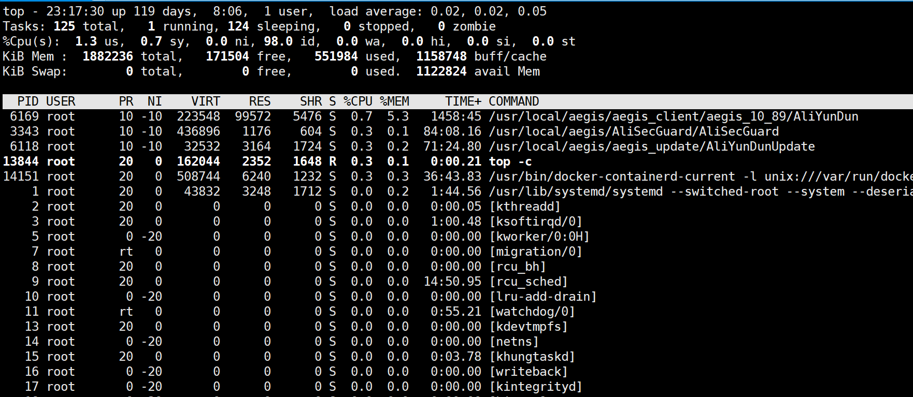
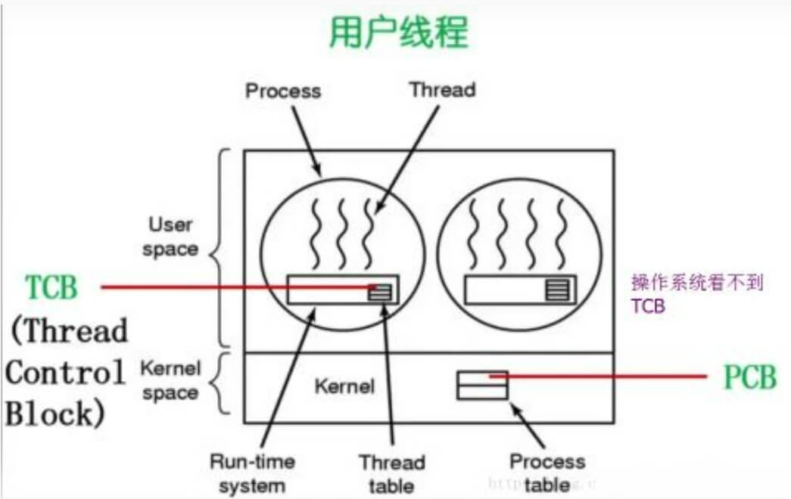

# 操作系统相关常见问题

## 什么是进程？

```linux
进程是具有一定独立功能的程序关于某个数据集合上的一次运行活动,进程是系统进行资源分配和调度的一个独立单位。 
每个进程都有自己的独立内存空间，不同进程通过进程间通信来通信。由于进程比较重量，占据独立的内存，所以上下文进程间的切换开销（栈、寄存器、虚拟内存、文件句柄等）比较大，但相对比较稳定安全。
```

## 什么是线程？

```linux
线程是进程的一个实体，线程是内核态，是CPU调度和分派的基本单位,它是比进程更小的能独立运行的基本单位。线程自己基本上不拥有系统资源，只拥有一点在运行中必不可少的资源(如程序计数器,一组寄存器和栈)，但是它可与同属一个进程的其他的线程共享进程所拥有的全部资源。 
线程间通信主要通过共享内存，上下文切换很快，资源开销较少，但相比进程不够稳定容易丢失数据。
```

## 进程与线程的区别？

```linux
资源：进程间的资源相互独立，同一进程的各线程间共享资源；某进程的线程在其他进程不可见。  

通信：进程间通信：消息传递、同步、共享内存、远程过程调用、管道。线程间通信：直接读写进程数据段（需要进程同步和互斥手段的辅助，以保证数据的一致性）。  

调度和切换：线程上下文切换比进程上下文切换要快得多。  
线程是操作系统最小的执行单元，在单线程程序中，任务一个一个地做，必须做完一个任务后，才会去做另一个任务。  
```

## 协程

```linux
协程是一种用户态的轻量级线程，协程的调度完全由用户控制。
协程拥有自己的寄存器上下文和栈。 
协程调度切换时，将寄存器上下文和栈保存到其他地方，在切回来的时候，恢复先前保存的寄存器上下文和栈，直接操作栈则基本没有内核切换的开销，可以不加锁的访问全局变量，所以上下文的切换非常快。
```

## 怎么查看一个程序是否正常运行，该程序端口为801

```linux
1、通过netstat -ntlp | grep 8010 查询到程序的进程ID  
2、然后通过 top -p pid 查看当前进程运行情况
```

## 如何查找一个文件？

```linux
find /etc -name nginx.conf  
locate nginx.conf  
```

## 怎么查找一个字符串，在哪些文件里?

```linux
grep -Ri "name"
```

## top命令信息解读?



```linux
第一行表示的项目依次为当前时间、系统运行时间、当前系统登录用户数目、1/5/10分钟系统平均负载(一般来说，这个负载值应该不太可能超过 1 才对，除非您的系统很忙碌。 
如果持续高于 5 的话，那么.....仔细的看看到底是那个程序在影响整体系统吧！)。
```

```linux
第二行显示的是所有启动的进程、目前运行、挂起 (Sleeping)的和无用(Zombie)的进程。(比较需要注意的是最后的 zombie 那个数值，如果不是 0 ，嘿嘿！好好看看到底是那个 process 变成疆尸了吧？！)(stop模式：与sleep进程应区别，sleep会主动放弃cpu，而stop是被动放弃cpu ，例单步跟踪，stop（暂停）的进程是无法自己回到运行状态的)
```

```linux
第三行显示的是目前CPU的使用情况，包括us用户空间占用CPU百分比、sy 内核空间占用CPU百分比、ni 用户进程空间内改变过优先级的进程占用CPU百分比(中断处理占用)、id 空闲CPU百分比、wa 等待输入输出的CPU时间百分比、hi,si,st 三者的意思目录还不清楚 ：)
```

```linux
第四行显示物理内存的使用情况，包括总的可以使用的内存、已用内存、空闲内存、缓冲区占用的内存。
```

```linux
第五行显示交换分区使用情况，包括总的交换分区、使用的、空闲的和用于高速缓存的大小。
```

```linux
第六行开始展示当前系统进运行的状态。
```

## fork的底层实现方式

```linux
fork的实现分为以下两步
1. 复制进程资源
2. 执行该进程

复制进程的资源包括以下几步
1. 进程pcb
2. 程序体，即代码段数据段等
3. 用户栈
4. 内核栈
5. 虚拟内存池
6. 页表

执行进程的话就比较简单了，只需要将其加入到就绪队列即可，接下来就等待cpu的调度了。
```

## 线程和协程的区别，内核态和用户态



[用户态与内核态 -- 帮你解惑，直达本质
](https://zhuanlan.zhihu.com/p/564044252)

## 一个进程能创建的线程数量受到哪些制约？

```linux
进程的虚拟内存空间上限:因为创建一个线程，操作系统需要为其分配一个栈空间，如果线程数量越多，所需的栈空间就要越大，那么虚拟内存就会占用的越多。

系统参数限制:虽然 Linux 并没有内核参数来控制单个进程创建的最大线程个数，但是有系统级别的参数来控制整个系统的最大线程个数。
```

[被问懵了：一个进程最多可以创建多少个线程？](https://www.cnblogs.com/xiaolincoding/p/15013929.html)

## linux常用操作

```linux
ls
alias|unalias
pwd
cd
rm
mkdir
man
touch
chmod
exit
sudo
```

## sleep底层实现原理

## linux文件系统

## osit层

## 进程阻塞怎么处理？就是进程完全不运行了，但是pid还在

## 查端口用什么命令？

```linux
netstat命令各个参数说明如下：
-t : 指明显示TCP端口
-u : 指明显示UDP端口
-l : 仅显示监听套接字
-p : 显示进程标识符和程序名称，每一个套接字/端口都属于一个程序
-n : 不进行DNS轮询，显示IP
```

### 常用案例  

```linux
netstat -ntlp // 查看当前所有TCP端口
netstat -ntulp | grep 80 // 查看所有80端口使用情况
netstat -an | grep 3306  // 查看所有3306端口使用情况
netstat -lanp // 查看一台服务器上面服务及端口
ps -ef | grep mysqld // 查看一个服务有几个端口
netstat -pnt | grep :3306 | wc // 查看某一个端口的连接数量
```

## lsof查不到的话用什么命令？

## 系统上有个大文件，但是不知道文件的名字和路径，在当前用户的用户空间下，如何找到他？

## linux查看cpu负载、磁盘io、内存用什么命令

### 1、使用top命令


| Tasks | 169 total 进程总数 |
| --- | --- |
| 1 running | 正在运行的进程数 |
| 96 sleeping | 睡眠的进程数 |
| 0 stopped | 停止的进程数 |
| 0 zombie | 僵尸进程数 |

| Cpu(s): | CPU使用信息 |
| --- | --- |
| 0.0 us | 用户空间占用CPU百分比 |
| 0.0 sy | 内核空间占用CPU百分比 |
| 0.0 ni | 用户进程空间内改变过优先级的进程占用CPU百分比 |
| 99.9 id | 空闲CPU百分比 |
| 0.0 wa | 等待输入输出的CPU时间百分比 |
| 0.0 hi |  |
| 0.0 si |  |
| 0.0 wa | 体现出当前的磁盘io请求是否频繁。如果 wa的数量比较大，说明等待输入输出的的io比较多。 |

### 2、vmstat

```linux
vmstat命令报告关于线程、虚拟内存、磁盘、陷阱和 CPU 活动的统计信息。
由vmstat命令生成的报告可以用于平衡系统负载活动。
系统范围内的这些统计信息(所有的处理器中)都计算出以百分比表示的平均值，或者计算其总和。

如果发现等待的进程和处在非中断睡眠状态的进程数非常多，并且发送到块设备的块数和从块设备接收到的块数非常大，那就说明磁盘io比较多。
```


| procs |  |
| --- | --- |
| r: | 等待运行的进程数 |
| b: | 处在非中断睡眠状态的进程数 |
| w: | 被交换出去的可运行的进程数 |

| Memory |  |
| --- | --- |
| swpd: | 虚拟内存使用情况，单位：KB  |
| free: | 空闲的内存，单位KB  |
| buff: | 被用来做为缓存的内存数，单位：KB  |

| Swap |  |
| --- | --- |
| si: | 从磁盘交换到内存的交换页数量，单位：KB/秒 |
| so: | 从内存交换到磁盘的交换页数量，单位：KB/秒 |

| IO |  |
| --- | --- |
| bi: | 发送到块设备的块数，单位：块/秒  |
| bo: | 从块设备接收到的块数，单位：块/秒  |

| system |  |
| --- | --- |
| in: | 每秒的中断数，包括时钟中断  |
| cs: | 每秒的环境(上下文)切换次数  |

| CPU | 按 CPU 的总使用百分比来显示 |
| --- | --- |
| us: | CPU 使用时间  |
| sy: | CPU 系统使用时间  |
| id: | 闲置时间  |

### iostat

## 写扩散和读扩散概念？

## 为什么内存操作很快

## linux内核
