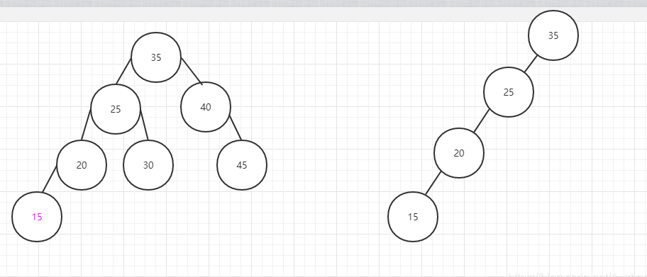
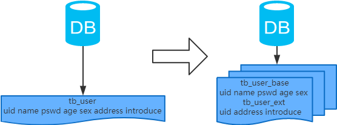

# MySql常见问题

索引、性能、事务、锁

## 索引

- [深入理解 Mysql 索引底层原理](https://zhuanlan.zhihu.com/p/73204847)
- [纸上得来终觉浅 绝知此事要躬行](https://www.cnblogs.com/MrYuChen-Blog/p/15672292.html)

索引是对数据库表中一列或多列的值进行排序的一种结构，MySQL索引的建立对于MySQL的高效运行是很重要的，索引可以大大提高MySQL的检索速度。索引只是提高效率的一个因素，如果你的MySQL有大数据量的表，就需要花时间研究建立最优秀的索引或优化查询语句。

简单类比一下，数据库如同书籍，索引如同书籍目录，假如我们需要从书籍查找与 xx 相关的内容，我们可以直接从目录中查找，定位到 xx 内容所在页面，如果目录中没有 xx 相关字符或者没有设置目录（索引），那只能逐字逐页阅读文本查找，效率可想而知。

### 为什么使用索引

使用索引是为了提高数据的检索效率和查询性能。索引是数据库表中的一种数据结构，它可以根据一个或多个列的值，快速地定位到符合条件的行，从而加快查询速度。当数据库表中的数据量较大时，使用索引可以显著减少查询所需的时间，提高数据库的响应速度。

具体来说，使用索引可以实现以下几个方面的优化：

- 加速数据查询：通过索引可以快速定位到符合查询条件的数据行，减少了全表扫描的时间，提高了查询速度。
- 优化排序：对于需要排序的查询，使用索引可以提高排序的速度，避免对整个表进行排序。
- 减少IO操作：索引可以减少磁盘IO操作，因为查询只需要读取索引所在的数据页，而不需要读取整个表的数据页。
- 提高并发性能：使用索引可以避免数据库在查询时进行锁定操作，从而提高了并发性能。

总之，索引可以提高数据库查询的效率和性能，使得数据库可以更加高效地处理大量数据。

### 索引的优缺点

优点：

- 提高查询效率：索引可以加速数据查询，通过快速定位符合条件的数据行，减少了全表扫描的时间，提高了查询效率。
- 优化排序：对于需要排序的查询，使用索引可以提高排序的速度，避免对整个表进行排序。
- 减少IO操作：索引可以减少磁盘IO操作，因为查询只需要读取索引所在的数据页，而不需要读取整个表的数据页。
- 提高并发性能：使用索引可以避免数据库在查询时进行锁定操作，从而提高了并发性能。

缺点：

- 占用空间：索引需要占用一定的磁盘空间，对于大量数据的表，需要创建较多的索引，会占用较多的存储空间。
- 影响插入、更新和删除操作：创建索引会对插入、更新和删除操作产生一定的影响，因为每次操作都需要维护索引结构，可能会导致性能下降。
- 索引失效的问题：当数据表的数据分布不均匀时，索引可能会失效，导致查询效率下降。
- 维护成本高：对于大量数据的表，索引的创建、维护和删除等操作会消耗较多的资源和时间，增加了数据库的维护成本。

### 创建索引准则

应该创建索引的列：

1、在经常需要搜索的列上，可以加快搜索的速度；
2、在作为主键的列上，强制该列的唯一性和组织表中数据的排列结构；
3、在经常用在连接（JOIN）的列上，这些列主要是一外键，可以加快连接的速度[少用]；
4、在经常需要根据范围（<，<=，=，>，>=，BETWEEN，IN）进行搜索的列上创建索引，因为索引已经排序，其指定的范围是连续的；
5、在经常需要排序（order by）的列上创建索引，因为索引已经排序，这样查询可以利用索引的排序，加快排序查询时间；
6、在经常使用在WHERE子句中的列上面创建索引，加快条件的判断速度。


不该创建索引的列：

1、对于那些在查询中很少使用或者参考的列不应该创建索引。若列很少使用到，因此有索引或者无索引，并不能提高查询速度。
相反由于增加了索引，反而降低了系统的维护速度和增大了空间需求。

2、对于那些只有很少数据值或者重复值多的列也不应该增加索引。【数据去重后的数据比趋于1,则索引效果越好】
这些列的取值很少，例如用户信息表的性别列，在查询的结果中，结果集的数据行占了表中数据行的很大比例，
即需要在表中搜索的数据行的比例很大。增加索引，并不能明显加快检索速度。

3、对于那些定义为text, image和bit数据类型的列不应该增加索引。这些列的数据量要么相当大，要么取值很少。

4、当该列修改性能要求远远高于检索性能时，不应该创建索引。（修改性能和检索性能是互相矛盾的）

### 索引的分类

- 主键索引(唯一且非空)【数据库默认建立的索引是给唯一键建立的】
- 唯一索引(唯一可为空)
- 普通索引(普通字段的索引)
- 全文索引(一般是varchar,char,text类型建立的，但很少用)
- 组合索引(多个字的建立的索引)

### mysql索引结构

MySQL索引是用于快速查找和访问数据库中数据的数据结构。在MySQL中，常用的索引结构包括B-Tree索引和哈希索引。

B-Tree索引
B-Tree（B树）是一种平衡树，它可以用于实现数据库索引。B-Tree索引是一种层级结构的索引，每个节点存储多个数据项和子节点的指针。

在MySQL中，B-Tree索引使用的是B+Tree，它的数据项存储在叶子节点中，非叶子节点仅存储索引键和子节点的指针。B+Tree索引的优点是可以支持范围查询、支持按照顺序遍历数据等操作，适用于数据量大、查询频繁的场景。

哈希索引
哈希索引是一种基于哈希表的索引结构，将数据存储在哈希表中，通过计算哈希值来查找数据。哈希索引适用于等值查询，但不支持范围查询和按照顺序遍历数据。

在MySQL中，哈希索引的实现是通过Memory存储引擎实现的，它可以用于缓存查询结果，但不适用于持久化存储。MySQL的InnoDB存储引擎不支持哈希索引。

除了B-Tree索引和哈希索引，MySQL还支持全文索引和空间索引等高级索引类型。全文索引用于对文本内容进行搜索，空间索引用于对空间数据（如地理位置信息）进行搜索。这些高级索引类型都是基于B-Tree索引实现的。


### 索引结构——二叉树

特性：  

- 所有非叶子结点至多拥有两个子节点（Left和Right）；
- 所有结点存储一个关键字；
- 非叶子结点的左指针指向小于其关键字的子树，右指针指向大于其关键字的子树；


二叉搜索树的搜索，从根结点开始，如果查询的关键字与结点关键字相等，则该结点为查询的结点，如果查询关键字比结点关键字小，则进入左子树，反之则进入右子树；如果左子树为空或者右子树为空，则返回查找不到响应的关键字；
如果二叉搜索树的所有叶子结点的左右子树的树木保持一个平衡即左右子树个数大致相等的话，其搜索则更接近与二分查找；但是它相比连续内存空的二分查找的优点是：改变二叉搜索树的结构（添加或者删除）不需要大段的移动数据，甚至通常都是常数开销；



当一个二叉树经历多次删除操作后，就会出现树不平衡的状态，如上图所示。

右边也是一个搜索二叉树，只不过不在平衡了，他的搜索功能也变成了线性的，同样的关键字可能导致不同的树结构索引，所以，在使用搜索二叉树时，还要考虑尽可能让B树保持左图的结构，避免和右图类似，这也有事所谓的平衡问题了；

实际使用的二叉搜索树都是在原二叉搜索树的基础上加上平衡算法，即平衡二叉树；如何保持B树节点分布均匀的平衡算法就是平衡二叉树的关键所在，平衡算法是一种在二叉搜索树的插入和删除结点时的一种策略。即：在插入或删除的同时保持二叉搜索树的平衡。

### 索引结构——B Tree

B-树，这里的B表示balance(平衡的意思),B-树是一种多路自平衡的搜索树（B树是一颗多路平衡查找树）它类似普通的平衡二叉树，不同的一点是B-树允许每个节点有更多的子节点；


B树是一种多路搜索树，一棵m阶的B树满足下列条件：

- 树中每个结点至少有M个孩子
- 根结点的子节点数为[2,M）
- 除根结点以外的非叶子结点的儿子数为[M/2, M]；
- 每个结点存放至少M/2-1（取上整）和至多M-1个关键字；（至少2个关键字）
- 非叶子结点的关键字个数 = 指向子节点的指针个数-1；
- 非叶子结点的关键字：K[1], K[2], …, K[M-1]；且K[i] < K[i+1]；
- 非叶子结点的指针：P[1], P[2], …, P[M]；其中P[1]指向关键字小于K[1]的子树，P[M]指向关键字大于K[M-1]的子树，其它P[i]指向关键字属于(K[i-1], K[i])的子树；
- 所有叶子结点位于同一层；

B树的特征:

- 关键字集合分布在整颗树中；
- 任何一个关键字出现且只出现在一个结点中；
- 搜索有可能在非叶子结点结束；
- 其搜索性能等价于在关键字全集内做一次二分查找；
- 自动层次控制；
- B树的搜索，从根结点开始，对结点内的关键字（有序）序列进行二分查找，如果命中则结束，否则进入查询关键字所属范围的子结点；重复，直到所对应的子指针为空，或已经是叶子结点；

### 索引结构——B+Tree

B+树是B-树的变体，也是一种多路搜索树，特性和B-类似，不同在于：

1、所有关键字存储在叶子节点出现，内部节点(非叶子节点并不存储真正的 data)  
2、为所有叶子结点增加了一个链指针

B+ 树的磁盘读写代价更低：B+ 树的数据都集中在叶子节点，分支节点 只负责指针（索引）；B 树的分支节点既有指针也有数据 。这将导致B+ 树的层高会小于B 树的层高，也就是说B+ 树平均的Io次数会小于B 树。

B+ 树的查询效率更加稳定：B+ 树的数据都存放在叶子节点，故任何关键字的查找必须走一条从根节点到叶子节点的路径。所有关键字的查询路径相同，每个数据查询效率相当。

B+树更便于遍历：由于B+树的数据都存储在叶子结点中，分支结点均为索引，遍历只需要扫描一遍叶子节点即可；B树因为其分支结点同样存储着数据，要找到具体的数据，需要进行一次中序遍历按序来搜索。

B+树更擅长范围查询：B+树叶子节点存放数据，数据是按顺序放置的双向链表。B树范围查询只能中序遍历。

B+ 树占用内存空间小：B+ 树索引节点没有数据，比较小。在内存有限的情况下，相比于B树索引可以加载更多B+ 树索引。


### B+树和B树有什么区别

B+树和B树都是一种平衡树，用于实现数据库索引，但它们有一些区别：

叶子节点：B树和B+树的叶子节点都存储了实际的数据，但是B+树的叶子节点只包含关键字和指向数据的指针，不存储实际的数据，而B树的叶子节点既包含关键字，也包含数据。

非叶子节点：B树和B+树的非叶子节点都包含了关键字和子节点的指针，但是B树的非叶子节点同时包含了关键字和子节点，而B+树的非叶子节点只包含了关键字，不包含子节点的指针。

查询操作：在B+树中，由于所有的数据都存储在叶子节点中，因此查找数据只需要遍历B+树的叶子节点。而在B树中，数据可能存储在任何一个节点中，因此查找数据需要遍历整棵树。

范围查询：由于B+树的叶子节点构成了一个有序链表，因此B+树支持范围查询和顺序遍历。而B树不支持这些操作，需要进行全量遍历。

磁盘IO：B+树的叶子节点构成了一个有序链表，可以减少磁盘IO次数，因此B+树适合于磁盘存储。而B树的非叶子节点和叶子节点都可能包含数据，因此B树的IO次数会更多，适合于内存存储。

总之，B+树和B树都是常用的平衡树数据结构，但是它们适用的场景不同，需要根据实际情况选择合适的数据结构。如果需要支持范围查询和顺序遍历，可以选择B+树，而如果数据全部存储在内存中，可以选择B树。

### 覆盖查询和回表查询

覆盖查询（Covering Query）是指一个查询可以直接从数据库索引中获取所有需要的数据，而不需要去访问实际的数据行。这意味着查询可以通过检查索引就能返回所有的查询结果，而不需要在数据库的表中查找相应的行。由于不需要访问表中的实际数据行，因此覆盖查询通常比回表查询更高效。覆盖查询在查询大型数据集时特别有用，因为它可以显著减少查询的响应时间。

回表查询（Lookup Query）是指一个查询需要在数据库表中查找实际的数据行，以获取查询结果。当一个查询无法直接从索引中获取所有需要的数据时，就需要执行回表查询。回表查询通常需要读取磁盘上的实际数据行，这可能会导致额外的磁盘 I/O，因此它可能比覆盖查询更慢。

综上所述，覆盖查询和回表查询是查询优化中重要的概念，使用覆盖查询可以避免回表查询带来的额外开销，从而提高查询的性能。

### 索引下推

索引下推（Index Pushdown）是指在关系型数据库中，查询优化器利用索引来减少查询需要访问的数据行的数量。

在执行一个查询时，优化器通常需要确定最佳的执行计划来获得查询结果。在一些情况下，查询可以通过在索引中执行更多的操作来减少需要访问的数据行的数量，从而提高查询性能。这个过程就是索引下推。

具体来说，索引下推的过程是将一些查询操作尽可能地下推到索引层级，以便在索引层级上进行操作，而不是在表层级上进行操作。例如，对于一个查询操作，如果可以通过索引来完成排序或筛选等操作，查询优化器就会将这些操作下推到索引层级中执行，以减少需要访问的数据行的数量。这样可以在查询过程中减少磁盘 I/O 操作，提高查询的性能。

需要注意的是，并非所有的查询操作都可以被下推到索引层级中执行，因此在使用索引下推时，需要根据具体的查询操作和索引类型进行评估和优化。在某些情况下，索引下推可能会带来额外的开销，甚至会降低查询性能。

综上所述，索引下推是一种利用索引来减少查询需要访问的数据行数量的优化技术，在适当的情况下，可以提高查询的性能。

### 聚簇索引和非聚簇索引

InnoDB 里，索引B+ Tree的叶子节点存储了整行数据的是主键索引，也被称之为聚簇索引。

而索引B+ Tree的叶子节点存储了主键的值的是非主键索引，也被称之为非聚簇索引。

### mysql主键索引和非主键索引在搜索和检索过程中有什么区别吗？

聚簇索引（clustered index）不是单独的一种索引类型，而是一种数据存储方式。这种存储方式是依靠B+树来实现的，根据表的主键构造一棵B+树且B+树叶子节点存放的都是表的行记录数据时，方可称该主键索引为聚簇索引。聚簇索引也可理解为将数据存储与索引放到了一块，找到索引也就找到了数据。

非聚簇索引：数据和索引是分开的，B+树叶子节点存放的不是数据表的行记录。

聚簇索引优点：

- 聚簇索引对于主键的排序查找和范围查找速度非常快
- 数据访问更快，因为聚簇索引将索引和数据保存在同一个B+树中，因此从聚簇索引中获取数据比非聚簇索引更快

聚簇索引缺点：

- 插入速度严重依赖于插入顺序，按照主键的顺序插入是最快的方式，否则将会出现页分裂，严重影响性能。因此，对于InnoDB表，我们一般都会定义一个自增的ID列为主键（主键列不要选没有意义的自增列，选经常查询的条件列才好，不然无法体现其主键索引性能）

- 更新主键的代价很高，因为将会导致被更新的行移动。因此，对于InnoDB表，我们一般定义主键为不可更新。

- 二级索引访问需要两次索引查找，第一次找到主键值，第二次根据主键值找到行数据。

### 哪些键可以设置唯一索引

数据列不允许重复，允许为 NULL 值，一张表可有多个唯一索引，索引列的值必须唯一，但允许有空值。如果是组合索引，则列值的组合必须唯一。

### 什么场景下联合索引会失效？

- 索引列上出现类型转换
- 存储引擎不能使用索引范围条件右边的列
- mysql在使用不等于（！=或者<>）的时候无法使用索引会导致全表扫描
- is null,is not null也无法使用索引
- like以通配符开头（’%abc…’）mysql索引失效会变成全表扫描的操作。

### 最左匹配原则？问为什么有这个东西？

组合索引中 先匹配左边，再继续向后匹配；比如user表中有name+age组成的联合索引，select * from user where name="纪先生" and age = 18 就符合最左匹配，可以用的索引。而select * from user where age = 18就不符合，用不到这个索引。

总结：组合索引顾头不顾未，想要使用索引，必须从组合索引的第一个字段开始。


### 数据库如何建索引

```mysql
主键索引
ALTER TABLE TableName ADD PRIMARY KEY(column_list); 

唯一索引
CREATE UNIQUE INDEX IndexName ON `TableName`(`字段名`(length));
# 或者
ALTER TABLE TableName ADD UNIQUE (column_list); 

普通索引
CREATE INDEX IndexName ON `TableName`(`字段名`(length));
# 或者
ALTER TABLE TableName ADD INDEX IndexName(`字段名`(length));
```

### sql索引优化问题

SQL 索引是一种常用的优化数据库查询性能的方法，可以大大提高查询的效率。
以下是 SQL 索引优化的一些常见问题：

什么是索引？
索引是数据库中用于加速数据访问的一种数据结构。它们是通过一个数据结构来存储表中的数据，从而提供快速的查询和排序。当创建索引时，它会在数据库中创建一个表格，包含列名和索引键的值。这样，查询时可以在索引表格中查找相应的记录，而不需要扫描整个数据表。

索引如何提高查询性能？
索引可以大大提高数据库的查询性能，因为它可以使数据库在查找数据时不需要扫描整个数据表，而是直接通过索引表格来定位相应的数据行。这可以大大减少数据库的 I/O 操作，从而提高查询速度。

如何选择索引列？
在选择索引列时，应该选择经常被用于查询、过滤、排序和分组的列。同时，也要考虑到索引的选择性。索引的选择性指的是索引列中不同值的数量与总行数之比。选择性越高，索引的效果就越好。

如何优化索引？
在优化索引时，可以采用以下几种方法：

删除不必要的索引，只保留那些经常被用到的索引；
尽量使用覆盖索引，避免使用全表扫描；
对复合索引的列进行优化，优先考虑选择性高的列作为索引前缀；
使用索引提示强制使用特定的索引；
定期对数据库进行性能测试和监控，及时发现问题并进行优化。


索引可能带来的问题？
尽管索引可以大大提高数据库的查询性能，但是也可能带来以下问题：

索引需要占用存储空间，可能会占用较大的存储空间；
当数据库表中的数据频繁更新时，索引也需要随之更新，会增加数据库的写入操作的开销；
过多的索引可能会影响数据库的性能，因为它们需要占用额外的存储空间，并且在查询时需要额外的处理时间。
因此，在使用索引时，需要根据具体情况进行权衡和优化。

### MySQL优化（索引、分表分库）

1、优化数据库结构：设计良好的数据库结构可以提高查询效率。例如，使用适当的数据类型、创建合适的索引、避免冗余数据等等。

2、合理使用索引：合适的索引可以大大提高查询速度，但是过多或者不合理的索引会导致查询性能下降。因此，需要对表的查询模式和索引的选择进行分析和评估。

3、避免全表扫描：全表扫描是一种低效的查询方式，应尽量避免。可以通过优化查询语句、创建索引、拆分大表等方式来避免全表扫描。

4、优化查询语句：使用合适的查询语句可以大大提高查询性能。例如，避免使用SELECT *、避免使用子查询、避免使用OR、使用LIMIT限制结果集大小等等。

5、优化服务器配置：合适的服务器配置可以提高MySQL的性能，包括内存、CPU、硬盘等方面。同时，需要根据服务器的实际情况进行调整，例如修改缓冲区大小、调整线程池大小等等。

6、优化表的存储引擎：MySQL支持多种存储引擎，不同的存储引擎对于不同的应用场景有着不同的优势和劣势。需要根据具体的应用场景选择合适的存储引擎。

7、定期进行数据库维护：定期进行数据库维护可以提高MySQL的性能和稳定性。例如，优化表结构、删除过期数据、进行备份和恢复等等。

总之，MySQL的优化是一个综合性的问题，需要从多个方面入手，不断进行优化和调整，才能达到最佳的性能。

### mysql索引，mongodb和mysql索引的区别，给了条sql语句问索引怎么构建

MongoDB使用B树索引，而MySQL使用B+树索引。

B树索引适用于随机读取和写入，适用于数据访问模式不规律的场景。MongoDB的B树索引在高负载、大数据量的情况下也能够保持较好的性能。但是B树索引在对范围查询的支持方面有限。

B+树索引更适用于范围查询，适用于有序的数据结构。MySQL的B+树索引相对于B树索引的优势在于能够更好地支持范围查询，而不会影响到性能。另外，B+树索引支持聚簇索引的实现，可以更好地支持主键查询和范围查询的组合操作。

因此，选择合适的索引类型，需要根据具体的应用场景和数据结构来决定。

```mongodb
假设我们有一个存储用户数据的集合（collection）叫做“users”，其中包含以下字段：

_id：唯一标识用户的ID。
name：用户的姓名。
email：用户的电子邮件地址。
age：用户的年龄。
我们想要对“email”字段创建一个索引，以便能够更快地根据用户的电子邮件地址进行搜索。在MongoDB中，可以使用以下命令来创建索引：

db.users.createIndex({ email: 1 })

上述命令中的 { email: 1 } 表示我们要对“email”字段创建一个升序的索引。如果要创建一个降序的索引，可以将1改为-1，例如：

db.users.createIndex({ email: -1 })

当索引被创建后，我们可以使用以下命令来查询用户数据：

db.users.find({ email: "example@example.com" })

上述命令将根据“email”字段查找具有指定电子邮件地址的用户。由于我们已经为“email”字段创建了索引，这个查询将会更加高效。

注意，如果集合中已经存在大量数据，创建索引可能需要一些时间。在这种情况下，可以使用 background: true 选项来将索引创建过程放入后台执行，例如：

db.users.createIndex({ email: 1 }, { background: true })

```

## 性能

[MySQL Explain详解](https://zhuanlan.zhihu.com/p/409658674)

### explain字段含义

### sql查询性能瓶颈处理方式

SQL查询性能瓶颈的处理方式通常包括以下几个方面：

1、优化SQL语句：优化SQL语句可以通过修改SQL查询语句，减少查询中不必要的计算和数据扫描，提高查询效率。例如，可以使用索引、合理地使用JOIN语句、减少子查询和重构查询语句等方式进行优化。

2、增加或修改索引：索引是数据库中提高查询效率的重要手段。可以根据查询需求，增加或修改相应的索引，以减少数据扫描的次数，提高查询效率。

3、增加缓存：缓存可以将常用的数据存储在内存中，减少数据库的访问次数，提高查询效率。可以使用缓存技术，如Memcached、Redis等，将查询结果缓存到内存中。

4、数据库分区：将数据按照某种方式进行分区，可以将大表分解为多个小表，减少数据扫描的时间，提高查询效率。

5、优化硬件设备：硬件设备的性能对SQL查询效率也有很大的影响。可以增加内存、CPU等硬件设备的配置，提高数据库服务器的性能。

6、优化数据库架构：数据库架构也会对SQL查询效率产生影响。可以通过对数据库架构进行优化，如分库分表、读写分离、负载均衡等，提高查询效率。

总之，SQL查询性能瓶颈的处理方式需要根据具体情况而定。可以通过多方面的优化来提高查询效率，以满足业务需求。

### 一条update语录执行流程
1、语法解析和语义检查：数据库系统首先对 UPDATE 语句进行语法解析和语义检查，以确保语句符合 SQL 标准和数据库的规范要求。

2、查询优化和执行计划生成：在查询优化阶段，数据库系统会根据查询条件、表结构、索引等因素，生成一个最优的执行计划，以尽量减少查询时间和系统资源的消耗。

3、锁定数据行：在执行 UPDATE 语句之前，数据库系统需要先锁定需要更新的数据行，以避免其他用户对同一行数据进行修改，造成数据不一致的问题。

4、执行数据更新：一旦数据行被锁定，数据库系统会执行具体的数据更新操作，包括对目标表中的数据行进行修改、删除和插入操作等。

5、提交事务：如果 UPDATE 语句是在事务中执行的，那么在更新操作完成后，需要将事务提交给数据库系统，以保证数据的一致性和可靠性。

6、释放锁定：一旦 UPDATE 语句执行完成并且事务提交成功，数据库系统会释放已经锁定的数据行，以允许其他用户对这些数据行进行修改和访问。

需要注意的是，在 UPDATE 语句的执行过程中，数据库系统需要进行大量的 I/O 操作和计算操作，因此可能会对系统资源造成较大的负担。为了优化 UPDATE 语句的执行效率，需要采取一些措施，如创建合适的索引、优化查询语句等。

### 一条sql的查询过程


### sql索引优化方式，explain字段含义

SQL索引优化的方式包括以下几个方面：

1、建立合适的索引：通过创建合适的索引可以提高查询效率。通常，需要在经常使用的WHERE和JOIN子句的列上建立索引，以减少数据的扫描次数。

2、删除不必要的索引：不必要的索引会降低数据库的写入性能，因此需要定期检查数据库中的索引，并删除不必要的索引。

3、优化查询语句：通过优化查询语句可以减少数据的扫描次数。例如，避免使用SELECT *，使用EXISTS代替IN子查询，合理使用JOIN语句等。

4、避免全表扫描：全表扫描会消耗大量的系统资源，降低数据库的性能。可以通过建立合适的索引、优化查询语句等方式避免全表扫描。

5、分区表：将表按照某种规则进行分区，可以提高查询效率，减少数据扫描的次数。

EXPLAIN是MySQL中用于查询语句优化的工具，通过使用EXPLAIN可以查看查询执行计划，并分析查询性能。在查询语句前加上EXPLAIN，即可查看查询的执行计划。

EXPLAIN查询结果中的字段含义如下：

- id：查询的序列号，按照查询的执行顺序递增。
- select_type：查询类型，包括SIMPLE、PRIMARY、SUBQUERY等。
- table：查询的表名。
- partitions：使用的分区，如果有的话。
- type：访问类型，包括ALL、index、range、ref、eq_ref、const、system、NULL等。
- possible_keys：可以使用的索引。
- key：实际使用的索引。
- key_len：使用的索引的长度。
- ref：连接的列。
- rows：扫描的行数。
- filtered：过滤的行数。
- Extra：附加信息，包括Using index、Using where等。
通过分析EXPLAIN查询结果，可以找到查询语句的瓶颈，并进行相应的优化。

### B+树细节优势，和哈希索引的区别，是为了解决什么问题

B+树是一种常用的数据结构，用于实现关系型数据库中的索引。B+树相较于其他索引结构（如B树、哈希索引等）具有以下优势：

- B+树支持范围查询：B+树中的每个节点都是一个有序的链表，可以通过遍历链表实现范围查询。这种特性在数据库中非常重要，因为范围查询是一种常见的查询方式。

- B+树支持顺序访问：由于B+树中所有数据都存在叶子节点中，因此可以通过顺序遍历叶子节点来实现对数据的顺序访问，从而提高查询性能。

- B+树支持高效的插入和删除：B+树采用了分裂和合并节点的方式来动态维护树的平衡，因此插入和删除操作的时间复杂度为O(log n)，比其他数据结构更加高效。

相比之下，哈希索引的主要优点是查询速度非常快，因为哈希索引中的数据是根据哈希函数直接存储在哈希表中的，可以通过O(1)的时间复杂度进行查询。但哈希索引的缺点是不支持范围查询和顺序访问，因此在这些场景下会表现得比B+树更加低效。

B+树的主要应用场景是在数据库中实现索引，用于提高查询性能。它可以在支持范围查询、顺序访问和高效插入/删除的同时，保持树的平衡，避免出现数据倾斜和树的深度过大等问题。因此，B+树可以在关系型数据库中高效地支持各种查询操作。

### 什么操作会影响联表查询效率

在关系型数据库中，联表查询是一种常见的操作。这种查询将数据从多个表中合并，以获得所需的结果。在进行联表查询时，有几个操作可能会影响查询效率，包括：

1、缺乏合适的索引：在进行联表查询时，如果没有合适的索引，数据库需要扫描大量的数据才能找到所需的结果，这将导致查询效率降低。

2、过多的数据：如果涉及到的数据量过大，查询效率也会降低。在这种情况下，可以使用分页查询或者对数据进行缓存来提高查询效率。

3、复杂的连接：如果联表查询涉及到多个表之间的复杂连接，查询效率也会受到影响。在这种情况下，可以考虑优化查询语句，使用子查询或者视图来简化查询操作。

4、数据库设计不佳：如果数据库的设计不合理，也会影响联表查询的效率。在这种情况下，可以重新设计数据库模式，优化表之间的关系，以提高查询效率。

总之，联表查询是一种常见的操作，但是在进行联表查询时，需要注意一些操作可能会影响查询效率。优化查询语句、增加合适的索引、优化数据表设计和控制数据量等方法都可以提高联表查询的效率。

### 分析sql性能好坏如何分析？

1、查询执行计划：查询执行计划是数据库在执行 SQL 查询时生成的一个详细的执行步骤列表，可以用来分析查询性能。使用 EXPLAIN 关键字可以生成查询执行计划，并通过查看其中的统计信息（如扫描行数、索引使用情况等）来确定性能瓶颈。

2、优化器日志：大多数数据库管理系统都有优化器日志功能，用于记录优化器在执行查询时所做的决策。分析优化器日志可以帮助我们理解查询执行的原理，以及寻找可以优化的地方。

3、查询分析器：一些数据库管理系统提供了查询分析器工具，可以帮助我们分析查询的执行计划，并提供一些优化建议。例如，MySQL 提供了 MySQL Query Analyzer 工具。

4、性能监控工具：可以使用性能监控工具来监测数据库的性能指标，例如 CPU 利用率、内存使用情况、磁盘 I/O 等。这些指标可以帮助我们找出性能瓶颈所在，并进行针对性的优化。

5、数据库日志：数据库日志中记录了数据库执行的每个操作，包括 SQL 查询。通过分析数据库日志，可以找出执行时间长的 SQL 查询，并优化它们。

总之，分析 SQL 性能好坏需要综合考虑多种因素，包括查询执行计划、优化器日志、查询分析器、性能监控工具和数据库日志等。在分析过程中，我们需要理解查询执行的原理，找出性能瓶颈所在，并针对性地进行优化。

### 一条sql语句比较慢用什么方式去优化？

1、增加索引：索引是提高查询性能的关键，我们可以通过增加合适的索引来优化查询性能。在确定要增加的索引之前，需要先分析查询执行计划，并查看哪些列被频繁使用。

2、优化查询语句：有些查询语句可能会造成性能问题，我们可以通过优化查询语句来提高查询性能。例如，可以使用 EXISTS 替代 IN 子查询，使用 UNION ALL 替代 UNION，尽可能减少使用 LIKE 操作符等。

3、优化数据表设计：数据表的设计也会影响查询性能。我们可以通过调整表之间的关系，合并冗余列等方式来优化数据表设计。

4、分析服务器配置：有时查询性能的瓶颈不在 SQL 查询本身，而是在服务器配置方面。我们可以检查服务器配置是否合适，例如 CPU、内存、磁盘 I/O 等。

5、分析数据库负载：有时数据库的负载可能比较高，导致查询性能下降。我们可以通过分析数据库负载，了解哪些查询造成的负载比较高，并采取相应措施，例如增加服务器数量、分片等。

总之，优化 SQL 查询需要综合考虑多个因素，并采取针对性的措施。我们可以通过增加索引、优化查询语句、优化数据表设计、分析服务器配置和分析数据库负载等方式来提高查询性能。

### sql慢查询

1、缺乏索引：如果 SQL 查询中涉及到的列没有建立索引，那么查询会变得很慢。在此情况下，我们可以通过增加索引来提高查询性能。

2、数据库统计信息不准确：数据库管理系统需要收集表中的统计信息（如行数、索引使用情况等），以便优化查询。如果这些统计信息不准确，那么查询执行计划可能会出现问题，导致查询变慢。

3、大量数据操作：如果 SQL 查询操作的数据量比较大，那么查询会变得很慢。在此情况下，我们可以通过使用分页查询、增量查询等方式来减少查询操作的数据量。

4、SQL 查询语句不合理：一些 SQL 查询语句可能会导致查询性能下降，例如使用子查询、模糊查询等。在此情况下，我们可以优化 SQL 查询语句，或者使用更合理的查询方式。

5、数据库连接池设置不合理：如果数据库连接池设置不合理，可能会导致查询执行缓慢。在此情况下，我们可以通过调整数据库连接池的配置来提高查询性能。

针对以上问题，我们可以采取不同的优化措施，例如增加索引、更新数据库统计信息、优化 SQL 查询语句、调整数据库连接池配置等。同时，我们也可以通过 SQL 查询分析工具、数据库性能监控工具等方式，对查询进行分析，找出慢查询的原因，并采取相应的优化措施。

### mysql索引慢分析：线上开启slowlog，提取慢查询，然后仔细分析explain中tye字段以及extra字段，发生的具体场景及mysql是怎么做的

### 关心过业务系统里面的sql耗时吗?统计过慢查询吗?对慢查询都怎么优化过?

慢查询的优化首先要搞明白慢的原因是什么?  
是查询条件没有命中索引?  
是load了不需要的数据列?还是数据量太大?  

1、首先分析语句，看看是否load了额外的数据，可能是查询了多余的行并且抛弃掉了，可能是加载了许多结果中并不需要的列，对语句进行分析以及重写.

2、分析语句的执行计划，然后获得其使用索引的情况，之后修改语句或者修改索引，使得语句可以尽可能的命中索引.

3、如果对语句的优化已经无法进行，可以考虑表中的数据量是否太大，如果是的话可以进行横向或者纵向的分表

## 事务

[mysql 事务](https://www.cnblogs.com/MrYuChen-Blog/p/15684602.html)

事务（Transaction）是指在数据库中执行的一个完整操作序列，它要么全部成功，要么全部失败。事务通常由一组数据库操作语句（如插入、更新、删除等）组成，这些语句构成了一个不可分割的工作单元。在执行事务期间，数据库必须保证数据的一致性和完整性，以及确保事务的原子性、一致性、隔离性和持久性（即所谓的ACID特性）。

原子性（Atomicity）：指事务是一个不可分割的操作序列，要么全部执行成功，要么全部失败。如果事务执行过程中出现了任何错误，数据库会将事务中所有操作撤销，回滚到事务开始之前的状态。

一致性（Consistency）：指事务执行结束后，数据库中的数据必须保持一致性状态，即所有的约束条件和完整性规则都得到保持。

隔离性（Isolation）：指多个事务并发执行时，每个事务都应该被隔离开来，即一个事务的执行不应该被其他事务所干扰。数据库系统提供了多种隔离级别，以支持不同的并发需求。

持久性（Durability）：指一旦事务提交成功，其结果就应该永久保存在数据库中，并且对于任何系统故障或者断电等情况，数据库都能够保证事务提交后的结果不会丢失。

### 事物四个特性？四种隔离级别？分别解决了什么问题？

事务的四个特性是：

- 原子性（Atomicity）：一个事务要么全部完成，要么全部不完成，不可能停留在中间状态。
- 一致性（Consistency）：事务执行前后，数据库从一个一致性状态转换到另一个一致性状态。
- 隔离性（Isolation）：一个事务的执行不能被其他事务干扰，即每个事务都应该感觉不到其他事务的存在。
- 持久性（Durability）：事务完成后，对数据库的改变应该是永久性的。

事务的四个隔离级别是：

- 读未提交（Read Uncommitted）：一个事务可以读取另一个事务尚未提交的数据，可能会出现脏读、不可重复读和幻读的问题。
- 读已提交（Read Committed）：一个事务只能读取另一个事务已经提交的数据，可以避免脏读的问题，但是不可重复读和幻读的问题仍然可能出现。
- 可重复读（Repeatable Read）：一个事务在执行过程中多次读取同一个数据时，能够保证每次读取到的数据都是一致的，可以避免脏读和不可重复读的问题，但是仍可能出现幻读的问题。
- 序列化（Serializable）：最高级别的隔离级别，可以避免所有并发问题，但是性能较差，一般不建议使用。该级别保证所有事务串行执行，不会出现脏读、不可重复读和幻读的问题。

### 事务分类

mysql中事务默认是隐式事务，执行insert、update、delete操作的时候，数据库自动开启事务、提交或回滚事务。

是否开启隐式事务是由变量autocommit控制的。

所以事务分为隐式事务和显式事务。

### 事务的隔离性和隔离级别

```mysql
#mysql5.7及之后版本
show variables like 'transaction_isolation';或者select @@transaction_isolation;

#mysql5.7之前版本
show variables like 'tx_isolation';或者select @@tx_isolation;

#注意mysql5.7之后才是transaction_isolation,之前都是tx_isolation,但是mysql8.0.3之后tx_isolation就被去掉了
```

#### 读未提交：read uncommitted

- 事物A和事物B，事物A未提交的数据，事物B可以读取到;
- 这里读取到的数据叫做“脏数据”;
- 这种隔离级别最低，这种级别一般是在理论上存在，数据库隔离级别一般都高于该级别。

#### 读已提交：read committed

- 事物A和事物B，事物A提交的数据，事物B才能读取到，这种隔离级别高于读未提交，换句话说，对方事物提交之后的数据，我当前事物才能读取到;
- Oracle默认隔离级别
- 这种级别可以避免“脏数据”
- 【会产生的问题】：不可重复读、幻读

#### 可重复读：repeatable read

- 事务A和事务B，事务A提交之后的数据，事务B读取不到
- 事务B是可重复读取数据
- 这种隔离级别高于读已提交
- 换句话说，对方提交之后的数据，我还是读取不到
- 这种隔离级别可以避免“不可重复读取”，达到可重复读取
- 比如1点和2点读到数据是同一个
- MySQL默认级别
- 【会产生的问题】：幻读

#### 串行化：serializable

- 事务A和事务B，事务A在操作数据库时，事务B只能排队等待
- 这种隔离级别很少使用，吞吐量太低，用户体验差
- 这种级别可以避免“幻像读”，每一次读取的都是数据库中真实存在数据，事务A与事务B串行，而不并发

隔离级别从小到大，安全性越来越高，但是效率越来越低。但是一般情况下不会修改数据库默认的隔离级别，只有在极特殊情况下才会做出修改已解决一些特殊问题。

### 脏读、幻读、不可重复读

#### 脏读

- 读未提交产生脏读问题
- 脏读就是指当一个事务正在访问数据，并且对数据进行了修改，而这种修改还没有提交到数据库中，这时，另外一个事务也访问这个数据，然后使用了这个数据。【简单说，事务A读取了事务B为提交的数据，可能使得最后提交的数据不正确】

| 时间顺序 | 转账事务 | 取款事务 |
| :-- | :-- | :-- |
| 1 | | start transaction |
| 2 | start transaction | |
| 3 | | 查询账户余额为2000元 |
| 4 | | 取款1000元，余额被更改为1000元（未提交）|
| 5 | 查询账户余额为1000元（产生脏数据）| |
| 6 | | 取款操作发生未知错误，事务回滚，余额变更为2000元 |
| 7 | 转入2000元，余额被更改为3000元（脏读1000+2000）| |
| 8 | 提交事务 | |
| 备注 | 按照正常逻辑此时账户应该为4000元 |

#### 不可重复读

- 在同一事务中，多次读取同一数据返回的结果有所不同，换句话说，后续读取可以读到另一事务已提交的更新数据。

| 时间顺序 | 事务A  | 事务B |
| :-- | :-- | :-- |
| 1 | start transaction | |
| 2 | select年龄为20岁 | |
| 3 | | start transaction |
| 4 | 其他操作 | |
| 5 | | update年龄30岁 |
| 6 | | |
| 7 | select 年龄30岁 | commit |
| 备注 | 按照正常逻辑，事务A的前后两次读取到的数据应该一致 | |

```mysql
有一个比较长的事务正在执行，这个时候，另外一个事务读取了相同的数据，进行修改，并且提交持久化到数据库，这个时候比较长的事务读取到的数据是新的数据，和第一次读取的不一样。
```

#### 幻读

- 幻读在可重复读的模式下才会出现
- 一个事务操作（DML）数据表中所有的记录，另一个事务添加了一条数据，则第一个事务查询不到自己的修改；

| 时间顺序 | 事务A  | 事务B |
| :-- | :-- | :-- |
| 1 | start transaction | |
| 2 | | start transaction |
| 3 | 其他操作 | |
| 4 | | insert 100条数据 |
| 5 | | commit |
| 6 | select count(*) 200条 | |
| 备注 | 按照正常逻辑，事务A前后两次读取到的数据总量应该一致 | |

#### 不可重复读和幻读区别

问题1：不可重复读是读取了其他事务更改的数据，针对update操作

解决：使用行级锁，锁定该行，事务A多次读取操作完成后才释放该锁，这个时候才允许其他事务更改刚才的数据。

问题2：幻读是读取了其他事务新增的数据，针对insert与delete操作

解决：使用表级锁，锁定整张表，事务A多次读取数据总量之后才释放该锁，这个时候才允许其他事务新增数据。


幻读和不可重复读都是指的一个事务范围内的操作受到其他事务的影响了。只不过幻读是重点在插入和删除，不可重复读重点在修改


### 事务实现原理

事务的四大特性，原子性，一致性，隔离性以及持久性，这些特性无非不是在保证数据库的可靠性以及并发处理。

可靠性：

数据库要保证当insert或update操作时抛异常或者数据库crash的时候需要保障数据的操作前后的一致，想要做到这个，需要知道我修改之前和修改之后的状态，所以就有了undo log和redo log。

并发处理：

也就是说当多个并发请求过来，并且其中有一个请求是对数据修改操作的时候会有影响，为了避免读到脏数据，所以需要对事务之间的读写进行隔离，至于隔离到啥程度得看业务系统的场景了，实现这个就得用MySQL 的隔离级别。

实现事务功能的三个技术:

- 日志文件(redo log 和 undo log)
- 锁技术
- MVCC

#### redo log【重做日志】

redo log是用来恢复数据的，用于保障，已提交事务的持久化特性（记录了已经提交的操作）

redo log叫做重做日志，是用来实现事务的持久性。该日志文件由两部分组成：重做日志缓冲（redo log buffer）以及重做日志文件（redo log），前者是在内存中，后者在磁盘中。当事务提交之后会把所有修改信息都会存到该日志中。

mysql 为了提升性能不会把每次的修改都实时同步到磁盘，而是会先存到Boffer Pool(缓冲池)里头，把这个当作缓存来用。然后使用后台线程去做缓冲池和磁盘之间的同步。

那么问题来了，如果还没来的同步的时候宕机或断电了怎么办？这样会导致丢部分已提交事务的修改信息！

所以引入了redo log来记录已成功提交事务的修改信息，并且会把redo log持久化到磁盘，系统重启之后在读取redo log恢复最新数据。


#### undo log【回滚日志】

undo log 记录事务修改之前版本的数据信息，因此假如由于系统错误或者rollback操作而回滚的话可以根据undo log的信息来进行回滚到没被修改前的状态。

undo log 叫做回滚日志，用于记录数据被修改前的信息。正好跟前面所说的重做日志所记录的相反，重做日志记录数据被修改后的信息。undo log主要记录的是数据的逻辑变化，为了在发生错误时回滚之前的操作，需要将之前的操作都记录下来，然后在发生错误时才可以回滚。

每次写入数据或者修改数据之前都会把修改前的信息记录到 undo log

- 每条数据变更(insert/update/delete)操作都伴随一条undo log的生成,并且回滚日志必须先于数据持久化到磁盘上
- 所谓的回滚就是根据回滚日志做逆向操作，比如delete的逆向操作为insert，insert的逆向操作为delete，update的逆向为update等

为了做到同时成功或者失败，当系统发生错误或者执行rollback操作时需要根据undo log 进行回滚

回滚操作就是要还原到原来的状态，undo log记录了数据被修改前的信息以及新增和被删除的数据信息，根据undo log生成回滚语句，比如：

1、如果在回滚日志里有新增数据记录，则生成删除该条的语句；  
2、如果在回滚日志里有删除数据记录，则生成生成该条的语句；  
3、如果在回滚日志里有修改数据记录，则生成修改到原先数据的语  句。

#### mysql锁

通过读写锁，可以做到读读可以并行，但是不能做到写读，写写并行

当有大量请求读数据表时，仅仅是读并不需要使用锁，但是当有多个请求修改或者是新增数据时，为了防止数据的正确性，就需要使用锁控制并发。

共享锁(shared lock),又叫做"读锁"，读锁是可以共享的，或者说多个读请求可以共享一把锁读数据，不会造成阻塞。

排他锁(exclusive lock),又叫做"写锁"，写锁会排斥其他所有获取锁的请求，一直阻塞，直到写入完成释放锁。


#### MVCC多版本并发控制

[MVCC基本原理](https://www.cnblogs.com/chinesern/p/7592537.html)

MVCC (MultiVersion Concurrency Control) 叫做多版本并发控制。一般情况下，事务性储存引擎不是只使用表锁，行加锁的处理数据，而是结合了MVCC机制，以处理更多的并发问题。Mvcc处理高并发能力最强，但系统开销比较大（较表锁、行级锁），这是最求高并发付出的代价。

MVCC（Multi-Version Concurrency Control）是一种常见的并发控制机制，用于在数据库系统中实现并发性和事务隔离性。MVCC 允许多个事务同时访问数据库，而不会互相干扰或导致数据不一致。

MVCC 的核心思想是，每个事务看到数据库的一个特定版本，而不是数据库的当前状态。每个事务可以在读取数据库时创建一个快照，并在快照上执行操作。当一个事务需要修改数据时，它创建一个新的版本，并将该版本标记为当前版本。其他事务仍然可以读取旧版本，直到它们提交或回滚事务并开始使用新版本。

MVCC 的优点包括高并发性、高可靠性和事务隔离性。它还可以减少锁竞争，从而提高数据库系统的性能。

MVCC 实现的具体方式因数据库系统而异。常见的实现方式包括多版本时间戳排序（Multiversion Timestamp Ordering）和快照隔离（Snapshot Isolation）。无论采用何种实现方式，MVCC 都需要维护版本和事务之间的关系，并确保事务的读取和写入操作不会相互干扰。


### 如果实现分布式事务？

实现分布式事务是一个复杂的任务，因为需要确保在跨越多个计算机系统的分布式环境中，事务可以正确地提交或回滚，并保证数据的一致性和可靠性。以下是实现分布式事务的一些常见方法：

1、两阶段提交协议（Two-Phase Commit Protocol，2PC）：2PC 是一种经典的分布式事务协议，它在分布式系统中保证事务的原子性和一致性。2PC 的基本思想是将事务分为两个阶段：准备阶段和提交阶段。在准备阶段，事务协调器向所有参与者发出准备请求，并等待他们的回复。如果所有参与者都已准备好提交事务，协调器会发出提交请求。否则，协调器会发出回滚请求，取消整个事务。

2、三阶段提交协议（Three-Phase Commit Protocol，3PC）：3PC 是在2PC的基础上进一步优化的协议。它将2PC的准备阶段进一步细分为 CanCommit 和 PreCommit 两个阶段，以避免长时间阻塞和单点故障的问题。

3、基于消息队列的事务（Transaction with Message Queue，TMQ）：TMQ 是一种基于消息队列的事务协议，它通过将事务操作转换为消息，并将消息发送到队列中，从而实现事务的原子性和可靠性。TMQ 可以通过使用消息队列的持久化机制来保证数据的可靠性，还可以通过消息队列的重试机制来处理网络故障和其他异常情况。

4、Paxos 算法：Paxos 算法是一种经典的分布式一致性算法，它可以用于实现分布式事务。Paxos 算法可以保证多个进程或节点在达成共识时的一致性和可靠性。Paxos 算法的主要思想是通过选举一个领导者来协调所有节点的操作，并使用一个分布式的协商过程来确定操作的顺序和结果。

以上方法都有各自的优缺点和适用场景，选择合适的方法需要根据具体的需求和环境来进行评估和选择。

## 分库分表

- [MySQL 分库分表方案，总结的非常好！](https://mp.weixin.qq.com/s?__biz=MzI0MDQ4MTM5NQ==&mid=2247485778&idx=1&sn=4297eaea0092de38fc2624a605d8afbe&chksm=e91b6c4ede6ce558ec7fc2060ed9f0a53887324d07db39e5dbad351ab041bb1f25a06ab6a217#rd)
- [不用找了，大厂在用的分库分表方案，都在这里！](https://mp.weixin.qq.com/s?__biz=MzU0OTk3ODQ3Ng==&mid=2247486543&idx=1&sn=81020eac4b50d304714bd0771eda0ec3&chksm=fba6e44cccd16d5ad79ff53b927d08a369dcac2581352182f5f8308c05d22aeedcea7f7b489e)
- [一口气说出9种分布式ID生成方式，阿里面试官都懵了](https://zhuanlan.zhihu.com/p/152179727)

### 数据库瓶颈

不管是IO瓶颈，还是CPU瓶颈，最终都会导致数据库的活跃连接数增加，进而逼近甚至达到数据库可承载活跃连接数的阈值。

在业务Service来看就是，可用数据库连接少甚至无连接可用；接下来就可以想象了吧（并发量、吞吐量、崩溃）。


#### IO瓶颈

第一种：磁盘读IO瓶颈，热点数据太多，数据库缓存放不下，每次查询时会产生大量的IO，降低查询速度 -> 分库和垂直分表。

第二种：网络IO瓶颈，请求的数据太多，网络带宽不够 -> 分库。


#### CPU瓶颈

第一种：SQL问题，如SQL中包含join，group by，order by，非索引字段条件查询等，增加CPU运
算的操作 -> SQL优化，建立合适的索引，在业务Service层进行业务计算。

第二种：单表数据量太大，查询时扫描的行太多，SQL效率低，CPU率先出现瓶颈 -> 水平分表。

### 分库分表查询方式，数据库分库分表，什么时候分库什么时候分表

分库分表联表查询是指在分布式数据库中，对多个表进行联合查询的过程。

下面是几种常见的分库分表联表查询方式：

1、应用程序实现联表查询
应用程序可以通过对多个数据库进行查询，然后在应用程序中将结果进行合并，从而实现联表查询。

2、跨节点联合查询
如果使用了跨节点的数据库架构，可以通过在一个节点上执行查询，然后将结果传输到另一个节点上，然后在另一个节点上执行下一步查询，从而实现联表查询。

3、分布式事务
在支持分布式事务的数据库中，可以使用分布式事务来执行联表查询。通过使用分布式事务，可以在多个数据库之间协调操作，并确保事务的原子性、一致性、隔离性和持久性。

4、全局表
在一些分布式数据库中，可以使用全局表来实现分库分表联表查询。全局表是指一个分布式数据库中所有节点共享的表，可以在全局表中存储数据，并且可以跨多个节点进行查询。

5、分布式数据库中间件
分布式数据库中间件是一种在应用程序和数据库之间的软件层，可以将分布式数据库中的多个节点抽象为一个单一的数据库，并提供跨节点的查询和事务支持。常见的分布式数据库中间件包括ShardingSphere、MyCat、Vitess等。


一般就是垂直切分和水平切分，这是一种结果集描述的切分方式，是物理空间上的切分。 我们从面临的问题，开始解决，阐述： 首先是用户请求量太大，我们就堆机器搞定（这不是本文重点）。

然后是单个库太大，这时我们要看是因为表多而导致数据多，还是因为单张表里面的数据多。 如果是因为表多而数据多，使用垂直切分，根据业务切分成不同的库。

如果是因为单张表的数据量太大，这时要用水平切分，即把表的数据按某种规则切分成多张表，甚至多个库上的多张表。 

分库分表的顺序应该是先垂直分，后水平分。 因为垂直分更简单，更符合我们处理现实世界问题的方式。

### 垂直拆分

#### 垂直分表



也就是“大表拆小表”，基于列字段进行的；一般是表中的字段较多，将不常用的，数据较大，长度较长
（比如text类型字段）的拆分到“扩展表“；一般是针对那种几百列的大表，也避免查询时，数据量太大造成的“跨页”问题。

1.概念：以字段为依据，按照字段的活跃性，将表中字段拆到不同的表（主表和扩展表）中。

2.结果：
每个表的结构都不一样；
每个表的数据也不一样，一般来说，每个表的字段至少有一列交集，一般是主键，用于关联数据；
所有表的并集是全量数据；

3.场景：
系统绝对并发量并没有上来，表的记录并不多，但是字段多，并且热点数据和非热点数据在一起，
单行数据所需的存储空间较大。以至于数据库缓存的数据行减少，查询时会去读磁盘数据产生大量的随机读IO，产生IO瓶颈。

4.分析：
可以用列表页和详情页来帮助理解。垂直分表的拆分原则是将热点数据（可能会冗余经常一起查询的
数据）放在一起作为主表，非热点数据放在一起作为扩展表。

这样更多的热点数据就能被缓存下来，进而减少了随机读IO。拆了之后，要想获得全部数据就需要关联两个表来取数据。

但记住，千万别用join，因为join不仅会增加CPU负担并且会讲两个表耦合在一起（必须在一个数据库实例上）。

关联数据，应该在业务Service层做文章，分别获取主表和扩展表数据然后用关联字段关联得到全部数据。


#### 垂直分库


1.概念：以表为依据，按照业务归属不同，将不同的表拆分到不同的库中。

2.结果：
每个库的结构都不一样；
每个库的数据也不一样，没有交集；
所有库的并集是全量数据；

3.场景：系统绝对并发量上来了，并且可以抽象出单独的业务模块。

4.分析：到这一步，基本上就可以服务化了。

例如，随着业务的发展一些公用的配置表、字典表等越来越多，这时可以将这些表拆到单独的库中，甚至可以服务化。
再有，随着业务的发展孵化出了一套业务模式，这时可以将相关的表拆到单独的库中，甚至可以服务化。

垂直分库针对的是一个系统中的不同业务进行拆分，比如用户User一个库，商品Producet一个库，订单Order一个库。 切分后要放在多个服务器上，而不是一个服务器上。为什么？ 我们想象一下，一个购物网站对外提供服务，会有用户，商品，订单等的CRUD。没拆分之前， 全部都是落到单一的
库上的，这会让数据库的单库处理能力成为瓶颈。按垂直分库后，如果还是放在一个数据库服务器上，随着用户量增大，这会让单个数据库的处理能力成为瓶颈，还有单个服务器的磁盘空间，内存，tps等非常吃紧。 所以我们要拆分到多个服务器上，这样上面的问题都解决了，以后也不会面对单机资源问题。

数据库业务层面的拆分，和服务的“治理”，“降级”机制类似，也能对不同业务的数据分别的进行管理，维护，监控，扩展等。 数据库往往最容易成为应用系统的瓶颈，而数据库本身属于“有状态”的，相对于Web和应用服务器来讲，是比较难实现“横向扩展”的。 数据库的连接资源比较宝贵且单机处理能力也有限，在高并发场景下，垂直分库一定程度上能够突破IO、连接数及单机硬件资源的瓶颈。

### 水平拆分

#### 水平分表


针对数据量巨大的单张表（比如订单表），按照某种规则（RANGE,HASH取模等），切分到多张表里面去。 但是这些表还是在同一个库中，所以库级别的数据库操作还是有IO瓶颈。不建议采用。

1.概念：以字段为依据，按照一定策略（hash、range等），将一个表中的数据拆分到多个表中。

2.结果：

每个表的结构都一样
每个表的数据都不一样，没有交集;
所有表的并集是全量数据;

3.场景：系统绝对并发量并没有上来，只是单表的数据量太多，影响了SQL效率，加重了CPU负担，以至于成为瓶颈。

4.分析：表的数据量少了，单次SQL执行效率高，自然减轻了CPU的负担。


#### 水平分库


将单张表的数据切分到多个服务器上去，每个服务器具有相应的库与表，只是表中数据集合不同。水平分库分表能够有效的缓解单机和单库的性能瓶颈和压力，突破IO、连接数、硬件资源等的瓶颈。

1、概念：以字段为依据，按照一定策略（hash、range等），将一个库中的数据拆分到多个库中。

2、结果：
每个库的结构都一样;
每个库的数据都不一样，没有交集;
所有库的并集是全量数据;

3、场景：系统绝对并发量上来了，分表难以根本上解决问题，并且还没有明显的业务归属来垂直分库。

4、分析：库多了，io和cpu的压力自然可以成倍缓解。


#### 水平分库分表切分规则

1、RANGE
从0到10000一个表，10001到20000一个表；

2、HASH取模
一个商场系统，一般都是将用户，订单作为主表，然后将和它们相关的作为附表，这样不会造成跨库事务之类的问题。 取用户id，然后hash取模，分配到不同的数据库上。

3、地理区域
比如按照华东，华南，华北这样来区分业务，七牛云应该就是如此。

4、时间
按照时间切分，就是将6个月前，甚至一年前的数据切出去放到另外的一张表，因为随着时间流逝，这些表的数据 被查询的概率变小，所以没必要和“热数据”放在一起，这个也是“冷热数据分离”。


### 分库分表后面临的问题

#### 事务支持

分库分表后，就成了分布式事务了。如果依赖数据库本身的分布式事务管理功能去执行事务，将付出高昂的性能代价； 如果由应用程序去协助控制，形成程序逻辑上的事务，又会造成编程方面的负担。

#### 跨库join

分库分表后表之间的关联操作将受到限制，我们无法join位于不同分库的表，也无法join分表粒度不同的表， 结果原本一次查询能够完成的业务，可能需要多次查询才能完成。 

粗略的解决方法： 
全局表：基础数据，所有库都拷贝一份。 
字段冗余：这样有些字段就不用join去查询了。 
系统层组装：分别查询出所有，然后组装起来，较复杂。


### 分库分表方案产品

目前市面上的分库分表中间件相对较多  
- 其中基于代理方式的有MySQL Proxy和Amoeba， 
- 基于Hibernate框架的是Hibernate Shards，
- 基于jdbc的有当当sharding-jdbc， 
- 基于mybatis的类似maven插件式的有蘑菇街的蘑菇街TSharding， 
- 通过重写spring的ibatis template类的Cobar Client。


### 分库之后唯一性如何保证

在数据库分库之后，唯一性约束的维护会变得更加复杂，因为数据分散在多个数据库中，需要确保不同数据库中的数据之间不会出现冲突。以下是几种常见的保证唯一性的方法：

1、应用程序级别的唯一性约束：在应用程序中，可以通过代码来维护唯一性约束。例如，在插入或更新数据之前，可以查询其他数据库或表，检查是否存在相同的数据。这种方法虽然简单，但是会增加应用程序的负担，可能会导致性能问题。

2、分布式锁：可以使用分布式锁来保证唯一性约束。在分库的情况下，可以使用分布式锁来控制对数据库的访问。例如，使用 ZooKeeper 或 Redis 等分布式锁服务，将操作加锁，确保每次只有一个请求能够访问数据库。

3、数据库级别的唯一性约束：在数据库中，可以使用唯一性约束来保证数据的唯一性。唯一性约束可以在单个数据库中实现，并通过跨数据库查询来确保唯一性。这种方法可以减轻应用程序的负担，但是需要确保不同数据库之间的唯一性约束是相同的。

4、分布式 ID：可以使用分布式 ID 生成器来确保每个数据的唯一性。分布式 ID 生成器可以确保每个数据库中的 ID 都是唯一的，并且可以跨数据库查询来确保唯一性。

以上方法都有各自的优缺点和适用场景，选择合适的方法需要根据具体的需求和环境来进行评估和选择。

### 分库分表分区有哪些差别？
分库、分表和分区是在数据库水平扩展时常用的技术，它们都可以将大型数据库划分为多个小型数据库，从而提高数据处理和查询的效率。它们的主要区别如下：

分库：将大型数据库中的数据按照某种规则（例如按照用户 ID 或地理位置等）划分到多个数据库中。分库可以通过垂直分库和水平分库两种方式实现。垂直分库是按照功能将不同的表放在不同的数据库中，水平分库是按照数据行划分。

分表：将大型数据库中的数据按照某种规则（例如按照时间、地理位置或业务类型等）划分到多个表中。分表可以通过垂直分表和水平分表两种方式实现。垂直分表是按照列将同一表中的不同列拆分到不同表中，水平分表是按照行将同一表中的数据划分到不同表中。

分区：将大型表中的数据按照某种规则（例如按照时间或地理位置等）划分到多个分区中，每个分区独立存储和管理。分区可以提高数据的查询效率，同时也可以降低备份和恢复数据的成本。

需要注意的是，虽然分库、分表和分区都可以提高数据库的性能和扩展性，但是它们也带来了一些复杂性和维护成本。在使用分库、分表和分区时，需要根据具体的业务需求和环境来选择合适的方案，并且需要注意分片（分库、分表、分区）之间的一致性和数据的可靠性问题

### 分表遇到联表查询怎么分页？
在分表的场景下，如果涉及到多个表的联表查询，那么在进行分页时，需要考虑一些特殊情况。

假设有两个表 A 和 B，它们之间存在关联关系，现在需要对这两个表进行联表查询，并对结果进行分页。下面是一种常见的方法：

1、首先对表 A 进行分页查询，查询出指定页码范围内的数据。

2、对查询到的表 A 的结果集中的关联字段进行分组，以减少后续查询时的数据量。

3、根据表 A 的结果集中的关联字段，查询表 B 中的数据，并将结果集与表 A 的结果集进行合并。

4、对合并后的结果集进行排序和分页。

下面是一个示例 SQL 查询语句：
```mysql
SELECT A.*, B.*
FROM (SELECT *
      FROM A
      ORDER BY id ASC
      LIMIT 10 OFFSET 10) A
LEFT JOIN B ON A.id = B.a_id
ORDER BY A.id ASC
LIMIT 10 OFFSET 0;

```
在这个例子中，首先对表 A 进行分页查询，查询出 id 在第 10-19 条的数据，然后对查询结果按照 id 进行排序。接下来，对查询结果中的每一行记录的关联字段 a_id 进行分组，然后根据关联字段查询表 B 中的数据，将查询结果与表 A 的结果进行合并，最后再对结果集进行排序和分页。

需要注意的是，在分表的场景下，每个表中的数据可能分布在不同的物理节点上，因此在进行联表查询时，可能需要通过分布式查询的方式来获取数据，并且需要保证分布式查询的一致性和正确性。
### 分库分表常用模式

在进行数据库水平扩展时，常用的分库分表模式包括以下几种：

1、垂直分库：将一个大型的数据库拆分为多个小型的数据库，每个数据库只包含一部分表，这些表按照功能或访问频率等进行分类。垂直分库可以提高数据库的性能和可扩展性，同时也可以简化数据库的维护和管理工作。

2、水平分库：将一个大型的表按照行划分到多个不同的数据库中，每个数据库只包含部分行数据。水平分库可以提高数据库的读写性能，同时也可以通过增加数据库节点的方式扩展系统的处理能力。

3、垂直分表：将一个大型的表按照列进行拆分，将不同列放到不同的表中，每个表只包含一部分列。垂直分表可以提高数据库的性能和可扩展性，同时也可以简化数据库的维护和管理工作。

4、水平分表：将一个大型的表按照行划分到多个不同的物理表中，每个物理表只包含部分行数据。水平分表可以提高数据库的读写性能，同时也可以通过增加数据库节点的方式扩展系统的处理能力。

5、分区表：将一个大型的表按照某种规则（例如按照时间或地理位置）划分为多个分区，每个分区独立存储和管理。分区表可以提高数据库的查询性能，同时也可以降低备份和恢复数据的成本。

需要注意的是，不同的分库分表模式适用于不同的场景和业务需求。在使用分库分表时，需要根据具体的情况来选择合适的方案，并且需要注意分片（分库、分表、分区）之间的一致性和数据的可靠性问题。同时，在进行分库分表设计时，需要充分考虑数据的访问模式和查询需求，以保证系统的高性能和可扩展性。

### 一开始一个项目数据比较多，后来需要分库分表，有什么思路在不停服务的情况下做到平滑切换？

1、选取合适的分库分表策略：在进行分库分表时，需要根据业务需求和系统特点选择合适的分库分表策略。不同的分库分表策略对系统的可扩展性和可维护性有不同的影响。例如，水平分表可以提高系统的性能，但是可能会导致数据的管理和维护变得更加困难。垂直分库可以简化系统的管理和维护，但是可能会导致系统的可扩展性降低。

2、预留足够的资源：在进行分库分表前，需要预留足够的资源，包括计算资源、存储资源和网络资源等，以保证在分库分表过程中系统的正常运行。

3、阶段性实施：将分库分表的过程分为多个阶段进行实施，每个阶段只切换一部分数据或功能。这样可以将系统的停机时间分散到多个阶段，并且可以在每个阶段结束后对系统进行测试和调整。

4、增加缓存和代理层：在分库分表过程中，可以增加缓存和代理层来缓解分片切换的压力。例如，可以使用分布式缓存和代理层来缓存部分数据，并且可以在切换数据时将数据同步到新的分片中。

5、利用分布式事务：在进行分库分表时，需要考虑分布式事务的问题，以保证数据的一致性和可靠性。可以使用分布式事务管理器或者分布式锁等技术来实现分布式事务，以避免数据的不一致性和丢失问题。

需要注意的是，在进行分库分表时，需要仔细规划和测试，并且需要对系统进行充分的备份和恢复准备工作，以避免出现数据丢失或者不一致的情况。同时，需要在分库分表前对系统进行全面的评估和分析，以确定最佳的分库分表策略。


## 存储引擎

### mysql默认的存储引擎

MySQL 默认的存储引擎是 InnoDB，这是一个支持事务和行级锁的存储引擎，是 MySQL 中最常用的存储引擎之一。InnoDB 存储引擎可以提供可靠的数据安全性、高效的事务处理能力、支持多版本并发控制(MVCC)等特性。

除了 InnoDB，MySQL 还提供了其他的存储引擎，如 MyISAM、Memory、CSV、Archive 等。这些存储引擎各自具有不同的特性，例如 MyISAM 存储引擎可以提供高效的读取性能，但是不支持事务和行级锁，而 Memory 存储引擎可以提供高速的内存读写速度，但是数据存储在内存中，重启后数据会丢失。

因此，在选择存储引擎时需要根据业务需求和数据特性来选择合适的存储引擎。如果需要支持事务和行级锁，同时需要保证数据的安全性和可靠性，建议使用 InnoDB 存储引擎。如果数据量较小且需要快速读取，可以考虑使用 Memory 存储引擎，而如果需要快速写入大量数据，可以考虑使用 CSV 存储引擎。

### mysql的存储引擎了解哪些？区别是啥？

InnoDB、MyISAM、memory、archive
mysql存储引擎是可插拔的，核心基础代码是与存储引擎分离的

1、InnoDB  
优点  
a、灾难恢复性好  
b、支持全部4种级别的事务  
c、使用行级锁  
d、对于innodb引擎中的表，数据的物理组织形式是簇表（数据按主键来组织，主键索引和数据是在一起的）  
e、实现了缓存管理  

2、MyISAM  
特点  
a、可以配合锁，实现操作系统下的复制备份，迁移  
b、使用表级锁，并发性能差  
c、支持全文检索  
d、灾难恢复性不佳  
e、不支持事务  
f、仅缓存索引  

3、memory  
提供内存表，也不支持事务，外键；使用内存表可以显著提供访问数据的速度，可以应用于频繁访问的  

4、archive  
被设计用来存储企业中的大量流水数据的存储引擎，使用zlib无损数据压缩，适合做日志记录，用户行为分析


## Mysql相关锁

- [MySQL锁总结](https://zhuanlan.zhihu.com/p/29150809)  
- [全面了解mysql锁机制（InnoDB）与问题排查](https://juejin.cn/post/6844903668571963406)  
- [Mysql 共享锁(lock in share mode)，排他锁(for update)](https://segmentfault.com/a/1190000015210634)

锁是计算机协调多个进程或线程并发访问某一资源的机制。锁保证数据并发访问的一致性、有效性；锁冲突也是影响数据库并发访问性能的一个重要因素。锁是Mysql在服务器层和存储引擎层的的并发控制。

加锁是消耗资源的，锁的各种操作，包括获得锁、检测锁是否是否已解除、释放锁等。

### 锁粒度

MySQL不同的存储引擎支持不同的锁机制，所有的存储引擎都以自己的方式显现了锁机制，服务器层完全不了解存储引擎中的锁实现；
默认情况下，表锁和行锁都是自动获得的，不需要额外的命令；
但是在有的情况下，用户需要明确地进行锁表或者进行事务的控制，以便确保整个事务的完整性，这样就需要使用事务控制和锁定语句来完成。

- MyISAM 和 MEMORY 存储引擎采用的是表级锁（table-level locking）
- BDB 存储引擎采用的是页面锁（page-level locking），但也支持表级锁
- InnoDB 存储引擎既支持行级锁（row-level locking），也支持表级锁，但默认情况下是采用行级锁。

### 不同粒度锁的比较

在并发控制中，锁是一种重要的机制，它可以保证并发访问数据的正确性和一致性。不同粒度的锁具有不同的优缺点，下面是常见的几种粒度锁的比较：

表锁  
表锁是最粗粒度的锁，它可以锁定整个表，从而保证多个事务之间的数据不会冲突。由于表锁的粒度较大，所以在高并发的情况下会出现大量的锁等待，降低了系统的并发性能。同时，由于表锁的范围太大，可能会引起死锁等问题，所以在实际应用中较少使用。

行锁  
行锁是在行级别上加锁，它可以保证不同事务之间对同一行数据的访问不会冲突。行锁的粒度比表锁小，可以提高系统的并发性能，但是会增加锁管理的复杂度，也可能会引起死锁等问题。在需要并发访问的场景中，通常使用行锁来控制并发。

页面锁  
页面锁是介于表锁和行锁之间的一种锁，它以数据页面为单位进行加锁，一般每个页面的大小为1KB或2KB。页面锁可以减少锁等待的时间，提高系统的并发性能，但是也会增加锁管理的复杂度。

字段锁  
字段锁是在字段级别上进行加锁，它可以保证不同事务之间对同一字段的访问不会冲突。由于字段锁的粒度非常小，所以可以提高系统的并发性能，但是也会增加锁管理的复杂度。在需要对数据进行细粒度控制的场景中，通常使用字段锁来控制并发。

综上所述，不同粒度锁各有优缺点，在实际应用中需要根据业务需求和性能要求来选择合适的锁粒度。一般来说，为了保证系统的并发性能和数据一致性，通常使用行锁和页面锁，而在特殊的场景中，可能需要使用表锁或字段锁来进行控制。

### MyISAM表级锁模式

- 表共享读锁 （Table Read Lock）：不会阻塞其他用户对同一表的读请求，但会阻塞对同一表的写请求；
- 表独占写锁 （Table Write Lock）：会阻塞其他用户对同一表的读和写操作；

MyISAM表的读操作与写操作之间，以及写操作之间是串行的。
当一个线程获得对一个表的写锁后，只有持有锁的线程可以对表进行更新操作。 
其他线程的读、写操作都会等待，直到锁被释放为止。

默认情况下，写锁比读锁具有更高的优先级，当一个锁释放时，这个锁会优先给写锁队列中等候的获取锁请求，然后再给读锁队列中等候的获取锁请求。


**可以设置改变读锁和写锁的优先级：**

- 指定启动参数low-priority-updates，使MyISAM引擎默认给予读请求以优先的权利。
- 执行命令SET LOW_PRIORITY_UPDATES=1，使该连接发出的更新请求优先级降低。
- 指定INSERT、UPDATE、DELETE语句的LOW_PRIORITY属性，降低该语句的优先级。
- 给系统参数max_write_lock_count设置一个合适的值，当一个表的读锁达到这个值后，MySQL就暂时将写请求的优先级降低，给读进程一定获得锁的机会。

### MyISAM加表锁方法

MyISAM 在执行查询语句（SELECT）前，会自动给涉及的表加读锁；
在执行更新操作（UPDATE、DELETE、INSERT 等）前，会自动给涉及的表加写锁；
这个过程并不需要用户干预，因此用户一般不需要直接用 LOCK TABLE命令给MyISAM表显式加锁。

在自动加锁的情况下，MyISAM总是一次获得SQL语句所需要的全部锁，这也正是 MyISAM 表不会出现死锁（Deadlock Free）的原因。

MyISAM存储引擎支持并发插入，以减少给定表的读和写操作之间的争用：

如果MyISAM表在数据文件中间没有空闲块，则行始终插入数据文件的末尾。在这种情况下，你可以自
由混合并发使用MyISAM表的INSERT和SELECT语句而不需要加锁——你可以在其他线程进行读操作的时候，同时将行插入到MyISAM表中。

如果文件中间有空闲快，则并发插入会被禁用，但是当所有空闲块都填充有新数据时，它又会自动重
新启用；要控制此行为，可以使用MySQL的concurrent_insert系统变量。

如果你使用LOCK TABLES显式获取表锁，则可以请求READ LOCAL锁而不是READ锁，以便在锁定表时，其他会话可以使用并发插入。


- 当concurrent_insert设置为0时，不允许并发插入。
- 当concurrent_insert设置为1时，如果MyISAM表中没有空洞（即表的中间没有被删除的行），MyISAM允许在一个线程读表的同时，另一个线程从表尾插入记录。这也是MySQL的默认设置。
- 当concurrent_insert设置为2时，无论MyISAM表中有没有空洞，都允许在表尾并发插入记录。

### 查询表级锁争用情况

```mysql
通过检查 table_locks_waited 和 table_locks_immediate 状态变量来分析系统上的表锁的争夺，
如果 Table_locks_waited 的值比较高，则说明存在着较严重的表级锁争用情况：

mysql> SHOW STATUS LIKE 'Table%';
+----------------------------+----------+
| Variable_name              | Value    |
+----------------------------+----------+
| Table_locks_immediate      | 55320843 |
| Table_locks_waited         | 0        |
+----------------------------+----------+
```

### InnoDB锁模式

InnoDB 实现了以下两种类型的行锁：

- 共享锁（S）：允许一个事务去读一行，阻止其他事务获得相同数据集的排他锁。
- 排他锁（X）：允许获得排他锁的事务更新数据，阻止其他事务取得相同数据集的共享读锁和排他写锁。

为了允许行锁和表锁共存，实现多粒度锁机制，InnoDB 还有两种内部使用的意向锁（Intention Locks），这两种意向锁都是表锁：

- 意向共享锁（IS）：事务打算给数据行加行共享锁，事务在给一个数据行加共享锁前必须先取得该表的 IS 锁。
- 意向排他锁（IX）：事务打算给数据行加行排他锁，事务在给一个数据行加排他锁前必须先取得该表的 IX 锁。

锁模式的兼容情况：


### InnoDB加锁方法

**隐式锁定：**

- 意向锁是InnoDB自动加的，不需用户干预。
- 对于UPDATE、 DELETE 和 INSERT 语句， InnoDB会自动给涉及数据集加排他锁（X)；
- 对于普通 SELECT 语句，InnoDB 不会加任何锁；

InnoDB在事务执行过程中，使用两阶段锁协议：
随时都可以执行锁定，InnoDB会根据隔离级别在需要的时候自动加锁；
锁只有在执行commit或者rollback的时候才会释放，并且所有的锁都是在同一时刻被释放。


**显式锁定 ：**

- 共享锁（S）：SELECT *FROM table_name WHERE ... LOCK IN SHARE MODE。 其他 session 仍然可以查询记录，并也可以对该记录加 share mode 的共享锁。但是如果当前事务需要对该记录进行更新操作，则很有可能造成死锁。
- 排他锁（X)：SELECT* FROM table_name WHERE ... FOR UPDATE。其他 session 可以查询该记录，但是不能对该记录加共享锁或排他锁，而是等待获得锁

```mysql
select ... lock in share mode //共享锁 
select ... for update //排他锁 
```

**select for update：**

在执行这个 select 查询语句的时候，会将对应的索引访问条目进行上排他锁（X 锁），也就是说这个语句对应的锁就相当于update带来的效果。

使用场景：为了让自己查到的数据确保是最新数据，并且查到后的数据只允许自己来修改的时候，需要用到 for update 子句。


**lock in share mode ：**

lock in share mode 子句的作用就是将查找到的数据加上一个 share 锁，这个就是表示其他的事务只能对这些数据进行简单的select 操作，并不能够进行 DML 操作。

使用场景：为了确保自己查到的数据没有被其他的事务正在修改，也就是说确保查到的数据是最新的数据，并且不允许其他人来修改数据。但是自己不一定能够修改数据，因为有可能其他的事务也对这些数据 使用了 in share mode 的方式上了 S 锁。


**for update 和 lock in share mode 的区别：**

前一个上的是排他锁（X 锁），一旦一个事务获取了X锁，其他的事务是没法在这些数据上执行 for update ；
后一个是共享锁，多个事务可以同时的对相同数据执行 lock in share mode。

**性能影响：**

for update 语句，相当于一个 update 语句。在业务繁忙的情况下，如果事务没有及时的commit或者rollback 可能会造成其他事务长时间的等待，从而影响数据库的并发使用效率。

lock in share mode 语句是一个给查找的数据上一个共享锁（S 锁）的功能，它允许其他的事务也对该数据上S锁，但是不能够允许对该数据进行修改。如果不及时的commit 或者rollback 也可能会造成大量的事务等待。


### InnoDB 行锁实现方式

- 1、InnoDB 行锁是通过给索引上的索引项加锁来实现的，这一点 MySQL 与 Oracle 不同，后者是通过在数据块中对相应数据行加锁来实现的。InnoDB 这种行锁实现特点意味着：只有通过索引条件检索数据，InnoDB 才使用行级锁，否则，InnoDB 将使用表锁！

- 2、不论是使用主键索引、唯一索引或普通索引，InnoDB 都会使用行锁来对数据加锁。

- 3、只有执行计划真正使用了索引，才能使用行锁：即便在条件中使用了索引字段，但是否使用索引来检索数据是由 MySQL 通过判断不同执行计划的代价来决定的，如果 MySQL 认为全表扫描效率更高，比如对一些很小的表，它就不会使用索引，这种情况下 InnoDB 将使用表锁，而不是行锁。因此，在分析锁冲突时，别忘了检查 SQL 的执行计划（可以通过 explain 检查 SQL 的执行计划），以确认是否真正使用了索引。

- 4、由于 MySQL 的行锁是针对索引加的锁，不是针对记录加的锁，所以虽然多个session是访问不同行的记录， 但是如果是使用相同的索引键， 是会出现锁冲突的（后使用这些索引的session需要等待先使用索引的session释放锁后，才能获取锁）。 应用设计的时候要注意这一点。

### InnoDB的间隙锁

当我们用范围条件而不是相等条件检索数据，并请求共享或排他锁时，InnoDB会给符合条件的已有数据记录的索引项加锁；对于键值在条件范围内但并不存在的记录，叫做“间隙（GAP)”，InnoDB也会对这个“间隙”加锁，这种锁机制就是所谓的间隙锁（Next-Key锁）。

在使用范围条件检索并锁定记录时，InnoDB这种加锁机制会阻塞符合条件范围内键值的并发插入，这往往会造成严重的锁等待。因此，在实际应用开发中，尤其是并发插入比较多的应用，我们要尽量优化业务逻辑，尽量使用相等条件来访问更新数据，避免使用范围条件。


**InnoDB使用间隙锁的目的：**

- 防止幻读，以满足相关隔离级别的要求；
- 满足恢复和复制的需要；

MySQL 通过 bin log 录入执行成功的 INSERT、UPDATE、DELETE 等更新数据的 SQL 语句，
并由此实现 MySQL 数据库的恢复和主从复制。

MySQL 的恢复机制（复制其实就是在 Slave Mysql 不断做基于 binlog 的恢复）有以下特点：

1、MySQL的恢复是 SQL 语句级的，也就是重新执行 BINLOG 中的 SQL 语句。

2、MySQL 的 Binlog 是按照事务提交的先后顺序记录的， 恢复也是按这个顺序进行的。

MySQL 的恢复机制要求：  
在一个事务未提交前，其他并发事务不能插入满足其锁定条件的任何记录，也就是不允许出现幻读。


### 获取 InnoDB 行锁争用情况

```mysql
mysql> show status like 'innodb_row_lock%'; 
+-------------------------------+-------+ 
| Variable_name | Value | 
+-------------------------------+-------+ 
| InnoDB_row_lock_current_waits | 0 | 
| InnoDB_row_lock_time | 0 | 
| InnoDB_row_lock_time_avg | 0 | 
| InnoDB_row_lock_time_max | 0 | 
| InnoDB_row_lock_waits | 0 | 
```

### LOCK TABLES 和 UNLOCK TABLES

Mysql也支持lock tables和unlock tables，这都是在服务器层（MySQL Server层）实现的，
和存储引擎无关，它们有自己的用途，并不能替代事务处理。 （除了禁用了autocommint后可以使用，其他情况不建议使用）：


- LOCK TABLES 可以锁定用于当前线程的表。如果表被其他线程锁定，则当前线程会等待，直到可以获取所有锁定为止。
- UNLOCK TABLES 可以释放当前线程获得的任何锁定。当前线程执行另一个 LOCK TABLES 时，
或当与服务器的连接被关闭时，所有由当前线程锁定的表被隐含地解锁

### 死锁（Deadlock Free）

**死锁产生：**

- 死锁是指两个或多个事务在同一资源上相互占用，并请求锁定对方占用的资源，从而导致恶性循环。
- 当事务试图以不同的顺序锁定资源时，就可能产生死锁。多个事务同时锁定同一个资源时也可能会产生死锁。
- 锁的行为和顺序和存储引擎相关。以同样的顺序执行语句，有些存储引擎会产生死锁有些不会——死锁有双重原因：真正的数据冲突；存储引擎的实现方式。

**检测死锁：**

数据库系统实现了各种死锁检测和死锁超时的机制，InnoDB存储引擎能检测到死锁的循环依赖并立即返回一个错误。

**死锁恢复：**

死锁发生以后，只有部分或完全回滚其中一个事务，才能打破死锁；
InnoDB目前处理死锁的方法是，将持有最少行级排他锁的事务进行回滚。
所以事务型应用程序在设计时必须考虑如何处理死锁，多数情况下只需要重新执行因死锁回滚的事务即可。


**外部锁的死锁检测：**

发生死锁后，InnoDB 一般都能自动检测到，并使一个事务释放锁并回退，另一个事务获得锁，继续
完成事务。但在涉及外部锁，或涉及表锁的情况下，InnoDB 并不能完全自动检测到死锁， 这需要通
过设置锁等待超时参数 innodb_lock_wait_timeout 来解决。


**死锁影响性能：**

死锁会影响性能而不是会产生严重错误，因为InnoDB会自动检测死锁状况并回滚其中一个受影响的事务。
在高并发系统上，当许多线程等待同一个锁时，死锁检测可能导致速度变慢。 有时当发生死锁时，
禁用死锁检测（使用innodb_deadlock_detect配置选项）可能会更有效，这时可以依赖innodb_lock_wait_timeout设置进行事务回滚。


### MyISAM避免死锁

在自动加锁的情况下，MyISAM 总是一次获得 SQL 语句所需要的全部锁，所以 MyISAM 表不会出现死锁。

### InnoDB避免死锁

1、为了在单个InnoDB表上执行多个并发写入操作时避免死锁，可以在事务开始时通过为预期要修改的
每个元祖（行）使用SELECT ... FOR UPDATE语句来获取必要的锁，即使这些行的更改语句是在之后才执行的。

2、在事务中，如果要更新记录，应该直接申请足够级别的锁，即排他锁，而不应先申请共享锁、更新时
再申请排他锁，因为这时候当用户再申请排他锁时，其他事务可能又已经获得了相同记录的共享锁，从而造成锁冲突，甚至死锁

3、如果事务需要修改或锁定多个表，则应在每个事务中以相同的顺序使用加锁语句。 在应用中，如果
不同的程序会并发存取多个表，应尽量约定以相同的顺序来访问表，这样可以大大降低产生死锁的机会。

4、通过SELECT ... LOCK IN SHARE MODE获取行的读锁后，如果当前事务再需要对该记录进行更新操作，
则很有可能造成死锁。

如果出现死锁，可以用 SHOW INNODB STATUS 命令来确定最后一个死锁产生的原因。返回结果中包括
死锁相关事务的详细信息，如引发死锁的 SQL 语句，事务已经获得的锁，正在等待什么锁，以及被回
滚的事务等。据此可以分析死锁产生的原因和改进措施。


### 一些优化锁性能的建议

- 尽量使用较低的隔离级别；
- 精心设计索引， 并尽量使用索引访问数据， 使加锁更精确， 从而减少锁冲突的机会
- 选择合理的事务大小，小事务发生锁冲突的几率也更小
- 给记录集显示加锁时，最好一次性请求足够级别的锁。比如要修改数据的话，最好直接申请排他锁，而不是先申请共享锁，修改时再请求排他锁，这样容易产生死锁
- 不同的程序访问一组表时，应尽量约定以相同的顺序访问各表，对一个表而言，尽可能以固定的顺序存取表中的行。这样可以大大减少死锁的机会
- 尽量用相等条件访问数据，这样可以避免间隙锁对并发插入的影响
- 不要申请超过实际需要的锁级别
- 除非必须，查询时不要显示加锁。 MySQL的MVCC可以实现事务中的查询不用加锁，优化事务性能；MVCC只在COMMITTED READ（读提交）和REPEATABLE READ（可重复读）两种隔离级别下工作
- 对于一些特定的事务，可以使用表锁来提高处理速度或减少死锁的可能

### 什么叫悲观锁？什么叫乐观锁？

**乐观锁(Optimistic Lock)：**

假设不会发生并发冲突，只在提交操作时检查是否违反数据完整性。 乐观锁不能解决脏读的问题。

乐观锁, 顾名思义，就是很乐观，每次去拿数据的时候都认为别人不会修改，所以不会上锁，但是在更新的时候会判断一下在此期间别人有没有去更新这个数据，可以使用版本号等机制。乐观锁适用于多读的应用类型，这样可以提高吞吐量，像数据库如果提供类似于write_condition机制的其实都是提供的乐观锁。


**悲观锁(Pessimistic Lock)：**

假定会发生并发冲突，屏蔽一切可能违反数据完整性的操作。

悲观锁，顾名思义，就是很悲观，每次去拿数据的时候都认为别人会修改，所以每次在拿数据的时候都会上锁，这样别人想拿这个数据就会block直到它拿到锁。传统的关系型数据库里边就用到了很多
这种锁机制，比如行锁，表锁等，读锁，写锁等，都是在做操作之前先上锁。


### 乐观锁如何保证最终一致性？

乐观锁是一种并发控制技术，用于保护共享资源的一致性。它通常用于多个进程或线程同时访问同一共享资源的情况下，以确保数据的一致性和完整性。

乐观锁通过在读取和写入共享资源之间检查数据版本号或时间戳来实现。在写入共享资源之前，进程或线程将读取当前的数据版本号或时间戳，并在写入时更新该版本号或时间戳。如果多个进程或线程同时尝试写入共享资源，则只有其中一个进程或线程能够成功地写入，而其他进程或线程必须重新读取共享资源并重试写入操作。

因此，乐观锁能够通过数据版本号或时间戳的检查来确保数据的一致性和完整性。如果两个进程或线程同时尝试写入共享资源，只有一个进程或线程能够成功，而另一个进程或线程必须重新尝试写入，以确保数据的最终一致性。

需要注意的是，乐观锁只能解决并发写入的问题，并不能解决并发读取的问题。因此，在实际应用中，需要根据具体情况选择合适的并发控制技术来保证数据的一致性和完整性。

## 主从

[6 种 MySQL 数据库平滑扩容方案剖析](https://mp.weixin.qq.com/s/k-WnKce2o92h1-RRvQolJw)

### mysql主从同步过程了解吗？

MySQL主从同步是指将一个MySQL服务器的数据同步到另一个MySQL服务器的过程，其中一个服务器作为主服务器，负责处理写操作，而另一个服务器作为从服务器，负责接收来自主服务器的更改，并将其应用到自己的数据中。主从同步可以提高数据库的可用性和可靠性，同时也可以分担主服务器的负载。

以下是MySQL主从同步的基本步骤：

1、配置主服务器：在主服务器上开启二进制日志（binlog），并设置唯一的服务器ID。

2、配置从服务器：在从服务器上设置唯一的服务器ID，并指定主服务器的IP地址和端口号，以便从服务器能够连接到主服务器。

3、启动从服务器：启动从服务器，并使用CHANGE MASTER TO语句指定主服务器的位置，包括主服务器的IP地址、端口号、二进制日志文件名和位置等信息。

4、开始同步：使用START SLAVE语句启动从服务器的复制进程，使从服务器开始复制来自主服务器的数据。

在主从同步期间，主服务器将二进制日志中的写操作发送到从服务器，并在从服务器上重放这些操作，以使从服务器的数据与主服务器保持同步。需要注意的是，在主从同步期间，如果主服务器的数据发生更改，从服务器上的数据可能会有一段时间的延迟，这是因为复制过程需要时间。为了确保数据的一致性，建议在应用程序中进行必要的容错处理和错误处理。

同时，在主从同步中也需要注意一些常见问题，比如主从服务器时间不一致、网络故障、主从服务器配置不当等问题。为了确保主从同步的稳定性和可靠性，需要对主从服务器进行定期的监控和维护。

### 复制原理及流程

MySQL复制是指将一个MySQL服务器上的数据和操作同步到另一个MySQL服务器的过程。复制可以在多台服务器之间进行，其中一台服务器作为主服务器，负责处理写操作，而其他服务器作为从服务器，负责接收来自主服务器的更改，并将其应用到自己的数据中。MySQL复制可以提高数据库的可用性和可靠性，同时也可以分担主服务器的负载。

下面是MySQL复制的基本流程：

1、在主服务器上开启二进制日志（binlog）功能，用于记录主服务器上的写操作。

2、当主服务器上发生写操作时，将写操作记录到二进制日志中。

3、从服务器连接到主服务器，并请求复制主服务器上的数据。

4、主服务器将二进制日志发送到从服务器，并在从服务器上重放这些操作，使从服务器的数据与主服务器保持同步。

5、如果从服务器上的数据与主服务器的数据不同步，从服务器将会自动请求更多的日志来达到一致性。

6、在从服务器上，可以配置复制过滤器（replication filters）来限制复制的数据。例如，可以指定只复制某个数据库或表的数据，或者只复制某些列的数据等。

需要注意的是，在MySQL复制期间，从服务器上的数据可能会有一段时间的延迟，这是因为复制过程需要时间。同时，如果主服务器上的数据发生更改，从服务器上的数据可能会有一段时间的不一致。为了确保数据的一致性，建议在应用程序中进行必要的容错处理和错误处理。

MySQL复制可以采用同步复制（synchronous replication）或异步复制（asynchronous replication）两种方式。同步复制需要在主服务器将写操作发送到所有从服务器并完成复制之前，才能将操作视为成功完成。这种方式可以保证数据的一致性，但也会对性能产生较大的影响。异步复制则不要求在所有从服务器上都完成复制之后才将操作视为成功完成，可以提高性能，但也可能会对数据的一致性产生影响。根据实际需要和场景，需要选择合适的复制方式。

## 缓存

### 缓存和数据库一致性的问题

在应用程序中使用缓存可以提高系统的性能和响应速度，但是同时也会带来缓存和数据库一致性的问题。因为缓存中的数据可能会和数据库中的数据不一致，这样就会导致一些数据操作出现异常，影响系统的可靠性和正确性。

缓存和数据库一致性的问题可以通过以下方法来解决：

1、数据双写：在应用程序中对数据进行更新时，除了更新数据库中的数据，还需要更新缓存中的数据，保证缓存中的数据和数据库中的数据一致。

2、缓存失效：当数据库中的数据发生更改时，需要及时让缓存中的数据失效，以避免使用过期的缓存数据。可以采用主动失效或被动失效的方式，主动失效是通过应用程序更新缓存来实现，被动失效是通过缓存过期时间或缓存更新策略来实现。

3、数据库更新通知：当数据库中的数据发生更改时，可以通过数据库触发器或消息队列等方式来通知应用程序更新缓存，保证缓存中的数据和数据库中的数据一致。

4、延时双删：当缓存中的数据需要更新时，先更新数据库中的数据，再删除缓存中的数据，可以避免更新数据库成功而删除缓存失败的情况，提高系统的可靠性和正确性。

需要根据实际的场景和需求选择合适的解决方案，以保证缓存和数据库的一致性。同时，在使用缓存的过程中，需要注意缓存的使用方法和策略，以避免一些常见的缓存问题，比如缓存穿透、缓存雪崩等问题。

[如何保持mysql和redis中数据的一致性？](https://www.zhihu.com/question/319817091/answer/2176813916)

## 知道mysql innodb是什么数据结构吗？

InnoDB是MySQL数据库的一个存储引擎，是一种支持事务、行级锁定和外键约束的存储引擎。在InnoDB存储引擎中，数据以B+树的形式进行组织和存储。

具体来说，InnoDB中的数据存储在一个表空间中，每个表的数据存储在一个或多个数据文件中，这些数据文件包括系统表空间文件、共享表空间文件和每个表的表空间文件。

在InnoDB存储引擎中，数据以页的形式进行管理，每个页的大小通常为16KB。所有的数据都被组织成一个B+树索引结构，包括聚集索引和辅助索引。其中，聚集索引是按照主键的顺序组织数据的，每个表只能有一个聚集索引；而辅助索引是按照非主键列的顺序组织数据的，一个表可以有多个辅助索引。

在InnoDB存储引擎中，数据行采用MVCC（多版本并发控制）技术来实现事务的隔离性。MVCC技术使用版本号来标识数据行的状态，对于同一行的数据，不同的事务可以看到不同的版本。这样可以实现并发访问，同时保证事务的隔离性。

总的来说，InnoDB存储引擎的数据结构是以B+树的形式进行组织和存储的，同时采用MVCC技术来实现事务的隔离性，是一种性能较好、功能较强的存储引擎。
## 数据库加密算法是怎么设计的？设计这种东西通用规范是怎么设计的？

数据库加密算法的设计通常涉及以下几个方面：

1、数据加密算法的选择：常见的数据加密算法包括对称加密算法和非对称加密算法。对称加密算法速度快，适合加密大量数据；而非对称加密算法则更加安全，适合加密小量数据和密钥传输。

2、密钥管理：密钥管理是数据库加密算法设计的重要组成部分，包括密钥的生成、存储、传输和使用等。密钥应该保证安全性和可靠性，同时需要定期更换和更新密钥，以避免密钥泄露和被破解。

3、加密策略和方案：根据不同的安全需求和应用场景，需要制定不同的加密策略和方案。例如，可以对整个数据库进行加密，也可以只对敏感数据进行加密，可以采用透明加密或非透明加密等不同的加密方式。

4、性能优化：加密会增加计算和存储的负担，因此需要进行性能优化。可以采用一些加密算法的优化策略，例如缓存加密结果、使用硬件加速器、采用多线程加密等方式。

通用的数据库加密算法设计规范包括：

1、安全性：加密算法需要保证足够的安全性，能够防止各种攻击手段，例如暴力破解、字典攻击、中间人攻击等。

2、可扩展性：加密算法需要支持数据库的扩展和升级，保证加密算法的兼容性和可扩展性。

3、易用性：加密算法需要易于使用和操作，尽可能减少对用户的影响和操作负担。

4、性能优化：加密算法需要考虑性能优化问题，保证加密的效率和速度。

5、合法性：加密算法需要遵循相关的法律法规和标准，保证算法的合法性和合规性。

综上所述，数据库加密算法的设计需要综合考虑安全性、可扩展性、易用性、性能优化和合法性等多个方面的因素，并遵循相关的规范和标准。

## 日志

[mysql日志](https://www.cnblogs.com/MrYuChen-Blog/p/15692854.html)

[mysql常用命令&架构&引擎](https://www.cnblogs.com/MrYuChen-Blog/p/15649937.html)
