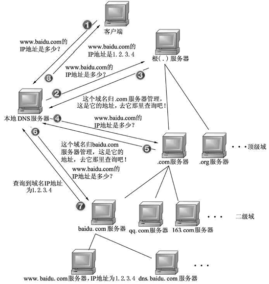
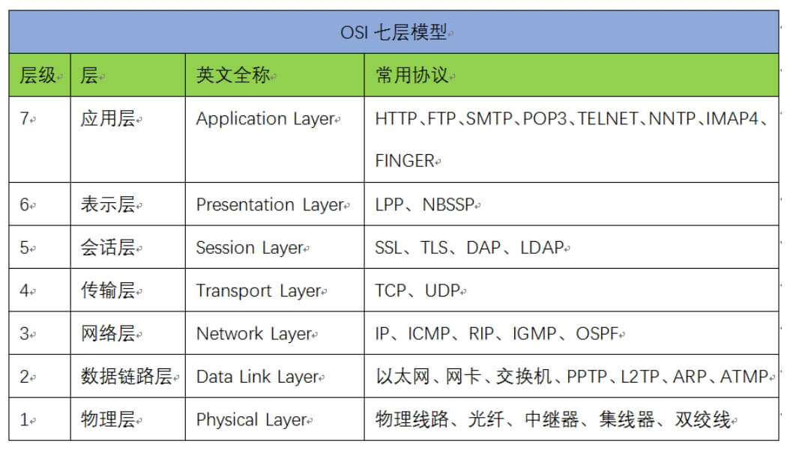
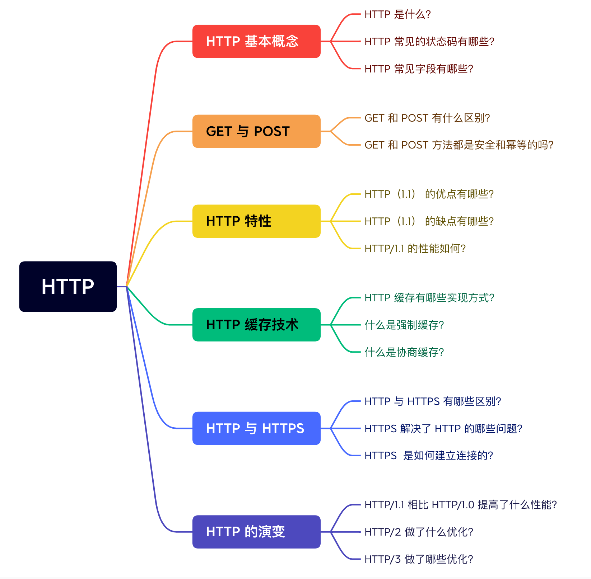
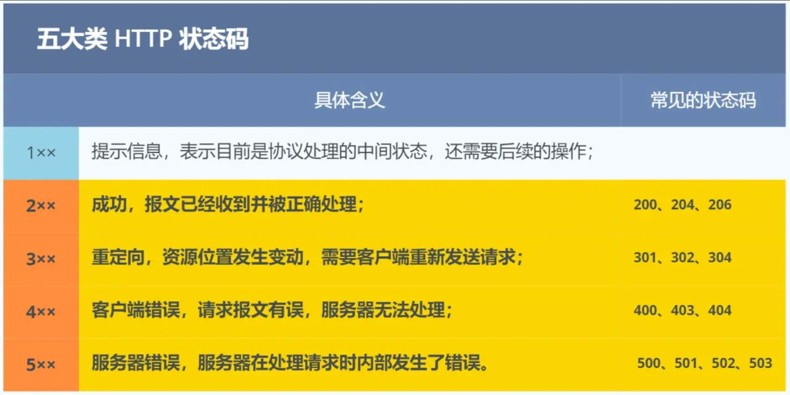
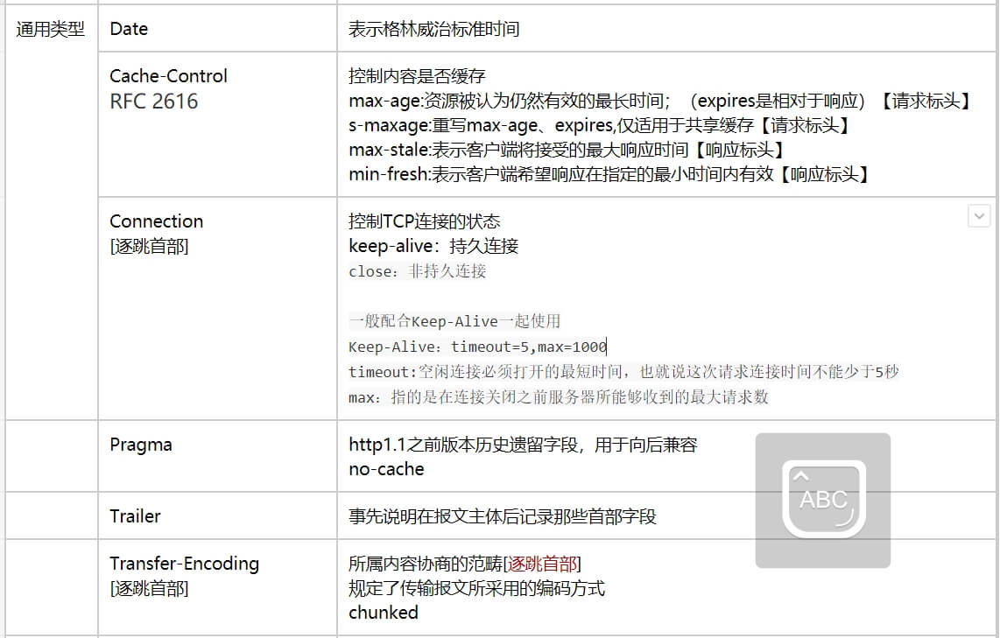

# 网络

## 输入URL到浏览器发生了什么？

[键入网址到网页显示，期间发生了什么？](https://xiaolincoding.com/network/1_base/what_happen_url.html)

```network
1、浏览器会调用网络组件，通过DNS获取当前域名的IP地址  
2、拿到IP地址，与服务段建立TCP链接  
3、建立链接之后向服务端发送请求数据  
4、服务端处理数据之后返回给浏览器
5、浏览器针对相应数据进行渲染
```

## DNS基于TCP还是UDP，为什么？

```network
同时使用TCP和UDP协议;
DNS在区域传输的时候使用TCP协议，为了保证数据传输时的准确性；其他时候使用UDP协议，保证快速的域名解析
```

## 域名解析的流程



- 1、客户端通过浏览器访问域名为 www.baidu.com (<http://www.baidu.com>) 的网站，发起查询该域名的IP地址的DNS请求。该请求发送到了本地DNS服务器上。本地DNS服务器会首先查询它的缓存记录，如果缓存中有此条记录，就可以直接返回结果。如果没有，本地DNS服务器还要向DNS根服务器进行查询。  
- 2、本地DNS服务器向根服务器发送DNS请求，请求域名为 www.baidu.com (<http://www.baidu.com>)的IP地址。  
- 3、根服务器经过查询，没有记录该域名及IP地址的对应关系。但是会告诉本地DNS服务器，可以到域名服务器上继续查询，并给出域名服务器的地址（.com 服务器）。  

- 4、本地 DNS 服务器向 .com 服务器发送 DNS 请求，请求域名www.baidu.com (<http://www.baidu.com>) 的 IP 地址。  
- 5、.com 服务器收到请求后，不会直接返回域名和IP地址的对应关系，而是告诉本地 DNS 服务器，该域名可以在 baidu.com 域名服务器上进行解析获取 IP 地址，并告诉 baidu.com 域名服务器的地址。  
- 6、本地 DNS 服务器向 baidu.com 域名服务器发送 DNS 请求，请求域名 www.baidu.com (<http://www.baidu.com>) 的 IP 地址。  
- 7、baidu.com 服务器收到请求后，在自己的缓存表中发现了该域名和 IP 地址的对应关系，并将IP地址返回给本地 DNS 服务器。  
- 8、本地 DNS 服务器将获取到与域名对应的 IP 地址返回给客户端，并且将域名和 IP 地址的对应关系保存在缓存中，以备下次别的用户查询时使用。

## 描述session和cookie

### 相同之处

- cookie和session都是用来跟踪浏览器用户身份的会话方式。

### 区别之处

- 1、cookie数据存放在客户的浏览器上，session数据放在服务器上；  
- 2、cookie不是很安全，别人可以分析存放在本地的COOKIE并进行COOKIE欺骗,如果主要考虑到安全应当使用session；  
- 3、session会在一定时间内保存在服务器上。当访问增多，会比较占用你服务器的性能，如果主要考虑到减轻服务器性能方面，应当使用cookie；  
- 4、cookie有大小限制

### cookie传输流程

- 1、由客户端首次请求时服务端生成  
- 2、服务端生成后，随着响应返回给客户端  
- 3、之后的每次客户端与服务端交互中携带cookie  

## 如何告诉客户端，响应的是什么数据类型？

```network
通过http的响应头Content-Type告知客户端响应的数类型
```

## 网络分层(OSI)

[网络模型](https://xiaolincoding.com/network/1_base/tcp_ip_model.html)

```network
应用层-》传输层-》网络层-》链路层-》物理层

应用层：HTTP、FTP、SMTP、DNS  
传输层：TCP、UDP  
网络层：IP  
链路层：DOCSIS  
物理层：网卡
```



## TCP与UDP差异

- 1、TCP基于面向连接的协议，数据传输可靠，传输速度慢，适用于传输大量数据，可靠性要求高的场合。  
- 2、UDP协议面向非连接协议，数据传输不可靠，传输速度快，适用于一次只传送少量数据、对可靠性要求不高的应用环境。  

## io多路复用，select\poll\epoll的实现和区别

[IO 多路复用是什么意思？](https://www.zhihu.com/question/32163005/answer/1802684879)

## HTTP

```network
HTTP 是超文本传输协议，也就是HyperText Transfer Protocol。
```

### HTTP 常见问题

[HTTP 常见面试题](https://xiaolincoding.com/network/2_http/http_interview.html)



#### HTTP基本概念

**HTTP 常见的状态码有哪些：**



|状态码|以2XX开头的都表示请求成功响应|
|-|-|
|200 | 成功响应
|201 | 请求已经被实现，而且有一个新的资源已经依据请求的需要而建立
|202 | 请求已经接受，但是还没执行，不保证完成请求
|204 | 请求处理成功，但是没有资源可以返回
|206 | 对资源某一部分进行响应，由Content-Range指定范围的实例内容
| | 以3XX为开头的都表示需要进行附加操作以完成请求
|301 | 永久性重定向，该状态码表示请求的资源已经重新分配URI，影后应该使用资源现有的URI
|302 | 临时性重定向，改状态码表示请求的资源已被分配了新的URI，希望用户“本次”能使用新的URI访问
|303 | 该状态码表示由于请求对应的资源存在另一个URI，应使用GET方法定向获取请求的资源
|304 | 该状态码表示客户端发送附带条件的请求时，服务端允许请求访问资源，但为满足条件的情况
|307 | 临时重定向，与302有相同含义【303、307是针对302的细分】
| | 以4XX的响应结果表明客户端是发生错误的原因所在
|400 | 该状态码表示请求报文中存在语法错误
|401 | 该状态码表示请求需要有通过HTTP认证（Basic、Digest）信息
|403 | 该状态码表明请求资源的访问被服务器拒绝了
|404 | 该状态码表明服务器无法找到请求的资源
|407 | 需要代理服务器认证
|408 | 客户端请求超时
|409 | 请求的资源可能引起冲突
| | 以5XX为开头的响应专题阿妈都表示服务器本身发生的错误
|500 | 该状态码表明服务器端在执行时发生了错误
|501 | 请求超过服务器能力范围，例如服务器不支持当前请求所需要的某个功能
|503 | 该状态码表明服务器暂时处于超负荷或者正在进行停机维护，无法处理请求
|504 | 代表服务端执行超时
|505 |

**HTTP 常见的请求头响应头：**

| 实体表头 | |
|-|-|
| Content-Length | 实体主体的大小，已字节为单位
| Content-Language | 可以接受的语言 zh-CN,zh
| Content-Encodeing | 指示对实体应用了何种编码gzip、compress、deflate、identity
| Content-Type | 实例主体的媒体类型
| Content-MD5 | 实体主体的报文摘要
| Content-Location | 替代对应资源的URI
| Content-Range  | 实体主体的位置范围
| Expires | 实体主体过期的日期时间
| Last-Modified | 资源最后修改日期时间

| 请求标头 | |
|-|-|
| Accept | 接受请求HTTP标头会通告客户端期能够理解的MIME类型
| Accept-Charset | 规定夫妻处理表单数据所接受的字符集Accept-Language能够处理的自然语言；en-US,en,q=0.5
| Host | 指定服务器的域名
| Referer | 请求的来源
| Upgrade-Insecure-Requests | 表示客户端优先选择加密机带有身份验证的响应
| If-Modified-Since | 条件请求 200：只有在给定日期的最后一次修改资源后，服务器才会以200状态发送会请求的资源 304如果请求从开始以来没有被修改过，响应会返回304并且没有额任何响应体

| 响应标头 | |
|-|-|
| Access-Control-Allow-Origin | 设置指定资源进行访问
| Keep-Alive[逐跳首部] | 表示Connection非持续连接的存活时间timeout=5,max=997（限制最大的超时时间是5S和最大的连接请求997）
| Server | 包含原始服务器用来处理请求的软件信息
| Set-Cookie |
| Transfer-Encoding | 规定了传输报文主体是采用的编码方式
| Accept-Ranges | 是否接受字节范围要求
| Age | 推算资源创建经过时间
| Etag | 资源的匹配信息
| Location | 令客户端重定向至指定URI
| Proxy-Authenticate | 代理服务器对客户端的认证信息
| Retry-After | 再次发送请求的实际要求

#### GET和POST

**GET:**

```network
根据 RFC 规范，GET 的语义是从服务器获取指定的资源，这个资源可以是静态的文本、页面、图片
视频等。GET 请求的参数位置一般是写在 URL 中，URL 规定只能支持 ASCII，所以 GET 请求的参
数只允许 ASCII 字符 ，而且浏览器会对 URL 的长度有限制（HTTP协议本身对 URL长度并没有做任何规定）。

常见的是我们查看某一篇文章发送的请求一般都是GET方式。
```

**POST:**

```network
根据 RFC 规范，POST 的语义是根据请求负荷（报文body）对指定的资源做出处理，具体的处理方
式视资源类型而不同。POST 请求携带数据的位置一般是写在报文 body 中， body 中的数据可以是
任意格式的数据，只要客户端与服务端协商好即可，而且浏览器不会对 body 大小做限制。

常见的是我们修改一篇文章，提交时的请求一般都是POST方式。
```

**GET 和 POST 方法都是安全和幂等的吗？**

- 在 HTTP 协议里，所谓的「安全」是指请求方法不会「破坏」服务器上的资源。
- 所谓的「幂等」，意思是多次执行相同的操作，结果都是「相同」的。

```network
GET 方法就是安全且幂等的，因为它是「只读」操作，无论操作多少次，服务器上的数据都是安全
的，且每次的结果都是相同的。所以，可以对 GET 请求的数据做缓存，这个缓存可以做到浏览器本
身上（彻底避免浏览器发请求），也可以做到代理上（如nginx），而且在浏览器中 GET 请求可以保存为书签。

POST 因为是「新增或提交数据」的操作，会修改服务器上的资源，所以是不安全的，且多次提交数
据就会创建多个资源，所以不是幂等的。所以，浏览器一般不会缓存 POST 请求，也不能把 POST 
请求保存为书签。


从 RFC 规范定义的语义来分析的
GET 的语义是请求获取指定的资源。GET 方法是安全、幂等、可被缓存的。

POST 的语义是根据请求负荷（报文主体）对指定的资源做出处理，具体的处理方式视资源类型而不
同。POST 不安全，不幂等，（大部分实现）不可缓存。

```

#### HTTP 缓存技术

## 网络协议

## 网络安全

## http和tcp有什么区别

## http和https的区别

## http和http2区别

## 用netstat看tcp连接的时候有关注过time_wait和close_wait吗？

## tcp如何保证稳定性

## https的连接过程

## 三次握手和四次挥手

## 长连接和短链接(怎么实现的、区别以及应用场景)

## 网络七层模型和五层模型

## 输入URL发生的整个网络过程

## TCP流量控制、拥塞控制

## TCP半连接队列

## TCP半关闭状态

## TCP滑动窗口

## tcp与udp区别，udp优点，适用场景

## tcp握手，为什么是四次挥手

## 挥手time_wait阶段是什么时候

## time_wait时间太长会怎样？

## http restful的定义规范

## 常见的http状态码

## tcp和udp有什么区别，在基础时间和传输层有什么区别

## tcp三次握手四次挥手

## tcp和udp区别

## 对连接池有了解吗？

## 信令用wss还是ws？

## wss是基于tcp的，tcp有个半连接队列，有没有遇到发了信令但是服务器没收到的情况？

## ntp协议

## 时间同步问题？

## tcp如何实现稳定性

## https如何实现的，证书是怎么获取的？

## 服务器上有大量time_wait状态，如何分析一下为什么会这样？

## 说下websocket是哪一层协议？

## 常见http状态码
