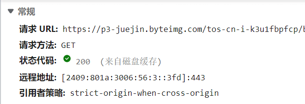
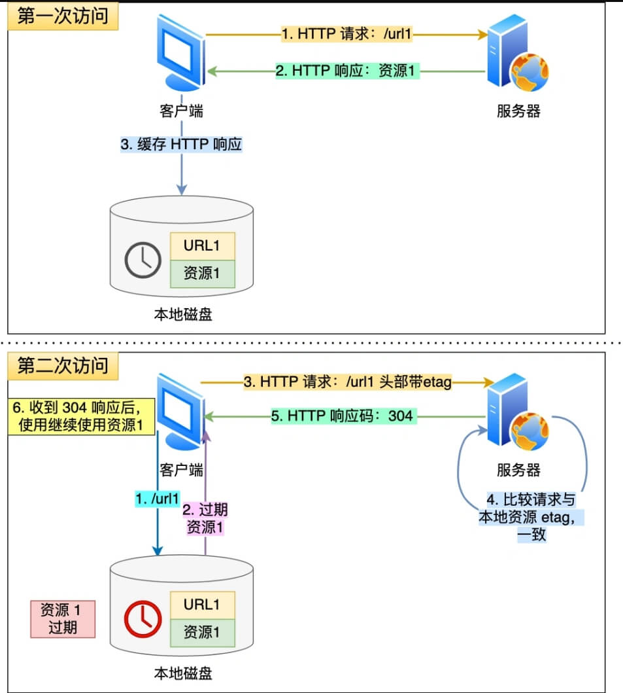

# 网络

[图解网络介绍](https://xiaolincoding.com/network/)

## 输入URL到浏览器发生了什么？

[键入网址到网页显示，期间发生了什么？](https://xiaolincoding.com/network/1_base/what_happen_url.html)

1、URL解析：浏览器会将输入的URL解析成协议（如HTTP、HTTPS、FTP等）、主机名、端口号、路径等信息。

2、DNS解析：如果主机名不是一个IP地址，浏览器将会发起一个DNS查询，将主机名转换为对应的IP地址。

3、TCP连接：浏览器会与目标服务器建立TCP连接，通过三次握手来确保连接的可靠性。

4、发送HTTP请求：浏览器将构建一个HTTP请求报文，包含请求方法、路径、请求头等信息，并将其发送给服务器。

5、服务器处理请求并响应：服务器接收到浏览器的请求后，会进行处理并生成一个HTTP响应报文，包含响应状态码、响应头、响应体等信息，并将其发送给浏览器。

6、接收响应：浏览器接收到服务器的响应后，会对其进行解析，并根据响应头中的Content-Type确定如何处理响应体。

7、渲染页面：如果响应中包含HTML、CSS和JavaScript等内容，浏览器会将这些内容解析并渲染出页面。

8、断开连接：一旦浏览器完成页面的渲染，会断开与服务器的TCP连接。如果页面中包含其他资源（如图片、样式表、脚本等），浏览器会继续发起HTTP请求来获取这些资源。

## DNS基于TCP还是UDP，为什么？

同时使用TCP和UDP协议;

在大多数情况下，DNS使用的是UDP协议，因为DNS查询通常是短而简单的请求和响应，UDP协议在传输数据时不需要进行握手和拆除连接等额外的开销，能够提供更快的查询速度和更少的网络流量。

但是，当DNS响应报文过大时，超出了UDP报文的最大限制（一般为512字节），DNS服务器将会返回一个截断响应，这时候客户端可以选择使用TCP协议重新发送DNS请求，以获得完整的响应结果。此外，DNS也可以通过TCP进行可靠的数据传输，例如在进行DNS区域传输时。

因此，DNS同时支持UDP和TCP协议，根据实际情况灵活选择。

## 域名解析的流程


- 1、客户端通过浏览器访问域名为 www.baidu.com (<http://www.baidu.com>) 的网站，发起查询该域名的IP地址的DNS请求。该请求发送到了本地DNS服务器上。本地DNS服务器会首先查询它的缓存记录，如果缓存中有此条记录，就可以直接返回结果。如果没有，本地DNS服务器还要向DNS根服务器进行查询。  
- 2、本地DNS服务器向根服务器发送DNS请求，请求域名为 www.baidu.com (<http://www.baidu.com>)的IP地址。  
- 3、根服务器经过查询，没有记录该域名及IP地址的对应关系。但是会告诉本地DNS服务器，可以到域名服务器上继续查询，并给出域名服务器的地址（.com 服务器）。  

- 4、本地 DNS 服务器向 .com 服务器发送 DNS 请求，请求域名www.baidu.com (<http://www.baidu.com>) 的 IP 地址。  
- 5、.com 服务器收到请求后，不会直接返回域名和IP地址的对应关系，而是告诉本地 DNS 服务器，该域名可以在 baidu.com 域名服务器上进行解析获取 IP 地址，并告诉 baidu.com 域名服务器的地址。  
- 6、本地 DNS 服务器向 baidu.com 域名服务器发送 DNS 请求，请求域名 www.baidu.com (<http://www.baidu.com>) 的 IP 地址。  
- 7、baidu.com 服务器收到请求后，在自己的缓存表中发现了该域名和 IP 地址的对应关系，并将IP地址返回给本地 DNS 服务器。  
- 8、本地 DNS 服务器将获取到与域名对应的 IP 地址返回给客户端，并且将域名和 IP 地址的对应关系保存在缓存中，以备下次别的用户查询时使用。


## 网络分层(OSI)

[网络模型](https://xiaolincoding.com/network/1_base/tcp_ip_model.html)

```network
应用层-》传输层-》网络层-》链路层-》物理层

应用层：HTTP、FTP、SMTP、DNS  
传输层：TCP、UDP  
网络层：IP  
链路层：DOCSIS  
物理层：网卡
```


## io多路复用，select\poll\epoll的实现和区别

[IO 多路复用是什么意思？](https://www.zhihu.com/question/32163005/answer/1802684879)

IO多路复用是指在单个线程中同时监视多个文件描述符，从而实现并发I/O操作的机制。常见的实现方式有select、poll和epoll。

select  
select是最早的IO多路复用机制之一，它的原理是将待处理的文件描述符分成几个集合，然后通过select函数进行监视。当其中一个文件描述符准备好I/O操作时，select函数就会返回该文件描述符，从而实现了并发处理多个I/O操作的目的。

select的缺点是效率较低，因为每次调用select函数都需要将待处理的文件描述符集合复制到内核空间中，而且select支持的文件描述符数量有限。

poll  
poll是select的改进版，它的原理与select类似，也是将待处理的文件描述符集合传递给poll函数进行监视。与select不同的是，poll没有文件描述符数量的限制，同时poll使用链表来管理文件描述符集合，可以更方便地进行添加和删除操作。

poll的缺点与select相似，效率较低。

epoll  
epoll是Linux内核中提供的IO多路复用机制，它的原理是使用事件驱动的方式来处理文件描述符，而不是每次都进行轮询。epoll提供了三个函数：epoll_create、epoll_ctl和epoll_wait，通过这些函数可以实现对文件描述符的监视、添加和删除。

与select和poll相比，epoll的优点在于效率较高，因为它使用了事件通知的方式，只有当文件描述符发生变化时才会通知应用程序，而不是每次都进行轮询。此外，epoll还支持多种触发模式，可以根据实际需求选择不同的模式。

总的来说，select、poll和epoll都是实现IO多路复用的机制，但它们的实现方式有所不同，epoll效率最高，同时也提供了更多的功能和灵活性，是最常用的IO多路复用机制。

## HTTP


[HTTP 常见面试题](https://xiaolincoding.com/network/2_http/http_interview.html)


HTTP是指Hypertext Transfer Protocol，即超文本传输协议。它是一种应用层协议，用于客户端和服务器之间的通信，比如在Web浏览器和Web服务器之间传输数据。

HTTP是Web的基础，允许在Web服务器和客户端之间交换数据。它是一种请求-响应协议，这意味着客户端向服务器发送请求，服务器响应包含所请求资源（如网页、图像或视频）的消息。

HTTP使用一组标准化的方法，也称为动词，用于客户端和服务器之间的通信。一些常用的HTTP方法包括GET、POST、PUT和DELETE。

HTTP建立在TCP/IP之上，提供可靠和面向连接的传输层。但是，HTTP是一种无状态协议，这意味着它不会维护任何有关以前请求或响应的信息。这使得它易于扩展和处理大量请求，但它也需要额外的机制（例如cookie或会话ID）来在请求之间维护状态。

### HTTP历史


HTTP/0.9是HTTP的第一个版本，于1991年引入。  
HTTP/1.0在RFC 1945中指定，并于1996年引入。  
HTTP/1.1在RFC 2616中指定，并于1997年1月正式发布。  
HTTP/2在RFC 7540中指定，并于2015年5月14日正式发布，它通过压缩HTTP标头以及对数据请求进行优先级处理和多路复用，从而缩短了浏览器中的页面加载时间。


### HTTP 常见的状态码


|状态码|以2XX开头的都表示请求成功响应|
|-|-|
|200 | 成功响应
|201 | 请求已经被实现，而且有一个新的资源已经依据请求的需要而建立
|202 | 请求已经接受，但是还没执行，不保证完成请求
|204 | 请求处理成功，但是没有资源可以返回
|206 | 对资源某一部分进行响应，由Content-Range指定范围的实例内容
| | 以3XX为开头的都表示需要进行附加操作以完成请求
|301 | 永久性重定向，该状态码表示请求的资源已经重新分配URI，影后应该使用资源现有的URI
|302 | 临时性重定向，改状态码表示请求的资源已被分配了新的URI，希望用户“本次”能使用新的URI访问
|303 | 该状态码表示由于请求对应的资源存在另一个URI，应使用GET方法定向获取请求的资源
|304 | 该状态码表示客户端发送附带条件的请求时，服务端允许请求访问资源，但为满足条件的情况
|307 | 临时重定向，与302有相同含义【303、307是针对302的细分】
| | 以4XX的响应结果表明客户端是发生错误的原因所在
|400 | 该状态码表示请求报文中存在语法错误
|401 | 该状态码表示请求需要有通过HTTP认证（Basic、Digest）信息
|403 | 该状态码表明请求资源的访问被服务器拒绝了
|404 | 该状态码表明服务器无法找到请求的资源
|407 | 需要代理服务器认证
|408 | 客户端请求超时
|409 | 请求的资源可能引起冲突
| | 以5XX为开头的响应专题阿妈都表示服务器本身发生的错误
|500 | 该状态码表明服务器端在执行时发生了错误
|501 | 请求超过服务器能力范围，例如服务器不支持当前请求所需要的某个功能
|503 | 该状态码表明服务器暂时处于超负荷或者正在进行停机维护，无法处理请求
|504 | 代表服务端执行超时
|505 |

### HTTP 常见的请求头响应头


| 实体表头 | |
|-|-|
| Content-Length | 实体主体的大小，已字节为单位
| Content-Language | 可以接受的语言 zh-CN,zh
| Content-Encodeing | 指示对实体应用了何种编码gzip、compress、deflate、identity
| Content-Type | 实例主体的媒体类型
| Content-MD5 | 实体主体的报文摘要
| Content-Location | 替代对应资源的URI
| Content-Range  | 实体主体的位置范围
| Expires | 实体主体过期的日期时间
| Last-Modified | 资源最后修改日期时间

| 请求标头 | |
|-|-|
| Accept | 接受请求HTTP标头会通告客户端期能够理解的MIME类型
| Accept-Charset | 规定夫妻处理表单数据所接受的字符集Accept-Language能够处理的自然语言；en-US,en,q=0.5
| Host | 指定服务器的域名
| Referer | 请求的来源
| Upgrade-Insecure-Requests | 表示客户端优先选择加密机带有身份验证的响应
| If-Modified-Since | 条件请求 200：只有在给定日期的最后一次修改资源后，服务器才会以200状态发送会请求的资源 304如果请求从开始以来没有被修改过，响应会返回304并且没有额任何响应体

| 响应标头 | |
|-|-|
| Access-Control-Allow-Origin | 设置指定资源进行访问
| Keep-Alive[逐跳首部] | 表示Connection非持续连接的存活时间timeout=5,max=997（限制最大的超时时间是5S和最大的连接请求997）
| Server | 包含原始服务器用来处理请求的软件信息
| Set-Cookie |
| Transfer-Encoding | 规定了传输报文主体是采用的编码方式
| Accept-Ranges | 是否接受字节范围要求
| Age | 推算资源创建经过时间
| Etag | 资源的匹配信息
| Location | 令客户端重定向至指定URI
| Proxy-Authenticate | 代理服务器对客户端的认证信息
| Retry-After | 再次发送请求的实际要求

### GET和POST

1、GET

根据 RFC 规范，GET 的语义是从服务器获取指定的资源，这个资源可以是静态的文本、页面、图片
视频等。GET 请求的参数位置一般是写在 URL 中，URL 规定只能支持 ASCII，所以 GET 请求的参
数只允许 ASCII 字符 ，而且浏览器会对 URL 的长度有限制（HTTP协议本身对 URL长度并没有做任何规定）。

常见的是我们查看某一篇文章发送的请求一般都是GET方式。

2、POST

根据 RFC 规范，POST 的语义是根据请求负荷（报文body）对指定的资源做出处理，具体的处理方
式视资源类型而不同。POST 请求携带数据的位置一般是写在报文 body 中， body 中的数据可以是
任意格式的数据，只要客户端与服务端协商好即可，而且浏览器不会对 body 大小做限制。

常见的是我们修改一篇文章，提交时的请求一般都是POST方式。

**GET 和 POST 方法都是安全和幂等的吗？**

- 在 HTTP 协议里，所谓的「安全」是指请求方法不会「破坏」服务器上的资源。
- 所谓的「幂等」，意思是多次执行相同的操作，结果都是「相同」的。

GET 方法就是安全且幂等的，因为它是「只读」操作，无论操作多少次，服务器上的数据都是安全
的，且每次的结果都是相同的。所以，可以对 GET 请求的数据做缓存，这个缓存可以做到浏览器本
身上（彻底避免浏览器发请求），也可以做到代理上（如nginx），而且在浏览器中 GET 请求可以保存为书签。

POST 因为是「新增或提交数据」的操作，会修改服务器上的资源，所以是不安全的，且多次提交数
据就会创建多个资源，所以不是幂等的。所以，浏览器一般不会缓存 POST 请求，也不能把 POST 
请求保存为书签。


从 RFC 规范定义的语义来分析的
GET 的语义是请求获取指定的资源。GET 方法是安全、幂等、可被缓存的。

POST 的语义是根据请求负荷（报文主体）对指定的资源做出处理，具体的处理方式视资源类型而不
同。POST 不安全，不幂等，（大部分实现）不可缓存。

### 描述session和cookie

Session和Cookie是Web开发中常用的两种技术，用于存储和管理用户的会话信息。

Cookie是一种在Web浏览器端存储数据的机制，它由服务器在HTTP响应头中通过Set-Cookie标头发送给客户端，客户端在接收到Cookie后将其存储在本地，以备将来的访问使用。Cookie一般包含一个名称、一个值、一个过期时间、一个路径和一个域。当用户访问同一站点时，浏览器会将Cookie发送给服务器，服务器可以读取其中的信息并进行相应的处理。

Session是一种在服务器端存储数据的机制，它通过在服务器上创建一个会话，并为每个会话分配一个唯一的标识符（Session ID），将用户的会话信息存储在服务器端，而不是在客户端。Session ID通常通过Cookie发送给客户端，客户端在下一次访问服务器时将其发送回来，服务器根据Session ID来查找相应的会话数据。Session可以存储任意类型的数据，包括对象和数组等复杂类型。由于Session数据存储在服务器上，因此相对于Cookie，Session更加安全和可靠。

总的来说，Cookie主要用于在客户端存储少量的简单数据，比如用户的登录状态、用户喜好等；而Session主要用于在服务器端存储大量、复杂的数据，比如用户购物车信息、用户浏览历史等。

### 如何告诉客户端，响应的是什么数据类型？

在HTTP响应头中通过Content-Type字段可以告诉客户端，响应的是什么数据类型。Content-Type字段的值通常是一个MIME类型，它描述了响应体中数据的格式。

以下是一些常见的MIME类型：
- text/html：HTML网页
- text/plain：纯文本
- application/json：JSON格式数据
- application/xml：XML格式数据
- image/jpeg：JPEG格式图片
- image/png：PNG格式图片

在Go语言中，可以通过设置http.ResponseWriter的Header方法来设置响应头，其中Content-Type可以设置为需要的MIME类型。例如，设置响应的MIME类型为JSON格式可以使用以下代码：
```golang
w.Header().Set("Content-Type", "application/json")
```


### HTTP 缓存有哪些实现方式？

[HTTP缓存技术](https://xiaolincoding.com/network/2_http/http_interview.html#%E4%BB%80%E4%B9%88%E6%98%AF%E5%BC%BA%E5%88%B6%E7%BC%93%E5%AD%98)


对于一些具有重复性的 HTTP 请求，比如每次请求得到的数据都一样的，我们可以把这对「请求-响应」的数据都缓存在本地，那么下次就直接读取本地的数据，不必在通过网络获取服务器的响应了，这样的话 HTTP/1.1 的性能肯定肉眼可见的提升。

所以，避免发送 HTTP 请求的方法就是通过缓存技术，HTTP 设计者早在之前就考虑到了这点，因此 HTTP 协议的头部有不少是针对缓存的字段。

HTTP 缓存有两种实现方式，分别是**强制缓存**和**协商缓存**。

### 什么是强制缓存？

强缓存指的是只要浏览器判断缓存没有过期，则直接使用浏览器的本地缓存，决定是否使用缓存的主动性在于浏览器这边。

如下图中，返回的是 200 状态码，标识的是 from disk cache，就是使用了强制缓存。



强缓存是利用下面这两个 HTTP 响应头部（Response Header）字段实现的，它们都用来表示资源在客户端缓存的有效期：

- Cache-Control：是一个相对时间
- Expires：是一个绝对时间

如果 HTTP 响应头部同时有 Cache-Control 和 Expires 字段的话，**Cache-Control的优先级高于 Expires**。

Cache-control 选项更多一些，设置更加精细，所以建议使用 Cache-Control 来实现强缓存。具体的实现流程如下：

- 当浏览器第一次请求访问服务器资源时，服务器会在返回这个资源的同时，在 Response 头部加上 Cache-Control，Cache-Control 中设置了过期时间大小；
- 浏览器再次请求访问服务器中的该资源时，会先通过请求资源的时间与 Cache-Control 中设置的过期时间大小，来计算出该资源是否过期，如果没有，则使用该缓存，否则重新请求服务器；
- 服务器再次收到请求后，会再次更新 Response 头部的 Cache-Control。

### 什么是协商缓存？

当我们在浏览器使用开发者工具的时候，你可能会看到过某些请求的响应码是 304，这个是告诉浏览器可以使用本地缓存的资源，通常这种通过服务端告知客户端是否可以使用缓存的方式被称为协商缓存。



上图就是一个协商缓存的过程，所以协商缓存就是与服务端协商之后，通过协商结果来判断是否使用本地缓存。


### Etag如何生成

ETag是HTTP协议中一种用于协商缓存的机制，通过比较资源的ETag值来判断资源是否发生了变化。ETag通常是由服务器生成的，常见的生成方式包括以下几种：

文件内容的hash值：服务器可以对文件的内容进行hash运算，例如使用MD5算法生成一个唯一的字符串作为ETag值。这种方法可以确保只要文件内容发生了任何变化，ETag值就会改变。

文件的最后修改时间和文件大小：服务器可以将文件的最后修改时间和文件大小结合起来作为ETag值。这种方法可以在文件内容没有变化但是最后修改时间改变时，ETag值也能够发生变化。

版本号：服务器可以为每个资源分配一个版本号，并将版本号作为ETag值返回给客户端。这种方法可以确保每个版本的资源都有唯一的ETag值。

需要注意的是，生成ETag值的方式可能会对缓存带来影响。例如，如果服务器使用文件内容的hash值作为ETag值，但是文件很大，hash计算时间很长，这样会影响服务器的性能。因此，服务器需要根据具体情况选择合适的方式来生成ETag值。

### HTTP/1.1 相比 HTTP/1.0 提高了什么性能？

1、持久连接：HTTP/1.1支持持久连接，即在一个TCP连接上可以传输多个HTTP请求和响应，避免了建立和关闭多个TCP连接的开销，减少了网络延迟和资源消耗。

2、流水线化：HTTP/1.1支持流水线化，在一个TCP连接上可以同时发送多个请求，不需要等待前面的响应，能够充分利用带宽，提高数据传输效率。

3、分块传输编码：HTTP/1.1引入了分块传输编码，可以将实体分成若干个部分，每个部分都可以独立发送，可以更快地将大型实体传输到客户端。

4、虚拟主机支持：HTTP/1.1支持虚拟主机，可以在同一个IP地址下，通过不同的域名访问不同的Web服务器，提高了Web服务器的可伸缩性和利用率。

5、缓存控制：HTTP/1.1引入了更为灵活的缓存控制机制，可以通过Cache-Control和Expires等头部字段，更精确地控制缓存的有效期和缓存的存储位置。

总体而言，HTTP/1.1在网络传输性能上有了较大的提升，可以更加高效地传输数据，降低网络延迟，提高Web应用程序的响应速度和用户体验。


### HTTP1.1的问题

1、队头阻塞  
在HTTP请求应答过程中，如果出现了某种情况，导致响应一直未能完成，那后面所有的请求就会一直阻塞；  
2、低效的TCP利用  
由于**TCP慢启动机制**，导致每个TCP连接在以开始的时候传输速率都不高，在处理多个请求后，才会慢慢达到合适的速率；  
3、臃肿的消息首部  
HTTP/1.1的首部无法压缩，再加上cookie的存在，和自定义的头部信息，可能会出现首部大小比请求数据大小还大的情况；  
4、受限的优先级设置  
HTTP/1.1无法为重要的资源指定优先级，每个HTTP请求都是一视同仁；  

### 那 HTTP/2 相比 HTTP/1.1 性能上的改进

1、多路复用：HTTP/2使用多路复用技术，在一个TCP连接上可以同时传输多个请求和响应，避免了HTTP/1.x中的队头阻塞问题，提高了网络传输效率。

2、二进制分帧：HTTP/2将HTTP报文分成一个个二进制的帧(Frame)进行传输，不仅更加高效，而且更容易进行处理和优化。

3、首部压缩：HTTP/2使用HPACK算法对HTTP头部进行压缩，减少了头部的大小，提高了网络传输效率。

4、服务器推送：HTTP/2支持服务器推送技术，可以将客户端需要的资源预测并主动推送到客户端，减少了客户端的请求次数，提高了性能。

5、加强安全性：HTTP/2强制使用HTTPS协议传输数据，可以提高通信的安全性，避免了中间人攻击等安全问题。

综上所述，HTTP/2在网络传输性能和安全性方面都有了较大的提升，可以更加高效地传输数据，提高Web应用程序的响应速度和用户体验。

## HTTP与RPC区别

[HTTP与RPC区别](https://mp.weixin.qq.com/s/H4aWYJ9QC0Rfgw0XNKagLQ)

HTTP（Hypertext Transfer Protocol）是一种用于传输超文本（如 HTML）的协议，它通常使用 TCP/IP 协议栈作为底层传输协议。HTTP 协议是无状态的，意味着每个请求与响应之间都是独立的，服务器不会记住之前的请求信息。HTTP 协议通常用于在 Web 应用程序之间进行通信。

RPC（Remote Procedure Call）是一种通信协议，它允许客户端应用程序通过网络调用远程服务器上的函数或过程，就像本地调用本地函数一样。RPC 协议可以基于不同的传输协议（如 TCP/IP、UDP、HTTP 等）实现，常用的 RPC 协议有 gRPC、Thrift 等。

HTTP 和 RPC 的主要区别在于它们的设计目的和通信方式。HTTP 协议主要用于在 Web 应用程序之间传输超文本和其他静态资源，通信方式是通过发送请求和接收响应来实现的。RPC 协议主要用于不同应用程序之间的远程调用，通信方式是通过发送请求和接收响应来实现的，但是与 HTTP 不同的是，RPC 协议的请求和响应数据通常是二进制数据格式，而不是文本格式。

此外，RPC 协议通常支持更多的数据序列化和反序列化格式，比如 Protocol Buffers、Thrift 等，这些格式能够更高效地传输数据。RPC 协议也通常支持更多的协议特性，比如异步调用、请求重试、负载均衡等。

### HTTP和TCP有什么区别

HTTP 和 TCP 是两个不同的概念，它们之间存在着较大的区别。

TCP (Transmission Control Protocol) 是一种传输层协议，它是互联网协议族中的一个重要协议。TCP 协议提供了一种面向连接的、可靠的数据传输服务，能够确保数据的可靠传输，并且保证数据按照正确的顺序到达目的地。TCP 协议的主要特点是：

- 面向连接：在通信前需要先建立连接，然后才能进行数据传输。

- 可靠传输：数据传输过程中，会对数据进行检验和校验，确保数据传输的正确性和完整性。

- 流控制和拥塞控制：能够根据网络情况自动调整传输速率，避免网络拥塞和数据丢失。

而 HTTP (Hypertext Transfer Protocol) 是一种应用层协议，它定义了客户端和服务器之间的通信规则，主要用于 Web 页面的数据传输。HTTP 协议的主要特点是：

- 基于请求和响应模式：客户端向服务器发送请求，服务器接收请求并返回响应。

- 无状态：每个请求和响应都是独立的，服务器不会记录任何状态信息。

- 支持多种请求方法：包括 GET、POST、PUT、DELETE 等多种方法，可以满足不同的数据传输需求。

因此，HTTP 和 TCP 的区别在于它们所处的不同层次，以及所提供的不同功能。HTTP 协议建立在 TCP 协议之上，利用 TCP 协议提供的可靠传输服务，实现 Web 页面的数据传输。

### HTTP和HTTPS的区别

HTTP（Hypertext Transfer Protocol）和 HTTPS（Hypertext Transfer Protocol Secure）都是用于在客户端和服务器之间传输数据的协议，但它们之间有几个重要的区别：

安全性：HTTPS比HTTP更安全，因为HTTPS使用了加密机制来保护数据传输过程中的隐私和安全。HTTPS使用了SSL / TLS协议来加密传输数据，从而可以防止数据被窃听、篡改或伪造。

端口号：HTTP协议的默认端口号为80，而HTTPS协议的默认端口号为443。当然，它们也可以使用其他端口号。

证书：HTTPS使用数字证书来验证服务器的身份，以确保客户端正在连接到正确的服务器，并且客户端和服务器之间的通信是加密的。这是确保HTTPS连接安全性的关键。

性能：由于HTTPS使用加密机制来保护数据传输，因此比HTTP协议慢一些。但是，这个差距正在缩小，因为现代计算机和服务器的处理能力越来越强。

总的来说，HTTPS比HTTP更安全，但它也需要更多的计算资源来加密和解密数据，这可能会对性能产生一定的影响。因此，需要根据实际情况来选择使用哪种协议。


### 了解QUIC吗？怎么实现的？

QUIC（Quick UDP Internet Connections）是一种基于UDP协议的传输层协议，由Google设计和推广，用于替代TCP作为HTTP/3的底层传输协议。QUIC旨在提供比TCP更快的连接建立和数据传输速度，以及更好的网络可靠性和安全性。

QUIC的主要特点包括：

1、建立快速：QUIC在建立连接时，只需要进行一次握手就可以完成，比TCP的三次握手更快。

2、传输可靠：QUIC内置了错误纠正和丢包恢复机制，使得数据传输更加可靠。

3、多路复用：QUIC支持在同一个连接上同时传输多个数据流，可以提高网络的吞吐量。

4、加密安全：QUIC支持基于TLS的加密传输，使得数据在传输过程中更加安全。

QUIC的实现基于UDP协议，因此在网络上更加灵活，特别适合在高丢包率和高延迟的网络环境中使用。QUIC采用了多种技术，包括0-RTT连接恢复、快速流恢复、负载均衡等，来优化传输性能和可靠性。

在实现方面，QUIC可以通过基于内核的实现或用户空间的实现来完成。基于内核的实现可以更好地利用系统资源和性能，但是缺少灵活性和可扩展性；用户空间的实现可以更加灵活和可扩展，但是需要更多的系统资源和处理器时间。目前主流的QUIC实现包括Google开发的Chrome QUIC和开源的quiche等。

## https的握手过程说一下，证书是如何验证的？为什么不用非对称加密通信？

HTTPS是HTTP协议基于TLS/SSL协议进行加密传输的安全版本。它采用了公钥加密和对称加密相结合的方式，确保客户端与服务器之间的通信过程是安全和可靠的。

HTTPS握手过程如下：

1、客户端向服务器发送一个HTTPS请求，其中包含SSL/TLS版本、加密算法列表等信息。

2、服务器收到请求后，向客户端发送一个包含数字证书的响应，证书中包含了公钥等信息。

3、客户端收到服务器的响应后，会验证证书的有效性和合法性，并提取服务器的公钥。

4、客户端使用服务器的公钥生成一个随机的对称加密密钥，并使用服务器的公钥对其进行加密。

5、客户端将加密后的对称加密密钥发送给服务器。

6、服务器收到加密后的对称加密密钥后，使用自己的私钥对其进行解密，得到对称加密密钥。

7、服务器和客户端都使用对称加密密钥对后续的通信进行加密和解密，确保数据的机密性和完整性。

需要注意的是，在HTTPS握手过程中，如果客户端发现服务器的数字证书无效或者存在问题，客户端会中止通信，从而避免不安全的通信。这个过程可以有效地保护客户端和服务器之间的通信安全和可靠。

## TCP & UDP

### TCP

传输控制协议（TCP，Transmission Control Protocol）是一种面向连接的、可靠的、基于字节流的传输层通信协议，由IETF的RFC793定义，是为了在不可靠的互联网络上提供可靠的端到端字节流而专门设计的一个传输协议。

### TCP特点

1、是面向连接的传输层协议，应用程序在使用TCP协议之前，必须先建立TCP连接，在传送数据完毕后，必须释放已经建立的TCP连接；  
2、每一条TCP连接只能有两个端点，每一条TCP连接只能是点对点的(一对一)；  
3、TCP提供可靠交付的服务，通过TCP连接传送的数据，无差错、不丢失、不重复，并且按序到达；  
4、TCP提供全双工通信，允许通信双方的应用进程在任何时候都能发送数据，连接的两端都设有发送缓存和接受缓存，用来临时存放双向通信的数据；  
5、面向字节流，TCP中的**流**指的是流入到进程或从进程流出的字节序列。  

### 如何保证可靠传输？

1、使用确认机制，针对接到的请求要对发送放回复确认机制  
2、超时重传机制，针对出现超时的情况要进行重置

### 停止等待协议

优点：简单  
缺点：信道利用率低  


### 连续ARQ(AutomaticRepeat reQuest)协议


### TCP发送时机？

1、TCP中维持一个变量，它等于最大报文段长度MSS，只要缓存中存放的数据达到MSS字节时，就组装成一个TCP报文段发送出去；  
2、由发送方的应用进程指明要求发送报文段，即TCP支持的推送(push)操作；  
3、发送方的一个计时器期限到了，这时把当前已有的缓存数据装入报文段(但长度不能超过MSS)发送出去；  

### TCP消息头


首部固定部分各个字段的意义：  
1、源端口和目的端口：各占2个字节，分别写入源端口号和目的端口号；  
2、序号：占四字节，序号范围【0，2^32-1】;为一个TCP连接中传送的字节流中的每一个字节进行顺序编号；。整个要传送的字节流的起始序号必须在连接建立时设置。  
3、确认号：占4字节，是期望收到对方下一个报文段的第一个数据字节的序号。  
4、数据偏移： 占4位，指出TCP报文段的数据起始处距离TCP报文段的起始处有多远；实际上是指出TCP报文段的首部长度;标识该TCP头部有多少个32bit字节，在没有选项时一般TCP头部都是20字节，值为5。
5、保留：占6位，保留为今后使用，但目前应置为0。  

### TCP为什么需要建立连接？

1、要使每一方能够确知对方的存在；  
2、要允许双方协商一些参数(最大窗口值、是否使用窗口扩大选项和时间戳选项以及服务质量等)  
3、能够对运输实体资源(缓存大小、连接表中的项目等)进行分配

### TCP三次握手

TCP是一个面向连接的协议，无论哪一方向另一方发送数据之前，都必须现在双方之间建立一条连接；


三次握手的过程：  
第一次握手：建立连接时，客户端发送syn包（syn=x）到服务器，并进入SYN_SENT状态，等待服务器确认；  
第二次握手：服务器收到syn包，必须确认客户的SYN（ack=x+1）,同时自己也发送一个SYN包（sync=y）,即SYN+ACK，此时服务器进入SYN_RECV状态;  
第三次握手：客户端收到服务器的SYN+ACK包，向服务器发送确认包ACK，此包发送完毕，客户端和服务端进入ESTABLISHED状态，完成三次握手。

### TCP四次挥手

TCP终止连接过程


1、客户端进程发出连接释放报文FIN，并且停止发送数据，此时客户端进入FIN-WAIT-1（终止状态1）状态；  

2、服务器收到连接释放报文，发出确认报文ACK，此时服务端就进入了CLOSE-WAIT（关闭等待）状态；TCP服务器通知高层的应用进程，客户端向服务器的方向就释放了，这时候处于半关闭状态，即客户端已经没有数据要发送了，但是服务器若发送数据，客户端依然要接受；这个状态还要持续一段时间，也就是整个CLOSE-WAIT状态持续的时间。  

3、客户端收到服务器的确认请求后，此时，客户端就进入FIN-WAIT-2（终止等待2）状态，等待服务器发送连接释放报文（在这之前还需要接受服务器发送的最后的数据）。  

4、服务器将最后的数据发送完毕后，就像客户端发送连接释放报文FIN，由于在半关闭状态，服务器很可能又发送了一些数据，服务器就进入了LAST-ACK（最后确认）状态，等待客户端的确认。  

5、客户端收到服务器的连接释放报文后，必须发出确认ACK，此时客户端就进入了TIME-WAIT（时间等待）状态；注意此时TCP连接还没有释放，必须经过2*MSL（最长报文段寿命）的时间后，当客户端撤销响应的TCB后，才进入CLOSED状态。  

6、服务器只要收到了客户端发出的确认，立即进入CLOSED状态。同样，撤销TCB后，就结束了这次的TCP连接。可以看到，服务器结束TCP连接的时间要比客户端早一些。

### TCP状态机


1、CLOSED:状态初始状态。  
2、LISTEN:服务端的监听指定socket的状态。  
3、SYN_RCVD:服务端收到SYN后，状态为SYN，发送SYN ACK。  
4、SYN_SENT:应用程序发送SYN后，状态进入SYN_SENT。  
5、ESTABLISHED:SYN_RCVD收到ACK后，状态为ESTABLISHED；SYN_SENT收到SYN ACK，在发送ACK之后，状态变为ESTABLISHED。  
6、CLOSE_WAIT：服务端收到关闭请求FIN并且发送ACK，状态为CLOSE_WAIT;如果此时服务器端还有数据需要发送，那么就发送，直到数据发送完毕；此时，服务器端发送FIN，状态变为 LAST_ACK。  
7、FIN_WAIT_1：应用程序端发送FIN，准备断开TCP连接；状态从ESTABLISHED -> FIN_WAIT_1。  
8、FIN_WAIT_2：应用程序端只收到服务器端得ACK信号，并没有收到FIN信号；说明服务器端还有数据传输，那么此时为半连接。  
9、TIME_WAIT：
```network
FIN_WAIT_1进入：此时应用程序端口收到FIN+ACK（而不是像FIN_WAIT_2那样只收到ACK，说明数据已经发送完毕）并向服务器端口发送ACK；

FIN_WAIT_2进入：此时应用程序端口收到了FIN，然后向服务器端发送ACK；TIME_WAIT是为了实现TCP全双工连接的可靠性关闭，用来重发可能丢失的ACK报文；需要持续2个MSL(最大报文生存时间)：假设应用程序端口在进入TIME_WAIT后，2个MSL时间内并没有收到FIN,说明应用程序最后发出的ACK已经收到了；否则会在2个MSL内在此收到ACK报文；
```

### 2*MSL

MSL：最长报文段寿命，指一个片段在网络中最大的存活时间，2ML就是一个发送和一个回复所需的最大时间。

### 为什么需要三次握手，最后一次如果没有行不行，会有什么问题？

如果最后一次握手没有进行，也就是客户端没有向服务器发送确认连接请求的ACK包，那么服务器就会一直等待客户端的确认，这个连接就一直处于半开放状态，直到超时或者服务器强制关闭连接。

这会浪费服务器资源，并且可能会导致连接资源的浪费，还有可能会产生错误或不必要的重传等问题。因此，三次握手是确保双方建立可靠连接的必要步骤，缺失任何一次握手都可能导致连接的异常或失败。

而且为了实现“可靠数据传输”，TCP协议的通信双方，必须维护一个序列号，以标识发送出去的数据包中，哪些是已经被对方收到的；三次握手的过程即是通信双方相互告知序列号起始值，并确认对方已经收到了序列号起始值的必经步骤。  

如果只是两次握手，至多只有连接发起方的起始序列号能被确认，另一方选择的序列号则得不到确认。


### TIME_WAIT的作用是什么？2MSL是多长？

用来保证四次挥手的，最后一次确认能够有效到达接收方，准确关闭连接

1、保证TCP协议的全双工连接能够可靠关闭  
2、保证这次连接的重复数据段从网络中消失  

### 线上大量的close_wait和time_wait该何解决？

```network
[root@~]$netstat -n | awk '/^tcp/ {++S[$NF]} END {for(a in S) print a, S[a]}'
ESTABLISHED 2
```
让服务器能够快速回收和重用那些TIME_WAIT的资源。


### 一台服务器最多可以建立多少个TCP链接，为什么？

一个服务器可以建立的最大TCP连接数量取决于多个因素，包括服务器的硬件配置、操作系统的设置、网络带宽和连接的使用模式等。

一般来说，服务器的硬件配置和操作系统的设置会影响服务器的性能和吞吐量，进而影响服务器可以处理的TCP连接数量。例如，服务器的处理器、内存和网络接口等硬件组件的性能会影响服务器的处理能力和响应速度。操作系统的TCP/IP协议栈的配置和优化也会影响服务器的网络吞吐量和连接处理能力。

此外，网络带宽和连接的使用模式也是影响服务器最大TCP连接数量的因素。如果服务器处理的连接都是短连接，那么服务器可以处理的连接数量可能比较大；如果服务器处理的连接都是长连接，那么服务器可以处理的连接数量可能会受到限制，因为长时间的连接会占用服务器的资源。

综上所述，一台服务器最多可以建立的TCP连接数量是一个复杂的问题，需要考虑多个因素。一般来说，现代服务器的TCP连接数量可以达到几万甚至几十万，但是具体的数量还需要根据实际情况进行调整和优化。


### 用netstat看tcp连接的时候有关注过time_wait和close_wait吗？

当使用 netstat 命令查看 TCP 连接状态时，我们可能会经常遇到 TIME_WAIT 和 CLOSE_WAIT 状态。

这两种状态分别表示：

1、TIME_WAIT 状态：表示连接关闭后等待一段时间，以确保远程主机已经收到了所有数据。在这个状态下，连接是不能被重用的，直到等待时间过去。这个等待时间通常为 2MSL（最大报文段生存时间），这是一个固定的时间，通常为 60 秒左右。

2、CLOSE_WAIT 状态：表示本地主机已经关闭连接，但是远程主机还没有关闭连接。在这个状态下，本地主机仍然可以接收远程主机发送的数据，但是本地主机不能向远程主机发送数据。

TIME_WAIT 状态通常出现在主动关闭连接的一方，这个状态下的连接不能被重用，但是它可以防止可能出现的重复连接。CLOSE_WAIT 状态通常出现在被动关闭连接的一方，这个状态下的连接仍然存在，但是不能再发送数据了。在 CLOSE_WAIT 状态下，如果远程主机不关闭连接，连接会一直保持到达到超时时间为止。

这两种状态通常出现在 TCP 连接的正常关闭过程中，但是如果出现大量的 TIME_WAIT 或 CLOSE_WAIT 连接，可能会导致 TCP 连接资源的浪费，进而影响系统的性能。因此，需要根据实际情况进行调整和优化，例如使用 TCP Keep-Alive 机制来减少 TIME_WAIT 和 CLOSE_WAIT 状态的数量，或者调整 TCP 连接的超时时间等。


## 服务器上有大量time_wait状态，如何分析一下为什么会这样？

TIME_WAIT状态是TCP连接的一个状态，它通常出现在连接被正常关闭后，在客户端和服务器之间保持一段时间。

请求完成后，客户端向服务器发送FIN报文段，服务器接收到该报文段后也会发送一个ACK报文段作为确认。在这之后服务器会向客户端发送一个FIN报文段以关闭连接，客户端再发送一个ACK报文段进行确认,TCP连接就完成了。在这个过程中，客户端和服务器都会进TIME_WAIT状态。

TIME_WAIT状态通常是因为TCP协议设计的需要而产生的。在TCP连接正常关闭后，**为了防止网络中可能存在的延迟报文段到达而导致的重复连接**，TCP协议规定在连接关闭后需要在一段时间内等待，这个等待时间就是TIME_WAIT状态。等待时间过后，TCP连接将被彻底关闭，资源也将被释放。

如果大量的连接处于TIME_WAIT状态，可能会占用大量的系统资源，导致系统的性能下降。为了解决这个问题，可以使用TCP连接重用等技术来减少TIME_WAIT状态的数量。

### tcp如何保证稳定性

TCP（传输控制协议）是一种面向连接的协议，它通过一系列的机制来保证数据传输的稳定性：

1、可靠的数据传输：TCP使用可靠的数据传输机制，通过使用序号、确认号和重传机制来保证数据的完整性和正确性。当接收方收到数据时，会发送一个确认消息，以确保发送方已经正确地将数据发送到接收方。

2、滑动窗口：TCP使用滑动窗口机制来管理发送方和接收方之间的数据传输。发送方根据接收方的反馈信息动态调整窗口大小，以避免发送过多数据导致网络拥塞，同时保证网络带宽得到最大的利用。

3、拥塞控制：TCP使用拥塞控制机制来避免网络拥塞。发送方通过监测网络拥塞程度来动态调整传输速率，并减少传输数据的数量，以避免网络拥塞导致数据丢失或延迟。

4、重传机制：如果数据传输过程中出现丢失、重复或损坏的数据包，TCP会使用重传机制重新发送这些数据包，直到接收方正确地接收到所有的数据。

5、流量控制：TCP使用流量控制机制来控制发送方发送数据的速率，以避免接收方因为缓存区已满而丢失数据或延迟。

通过这些机制，TCP可以在不可靠的网络上实现可靠的数据传输，保证网络传输的稳定性。

### TCP流量控制、拥塞控制

TCP使用流量控制和拥塞控制机制来确保网络传输的可靠性和稳定性。

流量控制：

TCP流量控制通过接收方通知发送方其接收缓冲区的大小，以确保发送方不会发送过多的数据导致接收方的缓冲区溢出。TCP使用滑动窗口机制来实现流量控制，发送方维护一个窗口，表示可以发送的数据量，而接收方维护一个窗口，表示其当前可用的缓冲区大小。当接收方需要暂停数据流时，它会将窗口设置为0，发送方将停止发送数据，直到接收方通知其可以继续发送数据。

拥塞控制：

TCP拥塞控制是为了避免过多的数据流入网络导致网络拥塞，从而导致数据包的丢失和延迟。TCP使用拥塞窗口来控制发送方可以发送的数据量。发送方根据网络拥塞程度动态调整拥塞窗口的大小。如果网络拥塞程度较低，则拥塞窗口可以增加，以便发送更多的数据。如果网络拥塞程度较高，则拥塞窗口会减小，以避免发送过多的数据导致网络拥塞。TCP使用拥塞避免算法和拥塞恢复算法来实现拥塞控制。

拥塞避免算法：

当发送方检测到网络拥塞时，拥塞窗口会减小，以避免发送过多的数据导致网络拥塞。随着时间的推移，发送方逐渐增加拥塞窗口的大小，直到达到网络的最大容量。

拥塞恢复算法：

当发送方检测到网络拥塞时，它会将拥塞窗口减小到一个较小的值，然后发送重传数据包。拥塞窗口会慢慢增加，直到重新达到原来的大小。

通过流量控制和拥塞控制机制，TCP可以避免过多的数据流入网络导致网络拥塞，从而保证网络传输的可靠性和稳定性。

### TCP半连接队列

TCP半连接队列是TCP连接建立的一种状态，在这种状态下，接受方的SYN ACK响应已经发出，但是最终的ACK响应还未到达。

在TCP协议中，当客户端向服务器发起一个连接请求时，服务器会接收到该请求，并返回一个SYN ACK响应。此时，服务器就进入了半连接状态，因为它已经接收到了一个SYN请求，但是还没有接收到客户端的ACK响应。在这种状态下，服务器会将该连接请求放入半连接队列中，等待客户端的ACK响应。

当服务器的半连接队列已满时，新的连接请求将被拒绝，这可能会导致客户端无法连接到服务器。因此，在设计应用程序时，需要考虑半连接队列的大小，以确保它足够大，以便处理大量的连接请求。

一旦服务器收到客户端的ACK响应，连接就会从半连接队列中删除，转换为完全建立的TCP连接状态，双方就可以开始进行数据传输。

### TCP半关闭状态

TCP半关闭状态是指TCP连接的一端在关闭连接时，只关闭了发送数据流的能力，而接收数据流的能力仍然保持打开状态。这种状态通常由TCP连接中的一端发起，即向另一端发送FIN（finish）数据包来表示发送数据流已经结束。在收到FIN数据包后，另一端可以继续向发送FIN数据包的一端发送数据，但是发送FIN数据包的一端不再接收来自另一端的数据。

半关闭状态通常用于在TCP连接中只关闭一端的情况，例如当一个Web服务器向客户端传送一个文件时，它可以先将文件数据发送给客户端，然后关闭发送数据的连接，但是仍然保持接收数据的连接，以便能够接收来自客户端的确认数据和其他控制信息。

需要注意的是，在TCP连接中，半关闭状态通常只存在于一段时间，一旦接收数据的一端也关闭了连接，整个TCP连接就会被完全关闭，资源被释放，连接被断开。

### 长连接和短链接(怎么实现的、区别以及应用场景)

长连接和短连接是指客户端和服务器之间建立的TCP连接的使用模式。

在短连接中，每个HTTP请求都会建立一个新的TCP连接，并在请求处理完成后关闭连接。这种连接模式适合处理一些短时任务，如查询数据、发送简单消息等，因为它能够避免连接的长时间占用和资源浪费。

在长连接中，客户端和服务器之间建立一个TCP连接，并在多次HTTP请求之间保持连接，直到连接被关闭或超时。这种连接模式适合处理一些长时间的任务，如在线聊天、视频流传输等，因为它能够减少连接的建立和关闭次数，提高数据传输效率，同时减少了TCP连接的负担和资源消耗。

实现长连接和短连接需要考虑以下几点：

TCP连接的建立和关闭方式。短连接需要在每个HTTP请求之前建立一个新的TCP连接，并在请求处理完成后立即关闭连接；长连接则需要在多次HTTP请求之间保持连接，直到连接被关闭或超时。

连接的超时设置。长连接需要设置一个合适的超时时间，以避免连接长时间占用和资源浪费；短连接则可以不设置超时，因为每个请求都会在处理完成后立即关闭连接。

连接池的管理。在长连接模式中，连接池可以减少连接建立和关闭的开销，提高连接的复用率和效率；在短连接模式中，连接池的作用不是很大，因为每个连接都只使用一次，不需要进行复用。

综上所述，长连接和短连接的实现需要根据实际需求进行选择和调整，以达到最优的网络传输效率和资源利用率。

### 对连接池有了解吗？

连接池是一种维护TCP连接的机制，它可以在应用程序启动时初始化一定数量的连接，并在需要时从连接池中获取可用的连接，避免了频繁创建和销毁连接的开销。连接池通常包括以下几个组件：

- 连接池管理器：负责维护连接池，包括初始化、获取、释放等操作。

- 连接池状态：记录连接池中连接的状态，如空闲连接数、活跃连接数、最大连接数等。

- 连接池配置：包括连接池的初始化参数、连接的超时时间等。

###  tcp如何实现稳定性

TCP (Transmission Control Protocol) 是一种面向连接的、可靠的传输协议，它实现了网络数据传输的稳定性。下面是 TCP 实现稳定性的一些机制：

1、数据分段和确认机制：TCP 将待传输的数据分成多个数据段，并且每个数据段都有一个序号和确认号，接收方在接收到数据后必须向发送方发送确认消息，以确保数据传输的可靠性。

2、超时重传机制：TCP 在发送数据后会启动一个计时器，如果在规定的时间内没有收到确认消息，就会认为数据丢失了，并重新发送数据，直到接收到确认消息为止。

3、滑动窗口机制：TCP 采用滑动窗口机制来实现流量控制和拥塞控制。发送方和接收方各自维护一个滑动窗口，发送方通过滑动窗口来限制发送的数据量，接收方通过滑动窗口来告诉发送方自己可以接收多少数据。

4、拥塞控制机制：TCP 还采用拥塞控制机制来防止网络拥塞，它会根据网络的拥塞程度动态调整发送速率，以保证网络的稳定性。

总之，TCP 实现稳定性的关键在于它的可靠性机制，包括数据分段和确认、超时重传、滑动窗口和拥塞控制等机制，这些机制共同保证了数据的可靠传输和网络的稳定性。


## TCP与UDP差异

TCP（Transmission Control Protocol）和UDP（User Datagram Protocol）是网络传输协议的两种不同类型，它们在传输数据时具有一些差异。

1、可靠性  
TCP是一种可靠的协议，它通过确认机制、超时重传和流量控制等方式来确保数据的可靠性。而UDP则是一种不可靠的协议，它不会对数据进行确认或重传，因此在数据传输过程中可能会发生数据丢失或乱序等情况。

2、连接性  
TCP是一种面向连接的协议，通信双方需要先建立连接，然后才能进行数据传输。而UDP是一种无连接的协议，通信双方可以直接发送数据，而不需要先建立连接。

3、传输速度  
由于TCP需要进行确认、重传等处理，因此它的传输速度相对较慢。而UDP则没有这些额外的处理，因此它的传输速度相对较快。

4、应用场景  
TCP适合需要可靠性保证和数据完整性的应用场景，比如网页浏览、文件传输、电子邮件等。而UDP适合实时性要求高、数据完整性要求低的应用场景，比如语音、视频、实时游戏等。

总的来说，TCP和UDP的差异主要在于可靠性、连接性和传输速度等方面。选择使用哪种协议应根据具体的应用场景和需求来确定。

### 参考

[停止等待协议](https://www.cnblogs.com/fennleo/p/13434741.html)  
[TCP协议详解](https://zhuanlan.zhihu.com/p/64155705)  
[服务器大量TIME_WAIT和CLOSE_WAIT的原因及解决办法](https://www.cnblogs.com/whx7762/p/9413787.html)  
[TCP 三次握手和四次挥手图解（有限状态机）](https://www.cnblogs.com/huansky/p/13951567.html)