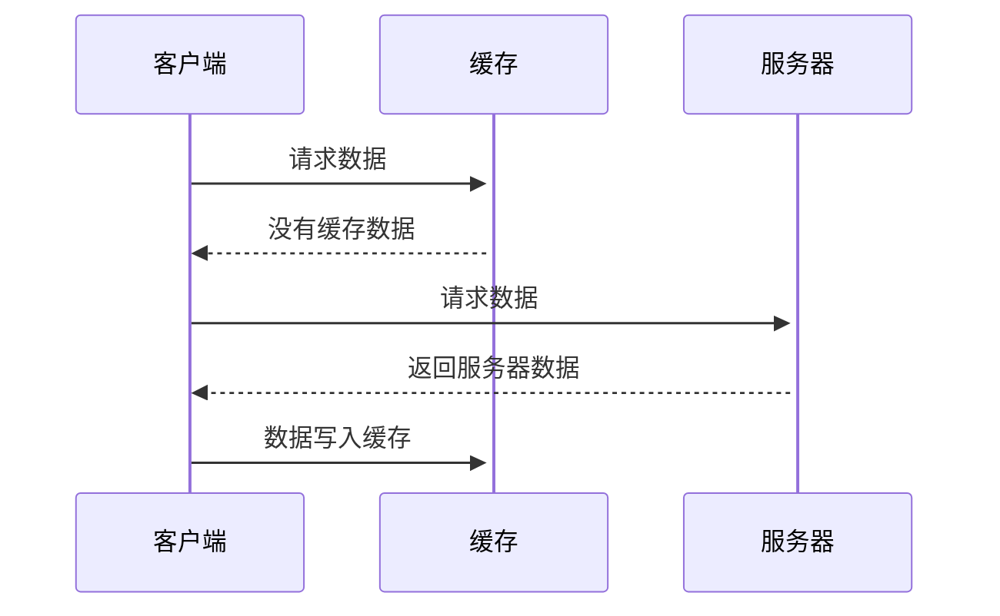
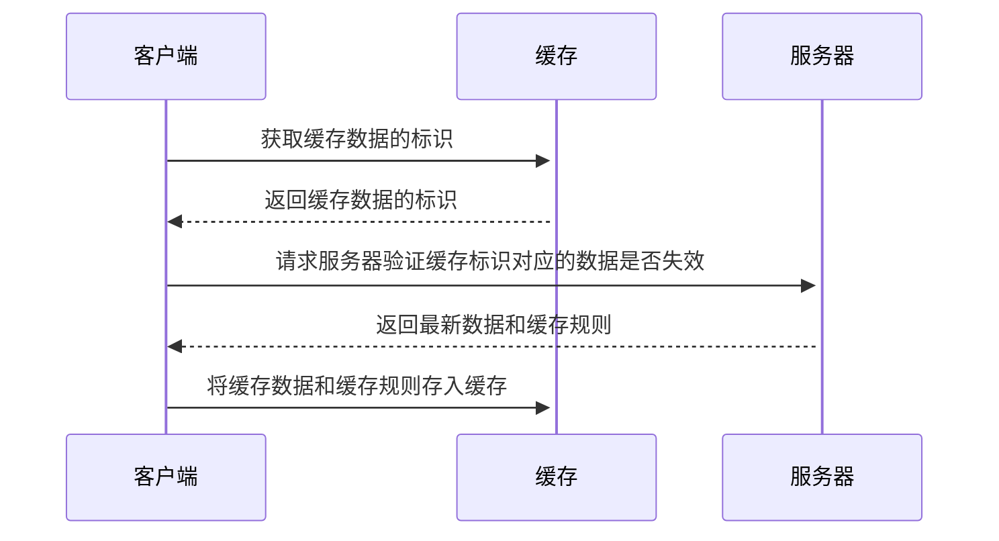
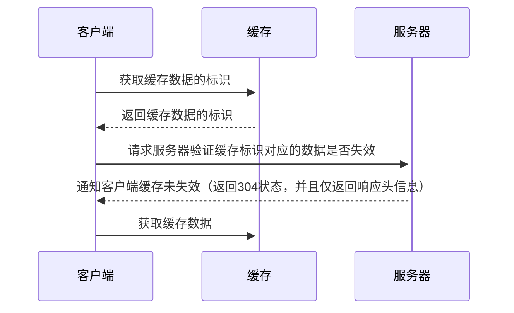

# HTTP缓存

记录一次与客户端添加缓存功能的经历，以及所调研的相关资料，感觉前辈分享的信息

## 1.添加缓存的目标  

减少网络内容传输，降低带宽  
降低服务器的QPS压力

## 2.HTTP 请求时序图




## 2.HTTP缓存分类

强制缓存、对比缓存  
两类缓存规则可以同时存在，强制缓存优先级高于对比缓存

## 3.强制缓存

强制缓存生效，不需要在和服务器发生交互

### 3.1 如何判断缓存数据是否有效？

在没有缓存数据的时候，浏览器先到服务器请求数据，服务器会将数据和缓存规则一并返回，在响应头信息会包含缓存规则

### 3.2 缓存规则

```Cache-Control
Cache-Control
Cache-Control是最重要的规则;常见的取值有private、public、no-cache、max-age，no-store，默认为private。
private:             客户端可以缓存
public:              客户端和代理服务器都可缓存（前端的同学，可以认为public和private是一样的）
max-age=xxx:   缓存的内容将在 xxx 秒后失效
no-cache:          需要使用对比缓存来验证缓存数据（后面介绍）
no-store:           所有内容都不会缓存，强制缓存，对比缓存都不会触发（对于前端开发来说，缓存越多越好，so...基本上和它说886）

实战案例:
Cache-Control:"max-age:300"
```

## 4 对比缓存

对比缓存不管是否生效，都需要与服务端发生交互，需要进行比较判断是否可以使用缓存；  

### 4.1 请求的相关流程

浏览器第一次请求数据时，服务器会将数据和缓存规则一起返回给客户端，客户端将响应的数据缓存到本地；  
再次请求数据时将缓存的标识发送给服务器，服务器根据缓存标识进行判断；
判断成功后，返回304状态码通知客户端比较成功，可以使用缓存；  
判断失败，则重新生成数据及缓存规则响应给客户端。

### 4.2 未命中缓存时序图




#### 4.3 命中缓存时序图




### 4.4 缓存规则

```ETag
ETag
服务器响应请求时，响应头携带的一个服务端数据唯一标识，由服务端生成，可以使用一些哈希函数对数据进行签名；

示例：
Etag:"a985e652c92c7f0065b645525449786a"

服务端响应头信息携带
```

```If-None-Match
If-None-Match
客户端再次请求服务器时，将此字段放入请求头中携带到服务器；
服务器收到请求后发现有头If-None-Match则与被请求资源的唯一标识进行比对；
不同，说明资源又被改动过，则响应整片资源内容，返回状态码200；
相同，说明资源无新修改，则响应HTTP 304，告知浏览器继续使用所保存的cache。

示例：
If-None-Match:"a985e652c92c7f0065b645525449786a"

客户端请求头携带
```

```Last-Modified
Last-Modified
服务器将资源传递给客户端时，会将资源最后更改的时间以“Last-Modified: GMT”的形式加在实体首部上一起返回给客户端；
如果响应头里含有这个信息，客户端可以在后续的请求中带上If-Modified-Since来验证缓存。

示例：
Last-Modified: Thu, 12 Nov 2020 12:47:00 GMT

服务端响应头信息携带
```

```If-Modified-Since
If-Modified-Since
服务器收到请求后发现有头If-Modified-Since则与被请求资源的最后修改时间进行比对；
若资源的最后修改时间大于If-Modified-Since，说明资源又被改动过，则响应整片资源内容，返回状态码200；
若资源的最后修改时间小于或等于If-Modified-Since，说明资源无新修改，则响应HTTP 304，告知浏览器继续使用所保存的cache。。

示例：
If-Modified-Since: Thu, 12 Nov 2020 12:47:00 GMT

客户端请求头携带
```

## 5.HTTP1.0的一些规则

```Expires
 Expires
 Expires的值为服务端返回的到期时间，即下一次请求时，请求时间小于服务端返回的到期时间，直接使用缓存数据；
 Expires 是HTTP 1.0的东西，现在默认浏览器均默认使用HTTP 1.1，所以它的作用基本忽略；
 另一个问题是，到期时间是由服务端生成的，但是客户端时间可能跟服务端时间有误差，这就会导致缓存命中的误差。
 
 示例：
 Expires:Thu, 12 Nov 2020 12:47:00 GMT
```

```Pragma
Pragma
Pragma是HTTP/1.0标准中定义的一个header属性，请求中包含Pragma的效果跟在头信息中定义Cache-Control: no-cache相同，但是HTTP的响应头没有明确定义这个属性，所以它不能拿来完全替代HTTP/1.1中定义的Cache-control头;通常定义Pragma以向后兼容基于HTTP/1.0的客户端
```

## 6.总结

强制缓存，服务器会响应一个缓存时间，在缓存时间内，客户端再次请求时，会使用本地缓存数据，缓存过期之后再执行请求服务器数据 对比缓存，通过对比缓存规则进行校验缓存的数据是否有效，如果有效则使用，如果无效服务器则重新响应最新数据和缓存规则

## 7.问题

### 缓存根据什么做为key？

与客户端同学截了一段okhttp框架的源码看到主要关键字是“this.url”“this.requestMethod”

```java
public void writeTo(Editor editor) throws IOException {
    BufferedSink sink = Okio.buffer(editor.newSink(0));
    sink.writeUtf8(this.url).writeByte(10);
    sink.writeUtf8(this.requestMethod).writeByte(10);
    sink.writeDecimalLong((long)this.varyHeaders.size()).writeByte(10);
    int i = 0;

    int size;
    for(size = this.varyHeaders.size(); i < size; ++i) {
        sink.writeUtf8(this.varyHeaders.name(i)).writeUtf8(": ").writeUtf8(this.varyHeaders.value(i)).writeByte(10);
    }

    sink.writeUtf8((new StatusLine(this.protocol, this.code, this.message)).toString()).writeByte(10);
    sink.writeDecimalLong((long)(this.responseHeaders.size() + 2)).writeByte(10);
    i = 0;

    for(size = this.responseHeaders.size(); i < size; ++i) {
        sink.writeUtf8(this.responseHeaders.name(i)).writeUtf8(": ").writeUtf8(this.responseHeaders.value(i)).writeByte(10);
    }

    sink.writeUtf8(SENT_MILLIS).writeUtf8(": ").writeDecimalLong(this.sentRequestMillis).writeByte(10);
    sink.writeUtf8(RECEIVED_MILLIS).writeUtf8(": ").writeDecimalLong(this.receivedResponseMillis).writeByte(10);
    if (this.isHttps()) {
        sink.writeByte(10);
        sink.writeUtf8(this.handshake.cipherSuite().javaName()).writeByte(10);
        this.writeCertList(sink, this.handshake.peerCertificates());
        this.writeCertList(sink, this.handshake.localCertificates());
        sink.writeUtf8(this.handshake.tlsVersion().javaName()).writeByte(10);
    }

    sink.close();
}
```

## 8.参考

[HTTP缓存](https://developer.mozilla.org/zh-CN/docs/Web/HTTP/Caching_FAQ)  
[HTTP缓存控制小结](https://imweb.io/topic/5795dcb6fb312541492eda8c)  
[彻底弄懂HTTP缓存机制及原理](https://www.cnblogs.com/chenqf/p/6386163.html)
[HTTP缓存（Cache-Control、Expires 、ETag）](https://cloud.tencent.com/developer/article/1359915)
[square/okhttp](https://github.com/square/okhttp/blob/parent-3.14.7/okhttp/src/main/java/okhttp3/internal/cache/CacheInterceptor.java)
