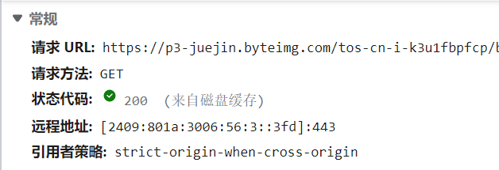
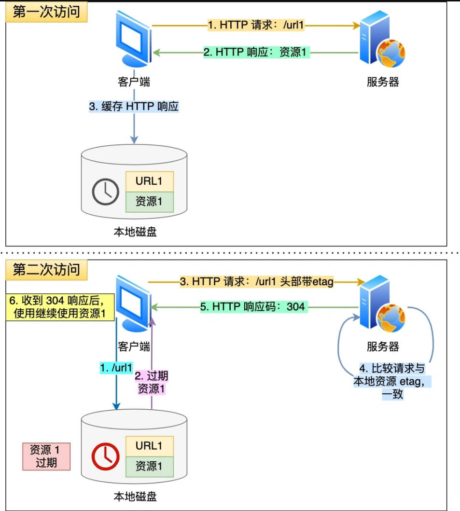

# HTTP缓存技术

[HTTP缓存技术](https://xiaolincoding.com/network/2_http/http_interview.html#%E4%BB%80%E4%B9%88%E6%98%AF%E5%BC%BA%E5%88%B6%E7%BC%93%E5%AD%98)

## HTTP 缓存有哪些实现方式？

对于一些具有重复性的 HTTP 请求，比如每次请求得到的数据都一样的，我们可以把这对「请求-响应」的数据都缓存在本地，那么下次就直接读取本地的数据，不必在通过网络获取服务器的响应了，这样的话 HTTP/1.1 的性能肯定肉眼可见的提升。

所以，避免发送 HTTP 请求的方法就是通过缓存技术，HTTP 设计者早在之前就考虑到了这点，因此 HTTP 协议的头部有不少是针对缓存的字段。

HTTP 缓存有两种实现方式，分别是**强制缓存**和**协商缓存**。

## 什么是强制缓存？

强缓存指的是只要浏览器判断缓存没有过期，则直接使用浏览器的本地缓存，决定是否使用缓存的主动性在于浏览器这边。

如下图中，返回的是 200 状态码，标识的是 from disk cache，就是使用了强制缓存。

强缓存是利用下面这两个 HTTP 响应头部（Response Header）字段实现的，它们都用来表示资源在客户端缓存的有效期：

- Cache-Control：是一个相对时间
- Expires：是一个绝对时间

如果 HTTP 响应头部同时有 Cache-Control 和 Expires 字段的话，**Cache-Control的优先级高于 Expires**。

Cache-control 选项更多一些，设置更加精细，所以建议使用 Cache-Control 来实现强缓存。具体的实现流程如下：

- 当浏览器第一次请求访问服务器资源时，服务器会在返回这个资源的同时，在 Response 头部加上 Cache-Control，Cache-Control 中设置了过期时间大小；
- 浏览器再次请求访问服务器中的该资源时，会先通过请求资源的时间与 Cache-Control 中设置的过期时间大小，来计算出该资源是否过期，如果没有，则使用该缓存，否则重新请求服务器；
- 服务器再次收到请求后，会再次更新 Response 头部的 Cache-Control。

## 什么是协商缓存？

当我们在浏览器使用开发者工具的时候，你可能会看到过某些请求的响应码是 304，这个是告诉浏览器可以使用本地缓存的资源，通常这种通过服务端告知客户端是否可以使用缓存的方式被称为协商缓存。

上图就是一个协商缓存的过程，所以协商缓存就是与服务端协商之后，通过协商结果来判断是否使用本地缓存。
