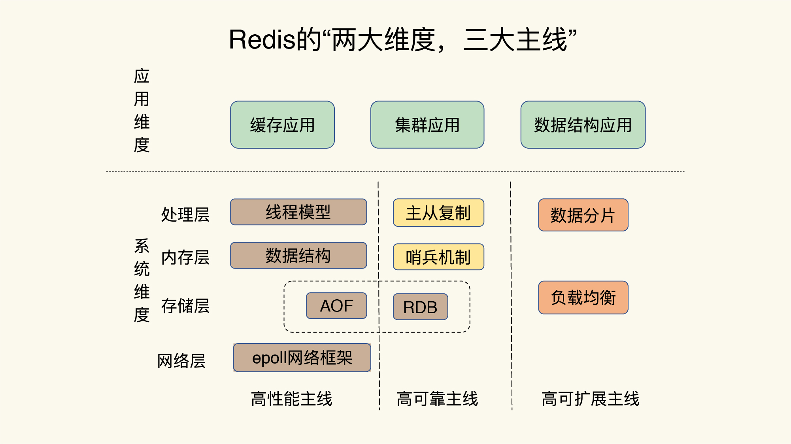

# redis 常见问题

## redis 学习路线



## redis问题画像


## redis为什么那么快？

1、数据存储方式：Redis将所有的数据都存储在内存中，通过将磁盘IO操作转化为内存操作，大大提高了数据读写的效率。同时，Redis在内存中使用了高效的数据结构，如哈希表、有序集合等，进一步提高了数据读写的速度。

2、单线程模型：Redis是采用单线程模型的，这意味着不需要进行线程切换和同步操作，避免了多线程带来的竞争、死锁、上下文切换等问题，大大提高了系统的稳定性和性能。

3、高效的网络模型：Redis使用了高效的网络I/O模型，采用了事件驱动的编程方式，能够处理大量的并发连接，并支持高效的异步操作，减少了网络延迟带来的影响，提高了系统的响应速度。

4、优秀的算法和数据结构：Redis中使用了很多优秀的算法和数据结构，如跳跃表、压缩列表、布隆过滤器等，这些算法和数据结构能够快速地进行数据查找和过滤，进一步提高了系统的性能。

综上所述，Redis之所以那么快，是由于它采用了高效的数据存储方式、单线程模型、高效的网络模型和优秀的算法和数据结构等多种优秀的设计和实现。

## redis有时访问慢的原因

Redis有时访问慢可能由以下几个原因造成：

1、内存不足：Redis将数据存储在内存中，如果内存不足，就会出现内存碎片和swap现象，导致Redis的访问变慢。可以通过增加内存、优化Redis配置、使用Redis集群等方式来解决。

2、数据过期：Redis支持过期时间，当数据过期时，Redis会删除它。如果设置了大量的过期数据，就会导致Redis频繁地删除数据，影响Redis的性能。可以通过调整过期时间、设置适当的过期策略等方式来解决。

3、CPU繁忙：如果Redis的CPU占用率过高，就会导致Redis的访问变慢。可以通过优化Redis配置、升级CPU等方式来解决。

4、网络延迟：Redis使用网络通信，如果网络延迟过高，就会导致Redis的访问变慢。可以通过优化网络环境、使用高速网络、加入Redis集群等方式来解决。

5、Redis阻塞操作：当Redis执行一些阻塞操作，如长时间的阻塞读写操作或者阻塞Lua脚本执行，会导致Redis的性能下降。可以通过优化阻塞操作、采用异步调用等方式来解决。

综上所述，Redis访问慢的原因可能是多方面的，需要从不同的角度进行排查和解决。

## string类型的底层数据结构是怎么样的？

 [redis_struct](./Struct.md)

 在Redis中，String类型的底层数据结构是一个动态字符串（Dynamic String），也称为简单动态字符串（Simple Dynamic String），其结构体定义如下：
 ```redis
 typedef struct {
    char *buf;      // 字符串缓冲区指针
    int len;        // 字符串长度
    int free;       // 字符串未使用空间长度
} sds;

 ```
 其中，buf指针指向的是实际存储字符串的缓冲区，len表示字符串的长度，free表示缓冲区中未使用空间的长度。

动态字符串和C语言中的普通字符串（char*）相比，有以下优点：

1、动态字符串是一个可修改的字符串，可以进行动态扩容和缩容，避免了C语言中字符串操作时需要重新分配内存的问题。

2、动态字符串在内存分配上使用的是惰性分配，即只会在需要时才会分配空间，可以有效减少内存的浪费。

3、动态字符串在字符串的常用操作上使用了优化的算法，如快速的字符串拼接、截取、查找等，可以提高Redis在字符串处理方面的性能。

综上所述，Redis中String类型的底层数据结构采用了动态字符串，这种数据结构在内存管理、字符串操作等方面具有优秀的性能表现。

## 删除数据内存占用还是很高?

当Redis中的数据被删除时，内存并不会立即释放，而是会留下一些空洞和碎片。这是因为Redis使用了一种惰性删除的策略，即只有当内存不足时，才会对这些空洞和碎片进行内存回收。这种策略可以提高Redis的性能，避免了频繁地进行内存分配和释放，但是会导致Redis的内存占用量看起来很高。

如果需要立即释放Redis中的内存空间，可以使用命令**MEMORY PURGE**或者**MEMORY MALLOC-STATS**来强制Redis回收内存。但是需要注意的是，强制回收内存可能会导致Redis的性能下降，因为内存分配和释放是一项比较耗时的操作。另外，如果Redis是运行在Redis集群中的，需要确保在所有节点上都进行了内存回收操作，否则可能会出现数据不一致的情况。

如果需要降低Redis的内存占用量，可以考虑采用以下几种方式：

1、设置合理的过期时间：可以设置过期时间来让Redis自动删除过期的数据，避免无用数据的占用。

2、压缩内存：可以使用**MEMORY DOCTOR**命令来压缩Redis中的内存碎片和空洞，以减少内存占用。

3、优化数据结构：可以采用更节省空间的数据结构，如使用Hash类型代替String类型。

4、分片存储数据：可以将数据分散存储在多个Redis节点上，以减少单个节点的内存占用量。

综上所述，Redis删除数据后内存占用看起来很高是正常的，如果需要降低内存占用，可以采用合理的策略和优化措施。

[为什么删除数据后，Redis内存占用依然很高？](https://www.oschina.net/group/database#/detail/2371060)

## redis的分布式锁用过吗？怎么用的？

Redis分布式锁是一种在分布式系统中协调不同节点之间对共享资源的访问的一种解决方案，它可以保证在任何时候只有一个客户端能够获得锁，从而避免了多个客户端同时访问共享资源的情况。

常见的实现Redis分布式锁的方式是使用SETNX命令（SET if Not eXists）和EXPIRE命令，其步骤如下：

1、客户端尝试通过SETNX命令设置一个指定名称的键值对，如果返回值为1，则表示该客户端成功获得了锁，否则表示锁已经被其他客户端占用，无法获取锁。

2、设置一个指定时间的过期时间，避免锁被某个客户端持有时间过长导致死锁。

3、客户端在使用完锁之后，通过DEL命令释放该锁。

需要注意的是，由于分布式系统中的网络延迟、时钟偏差等问题，Redis分布式锁并不能完全保证锁的强制一致性，因此在实际应用中需要根据具体情况进行权衡和优化。

为了解决分布式锁不足之处，Redis提供了RedLock算法，它是一种基于多个Redis节点协同工作的算法，可以在更多情况下提供更强的锁保护能力，同时也提高了锁服务的可用性。但是需要注意的是，RedLock算法并不适用于所有情况，需要根据具体场景进行选择和使用。

[分布式锁](./DistributedLock.md)

## redis是怎么实现原子性的?

Redis实现原子性主要依靠其单线程模型和事务功能。

首先，Redis是单线程模型的，即所有的命令都在一个线程中顺序执行，因此不会出现多线程并发修改同一个变量的情况，从而保证了每个操作的原子性。

其次，Redis提供了事务功能，可以通过MULTI、EXEC、WATCH、UNWATCH等命令实现事务。在事务中，客户端可以将多个操作打包成一个事务，然后一次性提交给Redis执行，Redis会对这些操作进行序列化，保证它们被当作一个整体进行执行，同时在事务执行期间，Redis不会中断当前事务执行的命令，即保证了事务的原子性。

此外，Redis还提供了一些具有原子性的命令，如INCR、DECR、HINCRBY等，这些命令在执行过程中不会被其他命令中断，保证了自身的原子性。

综上所述，Redis实现原子性主要依靠其单线程模型和事务功能，同时也提供了一些具有原子性的命令。

## redis为什么要用单线程？

1、降低了锁的开销：在多线程模型下，为了保证数据一致性，需要使用锁来控制多个线程之间对数据的访问，这会增加系统的开销。而单线程模型下不需要考虑锁的问题，可以减少系统的开销，提高Redis的性能。

2、避免了上下文切换的开销：在多线程模型下，线程之间的切换会产生上下文切换的开销，从而影响系统的性能。而在单线程模型下，不存在线程之间的切换，也不需要考虑线程同步的问题，因此可以避免上下文切换的开销。

3、更好的利用CPU缓存：在单线程模型下，Redis可以更好地利用CPU缓存，从而提高系统的性能。

4、保证数据的一致性：由于Redis是单线程模型的，所有的命令都在一个线程中顺序执行，不会出现多线程并发修改同一个变量的情况，从而保证了每个操作的原子性，避免了数据的不一致性问题。

总之，Redis采用单线程模型可以提高系统的性能、避免锁的开销和上下文切换的开销、更好地利用CPU缓存，同时还能够保证数据的一致性。

### redis 单线程的优劣势

Redis采用单线程模型，具有以下优势：

1、简单高效：单线程模型可以避免多线程之间的竞争和同步问题，避免了复杂的线程调度和上下文切换开销，从而使得Redis的性能更高，延迟更低。

2、避免了并发问题：由于Redis采用单线程模型，所有的操作都是顺序执行的，不会出现多线程并发访问同一个变量的情况，从而避免了并发问题，保证了数据的一致性。

3、更好地利用CPU：单线程模型可以更好地利用CPU的缓存，从而提高系统的性能。

4、易于实现：单线程模型实现起来比较简单，代码量相对较小，易于维护和调试。

但是，Redis采用单线程模型也存在一些劣势：

1、无法充分利用多核CPU：在多核CPU的环境下，单线程模型无法充分利用多核CPU的性能优势，无法扩展到多个CPU核心。

2、阻塞操作会影响性能：由于Redis是单线程模型，如果出现了阻塞操作，整个Redis的性能就会被影响，甚至可能导致整个Redis暂停响应。

综上所述，Redis采用单线程模型具有简单高效、避免了并发问题、更好地利用CPU、易于实现等优势，但也存在无法充分利用多核CPU和阻塞操作影响性能等劣势。

[Redis为什么是单线程，高并发快的3大原因详解](https://zhuanlan.zhihu.com/p/58038188)

## Redis单线程处理IO请求性能瓶颈主有哪些?

Redis是一个内存数据库，它在单个线程中处理所有的I/O请求。虽然这种设计使得Redis的实现非常简单和高效，但也存在一些性能瓶颈。下面是Redis单线程处理IO请求的主要性能瓶颈：

1、CPU限制：Redis使用单个线程处理所有的I/O请求，这意味着Redis的性能受到CPU的限制。当Redis的CPU使用率接近100%时，它就不能再处理更多的请求。

2、内存限制：Redis是一个内存数据库，所有的数据都存储在内存中。因此，Redis的性能受到可用内存的限制。如果Redis的数据量增长到超过可用内存，它可能会出现性能下降或崩溃的问题。

3、网络带宽限制：Redis通常用于高并发的网络应用中，因此网络带宽也可能成为性能瓶颈。如果Redis服务器的网络带宽不足，它可能会出现响应延迟或丢包等问题。

4、系统调用的开销：由于Redis使用单线程处理所有的I/O请求，因此每次请求都需要进行系统调用。这些系统调用的开销可能成为性能瓶颈，特别是在高并发场景下。

5、慢查询：Redis支持复杂的数据结构和查询操作，这些操作可能需要消耗大量的CPU时间。如果Redis中出现了慢查询，它可能会导致性能下降，甚至影响整个系统的稳定性。


## redis6.0 为什么引入多线程？

Redis在6.0版本中引入了多线程支持，主要是为了提高Redis在大规模数据处理和高并发场景下的性能和吞吐量。具体来说，引入多线程主要有以下几个原因：

1、充分利用多核CPU：传统的Redis是单线程的，只能利用单核CPU的性能。而随着多核CPU的普及，Redis需要引入多线程才能充分利用多核CPU的性能，提高处理数据的能力。

2、提高并发性能：Redis的单线程模型限制了它的并发处理能力，一旦Redis出现阻塞，整个服务就会受到影响。引入多线程后，Redis可以同时处理多个请求，提高了并发性能和响应速度。

3、减少阻塞时间：传统的Redis在处理一些I/O密集型操作时，需要等待I/O操作完成后才能继续执行下一个请求。引入多线程后，Redis可以把I/O操作交给其他线程处理，从而减少了阻塞时间，提高了整体性能。

3、实现新的功能：引入多线程还可以为Redis实现一些新的功能，例如在多个线程中同时执行不同的脚本、支持多个数据库等。

需要注意的是，Redis的多线程模型并不是完全并发的，而是通过将不同的操作交给不同的线程处理来实现并发。这种设计保留了Redis单线程模型的简单性和可维护性，同时提高了性能和并发处理能力。

## 最新的redis6.0用了多线程，是怎么实现的？


[Redis 6.0 新特性-多线程连环13问！](https://www.cnblogs.com/madashu/p/12832766.html)

Redis 6.0引入了多线程模型，它采用了一种异步I/O多线程模型，具体实现方式如下：

1、主线程：主线程主要负责网络I/O、协议解析和请求分发。当有新的客户端请求到来时，主线程会解析请求并将其分发到工作线程池中的某个线程进行处理。

2、工作线程池：工作线程池由多个工作线程组成，每个工作线程都是一个独立的线程，用于执行Redis的各种命令。当主线程将请求分发到某个工作线程时，该线程会负责处理请求并返回结果给主线程。

3、异步I/O模型：Redis采用了异步I/O模型，它使用epoll机制监听网络事件，并将事件加入到任务队列中。工作线程可以从任务队列中获取事件，并处理相应的I/O操作。

4、线程间通信：Redis采用了一种无锁的线程间通信方式，工作线程之间可以通过共享内存进行通信。这种方式可以避免线程间竞争和锁等待导致的性能问题。

通过这种多线程模型，Redis能够同时处理多个客户端请求，提高了并发性能和吞吐量。同时，Redis的多线程模型实现相对简单，易于维护和扩展。需要注意的是，由于Redis的多线程模型并不是完全并发的，因此在一些特殊情况下，仍可能出现性能瓶颈和竞争问题，需要特别关注。

## Redis6.0与Memcached多线程模型对比

相同点：都采用了master线程worker线程的模型  
不同点：Memcached执行主逻辑也是在worker线程里，模型更加简单，实现了真正的线程隔离，符合我们对线程隔离的常规理解；而Redis把处理逻辑交还给master线程，虽然一定程度上增加了模型复杂度，但也解决了线程并发安全等问题。

## redis与memcached的区别

|redis|memcached|
|-----|-----|
| 支持多种数据类型| 只支持string类型|
| redis6.0之前是单进程的| 是多进程的|
| 支持持久化| 不支持|
|支持数据备份| 不支持|

## 整数数组和压缩列表在查找时间复杂度方面并没有很大的优势，那为什么Redis还会把它们作为底层数据结构呢？

虽然在查找时间复杂度方面整数数组和压缩列表并没有很大的优势，但是它们在其他方面的优点使它们成为 Redis 底层数据结构的合适选择。

对于整数数组而言，它的内存占用非常小，因为它只存储整数值，不需要额外的指针等信息。在 Redis 中，整数数组被广泛用于实现列表、哈希表等数据结构，可以节约大量的内存。此外，整数数组在数据读取时具有很高的效率，可以快速地定位数组中的元素，并且连续的内存空间也能够有效利用 CPU 缓存，提高数据读取的效率。

对于压缩列表而言，它在存储小型数据结构时非常高效，因为它将多个元素的数据压缩到一个连续的内存块中。压缩列表支持快速的插入、删除等操作，而且在 Redis 中被广泛用于实现有序集合、列表等数据结构。此外，压缩列表还支持变长编码，能够根据数据元素大小动态调整内存占用，提高内存利用率。

虽然整数数组和压缩列表在查找时间复杂度方面不如其他数据结构（如哈希表、红黑树等），但它们在内存占用、数据读取效率、快速的插入、删除操作等方面具有优势，因此被 Redis 选为底层数据结构。在 Redis 的设计中，不同的数据结构被应用于不同的场景，以最优的方式实现了对数据的存储和访问。


## reids基本IO模型


Redis 基本的 I/O 模型是单线程的非阻塞 I/O 模型，主要包括以下两个方面：

单线程模型  
Redis 采用单线程模型，即所有的请求都由同一个线程来处理，这个线程负责处理所有的网络请求、持久化操作等。这样做的好处是可以避免线程切换带来的开销，降低了 Redis 的内存占用。同时，在单线程模型下，由于没有线程之间的竞争，可以避免多线程带来的并发控制问题。

非阻塞 I/O 模型  
在 Redis 中，采用了非阻塞 I/O 模型，通过 epoll 等系统调用实现了高效的网络通信。Redis 的网络处理主要分为两个阶段，分别是读取客户端请求和发送响应。在读取请求阶段，Redis 使用非阻塞 I/O 模型，通过 epoll 等系统调用实现异步的网络读取，当数据到达时立即返回，不会阻塞线程；在发送响应阶段，Redis 则采用异步的方式将响应数据发送给客户端。

总的来说，Redis 的基本 I/O 模型是单线程的非阻塞 I/O 模型，通过这种模型实现了高效的网络通信和请求处理。这种模型不仅能够减少线程切换的开销，降低内存占用，而且还能够避免多线程并发控制问题，提高了 Redis 的性能和可靠性。

## redis备份

[AOF和RDB](./backups.md)

在 Redis 中，数据备份的方式有两种：快照（RDB）和追加式文件（AOF）。

快照备份（RDB）  
快照备份是将 Redis 内存中的数据定期持久化到磁盘中，以防止数据丢失。快照备份的原理是在一定的时间间隔内，将 Redis 内存中的数据全部写入到磁盘文件中，以形成快照文件。Redis 可以在配置文件中设置快照备份的时间间隔和文件名，以控制备份的频率和文件大小。

快照备份的优点是备份文件小巧、还原速度快，适合用于数据量较大的 Redis 实例。但是快照备份可能会丢失最后一次快照以后的数据。

追加式文件备份（AOF）  
追加式文件备份是通过记录 Redis 的所有写操作来实现数据备份。Redis 将所有的写操作记录到一个追加式文件（AOF 文件）中，这些写操作被记录为 Redis 命令的序列。当 Redis 重启时，可以通过重新执行 AOF 文件中的所有命令来还原数据。

追加式文件备份的优点是能够记录所有的写操作，即使 Redis 停机或发生故障，也可以通过 AOF 文件还原所有的数据。但是，AOF 文件通常比快照文件更大，还原时间也更长。

在实际使用中，可以根据不同的需求选择合适的备份方式，通常建议同时开启快照备份和 AOF 文件备份，以保证数据安全。同时，Redis 还提供了一些命令，如 BGSAVE 和 BGREWRITEAOF，来异步地执行快照备份和 AOF 文件备份，以减少备份对性能的影响。

## 集群

[主从库](./master_slave.md)

Redis 集群是 Redis 提供的分布式解决方案，可以通过将数据分散存储到多个节点中来提高 Redis 的性能和可扩展性。Redis 集群使用的是无中心节点的分布式架构，节点之间通过 Gossip 协议进行通信。

Redis 集群中的数据被分散存储到多个节点中，每个节点都存储部分数据。Redis 集群采用了一种称为槽（slot）的机制来分配数据，将所有的数据分成 16384 个槽，每个节点负责存储部分槽中的数据。当客户端发送一个命令时，Redis 集群会根据命令中的键值计算出对应的槽，然后将该命令发送到负责存储该槽的节点上进行处理。

Redis 集群使用 Gossip 协议来实现节点之间的通信，Gossip 协议是一种分布式算法，可以实现节点之间的状态同步和信息传递。当一个节点发生变化时，例如加入集群、退出集群、数据迁移等，会通过 Gossip 协议告知其他节点。

在 Redis 集群中，每个节点都是对等的，没有中心节点，因此具有很好的可扩展性和高可用性。Redis 集群可以动态添加和删除节点，而且可以自动进行数据迁移和负载均衡，提高了 Redis 的性能和可靠性。

在实际使用中，Redis 集群的配置和部署相对复杂，需要考虑多个节点之间的通信、数据迁移、故障处理等问题。因此，在使用 Redis 集群时需要仔细设计和规划，以确保系统的稳定性和可靠性。

## redis 特点

1、快速：Redis 数据存储在内存中，读写速度非常快，适合高并发的应用场景。同时 Redis 还支持多种数据结构（如字符串、哈希表、列表、集合、有序集合等），可以满足不同场景的需求。

2、持久化：Redis 支持两种持久化方式，即 RDB 和 AOF。RDB 是将当前内存中的数据定期保存到磁盘上，而 AOF 则是将写操作记录下来，以便在重启时重新执行。这两种方式可以保证数据不会因为进程退出或系统故障而丢失。

3、多样性：Redis 提供了多种客户端语言接口（如 Python、Java、C# 等），并且支持多种数据结构和丰富的功能（如发布/订阅、事务、Lua 脚本等），可以满足不同语言和场景的需求。

4、分布式：Redis 提供了 Cluster 模式，可以将数据分布在多个节点上，提高系统的可扩展性和容错性。同时，Redis Cluster 还支持自动数据迁移、故障转移等功能，使得分布式部署更加方便和稳定。

5、易用性：Redis 非常易于安装和配置，并且具有完善的文档和社区支持。在使用 Redis 时，开发者可以使用命令行界面或者客户端库，对数据库进行快速操作和开发。

## redis一般会创建哪些子进程？

Redis 在启动时会创建以下两种子进程：

1、RDB 子进程：RDB 子进程是用于执行 RDB 持久化的进程。当 Redis 需要将内存中的数据写入磁盘时，就会创建 RDB 子进程，并将内存中的数据复制一份给 RDB 子进程，然后由 RDB 子进程将数据写入磁盘。写入完成后，RDB 子进程会退出。RDB 子进程的创建是通过 fork() 系统调用实现的。

2、AOF 子进程：AOF 子进程是用于执行 AOF 持久化的进程。当 Redis 需要将写操作写入 AOF 文件时，就会创建 AOF 子进程，并将写操作复制一份给 AOF 子进程，然后由 AOF 子进程将操作写入 AOF 文件。写入完成后，AOF 子进程会退出。AOF 子进程的创建也是通过 fork() 系统调用实现的。

需要注意的是，Redis 在默认情况下是单进程模式运行的，即只有一个主进程，不会创建其他子进程。只有在进行持久化操作时，才会创建 RDB 子进程或 AOF 子进程。同时，在 Redis Cluster 模式下，每个节点都是一个独立的 Redis 实例，会创建一个主进程和多个子进程（如 RDB 子进程和 AOF 子进程）。

## 集合统计模式

聚合统计、排序统计、二值状态统计、基数统计

Redis 集合统计模式是指一种常用的用于统计交集、并集和差集的算法，该算法主要用于处理大规模数据集合的运算，例如推荐系统、广告投放等场景。

具体来说，Redis 集合统计模式分为两个步骤：

将需要计算的集合划分为多个小集合。划分方法可以采用哈希函数将元素分散到多个小集合中，每个小集合只包含部分元素。

分别对每个小集合计算交集、并集和差集，并将结果汇总到最终结果中。对于交集和并集，可以采用迭代器遍历两个集合，找到相同或不同的元素并进行处理。对于差集，可以先计算 A 集合与 B 集合的补集，然后再计算补集与 C 集合的交集。

Redis 集合统计模式的优点是可以将大规模的数据集合划分为多个小集合进行计算，从而提高计算效率和减少内存占用。同时，Redis 集合统计模式还支持分布式计算，可以将不同的小集合分配给不同的节点计算，进一步提高计算速度和可扩展性。

## redis缓存和本地缓存是怎么配合使用的，数据的一致性是如何解决的？

[如何保持mysql和redis中数据的一致性？](https://www.zhihu.com/question/319817091/answer/2176813916)


### 数据一致性的解决方案

先更新数据库，后更新缓存  
先更新缓存，后更新数据库  
先更新数据库，后删除缓存  
先删除缓存，后更新数据库  

### 先删除缓存，后更新数据库  


该方案也会出问题，具体出现的原因如下。

此时来了两个请求，请求A（更新操作）和请求B（查询操作）  
1、请求A会先删除Redis中的数据，然后去数据库进行更新操作  
2、此时请求B看到redis中的数据是空的，回去数据库中查询该值，补录到redis中  
3、但是此时请求A并没没有更新成功，或者事务还未提交  

问题一：以上情况就可能出现数据库和redis数据不一致问题，一般解决方案就是双删的策略


问题二：上述保证事务提交完以后再进行删除缓存还有一个问题，就是如果你使用的是Mysql 的读写分离的架构的话，那么其实主从同步之间也会有时间差。


此时来了两个请求，请求A(更新操作)和请求B（查询操作）  
1、请求A更新操作，删除了Redis  
2、请求主库进行更新操作，主库与从库进行同步数的操作  
3、请求B查询操作，发现redis中没有数据  
4、去从库中请求数据  
5、此时同步数据还未完成，拿到的数据是旧数据  

此时的解决办法就是如果是对 Redis 进行填充数据的查询数据库操作，那么就强制将其指向主库进行查询。


## redis的优缺点

Redis 是一个快速、开源、内存型的数据存储系统，具有以下优点：

1、高性能：Redis 所有的数据都存储在内存中，读写速度非常快，能够支持高并发的读写请求。

2、简单易用：Redis 提供了简单易用的数据结构和命令，易于上手和使用。

3、支持持久化：Redis 支持 RDB 和 AOF 两种持久化方式，能够保证数据在内存中和磁盘中的一致性。

4、支持多种数据类型：Redis 支持多种数据类型，包括字符串、列表、哈希、集合、有序集合等，能够满足不同场景的数据存储需求。

5、支持分布式部署：Redis 支持分布式部署，能够将数据分片存储在不同节点上，从而提高数据存储和查询的性能和可扩展性。

Redis 的缺点包括：

1、数据容量受限：由于 Redis 所有的数据都存储在内存中，因此其数据容量受限于服务器的内存容量。

2、不支持事务处理：Redis 支持原子操作，但不支持事务处理，即不能在多个命令之间保持原子性。

3、单线程模型：Redis 的单线程模型意味着其性能受到单个 CPU 核心的限制，不能充分利用多核 CPU 的性能优势。

4、内存数据易丢失：由于 Redis 将所有数据存储在内存中，因此在断电或系统崩溃时，内存中的数据将全部丢失。虽然 Redis 支持持久化方式来保证数据的可靠性，但是这种方式也会带来额外的系统开销。

总之，Redis 是一款优秀的数据存储系统，能够满足许多应用场景的需求。然而，使用 Redis 时需要根据具体应用场景进行权衡和选择，从而达到最佳的性能和可靠性。

## 本地缓存和分布式缓存的区别？

本地缓存和分布式缓存是两种不同的缓存模型，主要的区别在于它们的使用场景和应用方式。

1、使用场景：本地缓存主要用于单机应用程序中，缓存的数据只在单个应用程序实例内共享。而分布式缓存则适用于多机或多进程的应用程序，多个应用程序实例可以共享缓存数据。

2、数据一致性：本地缓存对于同一应用程序实例内的多次读写操作，数据一致性较高，而分布式缓存则需要考虑多个应用程序实例之间的数据一致性，需要采用额外的同步机制来保证数据的一致性。

3、缓存性能：本地缓存的读写速度较快，因为缓存数据存储在本地内存中，而分布式缓存需要通过网络通信来读写缓存数据，可能会影响缓存性能。

4、扩展性：分布式缓存可以轻松地水平扩展，可以增加节点数量以满足更高的缓存负载，而本地缓存则需要通过增加硬件资源来提高性能。

5、失效策略：本地缓存的失效策略一般是基于时间或空间的，而分布式缓存可以采用更灵活的失效策略，例如基于事件或条件触发的失效。

总之，本地缓存和分布式缓存是两种不同的缓存模型，根据应用场景和需求进行选择和使用。在实际应用中，可以根据缓存的数据规模、访问频率和数据一致性要求等因素进行权衡，从而选择最合适的缓存方案。

## Redis持久化数据和缓存怎么做扩容？

Redis持久化数据和缓存扩容的实现方式不同。

### 对于Redis持久化数据，扩容可以通过以下步骤实现：

1、添加新的Redis节点：可以通过安装新的Redis实例并将其添加到集群中的方式来添加新的节点。

2、数据迁移：将旧节点中的部分数据迁移到新节点中，可以采用全量复制或增量同步的方式实现。

3、删除旧节点：当所有数据都成功迁移到新节点中后，可以安全地删除旧节点。

### 对于Redis缓存，扩容可以通过以下步骤实现：

1、添加新的Redis节点：与持久化数据类似，可以通过安装新的Redis实例并将其添加到集群中的方式来添加新的节点。

2、配置客户端路由：客户端需要配置新的节点地址和路由策略，以便将请求分发到新的节点。

3、数据迁移：将旧节点中的部分缓存数据迁移到新节点中，可以采用一致性哈希或其他分片算法来实现。

4、更新缓存：当所有数据都成功迁移到新节点中后，可以停止旧节点的服务，并更新客户端路由配置，使其只请求新节点。

需要注意的是，在进行Redis缓存扩容时，需要采用无损的缩容和扩容策略，以确保数据不会丢失或被损坏。同时，还需要定期备份数据以确保数据的可靠性和安全性。

## Redis的过期键的删除策略

### 定时过期

每个设置过期时间的key都需要创建一个定时器，到过期时间就会立即清除。该策略可以立即清除过期的数据，对内存很友好；但是会占用大量的CPU资源去处理过期的数据，从而影响缓存的响应时间和吞吐量。

### 惰性过期

只有当访问一个key时，才会判断该key是否已过期，过期则清除。该策略可以最大化地节省CPU资源，却对内存非常不友好。极端情况可能出现大量的过期key没有再次被访问，从而不会被清除，占用大量内存。

### 定期过期

每隔一定的时间，会扫描一定数量的数据库的expires字典中一定数量的key，并清除其中已过期的key。该策略是前两者的一个折中方案。通过调整定时扫描的时间间隔和每次扫描的限定耗时，可以在不同情况下使得CPU和内存资源达到最优的平衡效果。
(expires字典会保存所有设置了过期时间的key的过期时间数据，其中，key是指向键空间中的某个键的指针，value是该键的毫秒精度的UNIX时间戳表示的过期时间。键空间是指该Redis集群中保存的所有键。)


## redis支持的淘汰策略

|算法|说明|
|-----|-----|
|allkeys-lru|不管key是否设置了过期，淘汰最近最少访问的key|
|volatile-lru|只淘汰最近最少访问、并设置了过期时间的key|
|allkeys-random|不管key是否设置了过期，随机淘汰key|
|volatile-random|只随机淘汰设置了过期时间的key|
|allkeys-ttl|不管key是否设置了过期，淘汰即将过期的key|
|noeviction|不淘汰任何key，实例内存达到maxmeory后，再写入新数据直接返回错误|
|allkeys-lfu|不管key是否设置了过期，淘汰访问频率最低的key（4.0+版本支持）|
|volatile-lfu|只淘汰访问频率最低、并设置了过期时间 key（4.0+版本支持）|

## 缓存雪崩

缓存雪崩是指缓存同一时间大面积的失效，所以，后面的请求都会落到数据库上，造成数据库短时间内承受大量请求而崩掉。  

解决方案  
1、缓存数据的过期时间设置随机，防止同一时间大量数据过期现象发生。  
2、一般并发量不是特别多的时候，使用最多的解决方案是加锁排队。  
3、给每一个缓存数据增加相应的缓存标记，记录缓存的是否失效，如果缓存标记失效，则更新数据缓存。  

## 缓存穿透

缓存穿透是指缓存和数据库中都没有的数据，导致所有的请求都落到数据库上，造成数据库短时间内承受大量请求而崩掉。

解决方案  
1、接口层增加校验，如用户鉴权校验，id做基础校验，id<=0的直接拦截；  
2、从缓存取不到的数据，在数据库中也没有取到，这时也可以将key-value对写为key-null，缓存有效时间可以设置短点，如30秒（设置太长会导致正常情况也没法使用）。这样可以防止攻击用户反复用同一个id暴力攻击。  
3、采用布隆过滤器，将所有可能存在的数据哈希到一个足够大的 bitmap 中，一个一定不存在的数据会被这个 bitmap 拦截掉，从而避免了对底层存储系统的查询压力。  

## 缓存击穿

缓存击穿是指缓存中没有但数据库中有的数据（一般是缓存时间到期），这时由于并发用户特别多，同时读缓存没读到数据，又同时去数据库去取数据，引起数据库压力瞬间增大，造成过大压力。和缓存雪崩不同的是，缓存击穿指并发查同一条数据，缓存雪崩是不同数据都过期了，很多数据都查不到从而查数据库。  

解决方案：  
1、设置热点数据永远不过期。  
2、加互斥锁，互斥锁  


## 缓存预热

缓存预热就是系统上线后，将相关的缓存数据直接加载到缓存系统。这样就可以避免在用户请求的时候，先查询数据库，然后再将数据缓存的问题！用户直接查询事先被预热的缓存数据。

解决方案：  
1、直接写个缓存刷新页面，上线时手工操作一下；  
2、数据量不大，可以在项目启动的时候自动进行加载；  
3、定时刷新缓存；  

## redis为什么这么快？

- 内存存储：redis使用内存存储，没有磁盘IO上的开销；  
- 单线程实现：单线程处理请求，避免了多个线程之间切换和锁资源竞争的开销；  
- 非阻塞IO：redis使用多路复用IO技术，在poll、epoll选择最优IO实现；  
- 优化的数据结构：redis有诸多可以直接应用的优化数据结构实现，应用层可以直接使用原生的数据结构提升性能；  

## 常见数据结构？

- string  
- list  
- hash  
- set  
- zset  
- 发布订阅  
- GEO  
- HyperLogLog

## 底层数据结构有哪些？

- 简单动态字符串  
- 双端链表  
- 跳跃表  
- 字典  
- 压缩列表  
- 整数集合

## 不同的数据类型使用的业务场景?

- list：消息队列、最新消息列表?  
- zset：延迟消息队列、最新消息排行、带权重的消息队列  
- hash：商品属性、账户信息  
- set：共同好友、用户标签  
- Hyperloglog：基数计算器

## redis持久化？

### RDB：将redis数据根据配置同步到磁盘上【二进制压缩文件】  
1、同步是可能会影响redis性能，突然redis异常，会有段数据没有得到保存  
2、同步的两个命令SAVE（会阻塞redis）、BGSAVE（fork一个子进程异步处理）  
3、每次重启检查是否有rdb文件，会进行载入工作  

### AOF：将redis执行的有关数据操作命令同步到磁盘上  
1、同步的文件会越来越大  
2、可以通过重写方式重新写入aof文件  
3、过程:命令追加-》文件写入-》文件同步  
4、appendfsync : always[存在及同步]|everysec[隔一段时间进行同步]|no[系统决定何时同步]  
5、内容是redis通信协议（RESP）格式的命令文本存储  

比较：  
1、aof文件比rdb更新频率高，优先使用aof还原数据  
2、aof比rdb更安全也更大  
3、rdb性能比aof好


## 如果有大量key需要设置同一时间过期，一般要注意什么？

如果有大量key需要在同一时间过期，需要注意以下几点：

1、避免在同一时间设置过多的key过期时间  
在同一时间设置过多的key过期时间会导致Redis的事件循环出现短暂的阻塞，进而导致Redis性能下降。因此，在设置key过期时间时，应该分散过期时间，避免在同一时间设置过多的key过期时间。

2、使用Lua脚本进行设置  
在设置大量key过期时间时，可以使用Lua脚本进行设置，将多个过期时间的操作合并成一次，以减少Redis事件循环的阻塞。

3、合理设置过期时间  
在设置key的过期时间时，应该合理设置过期时间，避免过短或过长。如果过期时间过短，会导致Redis频繁地删除过期的key，影响性能；如果过期时间过长，会导致缓存数据的实时性不足。

4、考虑使用分布式锁  
如果需要对同一批key进行批量操作，可以考虑使用分布式锁，以保证操作的原子性和并发性。使用分布式锁可以避免多个客户端同时对同一批key进行过期时间设置操作，导致数据的不一致性。
## 实现一下LRU？

基于哈希链表的思路实现  
哈希表查找快，但是数据没有固定顺序；链表有顺序之分，插入、删除快，但是查找慢；所以结合一下，形成一种新得数据结构：哈希链表LinkedHashMap  

[算法—leetcode—146. LRU 缓存机制 (juejin.cn)](https://juejin.cn/post/6911709733871157262)

## redis内存占用满了会如何？

当Redis的内存占用满了，会发生以下情况：

1、写入操作失败  
当Redis的内存占用满了时，写入操作会失败，Redis会返回错误信息并拒绝写入操作。

2、内存溢出  
当Redis的内存占用满了时，如果Redis配置了maxmemory-policy策略，会根据策略自动进行内存回收，释放一部分内存空间。如果没有配置maxmemory-policy策略，Redis会发生内存溢出，导致Redis崩溃。

3、数据丢失  
当Redis的内存占用满了时，如果Redis没有进行持久化，且maxmemory-policy策略为volatile-lru、allkeys-lru或volatile-ttl，Redis会自动删除一部分过期数据和不活跃数据，释放内存空间。但是，如果maxmemory-policy策略为noeviction，Redis会发生数据丢失。

因此，为了避免Redis内存占用满导致的问题，可以采取以下措施：

合理设置maxmemory和maxmemory-policy参数，避免内存占用满。

配置持久化策略，将数据持久化到磁盘中，避免数据丢失。

配置Redis集群，采用分布式架构，避免单个Redis节点内存占用过高。

## 删除过期key的策略？

- 定时删除【给key创建一个定时器，时间到了即可以删除，消耗CPU】  
- 惰性删除【针对已经过期的key在，在访问的时候会删除，消耗内存】  
- 定期删除【根据服务器设置时间定期处理已经过期的key】  

## 假设redis有10亿个key，其中有10W个key是以某个固定的前缀开头的，如何将他们全部造出来？

考察点：单进程单线程模式，如果一个命令执行的慢，会影响接下来的其他命令  
1、如果在测试环境，没有访问压力的情况可是用keys 模式匹配搜索  
2、如果在线上环境可以使用scan命令，无阻塞增量的命令搜索指定前缀的key，可能存在重复的，需要程序进行筛选


## redis集群如何做？都用哪些方案？

Redis集群是为了解决单机Redis的性能瓶颈和容量限制问题而设计的，它可以将数据分布到多个Redis节点中进行存储和访问，从而实现水平扩展和高可用性。常见的Redis集群方案有以下几种：

1、Redis Sentinel  
Redis Sentinel是Redis官方提供的一种高可用性解决方案，它通过在多个Redis节点之间进行主从复制和自动故障转移，保证Redis集群的高可用性。Redis Sentinel的缺点是不支持数据分片和水平扩展，只能实现垂直扩展。

2、Redis Cluster  
Redis Cluster是Redis官方提供的一种分布式解决方案，它通过数据分片和多节点之间的数据交互实现水平扩展和高可用性。Redis Cluster将数据划分为多个槽位，每个槽位分配给不同的Redis节点进行存储和访问。Redis Cluster的优点是实现了水平扩展和高可用性，缺点是需要对数据进行手动分片，配置较为繁琐。

3、第三方解决方案  
除了Redis官方提供的Redis Sentinel和Redis Cluster，还有一些第三方Redis集群解决方案，如Codis、Twemproxy、Redisson等，它们提供了更多的功能和特性，比如动态节点管理、自动分片、多协议支持等。但这些方案也有各自的优缺点，需要根据实际情况进行选择和使用。

综上所述，选择合适的Redis集群方案需要根据实际业务需求和技术架构进行综合考虑，选择最适合自己的方案。

## 并发竞争问题?

redis为单进程单线程模式，采用队列模式将“并发访问”变成“串行访问”，因此对于多个客户端连接并不存在竞争，一般此类问题都是由客户端连接造成的  
解决方案  
1、保证每个客户端正常有序的与redis进行通信，对连接进行池化  
2、服务器角度，利用setnx实现锁机制  


## redis通信协议？

Redis使用的通信协议是Redis协议，也称为RESP(Redis Serialization Protocol)，是一种文本协议。RESP协议非常简单，易于实现和解析，是Redis高性能的基础之一。

RESP协议的基本规则如下：

- 客户端向服务器发送命令，命令由多个参数组成，以\r\n结尾。  
- 服务器对命令进行解析和执行，并将执行结果返回给客户端，结果以\r\n结尾。  
- 命令和结果都是以字符串的形式表示的。  

RESP协议中定义了五种数据类型：

- 简单字符串(Simple String)：以"+"开头，表示一个简单的字符串。  
- 错误字符串(Error String)：以"-"开头，表示一个错误字符串。  
- 整数(Integer)：以":"开头，表示一个整数。  
- 批量字符串(Bulk String)：以"$"开头，表示一个字符串。  
- 数组(Array)：以"*"开头，表示一个数组，可以包含多个RESP数据类型。  
- RESP协议支持的命令类型包括字符串操作、哈希表操作、列表操作、集合操作、有序集合操作等，具体命令可以参考Redis官方文档。  

需要注意的是，RESP协议是基于TCP/IP的，它不是一种安全协议，所以在生产环境中应该使用TLS等安全协议进行加密保护。

## redis是否支持事务？

【ACID 原子性，一致性，隔离性，持久性】  
**原子性**：数据库将事务中多个操作当做一个整体来执行，服务要么执行事务中的所有操作，要么一个操作也不执行  
因为redis记录日志的时间问题，不支持操作的回滚

**一致性**：数据库在执行事务之前是一致的，那么在事务执行之后无论事务是否成功，数据库也应该是一致的  
两个方面查看一致性：一个执行错误是否确保一致性，另一个宕机时，是否确保一致性机制

**隔离性**：数据库中有多个事务并发执行，各个事务之间不会相互影响，并且在并发状态下执行的事务和串行执行的事务产生的结果完全相同

redis因为是单线程操作，所以在隔离性上有天生的隔离机制；redis执行事务时，不会对事务进行中断，所以redis事务总是以串行的方式运行，事务也是具备隔离性

**持久性**：当一个事务执行完毕，执行这个事务所得到的结果被保存在持久化的存储中，即使服务器在事务执行完成后停机了，执行事务的结果也不会被丢失纯内存运行，不具备持久化

RDB持久化模式，取决于RDB策略，只有满足策略才会执行Bgsave，异步执行不能保证redis持久化；  
AOF持久化模式，只有将appendfsync设置为always，程序才会在执行命令同步保存到磁盘，redis才具备持久性

开启事务：multi  
执行命令  
提交事务：exec

结论  
redis具备了一定原子性，但不支持回滚  
redis不具备“一致性”概念  
redis具备隔离性  
redis通过一定策略可以保证持久性  
Redis设计更多的是追求简单和高性能，不会受制于传统ACID束缚

## 查看redis使用情况的命令

| 命令 | 说明 |
| --- | --- |
| info server | 服务器信息 |
| info clients | 已连接客户端信息  |
| info memory | 查看内存信息  |
| info persistence | 查看rdb 、aof的相关信息  |
| info stats | 一般统计信息  |
| info replication | 主/从复制信息  |
| info cpu | cpu计算量统计信息  |
| info commandstats | redis命令统计信息  |
| redis cluster | redis集群信息  |
| info keyspace | 数据库相关统计信息  |
| info all | 返回所有信息 |
| info default | 返回默认设置信息  |

## redis中底层是如何实现的？如何解决冲突和扩容?

Redis底层是使用哈希表来实现的。在 Redis 中，哈希表的实现采用了链式哈希表的方式。具体来说，每个哈希槽位的元素是一个链表，当发生哈希冲突时，新的键值对会被插入到链表的头部。这样，在查询时，只需要按照哈希函数计算出对应的槽位，然后遍历对应链表，即可找到对应的值。

Redis的哈希表在空间利用率和时间效率之间做了一些权衡，它采用了渐进式rehashing技术来实现哈希表的扩容。具体来说，当哈希表需要扩容时，Redis会创建一个新的哈希表，并将原有哈希表中的数据逐步迁移到新哈希表中，这个过程分多个步骤完成，每个步骤只迁移部分数据，因此不会一次性占用太多内存，同时也不会对性能造成太大的影响。

### Redis的哈希表扩容过程大致分为以下两个步骤：

开始rehash：创建一个新哈希表，并将新哈希表的大小设置为原哈希表的两倍。此时，Redis会将新哈希表的所有位置都设置为空。

渐进式rehash：对原哈希表中的每个键值对进行rehash操作，将它们从原哈希表中移除，并添加到新哈希表中。这个过程分多个步骤完成，每次只rehash一部分键值对，直到原哈希表中的所有键值对都被迁移到了新哈希表中，此时rehash操作完成。

需要注意的是，由于rehash操作是在后台进行的，因此在rehash期间，新添加的键值对可能会被分配到原哈希表中，这会导致哈希表中的键值对分布不均，影响性能。为了解决这个问题，Redis使用了渐进式rehash技术，将rehash操作分成多个步骤，逐步将键值对迁移到新哈希表中，避免了一次性占用过多内存和影响性能的问题。

### 底层使用的数据编码

当哈希对象可以同时满足以下两个条件时，哈希对象使用ziplist编码：  

- 哈希对象保存的所有键值对的键和值的字符串长度都小于64字节；  
- 哈希对象保存的键值对数量小于512个；不能满足这两个条件的哈希对象需要使用hashtable编码。

### 解决哈希冲突

Redis的哈希表使用链地址法（separate chaining）来解决键冲突，每个哈希表节点都有一个next指针，多个哈希表节点可以用next指针构成一个单向链表，被分配到同一个索引上的多个节点可以用这个单向链表连接起来，这就解决了键冲突的问题。  


### 扩展与收缩

哈希表的扩展与收缩当以下条件中的任意一个被满足时，程序会自动开始对哈希表执行扩展操作：  

- 服务器目前没有在执行BGSAVE命令或者BGREWRITEAOF命令，并且哈希表的负载因子大于等于1。  
- 服务器目前正在执行BGSAVE命令或者BGREWRITEAOF命令，并且哈希表的负载因子大于等于5。  

## redis的操作为什么是原子性的，如何保证原子性?

Redis 的操作是原子性的，这是因为 Redis 的内部实现采用了单线程模型。在 Redis 中，所有的命令都是原子性的，即每个命令的执行是独立的，互不干扰，同时每个命令的执行都是完整的，不会被其他命令打断或者修改。

为了保证操作的原子性，Redis 采用了多种机制。首先，Redis 的命令都是原子性的，即每个命令的执行都是完整的，不会被其他命令打断或者修改。其次，Redis 采用了单线程模型，所有命令都是顺序执行的，不会发生并发竞争的情况。此外，Redis 还提供了事务、乐观锁等机制，来保证数据的一致性和完整性。

具体来说，Redis 采用了以下机制来保证操作的原子性：

1、单线程模型：Redis 中只有一个主线程负责处理客户端请求，保证了所有命令的执行顺序和完整性。

2、命令的原子性：Redis 的命令都是原子性的，每个命令的执行是独立的，互不干扰。

3、事务机制：Redis 提供了事务机制，通过 MULTI 和 EXEC 命令可以将多个命令封装成一个事务，保证了多个命令的原子性。

4、乐观锁机制：Redis 中的乐观锁机制基于版本号实现，每个键值对都有一个版本号，当数据被修改时，版本号会递增，客户端在修改前获取版本号，修改时检查版本号是否一致，从而保证数据的一致性和完整性。

总之，Redis 采用了多种机制来保证操作的原子性，包括单线程模型、命令的原子性、事务机制和乐观锁机制等。这些机制相互协作，共同保证了 Redis 数据的一致性和可靠性。

## redis的存储结构？

Redis是一种内存键值存储系统，它支持多种数据结构，包括：

1、字符串 (string)：Redis中最基本的数据结构，可以存储任何类型的数据，如文本、整数、浮点数等。

2、列表 (list)：Redis中的列表是一个按照插入顺序排序的字符串列表，可以在列表的头部或尾部进行添加、删除和查找操作。

3、集合 (set)：Redis中的集合是一个无序的字符串集合，可以进行集合运算（如并集、交集、差集等）和成员判断操作。

4、散列 (hash)：Redis中的散列是一个包含键值对的字符串散列，可以进行单个键值对的读取、修改、删除和批量操作。

5、有序集合 (sorted set)：Redis中的有序集合是一个按照分数排序的字符串集合，可以进行范围查询、成员计数、分数修改等操作。

在Redis中，每个数据结构都可以通过唯一的键来进行访问和操作，这些键存储在一个全局的键空间中。此外，Redis还支持事务、发布/订阅、Lua脚本等高级功能，可以满足不同场景下的数据存储和处理需求。

## redis的setnx底层怎么实现的？

Redis的setnx底层实现是通过Redis的命令请求处理和持久化存储两个部分实现的。

当客户端调用setnx命令时，Redis首先会通过命令请求处理部分来处理该请求。具体地，Redis会在内存中查找指定的key是否存在。如果key不存在，则Redis会创建该key，并将给定的值设置为该key的值，并返回1表示设置成功；否则，Redis不做任何操作，直接返回0表示设置失败。

在持久化存储方面，Redis使用了类似日志的方式将数据持久化到磁盘上。具体地，Redis会将每次setnx操作转化为一条日志记录，该记录包含了要设置的key和value，并写入到磁盘上的AOF（Append-Only File）文件中。这样，即使Redis服务发生崩溃或重启，也可以通过重放AOF文件中的日志记录来恢复数据。

需要注意的是，由于Redis是单线程的，setnx操作是原子性的，可以避免多线程并发访问带来的问题。同时，由于Redis的数据存储在内存中，读写速度非常快，因此setnx操作的性能也非常高，可以满足高并发的应用场景。

## 缓存降级

## redis参考

[redis中文社区文档](http://www.redis.cn/documentation.html)
[Redis 常见面试题（2020最新版）](https://www.cnblogs.com/javazhiyin/p/13839357.html)
