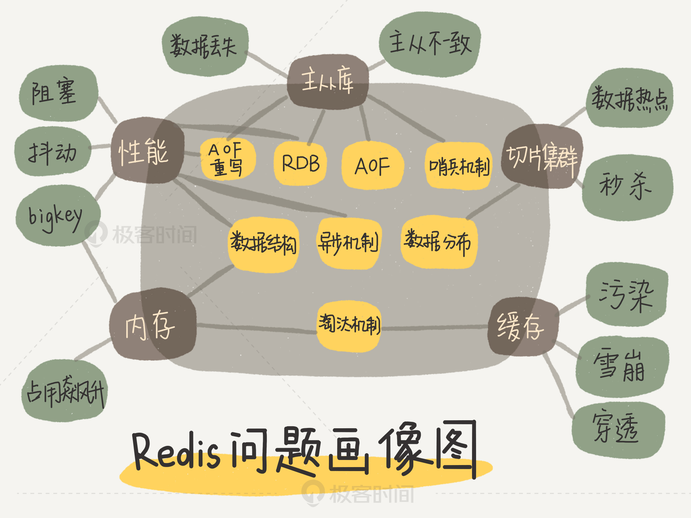

# redis 常见问题

## redis 学习路线


## redis问题画像



## redis为什么那么快？

>1、完全基于内存的操作，可以减少读取磁盘的消耗  
>2、单进程的，可以避免多线程切换问题和并发控制问题  
>3、非阻塞IO：redis采用epoll作为IO多路复用的事件模型，可以减少IO上的损耗  
>4、Redis采用一些常见的高效索引结构作为某些value类型的底层数据结构，这一技术路线为Redis实现高性能访问提供了良好的支撑。

## redis有时访问慢的原因

>哈希冲突  
>正在进行rehash  

## string类型的底层数据结构是怎么样的？

 [redis_struct](./Struct.md)

## 删除数据内存占用还是很高?

>内存分配策略局限性，一般都会分配固定的空间大小，导致实际分配的内存空间大于实际申请的，从而多出了许多不连续的空闲内存块。
>键值对的修改、删除导致了内存的扩容或者释放，导致多余的不连续的空闲内存块。  

```redis
### 解决方案

**方案一**
重启redis（需要考虑是否进行了数据持久化）

**方案二**
要求redis>4.0  
设置自动清理  
config set activedefrag yes  

```

[为什么删除数据后，Redis内存占用依然很高？](https://www.oschina.net/group/database#/detail/2371060)

## redis的分布式锁用过吗？，怎么用的？

[分布式锁](.DistributedLock.md)

## redis是怎么实现原子性的?

```redis
redis在处理客户端的请求时，包括获取 (socket 读)、解析、执行、内容返回 (socket 写) 等都由一个顺序串行的主线程处理，这就是所谓的“单线程”。  
对于Redis而言，命令的原子性指的是：一个操作的不可以再分，操作要么执行，要么不执行。  
执行get、set以及eval等API，都是一个一个的任务，这些任务都会由Redis的线程去负责执行，任务要么执行成功，要么执行失败，这就是Redis的命令是原子性的原因。  
Redis本身提供的所有API都是原子操作，Redis中的事务其实是要保证批量操作的原子性。
```

## redis为什么要用单线程？

```redis
1、实现简单，不用考虑处理资源的竞争  
2、减少多线程上下文切换的消耗  

因为Redis是基于内存的操作，CPU不是Redis的瓶颈，Redis的瓶颈最有可能是机器内存的大小或者网络带宽；既然单线程容易实现，而且CPU不会成为瓶颈，那就顺理成章地采用单线程的方案了。
```

### redis 单线程的优劣势

#### 优势

```redis
1、代码清晰，处理逻辑更简单  
2、不用考虑因为多线程导致得各种锁得问题  
3、不存在多进程或者多线程导致的切换而消耗CPU
```

#### 劣势

```redis
无法发挥多核CPU性能，不过可以通过在单机开多个Redis实例来完善；
```

[Redis为什么是单线程，高并发快的3大原因详解](https://zhuanlan.zhihu.com/p/58038188)

## Redis单线程处理IO请求性能瓶颈主有哪些?

```redis
1、任意一个请求在server中一旦发生耗时，都会影响整个server的性能，也就是说后面的请求都要等前面这个耗时请求处理完成；  
2、并发量非常大时，单线程读写客户端IO数据存在性能瓶颈，虽然采用IO多路复用机制，但是读写客户端数据依旧是同步IO，只能单线程依次读取客户端的数据，无法利用到CPU多核。
```

## redis6.0 为什么引入多线程？

```redis
1、可以充分利用服务器CPU资源，目前主线程只能利用一个核  
2、多线程任务可以分摊Redis同步IO读写负荷
```

## 最新的redis6.0用了多线程，是怎么实现的？

redis的多线程主要是针对IO进行了多线程，来提高redis针对IO上的性能  
[Redis 6.0 新特性-多线程连环13问！](https://www.cnblogs.com/madashu/p/12832766.html)

## Redis6.0与Memcached多线程模型对比

```redis
相同点：都采用了master线程worker线程的模型  
不同点：Memcached执行主逻辑也是在worker线程里，模型更加简单，实现了真正的线程隔离，符合我们对线程隔离的常规理解；而Redis把处理逻辑交还给master线程，虽然一定程度上增加了模型复杂度，但也解决了线程并发安全等问题。
```

## redis与memcached的区别

|redis|memcached|
|-----|-----|
| 支持多种数据类型| 只支持string类型|
| redis6.0之前是单进程的| 是多进程的|
| 支持持久化| 不支持|
|支持数据备份| 不支持|

## 整数数组和压缩列表在查找时间复杂度方面并没有很大的优势，那为什么Redis还会把它们作为底层数据结构呢？

```redis
1、内存利用率，数组和压缩列表都是非常紧凑的数据结构，它比链表占用的内存要更少。Redis是内存数据库，大量数据存到内存中，此时需要做尽可能的优化，提高内存的利用率。

2、数组对CPU高速缓存支持更友好，所以Redis在设计时，集合数据元素较少情况下，默认采用内存紧凑排列的方式存储，同时利用CPU高速缓存不会降低访问速度。当数据元素超过设定阈值后，避免查询时间复杂度太高，转为哈希和跳表数据结构存储，保证查询效率。
```

## 事件模型

## reids基本IO模型


## 备份

[AOF和RDB](./backups.md)

## 集群

[主从库](./master_slave.md)

## redis 特点

```redis
1、支持丰富的数据类型（string/list/hash/set/zset）  
2、支持持久化(aof/rdb)  
3、支持主从模式和哨兵机制的高可用  
4、内存过载时的淘汰算法  
5、支持集群和分片的横向扩展  
```

## redis一般会创建哪些子进程？

```redis
1、创建RDB的后台子进程(bgsave)，同时由它负责在主从同步时传输RDB给从库  
2、主从通过无盘复制方式传输RDB的子进程  
3、bgrewriteaof子进程（重写AOF）。
```

## 集合统计模式

```redis
聚合统计、排序统计、二值状态统计、基数统计
```

## redis缓存和本地缓存是怎么配合使用的，数据的一致性是如何解决的？

```redis
缓存和数据库双写时的数据一致性。
```

### 数据一致性的解决方案

```linux
先更新数据库，后更新缓存  
先更新缓存，后更新数据库  
先更新数据库，后删除缓存  
先删除缓存，后更新数据库  
```

### 先删除缓存，后更新数据库  

该方案也会出问题，具体出现的原因如下。


```redis
此时来了两个请求，请求A（更新操作）和请求B（查询操作）  
1、请求A会先删除Redis中的数据，然后去数据库进行更新操作  
2、此时请求B看到redis中的数据是空的，回去数据库中查询该值，补录到redis中  
3、但是此时请求A并没没有更i性能成功，或者事务还未提交  

问题一：以上情况就可能出现数据库和redis数据不一致问题，一般解决方案就是双删的策略
```


```redis
问题二：上述保证事务提交完以后再进行删除缓存还有一个问题，就是如果你使用的是Mysql 的读写分离的架构的话，那么其实主从同步之间也会有时间差。
```


```redis
此时来了两个请求，请求A(更新操作)和请求B（查询操作）  
1、请求A更新操作，删除了Redis  
2、请求主库进行更新操作，主库与从库进行同步数的操作  
3、请求B查询操作，发现redis中没有数据  
4、去从库中请求数据  
5、此时同步数据还未完成，拿到的数据是旧数据  

此时的解决办法就是如果是对 Redis 进行填充数据的查询数据库操作，那么就强制将其指向主库进行查询。
```


## redis的优缺点

### redis优点

```redis
1、读写性能优异，单台redis读的性能10W/s 单台redis写的性能8W/s  
2、支持持久化，支持RDB、AOF两种方式  
3、支持事务、redis的所有操作都是原子性的，同时还支持对几个操作合并后的原子性操作  
4、数据结构丰富，支持string、hash、list、set、zset等  
5、支持主从复制、集群等  
```

### redis缺点

```redis
1、数据库容量受物理内存的限制，不能用过海量数据的高性能读写；
2、redis不具备自动容错和恢复功能；  
3、主机宕机，宕机前部分数据未能及时同步到从机，切换IP后会引入数据不一致问题，降低了系统的可用性；  
```

### 本地缓存和分布式缓存的区别？

```redis
1、本地缓存一般仅存在当前线程，无法共享  
2、redis作为分布式缓存，可以使所有线程共享  
```

## Redis持久化数据和缓存怎么做扩容？

```redis
1、如果Redis被当做缓存使用，使用一致性哈希实现动态扩容缩容。  
2、如果Redis被当做一个持久化存储使用，必须使用固定的keys-to-nodes映射关系，节点的数量一旦确定不能变化。否则的话(即Redis节点需要动态变化的情况），必须使用可以在运行时进行数据再平衡的一套系统，而当前只有Redis集群可以做到这样。
```

## Redis的过期键的删除策略

### 定时过期

```redis
每个设置过期时间的key都需要创建一个定时器，到过期时间就会立即清除。该策略可以立即清除过期的数据，对内存很友好；但是会占用大量的CPU资源去处理过期的数据，从而影响缓存的响应时间和吞吐量。
```

### 惰性过期

```redis
只有当访问一个key时，才会判断该key是否已过期，过期则清除。该策略可以最大化地节省CPU资源，却对内存非常不友好。极端情况可能出现大量的过期key没有再次被访问，从而不会被清除，占用大量内存。
```

### 定期过期

```redis
每隔一定的时间，会扫描一定数量的数据库的expires字典中一定数量的key，并清除其中已过期的key。该策略是前两者的一个折中方案。通过调整定时扫描的时间间隔和每次扫描的限定耗时，可以在不同情况下使得CPU和内存资源达到最优的平衡效果。
(expires字典会保存所有设置了过期时间的key的过期时间数据，其中，key是指向键空间中的某个键的指针，value是该键的毫秒精度的UNIX时间戳表示的过期时间。键空间是指该Redis集群中保存的所有键。)
```

## redis支持的淘汰策略

|算法|说明|
|-----|-----|
|allkeys-lru|不管key是否设置了过期，淘汰最近最少访问的key|
|volatile-lru|只淘汰最近最少访问、并设置了过期时间的key|
|allkeys-random|不管key是否设置了过期，随机淘汰key|
|volatile-random|只随机淘汰设置了过期时间的key|
|allkeys-ttl|不管key是否设置了过期，淘汰即将过期的key|
|noeviction|不淘汰任何key，实例内存达到maxmeory后，再写入新数据直接返回错误|
|allkeys-lfu|不管key是否设置了过期，淘汰访问频率最低的key（4.0+版本支持）|
|volatile-lfu|只淘汰访问频率最低、并设置了过期时间 key（4.0+版本支持）|

## 缓存雪崩

```linux
缓存雪崩是指缓存同一时间大面积的失效，所以，后面的请求都会落到数据库上，造成数据库短时间内承受大量请求而崩掉。  

1、缓存数据的过期时间设置随机，防止同一时间大量数据过期现象发生。  
2、一般并发量不是特别多的时候，使用最多的解决方案是加锁排队。  
3、给每一个缓存数据增加相应的缓存标记，记录缓存的是否失效，如果缓存标记失效，则更新数据缓存。  
```

## 缓存穿透

```linux
缓存穿透是指缓存和数据库中都没有的数据，导致所有的请求都落到数据库上，造成数据库短时间内承受大量请求而崩掉。

1、接口层增加校验，如用户鉴权校验，id做基础校验，id<=0的直接拦截；  
2、从缓存取不到的数据，在数据库中也没有取到，这时也可以将key-value对写为key-null，缓存有效时间可以设置短点，如30秒（设置太长会导致正常情况也没法使用）。这样可以防止攻击用户反复用同一个id暴力攻击。  
3、采用布隆过滤器，将所有可能存在的数据哈希到一个足够大的 bitmap 中，一个一定不存在的数据会被这个 bitmap 拦截掉，从而避免了对底层存储系统的查询压力。  
```

## 缓存击穿

```linux
缓存击穿是指缓存中没有但数据库中有的数据（一般是缓存时间到期），这时由于并发用户特别多，同时读缓存没读到数据，又同时去数据库去取数据，引起数据库压力瞬间增大，造成过大压力。和缓存雪崩不同的是，缓存击穿指并发查同一条数据，缓存雪崩是不同数据都过期了，很多数据都查不到从而查数据库。  

解决方案：  
1、设置热点数据永远不过期。  
2、加互斥锁，互斥锁  
```

## 缓存预热

```linux
缓存预热就是系统上线后，将相关的缓存数据直接加载到缓存系统。这样就可以避免在用户请求的时候，先查询数据库，然后再将数据缓存的问题！用户直接查询事先被预热的缓存数据。

解决方案：  
1、直接写个缓存刷新页面，上线时手工操作一下；  
2、数据量不大，可以在项目启动的时候自动进行加载；  
3、定时刷新缓存；  
```

## redis为什么这么快？

- 内存存储：redis使用内存存储，没有磁盘IO上的开销；  
- 单线程实现：单线程处理请求，避免了多个线程之间切换和锁资源竞争的开销；  
- 非阻塞IO：redis使用多路复用IO技术，在poll、epoll选择最优IO实现；  
- 优化的数据结构：redis有诸多可以直接应用的优化数据结构实现，应用层可以直接使用原生的数据结构提升性能；  

## 常见数据结构？

- string  
- list  
- hash  
- set  
- zset  
- 发布订阅  
- GEO  
- HyperLogLog

## 底层数据结构有哪些？

- 简单动态字符串  
- 双端链表  
- 跳跃表  
- 字典  
- 压缩列表  
- 整数集合

## 不同的数据类型使用的业务场景?

- list：消息队列  
- zset：延迟消息队列、最新消息排行、带权重的消息队列  
- hash：商品属性、账户信息  
- set：共同好友、排行榜  
- Hyperloglog：基数计算器

## redis持久化？

``` redis
RDB：将redis数据根据配置同步到磁盘上【二进制压缩文件】  
1、同步是可能会影响redis性能，突然redis异常，会有段数据没有得到保存  
2、同步的两个命令SAVE（会阻塞redis）、BGSAVE（fork一个子进程异步处理）  
3、每次重启检查是否有rdb文件，会进行载入工作  

AOF：将redis执行的有关数据操作命令同步到磁盘上  
1、同步的文件会越来越大  
2、可以通过重写方式重新写入aof文件  
3、过程:命令追加-》文件写入-》文件同步  
4、appendfsync : always[存在及同步]|everysec[隔一段时间进行同步]|no[系统决定何时同步]  
5、内容是redis通信协议（RESP）格式的命令文本存储  

比较：  
1、aof文件比rdb更新频率高，优先使用aof还原数据  
2、aof比rdb更安全也更大  
3、rdb性能比aof好

```

## 分布式锁

```redis
setnx + expire
set nx ex
```

## 如果有大量key需要设置同一时间过期，一般要注意什么？

```redis
1、redis层面 过期删除方面考虑  
可能出现redis卡顿现象

2、针对缓存后面的DB 通过缓存  
可能出现缓存雪崩

解决方案：一般需要在时间加上一个随机值，使得过期时间分散一些
```

## redis淘汰策略配置？

- volatile-random：设置有效期的key 随机清理  
- volatile-lru：设置有效期的key 最少使用清理  
- volatile-ttl：设置有效期的key 即将过期的清理  
- allkeys-lru:：所有key 最少使用清理  
- allkeys-random：所有key 随机清理  
- no-enviction：不做清理【默认策略】

## 实现一下LRU？

```redis
基于哈希链表的思路实现  
哈希表查找快，但是数据没有固定顺序；链表有顺序之分，插入、删除快，但是查找慢；所以结合一下，形成一种新得数据结构：哈希链表LinkedHashMap  
```

[算法—leetcode—146. LRU 缓存机制 (juejin.cn)](https://juejin.cn/post/6911709733871157262)

## redis内存占用满了会如何？

```redis
默认淘汰策略：对于写请求不在提供服务，直接返回错误  
如果配置了淘汰策略：当内存达到上线，会冲刷掉旧的内容
```

## 删除过期key的策略？

- 定时删除【给key创建一个定时器，时间到了即可以删除，消耗CPU】  
- 惰性删除【针对已经过期的key在，在访问的时候会删除，消耗内存】  
- 定期删除【根据服务器设置时间定期处理已经过期的key】  

## 假设redis有10亿个key，其中有10W个key是以某个固定的前缀开头的，如何将他们全部造出来？

```redis
考察点：单进程单线程模式，如果一个命令执行的慢，会影响接下来的其他命令  
1、如果在测试环境，没有访问压力的情况可是用keys 模式匹配搜索  
2、如果在线上环境可以使用scan命令，无阻塞增量的命令搜索指定前缀的key，可能存在重复的，需要程序进行筛选
```

## redis比memcache的优势?

- 支持多种数据类型  
- 支持持久化  
- 支持数据备份，即master-slave模式的数据备份

## redis集群如何做？都用哪些方案？

### 客户端分片

```linux
一致性哈希
```

### 基于代理的分片

```redis
1、twemproxy: 使用代理方式  
问题:1、自身单端口实例的压力、针对redis集群数量改变是，数据无法移动到新的节点  

2、codis
```

### 路由查询

```redis
1、edis3.0自带redis-cluster：特点是分布式hash算法不是一致性hash，而是hash曹方式
```

## 并发竞争问题?

```redis
redis为单进程单线程模式，采用队列模式将“并发访问”变成“串行访问”，因此对于多个客户端连接并不存在竞争，一般此类问题都是由客户端连接造成的  
解决方案  
1、保证每个客户端正常有序的与redis进行通信，对连接进行池化  
2、服务器角度，利用setnx实现锁机制  
```

## redis有哪些架构模式？

```redis
单机版  
特点：简单  
问题：1、内存容量有限 2、处理能力有限，3、无法高可用  

主从复制  
特点：1、master/slave角色，2、master/slave数据相同 3降低master读取压力  
问题：1、无法保证高可用 2、没有解决master写的压力

哨兵  
特点：完善监控保证高可用，监控各个节点动态提醒、自动故障转移，  
缺点：1、主动模式，切换需要时间可能丢失数据 2、没有解决master写的压力  

集群  
twemproxy代理模式  
特点：  
1、支持多种hash算法， 2、失败节点自动删除 3、后端sharding分片逻辑对业务透明

```

## redis通信协议？

```redis
redis服务器与客户端通过RESP（redis Serialization Protocol）协议通信【文本协议】  
优点：简单的实现，快速的解析，直观理解
```

## redis是否支持事务？

```redis
【ACID 原子性，一致性，隔离性，持久性】  
**原子性**：数据库将事务中多个操作当做一个整体来执行，服务要么执行事务中的所有操作，要么一个操作也不执行  
因为redis记录日志的时间问题，不支持操作的回滚

**一致性**：数据库在执行事务之前是一致的，那么在事务执行之后无论事务是否成功，数据库也应该是一致的  
两个方面查看一致性：一个执行错误是否确保一致性，另一个宕机时，是否确保一致性机制

**隔离性**：数据库中有多个事务并发执行，各个事务之间不会相互影响，并且在并发状态下执行的事务和串行执行的事务产生的结果完全相同

redis因为是单线程操作，所以在隔离性上有天生的隔离机制；redis执行事务时，不会对事务进行中断，所以redis事务总是以串行的方式运行，事务也是具备隔离性

**持久性**：当一个事务执行完毕，执行这个事务所得到的结果被保存在持久化的存储中，即使服务器在事务执行完成后停机了，执行事务的结果也不会被丢失纯内存运行，不具备持久化

RDB持久化模式，取决于RDB策略，只有满足策略才会执行Bgsave，异步执行不能保证redis持久化；  
AOF持久化模式，只有将appendfsync设置为always，程序才会在执行命令同步保存到磁盘，redis才具备持久性

开启事务：multi  
执行命令  
提交事务：exec

结论  
redis具备了一定原子性，但不支持回滚  
redis不具备“一致性”概念  
redis具备隔离性  
redis通过一定策略可以保证持久性  
Redis设计更多的是追求简单和高性能，不会受制于传统ACID束缚
```

## 查看redis使用情况的命令

| 命令 | 说明 |
| --- | --- |
| info server | 服务器信息 |
| info clients | 已连接客户端信息  |
| info memory | 查看内存信息  |
| info persistence | 查看rdb 、aof的相关信息  |
| info stats | 一般统计信息  |
| info replication | 主/从复制信息  |
| info cpu | cpu计算量统计信息  |
| info commandstats | redis命令统计信息  |
| redis cluster | redis集群信息  |
| info keyspace | 数据库相关统计信息  |
| info all | 返回所有信息 |
| info default | 返回默认设置信息  |

## redis中底层是如何实现的？如何解决冲突和扩容?

### 底层使用的数据编码

```redis
当哈希对象可以同时满足以下两个条件时，哈希对象使用ziplist编码：  

- 哈希对象保存的所有键值对的键和值的字符串长度都小于64字节；  
- 哈希对象保存的键值对数量小于512个；不能满足这两个条件的哈希对象需要使用hashtable编码。
```

### 解决哈希冲突

```redis
Redis的哈希表使用链地址法（separate chaining）来解决键冲突，每个哈希表节点都有一个next指针，多个哈希表节点可以用next指针构成一个单向链表，被分配到同一个索引上的多个节点可以用这个单向链表连接起来，这就解决了键冲突的问题。  
```

### 扩展与收缩

```linux
哈希表的扩展与收缩当以下条件中的任意一个被满足时，程序会自动开始对哈希表执行扩展操作：  

- 服务器目前没有在执行BGSAVE命令或者BGREWRITEAOF命令，并且哈希表的负载因子大于等于1。  
- 服务器目前正在执行BGSAVE命令或者BGREWRITEAOF命令，并且哈希表的负载因子大于等于5。  
```

## redis的操作为什么是原子性的，如何保证原子性?

```redis
Redis的操作之所以是原子性的，是因为Redis是单线程的。  
线程是操作系统能够进行运算调度的最小单元。它被包含在进程之中，是进程的实际运作单位。
一条线程指的是进程中一个单一顺序的控制流，一个进程中可以并发多个线程，每条线程并行执行不同的任务。
```

## 缓存降级

## redis参考

[redis中文社区文档](http://www.redis.cn/documentation.html)
[Redis 常见面试题（2020最新版）](https://www.cnblogs.com/javazhiyin/p/13839357.html)
